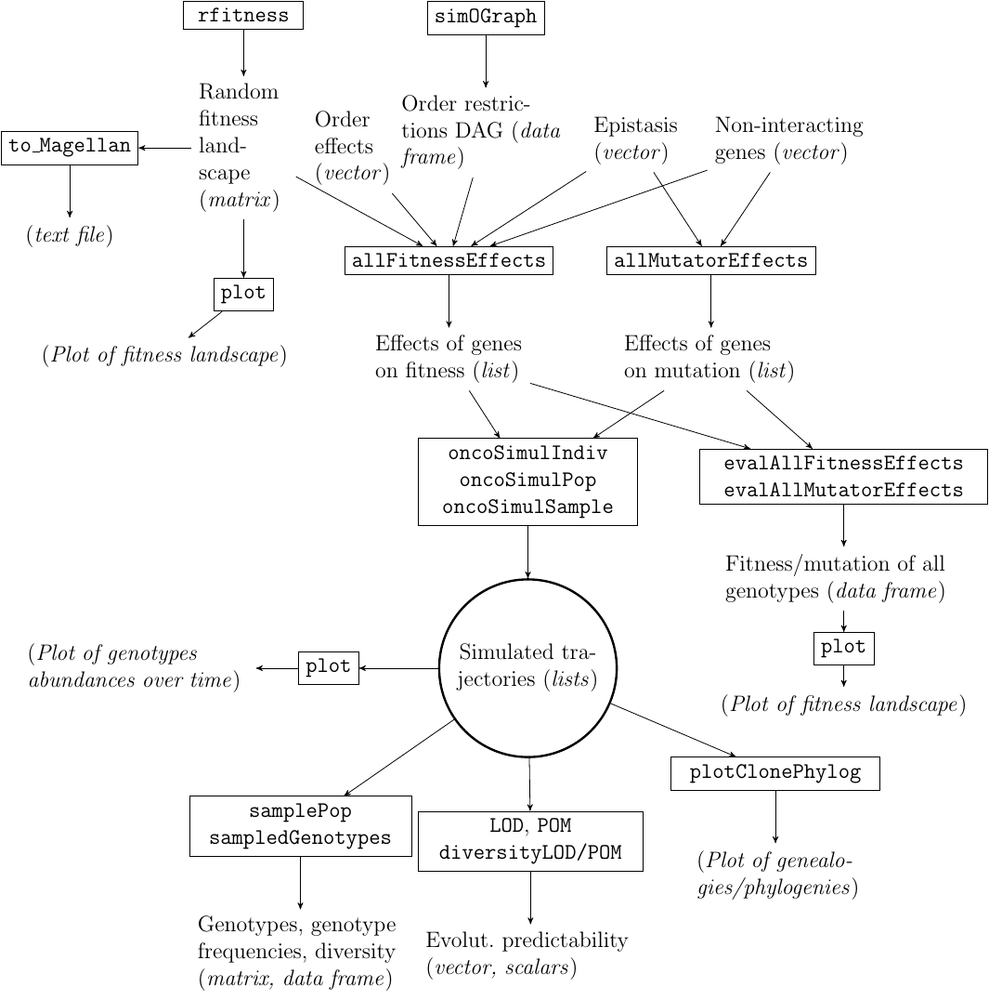
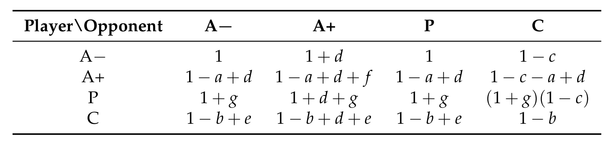
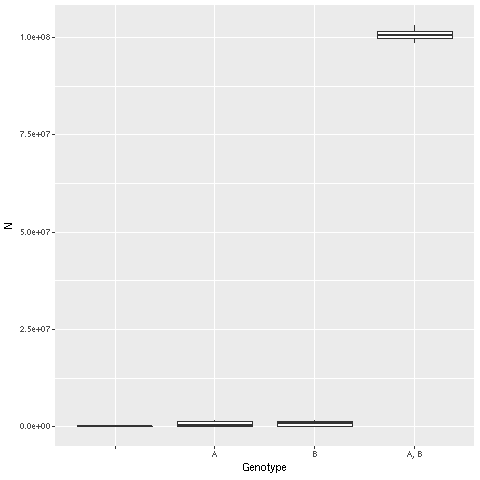
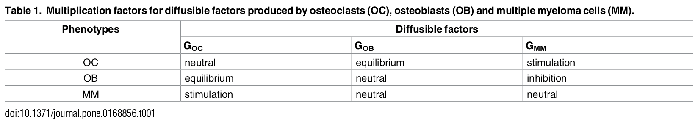

<!-- Fomr https://github.com/rstudio/bookdown/issues/153 -->
<script type="text/x-mathjax-config">
MathJax.Hub.Config({
  TeX: { equationNumbers: { autoNumber: "AMS" } }
});
</script>


```{r setup, include=FALSE}
## use collapse for bookdown, to collapse all the source and output
## blocks from one code chunk into a single block
knitr::opts_chunk$set(echo = TRUE, collapse = TRUE)
options(width = 70)
require(BiocStyle)
require(pander)
```


\clearpage

# Introduction {#introdd}
 
OncoSimulR is an individual- or clone-based forward-time genetic
simulator for biallelic markers (wildtype vs. mutated) in asexually
reproducing populations without spatial structure (perfect
mixing). Its design emphasizes flexible specification of fitness and
mutator effects.
 
 
 
OncoSimulR was originally developed to simulate tumor progression with
emphasis on allowing users to set restrictions in the accumulation of
mutations as specified, for example, by Oncogenetic Trees
[OT: @Desper1999JCB; @Szabo2008] or Conjunctive Bayesian Networks
[CBN: @Beerenwinkel2007; @Gerstung2009; @Gerstung2011], with the
possibility of adding passenger mutations to the simulations and allowing
for several types of sampling.


Since then, OncoSimulR has been vastly extended to allow you to specify
other types of restrictions in the accumulation of genes, such as the XOR
models of @Korsunsky2014 or the "semimonotone" model of
@Farahani2013. Moreover, different fitness effects related to the order in
which mutations appear can also be incorporated, involving arbitrary numbers
of genes. This is *very* different from "restrictions in the order of
accumulation of mutations". With order effects, described in a recent cancer
paper by Ortmann and collaborators [@Ortmann2015], the effect of having both
mutations "A" and "B" differs depending on whether "A" appeared before or
after "B" (the actual case involves genes JAK2 and TET2).

More generally, OncoSimulR now also allows you to specify arbitrary
epistatic interactions between arbitrary collections of genes and to model,
for example, synthetic mortality or synthetic viability (again, involving an
arbitrary number of genes, some of which might also depend on other genes,
or show order effects with other genes). Moreover, it is possible to specify
the above interactions in terms of modules, not genes. This idea is
discussed in, for example, @Raphael2014a and @Gerstung2011: the restrictions
encoded in, say, CBNs or OT can be considered to apply not to genes, but to
modules, where each module is a set of genes (and the intersection between
modules is the empty set) that performs a specific biological
function. Modules, then, play the role of a "union operation" over the set
of genes in a module. In addition, arbitrary numbers of genes without
interactions (and with fitness effects coming from any distribution you
might want) are also possible.

You can also directly specify the mapping between genotypes and
fitness and, thus, you can simulate on fitness landscapes of
arbitrary complexity. 

It is now (released initially in this repo as the freq-dep-fitness
branch on February 2019) also possible to simulate scenarios with
frequency-dependent fitness, where the fitness of one or more
genotypes depends on the relative or absolute frequencies of other
genotypes, as in game theory and adaptive dynamics. This makes it
possible to model predation and parasitism, cooperation and
mutualism, and commensalism.


Mutator/antimutator genes, genes that alter the mutation rate of
other genes [@gerrish_complete_2007; @tomlinson_mutation_1996], can
also be simulated with OncoSimulR and specified with most of the
mechanisms above (you can have, for instance, interactions between
mutator genes). And, regardless of the presence or not of other
mutator/antimutator genes, different genes can have different
mutation rates.


Simulations can be stopped as a function of total population size, number
of mutated driver genes, or number of time periods. Simulations can also
be stopped with a stochastic detection mechanism where the probability of
detecting a tumor increases with total population size. Simulations return
the number of cells of every genotype/clone at each of the sampling
periods and we can take samples from the former with single-cell or whole-
tumor resolution, adding noise if we want. If we ask for them, simulations
also store and return the genealogical relationships of all clones
generated during the simulation.


The models so far implemented are all continuous time models, which are
simulated using the BNB algorithm of @Mather2012. The core of the code is
implemented in C++, providing for fast execution.  To help with simulation
studies, code to simulate random graphs of the kind often seen in CBNs, OTs,
etc, is also available. Finally, OncoSimulR also allows for the generation
of random fitness landscapes and the representation of fitness landscapes
and provides statistics of evolutionary predictability.


## Key features of OncoSimulR {#key}

As mentioned above, OncoSimulR is now a very general package for forward
genetic simulation, with applicability well beyond tumor progression. This
is a summary of some of its key features:

<!-- FIXME: add the tables of the poster -->


 
* You can specify arbitrary interactions between genes, with
  arbitrary fitness effects, with explicit support for:
    - Restrictions in the accumulations of mutations, as specified by
      Oncogenetic Trees (OTs), Conjunctive Bayesian Networks (CBNs),
      semimonotone progression networks, and XOR relationships.
		  
    - Epistatic interactions including, but not limited to, synthetic
       viability and synthetic lethality.
    - Order effects.
	
* You can add passenger mutations.
* You can add mutator/antimutator effects.
* Fitness and mutation rates can be gene-specific.
* You can add arbitrary numbers of non-interacting
      genes with arbitrary fitness effects.
  
* you can allow for deviations from the OT, CBN, semimonotone, and
      XOR models, specifying a penalty for such deviations (the $s_h$
      parameter).
      
* You can conduct multiple simulations, and sample from them with
      different temporal schemes and using both whole tumor or single cell
      sampling. 
	  
* You can stop the simulations using a flexible combination of
      conditions: final time, number of drivers, population
      size, fixation of certain genotypes, and a stochastic
      stopping mechanism that depends on population size.
  
* Right now, three different models are available, two that lead
      to exponential growth, one of them loosely based on @Bozic2010, and
      another that leads to logistic-like growth, based on @McFarland2013.
      
<!-- * Code in C++ is available (though not yet callable from R) for -->
<!--       using several other models, including the one from @Beerenwinkel2007b. -->
      
* You can use large numbers of genes (e.g., see an example of
      50000 in section \@ref(mcf50070)).
      
* Simulations are generally very fast: I use C++ to implement the BNB
      algorithm (see sections \@ref(bnbmutation) and \@ref(bnbdensdep) for
      more detailed comments on the usage of this algorithm).

* You can obtain the true sequence of events and the phylogenetic
      relationships between clones (see section \@ref(meaningclone)
      for the details of what we mean by "clone").
    
* You can generate random fitness landscapes (under the House of
      Cards, Rough Mount Fuji, or additive models, or combinations of the
      former and under the NK model) and use those landscapes as input to the simulation
      functions.
      
* You can plot fitness landscapes.
      
* You can obtain statistics of evolutionary predictability
  from the simulations.
  
* You can now also use simulations with frequency-dependent fitness:
  fitness (birth rate) is not fixed for a genotype, but can be a
  function of the frequecies of the clones (see section
  \@ref(fdf)). We can therefore use OncoSimulR to examine, via
  simulations, results from game theory and adaptive dynamics and
  study complex scenarios that are not amenable to analytical
  solutions. More generally, we can model predation and parasitism,
  cooperation and mutualism, and commensalism.
  
  <!-- Evaluating frequently the fitness across -->
  <!-- the simulation, you can obtain a dynamic fitness landscape . -->
  


The table below, modified from the table at the
[Genetics Simulation Resources (GSR) page](https://popmodels.cancercontrol.cancer.gov/gsr/packages/oncosimulr/#detailed), 
provides a summary of the key features of OncoSimulR. (An
explanation of the meaning of terms specific to the GSR table is
available from
https://popmodels.cancercontrol.cancer.gov/gsr/search/ or from the
[Genetics Simulation Resources table itself](https://popmodels.cancercontrol.cancer.gov/gsr/packages/oncosimulr/#detailed),
by moving the mouse over each term).

\clearpage

|Attribute Category                  | Attribute                                     |
|-------------------------------|-----------------------------------------------|
|**Target**                           |  |
|&nbsp; Type of Simulated Data        |           Haploid DNA Sequence|
|&nbsp; Variations                    |           Biallelic Marker, Genotype or Sequencing Error|
|**Simulation Method**                |           Forward-time|
|&nbsp; Type of Dynamical Model       | Continuous time|
|&nbsp; Entities Tracked              | Clones (see \@ref(trackindivs))|
|**Input** | Program specific (R data frames and matrices specifying genotypes' fitness, gene effects, and starting genotype) |
|**Output**||
|&nbsp; Data Type| Genotype or Sequence, Individual Relationship (complete parent-child relationships between clones), Demographic (populations sizes of all clones at sampling times), Diversity Measures (LOD, POM, diversity of genotypes), Fitness|
|&nbsp; Sample Type|	Random or Independent, Longitudinal, Other (proportional to population size)|
|**Evolutionary Features**	||
|&nbsp; Mating Scheme| Asexual Reproduction |
|&nbsp; Demographic                   ||	
|&nbsp; &nbsp; Population Size Changes|	Exponential (two models), Logistic (McFarland et al., 2013)|
|&nbsp; Fitness Components||	
|&nbsp; &nbsp; Birth Rate|	Individually Determined from Genotype (models "Exp", "McFL", "McFLD"). Frequency-Dependently Determined from Genotype (models "Exp", "McFL", "McFLD")|
|&nbsp; &nbsp; Death Rate|	Individually Determined from Genotype (model "Bozic"), Influenced by Environment ---population size (models "McFL" and "McFLD")|
|&nbsp;Natural Selection||	
|&nbsp; &nbsp; Determinant|	Single and Multi-locus, Fitness of Offspring,  Environmental Factors (population size, genotype frequencies)|
|&nbsp; &nbsp; Models|	Directional Selection, Multi-locus models, Epistasis, Random Fitness Effects, Frequency-Dependent|
|&nbsp; Mutation Models|	Two-allele Mutation Model (wildtype, mutant), without back mutation|
|&nbsp; Events Allowed|	Varying Genetic Features: change of individual mutation rates (mutator/antimutator genes)|
|&nbsp; Spatial Structure| No Spatial Structure (perfectly mixed and no migration)|

Table:(\#tab:osrfeatures) Key features of OncoSimulR. Modified from
the original table from
https://popmodels.cancercontrol.cancer.gov/gsr/packages/oncosimulr/#detailed
.


<!-- Why not "Carrying cappacity" instead of logistic? Both are very -->
<!-- similar, but the GSR page says, for carrying capacity "This includes models with age or stage-specific carrying capacities" -->


Further details about the original motivation for wanting to
simulate data this way in the context of tumor progression can be
found in @Diaz-Uriarte2015, where additional comments about model
parameters and caveats are discussed.


Are there similar programs? The Java program by @Reiter2013a, TTP, offers
somewhat similar functionality to the previous version of OncoSimulR, but
it is restricted to at most four drivers (whereas v.1 of OncoSimulR
allowed for up to 64), you cannot use arbitrary CBNs or OTs (or XORs or
semimonotone graphs) to specify restrictions, there is no allowance for
passengers, and a single type of model (a discrete time Galton-Watson
process) is implemented. The current functionality of OncoSimulR goes well
beyond the the previous version (and, thus, also the TPT of
@Reiter2013a). We now allow you to specify all types of fitness effects
in other general forward genetic simulators such as FFPopSim
[@Zanini2012], and some that, to our knowledge (e.g., order effects) are
not available from any genetics simulator. In addition, the "Lego system"
to flexibly combine different fitness specifications is also unique; by
"Lego system" I mean that we can combine different pieces and blocks,
similarly to what we do with Lego bricks. (I find this an intuitive and
very graphical analogy, which I have copied from @Hothorn_2006 and
@Hothorn_2008). In a nutshell, salient features of OncoSimulR compared to
other simulators are the unparalleled flexibility to specify fitness and
mutator effects, with modules and order effects as particularly unique,
and the options for sampling and stopping the simulations, particularly
convenient in cancer evolution models. Also unique in this type of
software is the addition of functions for simulating fitness landscapes
and assessing evolutionary predictability.


## What kinds of questions is OncoSimulR suited for? {#generalwhatfor}

OncoSimulR can be used to address questions that span from the
effect of mutator genes in cancer to the interplay between fitness
landscapes and mutation rates. The main types of questions that
OncoSimulR can help address involve combinations of:


* Simulating asexual evolution (the `oncoSimul*` functions) where:
     - Fitness is:
        - A function of specific epistatic effects between genes
        - A function of order effects
        - A function of epistatic effects specified using
          DAGs/posets where these DAGs/posets:
		     - Are user-specified
	         - Generated randomly (`simOGraph`)
        - Any mapping between genotypes and fitness where this mapping is:
            - User-specified
            - Generated randomly from families of random fitness landscapes (`rfitness`)
        - A function of the frequency of other genotypes (i.e.,
          frequency-dependent fitness), such as in adaptive dynamics
          (see section \@ref(fdf) for more details). This also
          allows you to model competition, cooperation and
          mutualism, parasitism and predation, and commensalism
          between clones.
     - Mutation rates can:
          - Vary between genes
          - Be affected by other genes
		 
* Examining times to evolutionarily or biomedically relevant events
  (fixation of genotypes, reaching a minimal size, acquiring a
  minimal number of driver genes, etc ---specified with the stopping
  conditions to the `oncoSimul*` functions).

* Using different sampling schemes (`samplePop`) that are related
  to:
    - Assessing genotypes from single-cell vs. whole tumor (or whole
      population) with the  `typeSample` argument
    - Genotyping error (`propError` argument)
    - Timing of samples (`timeSample` argument)
    - ... and assessing the consequences of those on the observed
      genotypes and their diversity (`sampledGenotypes`) and any other
      inferences that depend on the observational process.
	- (OncoSimulR returns the abundances of all genotypes at each of
	  the sampling points, so you are not restricted by what the
	  `samplePop` function provides.)
  

* Tracking the genealogical relationships of clones
  (`plotClonePhylog`) and assessing evolutionary predictability
  (`LOD`, `POM`).


Some specific questions that you can address with the help of
OncoSimulR are discussed in section \@ref(whatfor).

-----

A quick overview of the main functions and their relationships is shown in
Figure \@ref(fig:frelats), where we use italics for the type/class of R
object and courier font for the name of the functions.
<!-- Note: figure1.png, and how to create it, explained in miscell-files -->
<!-- in the repo -->
<!--  -->


```{r frelats, eval=TRUE,echo=FALSE, fig.cap="Relationships between the main functions in OncoSimulR."}

```

\clearpage

## Examples of questions that can be addressed with OncoSimulR {#whatfor}

Most of the examples in the rest of this vignette, starting with those in
\@ref(quickexample), focus on the mechanics. Here, we will illustrate some
problems in cancer genomics and evolutionary genetics where OncoSimulR
could be of help. This section does not try to provide an answer to any of
these questions (those would be full papers by themselves). Instead, this
section simply tries to illustrate some kinds of questions where you can
use OncoSimulR; of course, the possible uses of OncoSimulR are only
limited by your ingenuity. Here, I will only use short snippets of working
code as we are limited by time of execution; for real work you would want
to use many more scenarios and many more simulations, you would use
appropriate statistical methods to compare the output of runs, etc, etc,
etc.


```{r firstload}
## Load the package
library(OncoSimulR) 
```

### Recovering restrictions in the order of accumulation of mutations {#ex-order}

This is a question that was addressed, for instance, in
@Diaz-Uriarte2015: do methods that try to infer restrictions in the
order of accumulation of mutations [e.g., @Szabo2008; @Gerstung2009;
@ramazzotti_capri_2015] work well under different evolutionary
models and with different sampling schemes? (This issue is also
touched upon in section \@ref(sample-1)).

A possible way to examine that question would involve:

 - generating random DAGs that encode restrictions;
 - simulating cancer evolution using those DAGs;
 - sampling the data and adding different levels of noise to the sampled data;
 - running the inferential method;
 - comparing the inferred DAG with the original, true, one.


```{r, echo=FALSE}
set.seed(2)
RNGkind("L'Ecuyer-CMRG")
```

```{r ex-dag-inf}
## For reproducibility
set.seed(2)
RNGkind("L'Ecuyer-CMRG")

## Simulate a DAG
g1 <- simOGraph(4, out = "rT")

## Simulate 10 evolutionary trajectories
s1 <- oncoSimulPop(10, allFitnessEffects(g1, drvNames = 1:4),
                   mc.cores = 2, ## adapt to your hardware
                   seed = NULL) ## for reproducibility of vignette

## Sample those data uniformly, and add noise
d1 <- samplePop(s1, timeSample = "unif", propError = 0.1)

## You would now run the appropriate inferential method and
## compare observed and true. For example

## require(Oncotree)
## fit1 <- oncotree.fit(d1)

## Now, you'd compare fitted and original. This is well beyond 
## the scope of this document (and OncoSimulR itself).

```

```{r hidden-rng-exochs, echo = FALSE}
set.seed(NULL)
```


### Sign epistasis and probability of crossing fitness valleys {#ex-ochs}

This question, and the question in the next section (\@ref(ex-predict)),
encompass a wide range of issues that have been addressed in evolutionary
genetics studies and which include from detailed analysis of simple models
with a few uphill paths and valleys as in @Weissman2009 or @Ochs2015, to
questions that refer to larger, more complex fitness landscapes as in
@szendro_predictability_2013 or @franke_evolutionary_2011 (see below).


Using as an example @Ochs2015 (we will see this example again in section
\@ref(ochsdesai), where we cover different ways of specifying fitness), we
could specify the fitness landscape and run simulations until fixation
(with argument `fixation` to `oncoSimulPop` ---see more details in section
\@ref(fixation) and \@ref(fixationG), again with this example). We would
then examine the proportion of genotypes fixed under different
scenarios. And we can extend this example by adding mutator genes:


```{r hiddenochs, echo=FALSE}
set.seed(2)
RNGkind("L'Ecuyer-CMRG")
```

```{r exochs}
## For reproducibility
set.seed(2)
RNGkind("L'Ecuyer-CMRG")

## Specify fitness effects. 

## Numeric values arbitrary, but set the intermediate genotype en
## route to ui as mildly deleterious so there is a valley.

## As in Ochs and Desai, the ui and uv genotypes
## can never appear. 

u <- 0.2; i <- -0.02; vi <- 0.6; ui <- uv <- -Inf

od <- allFitnessEffects(
    epistasis = c("u" = u,  "u:i" = ui,
                  "u:v" = uv, "i" = i,
                  "v:-i" = -Inf, "v:i" = vi))

## For the sake of extending this example, also turn i into a
## mutator gene

odm <- allMutatorEffects(noIntGenes = c("i" = 50))

## How do mutation and fitness look like for each genotype?
evalAllGenotypesFitAndMut(od, odm, addwt = TRUE)
```

Ochs and Desai explicitly say "Each simulated population was evolved
until either the uphill genotype or valley-crossing genotype fixed."
So we will use `fixation`.


```{r exochsb}
## Set a small initSize, as o.w. unlikely to pass the valley
initS <- 10
## The number of replicates is tiny, 10, for the sake of speed
## of creation of the vignette
od_sim <- oncoSimulPop(10, od, muEF = odm,
                       fixation = c("u", "i, v"), initSize = initS,
                       model = "McFL",
                       mu = 1e-4, detectionDrivers = NA, 
					   finalTime = NA,
                       detectionSize = NA, detectionProb = NA,
                       onlyCancer = TRUE, 
					   mc.cores = 2, ## adapt to your hardware
                       seed = NULL) ## for reproducibility
## What is the frequency of each final genotype?
sampledGenotypes(samplePop(od_sim))
```

```{r hidden-rng-exochs33, echo = FALSE}
set.seed(NULL)
```

### Predictability of evolution in complex fitness landscapes {#ex-predict}

Focusing now on predictability in more general fitness landscapes,
we would run simulations under random fitness landscapes with varied
ruggedness, and would then examine the evolutionary predictability
of the trajectories with measures such as "Lines of Descent" and
"Path of the Maximum" [@szendro_predictability_2013] and the
diversity of the sampled genotypes under different sampling regimes (see
details in section \@ref(evolpredszend)).


```{r hiddenrng0szen, echo=FALSE}
set.seed(7)
RNGkind("L'Ecuyer-CMRG")
```

```{r exszendro}
## For reproducibility
set.seed(7)
RNGkind("L'Ecuyer-CMRG")


## Repeat the following loop for different combinations of whatever
## interests you, such as number of genes, or distribution of the
## c and sd (which affect how rugged the landscape is), or 
## reference genotype, or evolutionary model, or stopping criterion, 
## or sampling procedure, or ...

##  Generate a random fitness landscape, from the Rough Mount
##  Fuji model, with g genes, and c ("slope" constant) and
##  reference chosen randomly (reference is random by default and 
##  thus not specified below). Require a minimal number of  
##  accessible genotypes

g <- 6
c <- runif(1, 1/5, 5)
rl <- rfitness(g, c = c, min_accessible_genotypes = g)

## Plot it if you want; commented here as it takes long for a
## vignette

## plot(rl)

## Obtain landscape measures from MAGELLAN. Export to MAGELLAN and
## call your own copy of MAGELLAN's binary
to_Magellan(rl, file = "rl1.txt")

## or use the binary copy provided with OncoSimulR
## see also below.
Magellan_stats(rl)

## Simulate evolution in that landscape many times (here just 10)
simulrl <- oncoSimulPop(10, allFitnessEffects(genotFitness = rl),
                        keepPhylog = TRUE, keepEvery = 1,
                        initSize = 4000,
                        seed = NULL, ## for reproducibility
                        mc.cores = 2) ## adapt to your hardware

## Obtain measures of evolutionary predictability
diversityLOD(LOD(simulrl))
diversityPOM(POM(simulrl))
sampledGenotypes(samplePop(simulrl, typeSample = "whole"))
```

```{r hidden-rng-exszend, echo = FALSE}
set.seed(NULL)
```


### Mutator and antimutator genes {#exmutantimut}

The effects of mutator and antimutator genes have been examined both
in cancer genetics [@nowak_evolutionary_2006;
@tomlinson_mutation_1996] and in evolutionary genetics
[@gerrish_complete_2007], and are related to wider issues such as
Muller's ratchet and the evolution of sex. There are, thus, a large
range of questions related to mutator and antimutator genes.


One question addressed in @tomlinson_mutation_1996 concerns under what
circumstances mutator genes are likely to play a role in cancer
progression. For instance, @tomlinson_mutation_1996 find that an increased
mutation rate is more likely to matter if the number of required mutations
in driver genes needed to reach cancer is large and if the mutator effect is
large.


We might want to ask, then, how long it takes before to reach cancer under
different scenarios. Time to reach cancer is stored in the component
`FinalTime` of the output. We would specify different numbers and effects
of mutator genes (argument `muEF`). We would also change the criteria for
reaching cancer and in our case we can easily do that by specifying
different numbers in `detectionDrivers`. Of course, we would also want to
examine the effects of varying numbers of mutators, drivers, and possibly
fitness consequences of mutators. Below we assume mutators are neutral and
we assume there are no additional genes with deleterious mutations, but
this need not be so, of course [see also
@tomlinson_mutation_1996; @gerrish_complete_2007; @McFarland2014].


Let us run an example. For the sake of simplicity, we assume no
epistatic interactions.

```{r ex-tomlin1}
sd <- 0.1 ## fitness effect of drivers
sm <- 0 ## fitness effect of mutator
nd <- 20 ## number of drivers
nm <- 5  ## number of mutators
mut <- 10 ## mutator effect

fitnessGenesVector <- c(rep(sd, nd), rep(sm, nm))
names(fitnessGenesVector) <- 1:(nd + nm)
mutatorGenesVector <- rep(mut, nm)
names(mutatorGenesVector) <- (nd + 1):(nd + nm)

ft <- allFitnessEffects(noIntGenes = fitnessGenesVector,
                        drvNames = 1:nd)
mt <- allMutatorEffects(noIntGenes = mutatorGenesVector)

```


Now, simulate using the fitness and mutator specification. We fix
the number of drivers to cancer, and we stop when those numbers of
drivers are reached. Since we only care about the time it takes to
reach cancer, not the actual trajectories, we set `keepEvery = NA`:

```{r hiddentom, echo=FALSE}
set.seed(2)
RNGkind("L'Ecuyer-CMRG")
```

```{r ex-tomlin2}
## For reproducibility
set.seed(2)
RNGkind("L'Ecuyer-CMRG")


ddr <- 4
st <- oncoSimulPop(4, ft, muEF = mt,
                   detectionDrivers = ddr,
                   finalTime = NA,
                   detectionSize = NA,
                   detectionProb = NA,
                   onlyCancer = TRUE,
                   keepEvery = NA, 
                   mc.cores = 2, ## adapt to your hardware
                   seed = NULL) ## for reproducibility

## How long did it take to reach cancer?
unlist(lapply(st, function(x) x$FinalTime))

```
```{r hidden-rng-tom, echo = FALSE}
set.seed(NULL)
```


(Incidentally, notice that it is easy to get OncoSimulR to throw an
exception if you accidentally specify a huge mutation rate when all
mutator genes are mutated: see section \@ref(tomlinexcept).)


### Epistatic interactions between drivers and passengers in cancer and the consequences of order effects {#exbauer}

#### Epistatic interactions between drivers and passengers {#bauer0}

@Bauer2014 have examined the effects of epistatic relationships
between drivers and passengers in cancer initiation. We could use
their model as a starting point, and examine how likely cancer is to
develop under different variations of their model and different
evolutionary scenarios (e.g., initial sample size, mutation rates,
evolutionary model, etc).


There are several ways to specify their model, as we discuss in
section \@ref(bauer). We will use one based on DAGs here:


```{r exusagebau}
K <- 4
sp <- 1e-5
sdp <- 0.015
sdplus <- 0.05
sdminus <- 0.1

cnt <- (1 + sdplus)/(1 + sdminus)
prod_cnt <- cnt - 1
bauer <- data.frame(parent = c("Root", rep("D", K)),
                    child = c("D", paste0("s", 1:K)),
                    s = c(prod_cnt, rep(sdp, K)),
                    sh = c(0, rep(sp, K)),
                    typeDep = "MN")
fbauer <- allFitnessEffects(bauer)
(b1 <- evalAllGenotypes(fbauer, order = FALSE, addwt = TRUE))

## How does the fitness landscape look like?
plot(b1, use_ggrepel = TRUE) ## avoid overlapping labels
```

Now run simulations and examine how frequently the runs end up with
population sizes larger than a pre-specified threshold; for
instance, below we look at increasing population size 4x in the
default maximum number of 2281 time periods (for real, you would of
course increase the number of total populations, the range of
initial population sizes, model, mutation rate, required population
size or number of drivers, etc):


```{r hiddenbau, echo=FALSE}
set.seed(2)
RNGkind("L'Ecuyer-CMRG")
```

```{r exusagebau2}
## For reproducibility
set.seed(2)
RNGkind("L'Ecuyer-CMRG")

totalpops <- 5
initSize <- 100
sb1 <- oncoSimulPop(totalpops, fbauer, model = "Exp",
                    initSize = initSize,
                    onlyCancer = FALSE, 
					mc.cores = 2, ## adapt to your hardware
                    seed = NULL) ## for reproducibility
					
## What proportion of the simulations reach 4x initSize?
sum(summary(sb1)[, "TotalPopSize"] > (4 * initSize))/totalpops

```
```{r hidden-rng-exbau, echo = FALSE}
set.seed(NULL)
```


Alternatively, to examine how long it takes to reach cancer for a
pre-specified size, you could look at the value of `FinalTime` as we
did above (section \@ref(exmutantimut)) after running simulations
with `onlyCancer = TRUE` and `detectionSize` set to some reasonable value:


```{r hiddenbau22, echo=FALSE}
set.seed(2)
RNGkind("L'Ecuyer-CMRG")
```

```{r hhhhbbbb22}

totalpops <- 5
initSize <- 100
sb2 <- oncoSimulPop(totalpops, fbauer, model = "Exp",
                    initSize = initSize,
                    onlyCancer = TRUE,
					detectionSize = 10 * initSize,
					mc.cores = 2, ## adapt to your hardware
                    seed = NULL) ## for reproducibility
				
## How long did it take to reach cancer?
unlist(lapply(sb2, function(x) x$FinalTime))
```

```{r hidden-rng-exbau22, echo = FALSE}
set.seed(NULL)
```

#### Consequences of order effects for cancer initiation {#exorder1intro}

Instead of focusing on different models for epistatic interactions,
you might want to examine the consequences of order effects
[@Ortmann2015]. You would proceed as above, but using models that
differ by, say, the presence or absence of order effects. Details on
their specification are provided in section \@ref(oe). Here is one
particular model (you would, of course, want to compare this to
models without order effects or with other magnitudes and types of
order effects):


```{r oex1intro}
## Order effects involving three genes.

## Genotype "D, M" has different fitness effects
## depending on whether M or D mutated first.
## Ditto for genotype "F, D, M".

## Meaning of specification: X > Y means
## that X is mutated before Y.


o3 <- allFitnessEffects(orderEffects = c(
                            "F > D > M" = -0.3,
                            "D > F > M" = 0.4,
                            "D > M > F" = 0.2,
                            "D > M"     = 0.1,
                            "M > D"     = 0.5))

## With the above specification, let's double check
## the fitness of the possible genotypes

(oeag <- evalAllGenotypes(o3, addwt = TRUE, order = TRUE))

``` 

Now, run simulations and examine how frequently the runs do not end
up in extinction. As above, for real, you would of course increase
the number of total populations, the range of initial population
sizes, mutation rate, etc:


```{r hiddoef, echo=FALSE}
set.seed(2)
RNGkind("L'Ecuyer-CMRG")
```

```{r exusageoe2}
## For reproducibility
set.seed(2)
RNGkind("L'Ecuyer-CMRG")

totalpops <- 5
soe1 <- oncoSimulPop(totalpops, o3, model = "Exp",
                    initSize = 500,
                    onlyCancer = FALSE,
					mc.cores = 2, ## adapt to your hardware
                    seed = NULL) ## for reproducibility
					
## What proportion of the simulations do not end up extinct?
sum(summary(soe1)[, "TotalPopSize"] > 0)/totalpops

```

```{r hidden-rng-exoef, echo = FALSE}
set.seed(NULL)
```


As we just said, alternatively, to examine how long it takes to
reach cancer you could run simulations with `onlyCancer = TRUE` and
look at the value of `FinalTime` as we did above (section
\@ref(exmutantimut)).

### Simulating evolution with frequency-dependent fitness 
    
The new frequency-dependent fitness funcionality allows users to run
simulations in a different way, defining fitness (birth rates) as
functions of clone's frequencies.  We can thus model
frequency-dependent selection, as well as predation and parasitism,
cooperation and mutualism, and commensalism. See section \@ref(fdf)
for further details and examples.


## Trade-offs and what is OncoSimulR not well suited for {#whatnotfor}

OncoSimulR is designed for complex fitness specifications and selection
scenarios and uses forward-time simulations; the types of questions where
OncoSimulR can be of help are discussed in sections \@ref(generalwhatfor)
and \@ref(whatfor) and running time and space consumption of OncoSimulR are
addressed in section \@ref(timings). You should be aware that **coalescent
simulations**, sometimes also called backward-time simulations, are much
more efficient for simulating neutral data as well as some special selection
scenarios [@Yuan2012; @Carvajal-Rodriguez2010; @Hoban2011].  

In addition, since OncoSimulR allows you to specify fitness with
arbitrary epistatic and order effects, as well as mutator effects,
you need to learn the syntax of how to specify those effects and you
might be paying a performance penalty if your scenario does not
require this complexity. For instance, in the model of
@Beerenwinkel2007b, the fitness of a genotype depends only on the
total number of drivers mutated, but not on which drivers are
mutated (and, thus, not on the epistatic interactions nor the order
of accumulation of the drivers). This means that the syntax for
specifying that model could probably be a lot simpler
(e.g., specify $s$ per driver).

But it also means that code written for just that case could
probably run much faster. First, because fitness evaluation is
easier. Second, and possibly much more important, because what we
need to keep track of leads to much simpler and economic structures:
we do not need to keep track of clones (where two cells are regarded
as different clones if they differ anywhere in their genotype), but
only of clone types or clone classes as defined by the number of
mutated drivers, and keeping track of clones can be expensive ---see
sections \@ref(timings) and \@ref(trackindivs).

So for those cases where you do not need the full flexibility of OncoSimulR,
special purpose software might be easier to use and faster to run. Of
course, for some types of problems this special purpose software might not
be available, though.


## Steps for using OncoSimulR {#steps}


Using this package will often involve the following steps:


1. Specify fitness effects: sections \@ref(specfit) and \@ref(litex).

2. Simulate cancer progression: section \@ref(simul). You can
  simulate for a single individual or subject or for a set of
  subjects. You will need to:
  
    - Decide on a model. This basically amounts to choosing a model with
    exponential growth ("Exp" or "Bozic") or a model with carrying capacity
    ("McFL"). If exponential growth, you can choose whether the the effects
    of mutations operate on the death rate ("Bozic") or the birth rate
    ("Exp")[^1].
  
    - Specify other parameters of the simulation. In particular, decide
    when to stop the simulation, mutation rates, etc.

     Of course, at least for initial playing around, you can use the
     defaults.
  
3. Sample from the simulated data and do something with those
  simulated data (e.g., fit an OT model to them, examine diversity
  or time until cancer, etc). Most of what you do with the data,
  however, is outside the scope of this package and this vignette.

        

[^1]:It is of course possible to do this with the carrying capacity (or
      gompertz-like) models, but there probably is little reason to do
      it. @McFarland2013 discuss this has little effect on their results,
      for example. In addition, decreasing the death rate will more easily
      lead to numerical problems as shown in section \@ref(ex-0-death).


Before anything else, let us load the package in case it was not yet
loaded. We also explicitly load `r Biocpkg("graph")` and 
`r CRANpkg("igraph")` for the vignette to work (you do not need that
for your usual interactive work). And I set the default color for
vertices in igraph.

```{r, results="hide",message=FALSE, echo=TRUE, include=TRUE}
library(OncoSimulR)
library(graph)
library(igraph)
igraph_options(vertex.color = "SkyBlue2")
``` 

```{r, echo=FALSE, results='hide'}
options(width = 68)
``` 

To be explicit, what version are we running?
```{r}
packageVersion("OncoSimulR")
``` 


## Two quick examples of fitness specifications {#quickexample}

Following \@ref(steps) we will run two very minimal examples. First a
model with a few genes and **epistasis**:

```{r, fig.width=6.5, fig.height=10}
## 1. Fitness effects: here we specify an 
##    epistatic model with modules.
sa <- 0.1
sb <- -0.2
sab <- 0.25
sac <- -0.1
sbc <- 0.25
sv2 <- allFitnessEffects(epistasis = c("-A : B" = sb,
                                       "A : -B" = sa,
                                       "A : C" = sac,
                                       "A:B" = sab,
                                       "-A:B:C" = sbc),
                         geneToModule = c(
                             "A" = "a1, a2",
                             "B" = "b",
                             "C" = "c"),
                         drvNames = c("a1", "a2", "b", "c"))
evalAllGenotypes(sv2, addwt = TRUE)

## 2. Simulate the data. Here we use the "McFL" model and set
##    explicitly parameters for mutation rate, initial size, size
##    of the population that will end the simulations, etc

RNGkind("Mersenne-Twister")
set.seed(983)
ep1 <- oncoSimulIndiv(sv2, model = "McFL",
                      mu = 5e-6,
                      sampleEvery = 0.025,
                      keepEvery = 0.5,
                      initSize = 2000,
                      finalTime = 3000,
                      onlyCancer = FALSE)
``` 


```{r iep1x1,fig.width=6.5, fig.height=4.5, fig.cap="Plot of drivers of an epistasis simulation."}
## 3. We will not analyze those data any further. We will only plot
## them.  For the sake of a small plot, we thin the data.
plot(ep1, show = "drivers", xlim = c(0, 1500),
     thinData = TRUE, thinData.keep = 0.5)
``` 


As a second example, we will use a model where we specify
**restrictions in the order of accumulation of mutations using a
DAG** with the
pancreatic cancer poset in @Gerstung2011 (see more
details in section \@ref(pancreas)):

```{r fepancr1, fig.width=5}
## 1. Fitness effects: 
pancr <- allFitnessEffects(
    data.frame(parent = c("Root", rep("KRAS", 4), 
                   "SMAD4", "CDNK2A", 
                   "TP53", "TP53", "MLL3"),
               child = c("KRAS","SMAD4", "CDNK2A", 
                   "TP53", "MLL3",
                   rep("PXDN", 3), rep("TGFBR2", 2)),
               s = 0.1,
               sh = -0.9,
               typeDep = "MN"),
    drvNames = c("KRAS", "SMAD4", "CDNK2A", "TP53", 
	             "MLL3", "TGFBR2", "PXDN"))
```

```{r figfpancr1, fig.width=5, fig.cap="Plot of DAG corresponding to fitnessEffects object."}
## Plot the DAG of the fitnessEffects object
plot(pancr)
``` 


```{r}
## 2. Simulate from it. We change several possible options. 

set.seed(4) ## Fix the seed, so we can repeat it
ep2 <- oncoSimulIndiv(pancr, model = "McFL",
                     mu = 1e-6,
                     sampleEvery = 0.02,
                     keepEvery = 1,
                     initSize = 1000,
                     finalTime = 10000,
                     onlyCancer = FALSE)
``` 


```{r iep2x2, fig.width=6.5, fig.height=5, fig.cap= "Plot of genotypes of a simulation from a DAG."}
## 3. What genotypes and drivers we get? And play with limits
##    to show only parts of the data. We also aggressively thin
##    the data.
par(cex = 0.7)
plot(ep2, show = "genotypes", xlim = c(1000, 8000), 
     ylim = c(0, 2400),
     thinData = TRUE, thinData.keep = 0.03)
``` 


The rest of this vignette explores all of those functions and arguments in
much more detail. 

## Citing OncoSimulR and other documentation {#citing}

In R, you can do
```{r}
citation("OncoSimulR")
``` 
which will tell you how to cite the package. Please, do cite the
Bionformatics paper if you use the package in publications.


This is the URL for the Bioinformatics paper: [https://doi.org/10.1093/bioinformatics/btx077](https://doi.org/10.1093/bioinformatics/btx077)
(there is also an early preprint
at [bioRxiv](http://biorxiv.org/content/early/2016/08/14/069500),
but it should now point to the Bioinformatics paper). 


### HTML and PDF versions of the vignette {#pdfvignette}

A PDF version of this vignette is available
from <https://rdiaz02.github.io/OncoSimul/pdfs/OncoSimulR.pdf>.  And an HTML
version from <https://rdiaz02.github.io/OncoSimul/OncoSimulR.html>. These
files should correspond to the most recent, GitHub version, of the package
(i.e., they might include changes not yet available from the BioConductor
package).


## Testing, code coverage, and other examples {#codecover}

OncoSimulR includes more than 2000 tests that are run at every check
cycle. These tests provide a code coverage of more than 90%
including both the C++ and R code. Another set of over 500
long-running (several hours) tests can be run on demand (see
directory '/tests/manual'). In addition to serving as test cases,
some of that code also provides further examples of usage.


## Versions {#versions}

In this vignette and the documentation I often refer to version 1 (v.1) and
version 2 of OncoSimulR. Version 1 is the version available up to, and
including, BioConductor v. 3.1. Version 2 of OncoSimulR is available
starting from BioConductor 3.2 (and, of course, available too from
development versions of BioC).  So, if you are using the current stable or
development version of BioConductor, or you grab the sources from GitHub
(<https://github.com/rdiaz02/OncoSimul>) you are using what we call
version 2. Please note that **the functionality of version 1 will soon be removed.**


\clearpage

# Running time and space consumption of OncoSimulR {#timings}

Time to complete the simulations and size of returned objects (space
consumption) depend on several, interacting factors. The usual rule
of "experiment before launching a large number of simulations"
applies, but here we will walk through several cases to get a
feeling for the major factors that affect speed and size. Many of
the comments on this section need to use ideas discussed in other
places of this document; if you read this section first, you might
want to come back after reading the relevant parts.


Speed will depend on:

* Your hardware, of course.
* The evolutionary model.
* The granularity of how often you keep data (`keepEvery`
  argument). Note that the default, which is to keep as often as you
  sample (so that we preserve all history) can lead to slow execution
  times.
* The mutation rate, because higher mutation rates lead to more
  clones, and more clones means we need to iterate over, well, more clones,
  and keep larger data structures.
* The fitness specification: more complex fitness specifications tend
  to be slightly slower but specially different fitness specifications can
  have radically different effects on the evolutionary trajectories,
  accessibility of fast growing genotypes and, generally, the evolutionary dynamics.
* The stopping conditions (`detectionProb`, `detectionDrivers`,
  `detectionSize` arguments) and whether or not simulations are run until
  cancer is reached (`onlyCancer` argument).
* Most of the above factors can interact in complex ways.


Size of returned objects will depend on:

* Any factor that affects the number of clones tracked/returned, in
  particular: initial sizes and stopping conditions, mutation rate,
  and how often you keep data (the `keepEvery` argument can make a
  huge difference here).
* Whether or not you keep the complete genealogy of clones (this affects
  slightly the size of returned object, not speed).


In the sections that follow, we go over several cases to understand
some of the main settings that affect running time (or execution
time) and space consumption (the size of returned objects). It
should be understood, however, that many of the examples shown below
do not represent typical use cases of OncoSimulR and are used only
to identify what and how affects running time and space
consumption. As we will see in most examples in this vignette,
typical use cases of OncoSimulR involve hundreds to thousands of
genes on population sizes up to $10^5$ to $10^7$. 


Note that most of the code in this section is not executed during the
building of the vignette to keep vignette build time reasonable and prevent
using huge amounts of RAM. All of the code, ready to be sourced and run, is
available from the 'inst/miscell' directory (and the summary output from
some of the benchmarks is available from the
'miscell-files/vignette_bench_Rout' directory of the main OncoSimul
repository at https://github.com/rdiaz02/OncoSimul).


```{r colnames_benchmarks, echo = FALSE, eval = TRUE}

data(benchmark_1)
data(benchmark_1_0.05)
data(benchmark_2)
data(benchmark_3)

colnames(benchmark_1)[
    match(c(
	"time_per_simul",
    "size_mb_per_simul", "NumClones.Median", "NumIter.Median",
	"FinalTime.Median", "TotalPopSize.Median", "TotalPopSize.Mean",
	"TotalPopSize.Max.", "keepEvery",  "Attempts.Median",
	"Attempts.Mean", "Attempts.Max.",
	"PDBaseline", "n2", "onlyCancer"),
	 colnames(benchmark_1)
	)] <- c("Elapsed Time, average per simulation (s)",
	              "Object Size, average per simulation (MB)",
				  "Number of Clones, median",
				  "Number of Iterations, median",
				  "Final Time, median",
				  "Total Population Size, median",
				   "Total Population Size, mean",
				  "Total Population Size, max.",
				  "keepEvery",
				  "Attempts until Cancer, median",
				  "Attempts until Cancer, mean",
				  "Attempts until Cancer, max.",
				  "PDBaseline", "n2", "onlyCancer"
				  )
				  
	
colnames(benchmark_1_0.05)[
    match(c("time_per_simul",
    "size_mb_per_simul", "NumClones.Median", "NumIter.Median",
	"FinalTime.Median", "TotalPopSize.Median", "TotalPopSize.Mean", 
	"TotalPopSize.Max.",
	"keepEvery",
	"PDBaseline", "n2", "onlyCancer", "Attempts.Median"),
	colnames(benchmark_1_0.05))] <- c("Elapsed Time, average per simulation (s)",
	              "Object Size, average per simulation (MB)",
				  "Number of Clones, median",
				  "Number of Iterations, median",
				  "Final Time, median",
				  "Total Population Size, median",
				  "Total Population Size, mean",
				  "Total Population Size, max.",
				  "keepEvery",
				  "PDBaseline", "n2", "onlyCancer",
				  "Attempts until Cancer, median"
				  )


colnames(benchmark_2)[match(c("Model", "fitness", "time_per_simul",
    "size_mb_per_simul", "NumClones.Median", "NumIter.Median",
	"FinalTime.Median", "TotalPopSize.Median", "TotalPopSize.Mean", 
	"TotalPopSize.Max."), colnames(benchmark_2))] <-  c("Model",
				  "Fitness",
	"Elapsed Time, average per simulation (s)",
	              "Object Size, average per simulation (MB)",
				  "Number of Clones, median",
				  "Number of Iterations, median",
				  "Final Time, median",
				  "Total Population Size, median",
				  "Total Population Size, mean",
				  "Total Population Size, max."
				  )	
				  
colnames(benchmark_3)[match(c("Model", "fitness", "time_per_simul",
    "size_mb_per_simul", "NumClones.Median", "NumIter.Median",
	"FinalTime.Median", "TotalPopSize.Median", "TotalPopSize.Mean", 
	"TotalPopSize.Max."), colnames(benchmark_3))] <-  c("Model",
				  "Fitness",
	"Elapsed Time, average per simulation (s)",
	              "Object Size, average per simulation (MB)",
				  "Number of Clones, median",
				  "Number of Iterations, median",
				  "Final Time, median",
				  "Total Population Size, median",
				  "Total Population Size, mean",
				  "Total Population Size, max."
				  )					  
```


## Exp and McFL with "detectionProb" and pancreas example {#bench1}

To get familiar with some of they factors that affect time and size,
we will use the fitness specification from section
\@ref(quickexample), with the `detectionProb` stopping mechanism
(see \@ref(detectprob)).  We will use the two main growth models
(exponential and McFarland). Each model will be run with two
settings of `keepEvery`. With `keepEvery = 1` (runs `exp1` and
`mc1`), population samples are stored at time intervals of 1 (even
if most of the clones in those samples later become extinct). With
`keepEvery = NA` (runs `exp2` and `mc2`) no intermediate population
samples are stored, so clones that become extinct at any sampling
period are pruned and only the existing clones at the end of the
simulation are returned (see details in \@ref(prune)).


Will run `r unique(benchmark_1$Numindiv)` simulations.  The results
I show are for a laptop with an 8-core Intel Xeon E3-1505M CPU,
running Debian GNU/Linux (the results from these benchmarks are
available as `data(benchmark_1)`).


```{r timing1, eval=FALSE}
## Specify fitness
pancr <- allFitnessEffects(
    data.frame(parent = c("Root", rep("KRAS", 4), 
                   "SMAD4", "CDNK2A", 
                   "TP53", "TP53", "MLL3"),
               child = c("KRAS","SMAD4", "CDNK2A", 
                   "TP53", "MLL3",
                   rep("PXDN", 3), rep("TGFBR2", 2)),
               s = 0.1,
               sh = -0.9,
               typeDep = "MN"),
    drvNames = c("KRAS", "SMAD4", "CDNK2A", "TP53", 
	             "MLL3", "TGFBR2", "PXDN"))

Nindiv <- 100 ## Number of simulations run.
              ## Increase this number to decrease sampling variation

## keepEvery = 1
t_exp1 <- system.time(
    exp1 <- oncoSimulPop(Nindiv, pancr, 
                            detectionProb = "default", 
                            detectionSize = NA,
                            detectionDrivers = NA,
                            finalTime = NA,
                            keepEvery = 1,
                            model = "Exp", 
                            mc.cores = 1))["elapsed"]/Nindiv


t_mc1 <- system.time(
    mc1 <- oncoSimulPop(Nindiv, pancr, 
                           detectionProb = "default", 
                           detectionSize = NA,
                           detectionDrivers = NA,
                           finalTime = NA,
                           keepEvery = 1,                                  
                           model = "McFL", 
                           mc.cores = 1))["elapsed"]/Nindiv

## keepEvery = NA
t_exp2 <- system.time(
    exp2 <- oncoSimulPop(Nindiv, pancr, 
                            detectionProb = "default", 
                            detectionSize = NA,
                            detectionDrivers = NA,
                            finalTime = NA,
                            keepEvery = NA, 
                            model = "Exp", 
                            mc.cores = 1))["elapsed"]/Nindiv


t_mc2 <- system.time(
    mc2 <- oncoSimulPop(Nindiv, pancr, 
                           detectionProb = "default", 
                           detectionSize = NA,
                           detectionDrivers = NA,
                           finalTime = NA,
                           keepEvery = NA,
                           model = "McFL", 
                           mc.cores = 1))["elapsed"]/Nindiv


``` 

We can obtain times, sizes of objects, and summaries of numbers
of clones, iterations, and final times doing, for instance:


``` {r, eval=FALSE}
cat("\n\n\n t_exp1 = ", t_exp1, "\n")
object.size(exp1)/(Nindiv * 1024^2)
cat("\n\n")
summary(unlist(lapply(exp1, "[[", "NumClones")))
summary(unlist(lapply(exp1, "[[", "NumIter")))
summary(unlist(lapply(exp1, "[[", "FinalTime")))
summary(unlist(lapply(exp1, "[[", "TotalPopSize")))
```


The above runs yield the following:


\blandscape

Table: (\#tab:bench1) Benchmarks of Exp and McFL models using the default `detectionProb` with two settings of `keepEvery`. 
```{r bench1, eval=TRUE, echo = FALSE}

panderOptions('table.split.table', 99999999)
panderOptions('table.split.cells', 900)  ## For HTML
## panderOptions('table.split.cells', 8) ## For PDF

set.alignment('right')
panderOptions('round', 2)
panderOptions('big.mark', ',')
panderOptions('digits', 2)
				          
pander(benchmark_1[1:4, c("Elapsed Time, average per simulation (s)", 
 	              "Object Size, average per simulation (MB)",
 				  "Number of Clones, median",
 				  "Number of Iterations, median",
 				  "Final Time, median",
 				  "Total Population Size, median",
 				  "Total Population Size, max.",
 				  "keepEvery")],
				  justify = c('left', rep('right', 8)), ##  o.w. hlines not right
				  ## caption = "\\label{tab:bench1}Benchmarks of Exp and McFL  models using the default `detectionProb` with two settings of `keepEvery`."
				  )
```

\elandscape

\clearpage


The above table shows that a naive comparison (looking simply at execution
time) might conclude that the McFL model is much, much slower than the Exp
model. But that is not the complete story: using the `detectionProb`
stopping mechanism (see \@ref(detectprob)) will lead to stopping the
simulations very quickly in the exponential model because as soon as a
clone with fitness $>1$ appears it starts growing exponentially. In fact,
we can see that the number of iterations and the final time are much
smaller in the Exp than in the McFL model.  We will elaborate on this
point below (section \@ref(common1)), when we discuss the setting for
`checkSizePEvery` (here left at its default value of 20): checking the
exiting condition more often (smaller `checkSizePEvery`) would probably be
justified here (notice also the very large final times) and would lead to
a sharp decrease in number of iterations and, thus, running time.


This table also shows that the `keepEvery = NA` setting, which was
in effect in simulations `exp2` and `mc2`, can make a difference
especially for the McFL models, as seen by the median number of
clones and the size of the returned object. Models `exp2` and `mc2`
do not store any intermediate population samples so clones that
become extinct at any sampling period are pruned and only the
existing clones at the end of the simulation are returned. In
contrast, models `exp1` and `mc1` store population samples at time
intervals of 1 (`keepEvery = 1`), even if many of those clones
eventually become extinct. We will return to this issue below as
execution time and object size depend strongly on the number of
clones tracked.


We can run the exponential model again modifying the arguments of the
`detectionProb` mechanism; in two of the models below (`exp3` and `exp4`) no
detection can take place unless populations are at least 100 times larger
than the initial population size, and probability of detection is 0.1 with a
population size 1,000 times larger than the initial one (`PDBaseline = 5e4`,
`n2 = 5e5`). In the other two models (`exp5` and `exp6`), no detection can
take place unless populations are at least 1,000 times larger than the
initial population size, and probability of detection is 0.1 with a
population size 100,000 times larger than the initial one (`PDBaseline =
5e5`, `n2 = 5e7`)[^rva]. In runs `exp3` and `exp5` we set `keepEvery = 1` and in
runs `exp4` and `exp6` we set `keepEvery = NA`.

[^rva]:Again, these are not necessarily reasonable or common
settings. We are using them to understand what and how affects
running time and space consumption.


```{r timing2, eval = FALSE}
t_exp3 <- system.time(
    exp3 <- oncoSimulPop(Nindiv, pancr, 
                            detectionProb = c(PDBaseline = 5e4,
                                              p2 = 0.1, n2 = 5e5,
                                              checkSizePEvery = 20), 
                            detectionSize = NA,
                            detectionDrivers = NA,
                            finalTime = NA,
                            keepEvery = 1, 
                            model = "Exp", 
                            mc.cores = 1))["elapsed"]/Nindiv

t_exp4 <- system.time(
    exp4 <- oncoSimulPop(Nindiv, pancr, 
                            detectionProb = c(PDBaseline = 5e4,
                                              p2 = 0.1, n2 = 5e5,
                                              checkSizePEvery = 20), 
                            detectionSize = NA,
                            detectionDrivers = NA,
                            finalTime = NA,
                            keepEvery = NA, 
                            model = "Exp", 
                            mc.cores = 1))["elapsed"]/Nindiv


t_exp5 <- system.time(
    exp5 <- oncoSimulPop(Nindiv, pancr, 
                            detectionProb = c(PDBaseline = 5e5,
                                              p2 = 0.1, n2 = 5e7), 
                            detectionSize = NA,
                            detectionDrivers = NA,
                            finalTime = NA,
                            keepEvery = 1, 
                            model = "Exp", 
                            mc.cores = 1))["elapsed"]/Nindiv

t_exp6 <- system.time(
    exp6 <- oncoSimulPop(Nindiv, pancr, 
                            detectionProb = c(PDBaseline = 5e5,
                                              p2 = 0.1, n2 = 5e7), 
                            detectionSize = NA,
                            detectionDrivers = NA,
                            finalTime = NA,
                            keepEvery = NA, 
                            model = "Exp", 
                            mc.cores = 1))["elapsed"]/Nindiv

```

\blandscape

Table: (\#tab:bench1b) Benchmarks of Exp models modifying the default `detectionProb` with two settings of `keepEvery`.
```{r bench1b, eval=TRUE, echo = FALSE}
panderOptions('table.split.table', 99999999)
panderOptions('table.split.cells', 900)  ## For HTML
## panderOptions('table.split.cells', 8) ## For PDF

set.alignment('right')
panderOptions('round', 2)
panderOptions('big.mark', ',')
panderOptions('digits', 2)

pander(benchmark_1[5:8, c("Elapsed Time, average per simulation (s)",
 	              "Object Size, average per simulation (MB)",
 				  "Number of Clones, median",
 				  "Number of Iterations, median",
 				  "Final Time, median",
 				  "Total Population Size, median",
 				  "Total Population Size, max.",
 				  "keepEvery",
				  "PDBaseline",
				  "n2")], 
				  justify = c('left', rep('right', 10)), ##  o.w. hlines not right
## 				  round = c(rep(2, 3), rep(0, 7)),
## 				  digits = c(rep(2, 3), rep(1, 7)),
	  ## caption = "\\label{tab:bench1b}Benchmarks of Exp and McFL models modifying the default `detectionProb` with two settings of `keepEvery`."
    )

```

\elandscape

\clearpage

As above,  `keepEvery = NA` (in `exp4` and `exp6`) leads to much
smaller object sizes and slightly smaller numbers of clones and
execution times. Changing the exiting conditions (by changing
`detectionProb` arguments) leads to large increases in number of
iterations (in this case by factors of about 15x to 25x) and a
corresponding increase in execution time as well as much larger
population sizes (in some cases $>10^{10}$).


In some of the runs of `exp5` and `exp6` we get the (recoverable)
exception message from the C++ code: `Recoverable exception ti set to
DBL_MIN. Rerunning`, which is related to those simulations reaching total
population sizes $>10^{10}$; we return to this below (section
\@ref(popgtzx)). You might also wonder why total and median population
sizes are so large in these two runs, given the exiting conditions. One of
the reasons is that we are using the default `checkSizePEvery = 20`, so
the interval between successive checks of the exiting condition is large;
this is discussed at greater length in section \@ref(common1).


All the runs above used the default value `onlyCancer = TRUE`. This means
that simulations will be repeated until the exiting conditions are reached
(see details in section \@ref(endsimul)) and, therefore, any simulation
that ends up in extinction will be repeated. This setting can thus have a
large effect on the exponential models, because when the initial
population size is not very large and we start from the wildtype, it is
not uncommon for simulations to become extinct (when birth and death
rates are equal and the population size is small, it is easy to reach
extinction before a mutation in a gene that increases fitness occurs). But
this is rarely the case in the McFarland model (unless we use really tiny
initial population sizes) because of the dependency of death rate on total
population size (see section \@ref(mcfl)).


The number of attempts until cancer was reached in the above
models is shown in  Table \@ref(tab:bench1c) (the values can be obtained from
any of the above runs doing, for instance, `median(unlist(lapply(exp1,
function(x) x$other$attemptsUsed)))` ):

Table: (\#tab:bench1c) Number of attempts until cancer.
```{r bench1c, eval=TRUE, echo = FALSE}
panderOptions('table.split.table', 99999999)
panderOptions('table.split.cells', 900)  ## For HTML
## panderOptions('table.split.cells', 12) ## For PDF
set.alignment('right')
panderOptions('round', 2)
panderOptions('big.mark', ',')
panderOptions('digits', 2)

pander(benchmark_1[1:8, c(
"Attempts until Cancer, median", 
"Attempts until Cancer, mean", 
"Attempts until Cancer, max.", 
				  "PDBaseline",
				  "n2")], 
				  justify = c('left', rep('right', 5)), ##  o.w. hlines not right
## 				  round = c(rep(2, 3), rep(0, 7)),
## 				  digits = c(rep(2, 3), rep(1, 7)),
	  ## caption = "\\label{tab:bench1c}Number of attempts until cancer."
    )
## ## data(benchmark_1)
## knitr::kable(benchmark_1[1:8, c("Attempts.Median",
##                                 "PDBaseline", "n2"), drop = FALSE], 
##     booktabs = TRUE,
## 	row.names = TRUE,
## 	col.names = c("Attempts until cancer", "PDBaseline", "n2"),
##     caption = "Median number of attempts until cancer.", 
## 	align = "r")
	
```


The McFL models finish in a single attempt. The exponential model
simulations where we can exit with small population sizes (`exp1`, `exp2`)
need many fewer attempts to reach cancer than those where large population
sizes are required (`exp3` to `exp6`). There is no relevant different
among those last four, which is what we would expect: a population that has
already reached a size of 50,000 cells from an initial population size of
500 is obviously a growing population where there is at least one mutant
with positive fitness; thus, it unlikely to go extinct and therefore
having to grow up to at least 500,000 will not significantly increase the
risk of extinction.


We will now rerun all of the above models with argument `onlyCancer =
FALSE`.  The results are shown in Table \@ref(tab:timing3) (note that the
differences between this table and Table \@ref(tab:bench1) for the McFL
models are due only to sampling variation).

\bslandscape


Table: (\#tab:timing3) Benchmarks of models in Table \@ref(tab:bench1) and \@ref(tab:bench1b) when run with `onlyCancer = FALSE`
```{r bench1d, eval=TRUE, echo = FALSE}
panderOptions('table.split.table', 99999999)
panderOptions('table.split.cells', 900)  ## For HTML
## panderOptions('table.split.cells', 8) ## For PDF
panderOptions('table.split.cells', 15) ## does not fit otherwise
set.alignment('right')
panderOptions('round', 3)

pander(benchmark_1[9:16, 
    c("Elapsed Time, average per simulation (s)",
 	              "Object Size, average per simulation (MB)",
 				  "Number of Clones, median",
 				  "Number of Iterations, median",
 				  "Final Time, median",
 				  "Total Population Size, median",
				  "Total Population Size, mean",
 				  "Total Population Size, max.",
 				  "keepEvery",
				  "PDBaseline",
				  "n2")],
				  justify = c('left', rep('right', 11)), ##  o.w. hlines not right
## caption = "\\label{tab:timing3} Benchmarks of models in Table \\@ref(tab:bench1) and \\@ref(tab:bench1b) when run with `onlyCancer = FALSE`."
				  )	
	
```

\eslandscape

\clearpage


Now most simulations under the exponential model end up in extinction, as
seen by the median population size of 0 (but not all, as the mean and
max. population size are clearly away from zero). Consequently,
simulations under the exponential model are now faster (and the size of
the average returned object is smaller). Of course, whether one should run
simulations with `onlyCancer = TRUE` or `onlyCancer = FALSE` will depend
on the question being asked (see, for example, section \@ref(exbauer) for
a question where we will naturally want to use `onlyCancer = FALSE`).


To make it easier to compare results with those of the next section, Table
\@ref(tab:allr1bck) shows all the runs so far.


\bslandscape

Table: (\#tab:allr1bck) Benchmarks of all models in Tables \@ref(tab:bench1), \@ref(tab:bench1b), and \@ref(tab:timing3).  
```{r bench1dx0, eval=TRUE, echo = FALSE}
panderOptions('table.split.table', 99999999)
## panderOptions('table.split.cells', 900)  ## For HTML
panderOptions('table.split.cells', 19)

set.alignment('right') 
panderOptions('round', 3)
	
pander(benchmark_1[ , c("Elapsed Time, average per simulation (s)",
 	              "Object Size, average per simulation (MB)", 
				  "Number of Clones, median", 
				  "Number of Iterations, median", 
				  "Final Time, median", "Total Population Size, median", 
				  "Total Population Size, mean", "Total Population Size, max.",
 	              "keepEvery", "PDBaseline", "n2", "onlyCancer")], 
				  justify = c('left', rep('right', 12)), ##  o.w. hlines not right
				  ## caption = "\\label{tab:allr1bck}Benchmarks of all models in Tables \\@ref(tab:bench1), \\@ref(tab:bench1b),  and \\@ref(tab:timing3)."  
				  )  
```

\eslandscape

\clearpage


### Changing fitness: $s=0.1$ and $s=0.05$ {#bench1xf}

In the above fitness specification the fitness effect of each gene
(when its restrictions are satisfied) is $s = 0.1$ (see section
\@ref(numfit) for details). Here we rerun all the above benchmarks
using $s= 0.05$ (the results from these benchmarks are available as
`data(benchmark_1_0.05)`) and results are shown below in Table
\@ref(tab:timing3xf).

\bslandscape

Table: (\#tab:timing3xf) Benchmarks of all models in Table \@ref(tab:allr1bck) using $s=0.05$ (instead of $s=0.1$).
```{r bench1dx, eval=TRUE, echo = FALSE}
## data(benchmark_1_0.05)
## knitr::kable(benchmark_1_0.05[, c("time_per_simul",
##     "size_mb_per_simul", "NumClones.Median", "NumIter.Median",
## 	"FinalTime.Median", "TotalPopSize.Median", "TotalPopSize.Mean", 
## 	"TotalPopSize.Max.",
## 	"keepEvery",
## 	"PDBaseline", "n2", "onlyCancer")], 
##     booktabs = TRUE,
## 	col.names = c("Elapsed Time, average per simulation (s)",
## 	              "Object Size, average per simulation (MB)",
## 				  "Number of Clones, median",
## 				  "Number of Iterations, median",
## 				  "Final Time, median",
## 				  "Total Population Size, median",
## 				  "Total Population Size, mean",
## 				  "Total Population Size, max.",				  
## 				  "keepEvery",
## 				  "PDBaseline", "n2", "onlyCancer"
## 				  ),
## ##    caption = "Benchmarks of models in Table \@ref(tab:bench1) and
## ##   \@ref(tab:bench1b) when run with `onlyCancer = FALSE`", 
## 	align = "c")
	
panderOptions('table.split.table', 99999999)
## panderOptions('table.split.cells', 900)  ## For HTML
panderOptions('table.split.cells', 19)

set.alignment('right') 
panderOptions('round', 3)
	
pander(benchmark_1_0.05[ , c("Elapsed Time, average per simulation (s)",
 	              "Object Size, average per simulation (MB)", 
				  "Number of Clones, median", 
				  "Number of Iterations, median", 
				  "Final Time, median", 
				  "Total Population Size, median", 
				  "Total Population Size, mean", "Total Population Size, max.",
 	              "keepEvery", "PDBaseline", "n2", "onlyCancer")], 
				  justify = c('left', rep('right', 12)), ##  o.w. hlines not right
 	              ## caption = "\\label{tab:timing3xf}Benchmarks of all models in Table \\@ref(tab:allr1bck) using $s=0.05$ (instead of $s=0.1$)."  
)  
				  
```

\eslandscape

\clearpage

As expected, having a smaller $s$ leads to slower processes in most cases,
since it takes longer to reach the exiting conditions sooner. Particularly
noticeable are the runs for the McFL models (notice the increases in
population size and number of iterations ---see also below). 


That is not the case, however, for `exp5` and `exp6` (and `exp5_noc` and
`exp6_noc`). When running with $s=0.05$ the simulations exit at a later
time (see column "Final Time") but they exit with smaller population
sizes. Here we have an interaction between sampling frequency, speed of
growth of the population, mutation events and number of clones. In
populations that grow much faster mutation events will happen more often
(which will trigger further iterations of the algorithm); in addition,
more new clones will be created, even if they only exist for short times
and become extinct by the following sampling period (so they are not
reflected in the `pops.by.time` matrix). These differences are
proportionally larger the larger the rate of growth of the
population. Thus, they are larger between, say, the `exp5` at $s=0.1$ and
$s=0.05$ than between the `exp4` at the two different $s$: the `exp5` exit
conditions can only be satisfied at much larger population sizes so at
populations sizes when growth is much faster (recall we are dealing with
exponential growth).

Recall also that with the default settings in `detectionProb`, we
assess the exiting condition every 20 time periods (argument
`checkSizePEvery`); this means that for fast growing populations,
the increase in population size between successive checks of the
exit conditions will be much larger (this phenomenon is also discussed in
section \@ref(common1)).


Thus, what is happening in the `exp5` and `exp6` with $s=0.1$ is
that close to the time the exit conditions could be satisfied, they
are growing very fast, accumulating mutants, and incurring in
additional iterations. They exit sooner in terms of time periods,
but they do much more work before arriving there.


The setting of `checkSizePEvery` is also having a huge effect on the McFL
model simulations (the number of iterations is $>10^6$). Even more than in
the previous section, checking the exiting condition more often (smaller
`checkSizePEvery`) would probably be justified here (notice also the very
large final times) and would lead to a sharp decrease in number of
iterations and, thus, running time.


The moral here is that in complex simulations like this (and most
simulations are complex), the effects of some parameters ($s$ in this
case) might look counter-intuitive at first. Thus the need to "experiment
before launching a large number of simulations".


## Several "common use cases" runs {#benchusual}

Let us now execute some simulations under more usual conditions. We will use
seven different fitness specifications: the pancreas example, two random
fitness landscapes, and four sets of independent genes (200 to 4000 genes)
with fitness effects randomly drawn from exponential distributions:


```{r fitusualb, echo = TRUE, eval = FALSE}
pancr <- allFitnessEffects(
    data.frame(parent = c("Root", rep("KRAS", 4), 
                   "SMAD4", "CDNK2A", 
                   "TP53", "TP53", "MLL3"),
               child = c("KRAS","SMAD4", "CDNK2A", 
                   "TP53", "MLL3",
                   rep("PXDN", 3), rep("TGFBR2", 2)),
               s = 0.1,
               sh = -0.9,
               typeDep = "MN"),
    drvNames = c("KRAS", "SMAD4", "CDNK2A", "TP53", 
	             "MLL3", "TGFBR2", "PXDN"))


## Random fitness landscape with 6 genes
## At least 50 accessible genotypes
rfl6 <- rfitness(6, min_accessible_genotypes = 50)
attributes(rfl6)$accessible_genotypes ## How many accessible
rf6 <- allFitnessEffects(genotFitness = rfl6)


## Random fitness landscape with 12 genes
## At least 200 accessible genotypes
rfl12 <- rfitness(12, min_accessible_genotypes = 200)
attributes(rfl12)$accessible_genotypes ## How many accessible
rf12 <- allFitnessEffects(genotFitness = rfl12)


## Independent genes; positive fitness from exponential distribution
## with mean around 0.1, and negative from exponential with mean 
## around -0.02. Half of genes positive fitness effects, half 
## negative.

ng <- 200 re_200 <- allFitnessEffects(noIntGenes = c(rexp(ng/2, 10),
-rexp(ng/2, 50)))

ng <- 500
re_500 <- allFitnessEffects(noIntGenes = c(rexp(ng/2, 10), 
                                           -rexp(ng/2, 50)))

ng <- 2000
re_2000 <- allFitnessEffects(noIntGenes = c(rexp(ng/2, 10), 
                                            -rexp(ng/2, 50)))

ng <- 4000
re_4000 <- allFitnessEffects(noIntGenes = c(rexp(ng/2, 10), 
                                            -rexp(ng/2, 50)))

```


### Common use cases, set 1. {#common1}

We will use the Exp and the McFL models, run with different parameters. The
script is provided as 'benchmark_2.R', under '/inst/miscell', with output in
the 'miscell-files/vignette_bench_Rout' directory of the main OncoSimul
repository at https://github.com/rdiaz02/OncoSimul. The data are available
as `data(benchmark_2)`.

For the Exp model the call will be

```{r exp-usual-r, eval = FALSE, echo = TRUE}

oncoSimulPop(Nindiv,
            fitness,
            detectionProb = NA, 
            detectionSize = 1e6,
            initSize = 500,
            detectionDrivers = NA,
            keepPhylog = TRUE,
            model = "Exp",
            errorHitWallTime = FALSE,
            errorHitMaxTries = FALSE,
            finalTime = 5000,
            onlyCancer = FALSE,
            mc.cores = 1,
            sampleEvery = 0.5,
			keepEvery = 1)
```

And for McFL:

```{r mc-usual-r, eval = FALSE, echo = TRUE}
initSize <- 1000
oncoSimulPop(Nindiv,
              fitness,
               detectionProb = c(
                   PDBaseline = 1.4 * initSize,
                   n2 = 2 * initSize,
                   p2 = 0.1,
                   checkSizePEvery = 4),
               initSize = initSize,
               detectionSize = NA,
               detectionDrivers = NA,
               keepPhylog = TRUE,
               model = "McFL",
               errorHitWallTime = FALSE,
               errorHitMaxTries = FALSE,
               finalTime = 5000,
               max.wall.time = 10,
               onlyCancer = FALSE,
               mc.cores = 1,
			   keepEvery = 1)

```


For the exponential model we will stop simulations when populations
have $>10^6$ cells (simulations start from 500 cells). For the McFarland
model we will use the `detectionProb` mechanism (see section
\@ref(detectprob) for details); we could have used as stopping mechanism
`detectionSize = 2 * initSize` (which would be basically equivalent to
reaching cancer, as argued in [@McFarland2013]) but we want to provide
further examples under the `detectionProb` mechanism. We will start from 1000
cells, not 500 (starting from 1000 we almost always reach cancer in a
single run).


Why not use the `detectionProb` mechanism with the `Exp` models?  Because
it can be hard to intuitively understand what are reasonable settings for
the parameters of the `detectionProb` mechanism when used in a population
that is growing exponentially, especially if different genes have very
different effects on fitness. Moreover, we are using fitness
specifications that are very different (compare the fitness landscape of
six genes, the pancreas specification, and the fitness specification with
4000 genes with fitness effects drawn from an exponential distribution
---`re_4000`). In contrast, the `detectionProb` mechanism might be simpler
to reason about in a population that is growing under a model of carrying
capacity with possibly large periods of stasis. Let us emphasize that it
is not that the `detectionProb` mechanism does not make sense with the Exp
model; it is simply that the parameters might need finer adjustment for
them to make sense, and in these benchmarks we are dealing with widely
different fitness specifications.


Note also that we specify `checkSizePEvery = 4` (instead of the default,
which is 20). Why? Because the fitness specifications where fitness
effects are drawn from exponential distributions (`re_200` to `re_4000`
above) include many genes (well, up to 4000) some of them with possibly
very large effects. In these conditions, simulations can run very fast in
the sense of "units of time". If we check exiting conditions every 20
units the population could have increased its size several orders of
magnitude in between checks (this is also discussed in sections
\@ref(bench1xf) and \@ref(detectprob)). You can verify this by running the
script with other settings for `checkSizePEvery` (and being aware that
large settings might require you to wait for a long time). To ensure that
populations have really grown, we have increased the setting of
`PDBaseline` so that no simulation can be considered for stopping unless
its size is 1.4 times larger than `initSize`.

In all cases we use `keepEvery = 1` and `keepPhylog = TRUE` (so we store
the population sizes of all clones every 1 time unit and we keep the
complete genealogy of clones). Finally, we run all models with
`errorHitWallTime = FALSE` and `errorHitMaxTries = FALSE` so that we can
see results even if stopping conditions are not met.


<!-- ```{r loadbench2usual, echo = FALSE, eval = TRUE}  -->
<!-- data(benchmark_2)  -->
<!-- ```  -->

The results of the benchmarks, using `r unique(benchmark_2$Numindiv)`
individual simulations, are shown in Table \@ref(tab:timingusual).


\blandscape

Table: (\#tab:timingusual) Benchmarks under some common use cases, set 1.
```{r benchustable, eval=TRUE, echo = FALSE}
## data(benchmark_2)

## knitr::kable(benchmark_2[, c("Model", "fitness", "time_per_simul",
##     "size_mb_per_simul", "NumClones.Median", "NumIter.Median",
## 	"FinalTime.Median", "TotalPopSize.Median", "TotalPopSize.Mean", 
## 	"TotalPopSize.Max.")], 
##     booktabs = TRUE,
## 	col.names = c("Model",
## 				  "Fitness",
## 	"Elapsed Time, average per simulation (s)",
## 	              "Object Size, average per simulation (MB)",
## 				  "Number of Clones, median",
## 				  "Number of Iterations, median",
## 				  "Final Time, median",
## 				  "Total Population Size, median",
## 				  "Total Population Size, mean",
## 				  "Total Population Size, max."
## 				  ),
## 	align = "c")

panderOptions('table.split.table', 99999999)
panderOptions('table.split.cells', 900)  ## For HTML
## panderOptions('table.split.cells', 8) ## For PDF

## set.alignment('right', row.names = 'center')
panderOptions('table.alignment.default', 'right')

panderOptions('round', 3)

pander(benchmark_2[ , c(
    "Model", "Fitness",
    "Elapsed Time, average per simulation (s)",
 	              "Object Size, average per simulation (MB)",
 				  "Number of Clones, median",
 				  "Number of Iterations, median",
 				  "Final Time, median",
 				  "Total Population Size, median",
 				  "Total Population Size, mean",				  
 				  "Total Population Size, max.")], 
				  justify = c('left', 'left', rep('right', 8)),
				  ## caption = "\\label{tab:timingusual}Benchmarks under some common use cases, set 1." 
				  )	
	
```

\elandscape

\clearpage

In most cases, simulations run reasonably fast (under 0.1 seconds per
individual simulation) and the returned objects are small. I will only
focus on a few cases.

The McFL model with random fitness landscape `rf12` and with `pancr` does
not satisfy the conditions of `detectionProb` in most cases: its median
final time is 5000, which was the maximum final time specified. This
suggests that the fitness landscape is such that it is unlikely that we
will reach population sizes $> 1400$ (remember we the setting for
`PDBaseline`) before 5000 time units. There is nothing particular about
using a fitness landscape of 12 genes and other runs in other 12-gene
random fitness landscapes do not show this pattern. However, complex
fitness landscapes might be such that genotypes of high fitness (those
that allow reaching a large population size quickly) are not easily
accessible[^access] so reaching them might take a long time. This does not
affect the exponential model in the same way because, well, because there
is exponential growth in that model: any genotype with fitness $>1$ will
grow exponentially (of course, at possibly very different rates). You
might want to play with the script and modify the call to `rfitness`
(using different values of `reference` and `c`, for instance) to have
simpler paths to a maximum or modify the call to `oncoSimulPop` (with,
say, `finalTime` to much larger values). Some of these issues are related
to more general questions about fitness landscapes and accessibility (see
section \@ref(ex-ochs) and references therein).

[^access]:By easily accessible I mean that there are many, preferably
    short, paths of non-decreasing fitness from the wildtype to this
    genotype. See definitions and discussion in, e.g.,
    @franke_evolutionary_2011.


You could also set `onlyCancer = TRUE`. This might make sense if you are
interested in only seeing simulations that "reach cancer" (where "reach
cancer" means reaching a state you define as a function of population size
or drivers). However, if you are exploring fitness landscapes, `onlyCancer
= TRUE` might not always be reasonable as reaching a particular population
size, for instance, might just not be possible under some fitness
landscapes (this phenomenon is of course not restricted to random fitness
landscapes ---see also section \@ref(largegenes005)).


As we anticipated above, the `detectionProb` mechanism has to be used with
care: some of the simulations run in very short "time units", such as
those for the fitness specifications with 2000 and 4000 genes. Having used
a `checkSizePEvery = 20`  probably would not have made sense.


Finally, it is interesting that in the cases examined here, the two
slowest running simulations are from "Exp", with fitnesses `re_2000`
and `re_4000` (and the third slowest is also Exp, under
`re_500`). These are also the cases with the largest number of
clones. Why? In the "Exp" model there is no competition, and fitness
specifications `re_2000` and `re_4000` have genomes with many genes
with positive fitness contributions. It is thus very easy to obtain,
from the wildtype ancestor, a large number of clones all of which
have birth rates $>1$ and, thus, clones that are unlikely to become
extinct.


### Common use cases, set 2. {#common2}

We will now rerun the simulations above changing the following:

- `finalTime`  set to 25000.
- `onlyCancer`  set to TRUE.
- The "Exp" models will stop when population size $> 10^5$.


This is in script 'benchmark_3.R', under '/inst/miscell', with
output in the 'miscell-files/vignette_bench_Rout' directory of the
main OncoSimul repository at https://github.com/rdiaz02/OncoSimul.
The data are available as `data(benchmark_3)`.
	
\blandscape

Table: (\#tab:timingusual2) Benchmarks under some common use cases, set 2.	
```{r benchustable2, eval=TRUE, echo = FALSE}
## data(benchmark_3)

## knitr::kable(benchmark_3[, c("Model", "fitness", "time_per_simul",
##     "size_mb_per_simul", "NumClones.Median", "NumIter.Median",
## 	"FinalTime.Median", "TotalPopSize.Median", "TotalPopSize.Mean", 
## 	"TotalPopSize.Max.")], 
##     booktabs = TRUE,
## 	col.names = c("Model",
## 				  "Fitness", "Elapsed Time, average per simulation (s)",
## 	              "Object Size, average per simulation (MB)",
## 				  "Number of Clones, median",
## 				  "Number of Iterations, median",
## 				  "Final Time, median",
## 				  "Total Population Size, median",
## 				  "Total Population Size, mean",
## 				  "Total Population Size, max."
## 				  ),
## 	align = "c")

panderOptions('table.split.table', 99999999)
panderOptions('table.split.cells', 900)  ## For HTML
## panderOptions('table.split.cells', 8) ## For PDF


panderOptions('round', 3)
panderOptions('table.alignment.default', 'right')

pander(benchmark_3[ , c(
    "Model", "Fitness",
    "Elapsed Time, average per simulation (s)",
 	              "Object Size, average per simulation (MB)",
 				  "Number of Clones, median",
 				  "Number of Iterations, median",
 				  "Final Time, median",
 				  "Total Population Size, median",
 				  "Total Population Size, mean",				  
 				  "Total Population Size, max.")],
				  justify = c('left', 'left', rep('right', 8)),
				  ## caption = "\\label{tab:timingusual2}Benchmarks under some common use cases, set 2."
				  )	
```

\elandscape

\clearpage


Since we increased the maximum final time and forced runs to "reach
cancer" the McFL run with the pancreas fitness specification takes a bit
longer because it also has to do a larger number of
iterations. Interestingly, notice that the median final time is close to
10000, so the runs in \@ref(common1) with maximum final time of 5000 would
have had a hard time finishing with `onlyCancer = TRUE`.

Forcing simulations to "reach cancer" and just random differences between
the random fitness landscape also affect the McFL run under `rf12`: final
time is below 5000 and the median number of iterations is about half of
what was above.

Finally, by stopping the Exp simulations at $10^5$, simulations with
`re_2000` and `re_4000` finish now in much shorter times (but they still
take longer than their McFL counterparts) and the number of clones created
is much smaller.


## Can we use a large number of genes? {#lnum}

Yes. In fact, in OncoSimulR there is no pre-set limit on genome
size. However, large numbers of genes can lead to unacceptably large
returned object sizes and/or running time. We discuss several examples
next that illustrate some of the major issues to consider. Another example
with 50,000 genes is shown in section \@ref(mcf50070).

We have seen in \@ref(bench1) and \@ref(common1) that for the Exp model,
benchmark results using `detectionProb` require a lot of care and can be
misleading. Here, we will fix initial population sizes (to 500) and all
final population sizes will be set to $\geq 10^6$. In addition, to avoid
the confounding factor of the `onlyCancer = TRUE` argument, we will set it
to FALSE, so we measure directly the time of individual runs.


### Exponential model with 10,000 and 50,000 genes {#exp50000}

#### Exponential, 10,000 genes, example 1  {#exp100001}

We will start with 10000 genes and an exponential model, where we
stop when the population grows over $10^6$ individuals:

```{r exp10000, echo = TRUE, eval = FALSE}
ng <- 10000
u <- allFitnessEffects(noIntGenes = c(rep(0.1, ng/2), 
                                      rep(-0.1, ng/2)))

t_e_10000 <- system.time(
    e_10000 <- oncoSimulPop(5, u, model = "Exp", mu = 1e-7,
                            detectionSize = 1e6,
                            detectionDrivers = NA,
                            detectionProb = NA,
                            keepPhylog = TRUE,
                            onlyCancer = FALSE,
                            mutationPropGrowth = TRUE,
                            mc.cores = 1))
```


```{r exp10000-out, echo = TRUE, eval = FALSE}
t_e_10000
##    user  system elapsed 
##   4.368   0.196   4.566 
  
summary(e_10000)[, c(1:3, 8, 9)]
##   NumClones TotalPopSize LargestClone FinalTime NumIter
## 1      5017      1180528       415116       143    7547
## 2      3726      1052061       603612       131    5746
## 3      4532      1100721       259510       132    6674
## 4      4150      1283115       829728        99    6646
## 5      4430      1139185       545958       146    6748

print(object.size(e_10000), units = "MB")
## 863.9 Mb

```

Each simulation takes about 1 second but note that the number of clones
for most simulations is already over 4000 and that the size of the returned
object is close to 1 GB (a more detailed explanation of where this 1 GB
comes from is deferred until section \@ref(wheresizefrom)).


#### Exponential, 10,000 genes, example 2 {#exp10000_2}

We can decrease the size of the returned object if we use the `keepEvery =
NA` argument (this setting was explained in detail in section
\@ref(bench1)):


```{r exp10000b, eval = FALSE, echo = TRUE}
t_e_10000b <- system.time(
    e_10000b <- oncoSimulPop(5,
                             u,
                             model = "Exp",
                             mu = 1e-7,
                             detectionSize = 1e6,
                             detectionDrivers = NA,
                             detectionProb = NA,
                             keepPhylog = TRUE,
                             onlyCancer = FALSE,
                             keepEvery = NA,
                             mutationPropGrowth = TRUE,
                             mc.cores = 1
                             ))

```

```{r exp10000b-out, echo = TRUE, eval = FALSE}
t_e_10000b
##    user  system elapsed 
##   5.484   0.100   5.585
  
summary(e_10000b)[, c(1:3, 8, 9)]
##   NumClones TotalPopSize LargestClone FinalTime NumIter
## 1      2465      1305094       727989        91    6447
## 2      2362      1070225       400329       204    8345
## 3      2530      1121164       436721       135    8697
## 4      2593      1206293       664494       125    8149
## 5      2655      1186994       327835       191    8572

print(object.size(e_10000b), units = "MB")
## 488.3 Mb

```

#### Exponential,  50,000 genes, example 1 {#exp500001}

Let's use 50,000 genes. To keep object sizes reasonable we use
`keepEvery = NA`. For now, we also set `mutationPropGrowth = FALSE`
so that the mutation rate does not become really large in clones
with many mutations but, of course, whether or not this is a
reasonable decision depends on the problem; see also below.

```{r exp50000, echo = TRUE, eval = FALSE}
ng <- 50000
u <- allFitnessEffects(noIntGenes = c(rep(0.1, ng/2), 
                                      rep(-0.1, ng/2)))
t_e_50000 <- system.time(
    e_50000 <- oncoSimulPop(5,
                            u,
                            model = "Exp",
                            mu = 1e-7,
                            detectionSize = 1e6,
                            detectionDrivers = NA,
                            detectionProb = NA,
                            keepPhylog = TRUE,
                            onlyCancer = FALSE,
                            keepEvery = NA,
                            mutationPropGrowth = FALSE,
                            mc.cores = 1
                            ))


t_e_50000
##    user  system elapsed
##  44.192   1.684  45.891 

summary(e_50000)[, c(1:3, 8, 9)]
##   NumClones TotalPopSize LargestClone FinalTime NumIter
## 1      7367      1009949       335455     75.00   18214
## 2      8123      1302324       488469     63.65   17379
## 3      8408      1127261       270690     72.57   21144
## 4      8274      1138513       318152     80.59   20994
## 5      7520      1073131       690814     70.00   18569

print(object.size(e_50000), units = "MB")
## 7598.6 Mb
```

Of course, simulations now take longer and the size of the returned
object is over 7 GB (we are keeping more than 7,000 clones, even if when
we prune all those that went extinct). 

#### Exponential, 50,000 genes, example 2 {#exp50000_2}

What if we had not pruned? 

```{r exp50000np, echo = TRUE, eval = FALSE}
ng <- 50000
u <- allFitnessEffects(noIntGenes = c(rep(0.1, ng/2), 
                                      rep(-0.1, ng/2)))
t_e_50000np <- system.time(
    e_50000np <- oncoSimulPop(5,
                              u,
                              model = "Exp",
                              mu = 1e-7,
                              detectionSize = 1e6,
                              detectionDrivers = NA,
                              detectionProb = NA,
                              keepPhylog = TRUE,
                              onlyCancer = FALSE,
                              keepEvery = 1,
                              mutationPropGrowth = FALSE,
                              mc.cores = 1
                              ))

t_e_50000np
##   user  system elapsed
## 42.316   2.764  45.079 

summary(e_50000np)[, c(1:3, 8, 9)]
##   NumClones TotalPopSize LargestClone FinalTime NumIter
## 1     13406      1027949       410074     71.97   19469
## 2     12469      1071325       291852     66.00   17834
## 3     11821      1089834       245720     90.00   16711
## 4     14008      1165168       505607     77.61   19675
## 5     14759      1074621       205954     87.68   20597

print(object.size(e_50000np), units = "MB")
## 12748.4 Mb

```
The main effect is not on execution time but on object size (it has
grown by 5 GB). We are tracking more than 10,000 clones.


#### Exponential,  50,000 genes, example 3 {#exp50000_3}

What about the `mutationPropGrowth` setting? We will rerun the example in
\@ref(exp500001) leaving `keepEvery = NA` but with the default
`mutationPropGrowth`:

```{r exp50000mpg, echo = TRUE, eval = FALSE}

ng <- 50000
u <- allFitnessEffects(noIntGenes = c(rep(0.1, ng/2), 
                                      rep(-0.1, ng/2)))

t_e_50000c <- system.time(
    e_50000c <- oncoSimulPop(5,
                             u,
                             model = "Exp",
                             mu = 1e-7,
                             detectionSize = 1e6,
                             detectionDrivers = NA,
                             detectionProb = NA,
                             keepPhylog = TRUE,
                             onlyCancer = FALSE,
                             keepEvery = NA,
                             mutationPropGrowth = TRUE,
                             mc.cores = 1
                             ))

t_e_50000c
##    user  system elapsed 
## 84.228   2.416  86.665

summary(e_50000c)[, c(1:3, 8, 9)]
##   NumClones TotalPopSize LargestClone FinalTime NumIter
## 1     11178      1241970       344479     84.74   27137
## 2     12820      1307086       203544     91.94   33448
## 3     10592      1126091       161057     83.81   26064
## 4     11883      1351114       148986     65.68   25396
## 5     10518      1101392       253523     99.79   26082

print(object.size(e_50000c), units = "MB")
## 10904.9 Mb

```

As expected (because the mutation rate per unit time is increasing
in the fastest growing clones), we have many more clones, larger
objects, and longer times of execution here: we almost double the
time and the size of the object increases by almost 3 GB.


What about larger population sizes or larger mutation rates? The
number of clones starts growing fast, which means much slower
execution times and much larger returned objects (see also the examples
below).


#### Interlude: where is that 1 GB coming from? {#wheresizefrom}

In section \@ref(exp100001) we have seen an apparently innocuous
simulation producing a returned object of almost 1 GB. Where is that coming
from? It means that each simulation produced almost 200 MB of output.

Let us look at one simulation in more detail:

```{r sizedetail, eval = FALSE, echo = TRUE}
r1 <- oncoSimulIndiv(u,
                     model = "Exp",
                     mu = 1e-7,
                     detectionSize = 1e6,
                     detectionDrivers = NA,
                     detectionProb = NA,
                     keepPhylog = TRUE,
                     onlyCancer = FALSE,
                     mutationPropGrowth = TRUE
                     )
summary(r1)[c(1, 8)]
##   NumClones  FinalTime
## 1      3887        345

print(object.size(r1), units = "MB")
## 160 Mb

## Size of the two largest objects inside:
sizes <- lapply(r1, function(x) object.size(x)/(1024^2))
sort(unlist(sizes), decreasing = TRUE)[1:2]
## Genotypes pops.by.time 
##       148.28        10.26 

dim(r1$Genotypes)
## [1] 10000  3887
```

The above shows the reason: the `Genotypes` matrix is a 10,000 by 3,887
integer matrix (with a 0 and 1 indicating not-mutated/mutated for each
gene in each genotype) and in R integers use 4 bytes each. The
`pops.by.time` matrix is 346 by 3,888 (the 1 in $346 = 345 + 1$ comes from
starting at 0 and going up to the final time, both included; the 1 in
$3888 = 3887 + 1$ is from the column of time) double matrix and doubles
use 8 bytes[^popsbytime].

[^popsbytime]:These matrices do not exist during most of the
execution of the C++ code; they are generated right before returning
from the C++ code.


### McFarland model with 50,000 genes; the effect of `keepEvery` {#mc50000}

We show an example of McFarland's model with 50,000 genes in section
\@ref(mcf50070). We will show here a few more examples with those many
genes but with a different fitness specification and changing several
other settings.


#### McFarland, 50,000 genes, example 1 {#mc50000ex1}

Let's start with  `mutationPropGrowth = FALSE` and `keepEvery =
NA`. Simulations end when population size $\geq 10^6$.

```{r mc50000_1, echo = TRUE, eval = FALSE}
ng <- 50000
u <- allFitnessEffects(noIntGenes = c(rep(0.1, ng/2), 
                                      rep(-0.1, ng/2)))

t_mc_50000_nmpg <- system.time(
    mc_50000_nmpg <- oncoSimulPop(5,
                                  u,
                                  model = "McFL",
                                  mu = 1e-7,
                                  detectionSize = 1e6,
                                  detectionDrivers = NA,
                                  detectionProb = NA,
                                  keepPhylog = TRUE,
                                  onlyCancer = FALSE,
                                  keepEvery = NA,
                                  mutationPropGrowth = FALSE,
                                  mc.cores = 1
                                  ))
t_mc_50000_nmpg
##   user  system elapsed 
##  30.46    0.54   31.01 


summary(mc_50000_nmpg)[, c(1:3, 8, 9)]
##   NumClones TotalPopSize LargestClone FinalTime NumIter
## 1      1902      1002528       582752     284.2   31137
## 2      2159      1002679       404858     274.8   36905
## 3      2247      1002722       185678     334.5   42429
## 4      2038      1009606       493574     218.4   32519
## 5      2222      1004661       162628     291.0   38470

print(object.size(mc_50000_nmpg), units = "MB")
## 2057.6 Mb

```

We are already dealing with 2000 clones.

#### McFarland, 50,000 genes, example 2 {#mc50000ex2}

Setting `keepEvery = 1` (i.e., keeping track of clones with an
interval of 1):

```{r mc50000_kp, echo = TRUE, eval = FALSE}
t_mc_50000_nmpg_k <- system.time(
    mc_50000_nmpg_k <- oncoSimulPop(5,
                                    u,
                                    model = "McFL",
                                    mu = 1e-7,
                                    detectionSize = 1e6,
                                    detectionDrivers = NA,
                                    detectionProb = NA,
                                    keepPhylog = TRUE,
                                    onlyCancer = FALSE,
                                    keepEvery = 1,
                                    mutationPropGrowth = FALSE,
                                    mc.cores = 1
                                    ))

t_mc_50000_nmpg_k
##    user  system elapsed 
##  30.000   1.712  31.714 

summary(mc_50000_nmpg_k)[, c(1:3, 8, 9)]
##   NumClones TotalPopSize LargestClone FinalTime NumIter
## 1      8779      1000223       136453     306.7   38102
## 2      7442      1006563       428150     345.3   35139
## 3      8710      1003509       224543     252.3   35659
## 4      8554      1002537       103889     273.7   36783
## 5      8233      1003171       263005     301.8   35236

print(object.size(mc_50000_nmpg_k), units = "MB")
## 8101.4 Mb
```

Computing time increases slightly but the major effect is seen on the size
of the returned object, that increases by a factor of about 4x, up to 8
GB, corresponding to the increase in about 4x in the number of clones
being tracked (see details of where the size of this object comes from in
section \@ref(wheresizefrom)).


#### McFarland, 50,000 genes, example 3 {#mc50000ex3}

We will set `keepEvery = NA` again, but we will now increase
detection size by a factor of 3 (so we stop when total population
size becomes $\geq 3 * 10^6$).

```{r mc50000_popx, echo = TRUE, eval = FALSE}
ng <- 50000
u <- allFitnessEffects(noIntGenes = c(rep(0.1, ng/2), 
                                      rep(-0.1, ng/2)))

t_mc_50000_nmpg_3e6 <- system.time(
    mc_50000_nmpg_3e6 <- oncoSimulPop(5,
                                      u,
                                      model = "McFL",
                                      mu = 1e-7,
                                      detectionSize = 3e6,
                                      detectionDrivers = NA,
                                      detectionProb = NA,
                                      keepPhylog = TRUE,
                                      onlyCancer = FALSE,
                                      keepEvery = NA,
                                      mutationPropGrowth = FALSE,
                                      mc.cores = 1
                                      ))
t_mc_50000_nmpg_3e6
##    user  system elapsed 
##  77.240   1.064  78.308 

summary(mc_50000_nmpg_3e6)[, c(1:3, 8, 9)]
##   NumClones TotalPopSize LargestClone FinalTime NumIter
## 1      5487      3019083       836793     304.5   65121
## 2      4812      3011816       789146     286.3   53087
## 3      4463      3016896      1970957     236.6   45918
## 4      5045      3028142       956026     360.3   63464
## 5      4791      3029720       916692     358.1   55012

print(object.size(mc_50000_nmpg_3e6), units = "MB")
## 4759.3 Mb
												   
```

Compared with the first run (\@ref(mc50000ex1)) we have
approximately doubled computing time, number of iterations, number
of clones, and object size.


#### McFarland, 50,000 genes, example 4 {#mc50000ex4}

Let us use the same `detectionSize = 1e6` as in the first example
(\@ref(mc50000ex1)), but with 5x the mutation rate:

```{r mc50000_mux, echo = TRUE, eval = FALSE}

t_mc_50000_nmpg_5mu <- system.time(
    mc_50000_nmpg_5mu <- oncoSimulPop(5,
                                      u,
                                      model = "McFL",
                                      mu = 5e-7,
                                      detectionSize = 1e6,
                                      detectionDrivers = NA,
                                      detectionProb = NA,
                                      keepPhylog = TRUE,
                                      onlyCancer = FALSE,
                                      keepEvery = NA,
                                      mutationPropGrowth = FALSE,
                                      mc.cores = 1
                                      ))

t_mc_50000_nmpg_5mu
##    user  system elapsed 
## 167.332   1.796 169.167 

summary(mc_50000_nmpg_5mu)[, c(1:3, 8, 9)]
##   NumClones TotalPopSize LargestClone FinalTime NumIter
## 1      7963      1004415       408352     99.03   57548
## 2      8905      1010751       120155    130.30   74738
## 3      8194      1005465       274661     96.98   58546
## 4      9053      1014049       119943    112.23   75379
## 5      8982      1011817        95047     99.95   76757

print(object.size(mc_50000_nmpg_5mu), units = "MB")
## 8314.4 Mb
``` 

The number of clones we are tracking is about 4x the number of
clones of the first example (\@ref(mc50000ex1)), and roughly similar
to the number of clones of the second example (\@ref(mc50000ex2)),
and size of the returned object is similar to that of the second
example.  But computing time has increased by a factor of about 5x
and iterations have increased by a factor of about 2x. Iterations
increase because mutation is more frequent; in addition, at each
sampling period each iteration needs to do more work as it needs to
loop over a larger number of clones and this larger number includes
clones that are not shown here, because they are pruned (they are
extinct by the time we exit the simulation ---again, pruning is
discussed with further details in \@ref(prune)).


#### McFarland, 50,000 genes, example 5 {#mc50000ex5}

Now let's run the above example but with `keepEvery = 1`:

```{r mcf5muk, echo = TRUE, eval = FALSE}
t_mc_50000_nmpg_5mu_k <- system.time(
    mc_50000_nmpg_5mu_k <- oncoSimulPop(5,
                                        u,
                                        model = "McFL",
                                        mu = 5e-7,
                                        detectionSize = 1e6,
                                        detectionDrivers = NA,
                                        detectionProb = NA,
                                        keepPhylog = TRUE,
                                        onlyCancer = FALSE,
                                        keepEvery = 1,
                                        mutationPropGrowth = FALSE,
                                        mc.cores = 1
                                        ))
												   
t_mc_50000_nmpg_5mu_k
##    user  system elapsed 
## 174.404   5.068 179.481 

summary(mc_50000_nmpg_5mu_k)[, c(1:3, 8, 9)]
##   NumClones TotalPopSize LargestClone FinalTime NumIter
## 1     25294      1001597       102766     123.4   74524
## 2     23766      1006679       223010     124.3   71808
## 3     21755      1001379       203638     114.8   62609
## 4     24889      1012103       161003     119.3   75031
## 5     21844      1002927       255388     108.8   64556

print(object.size(mc_50000_nmpg_5mu_k), units = "MB")
## 22645.8 Mb
 
```

We have already seen these effects before in section
\@ref(mc50000ex2): using `keepEvery = 1` leads to a slight increase
in execution time. What is really affected is the size of the
returned object which increases by a factor of about 3x (and is now
over 20GB). That 3x corresponds, of course, to the increase in the
number of clones being tracked (now over 20,000). This, by the way,
also allows us to understand the comment above, where we said that
in these two cases (where we have increased mutation rate) at each
iteration we need to do more work as at every update of the
population the algorithm needs to loop over a much larger number of
clones (even if many of those are eventually pruned).


#### McFarland, 50,000 genes, example 6 {#mc50000ex6}

Finally, we will run the example in section \@ref(mc50000ex1) with the
default of `mutationPropGrowth = TRUE`:


```{r mc50000_2, echo = TRUE, eval = FALSE}

t_mc_50000 <- system.time(
    mc_50000 <- oncoSimulPop(5,
                             u,
                             model = "McFL",
                             mu = 1e-7,
                             detectionSize = 1e6,
                             detectionDrivers = NA,
                             detectionProb = NA,
                             keepPhylog = TRUE,
                             onlyCancer = FALSE,
                             keepEvery = NA,
                             mutationPropGrowth = TRUE,
                             mc.cores = 1
                             ))

t_mc_50000
##    user  system elapsed 
## 303.352   2.808 306.223 

summary(mc_50000)[, c(1:3, 8, 9)]
##   NumClones TotalPopSize LargestClone FinalTime NumIter
## 1     13928      1010815       219814     210.9   91255
## 2     12243      1003267       214189     178.1   67673
## 3     13880      1014131       124354     161.4   88322
## 4     14104      1012941        75521     205.7   98583
## 5     12428      1005594       232603     167.4   70359

print(object.size(mc_50000), units = "MB")
## 12816.6 Mb

```

Note the huge increase in computing time (related of course to the huge
increase in number of iterations) and in the size of the returned object: we
have gone from having to track about 2000 clones to tracking over 12000
clones even when we prune all clones without descendants.


### Examples with $s = 0.05$ {#largegenes005}

A script with the above runs but using $s=0.05$ instead of $s=0.1$ is
available from the repository
('miscell-files/vignette_bench_Rout/large_num_genes_0.05.Rout'). I will
single out a couple of cases here.

First, we repeat the run shown in section \@ref(mc50000ex5):

```{r mcf5muk005, echo = TRUE, eval = FALSE}
t_mc_50000_nmpg_5mu_k <- system.time(
    mc_50000_nmpg_5mu_k <- oncoSimulPop(2,
                                        u,
                                        model = "McFL",
                                        mu = 5e-7,
                                        detectionSize = 1e6,
                                        detectionDrivers = NA,
                                        detectionProb = NA,
                                        keepPhylog = TRUE,
                                        onlyCancer = FALSE,
                                        keepEvery = 1,
                                        mutationPropGrowth = FALSE,
                                        mc.cores = 1
                                        ))
t_mc_50000_nmpg_5mu_k
##    user  system elapsed 
## 305.512   5.164 310.711 
 
summary(mc_50000_nmpg_5mu_k)[, c(1:3, 8, 9)]
##   NumClones TotalPopSize LargestClone FinalTime NumIter
## 1     61737      1003273       104460  295.8731  204214
## 2     65072      1000540       133068  296.6243  210231
 
print(object.size(mc_50000_nmpg_5mu_k), units = "MB")
## 24663.6 Mb

```

Note we use only two replicates, since those two already lead to a
24 GB returned object as we are tracking more than 60,000 clones, more
than twice those with $s=0.1$.  The reason for the difference in
number of clones and iterations is of course the change from $s=0.1$
to $s=0.05$: under the McFarland model to reach population sizes of
$10^6$ starting from an equilibrium population of 500 we need about
43 mutations (whereas only about 22 are needed if $s=0.1$[^mcnum]).


[^mcnum]: Given the dependence of death rates on population size in
    McFarland's model (section \@ref(mcfl) and \@ref(mcfldeath)), if all mutations have
    the same fitness effects we can calculate the equilibrium
    population size (where birth and death rates are equal) for a
    given number of mutated genes as: $K * (e^{(1 + s)^p} - 1)$,
    where $K$ is the initial equilibrium size, $s$ the fitness
    effect of each mutation, and $p$ the number of mutated genes. 


Next, let us rerun \@ref(mc50000ex1):

```{r mc50000_1_005, echo = TRUE, eval = FALSE}
t_mc_50000_nmpg <- system.time(
    mc_50000_nmpg <- oncoSimulPop(5,
                                  u,
                                  model = "McFL",
                                  mu = 1e-7,
                                  detectionSize = 1e6,
                                  detectionDrivers = NA,
                                  detectionProb = NA,
                                  keepPhylog = TRUE,
                                  onlyCancer = FALSE,
                                  keepEvery = NA,
                                  mutationPropGrowth = FALSE,
                                  mc.cores = 1
                                  ))
t_mc_50000_nmpg
##    user  system elapsed 
## 111.236   0.596 111.834 
 
summary(mc_50000_nmpg)[, c(1:3, 8, 9)]
##   NumClones TotalPopSize LargestClone FinalTime NumIter
## 1      2646      1000700       217188   734.475  108566
## 2      2581      1001626       209873   806.500  107296
## 3      2903      1001409       125148   841.700  120859
## 4      2310      1000146       473948   906.300   91519
## 5      2704      1001290       448409   838.800  103556
 
print(object.size(mc_50000_nmpg), units = "MB")
## 2638.3 Mb

```
Using $s=0.05$ leads to a large increase in final time and number of
iterations. However, as we are using the `keepEvery = NA` setting,
the increase in number of clones tracked and in size of returned
object is relatively small.


### The different consequences of `keepEvery = NA` in the Exp and McFL models {#kpexpmc}

We have seen that `keepEvery = NA` often leads to much smaller returned
objects when using the McFarland model than when using the Exp model. Why?
Because in the McFarland model there is strong competition and there can
be complete clonal sweeps so that in extreme cases a single clone might be
all that is left after some time. This is not the case in the exponential
models. 

Of course, the details depend on the difference in fitness effects
between different genotypes (or clones). In particular, we have seen
several examples where even with `keepEvery=NA` there are a lot of
clones in the McFL models. In those examples many clones had
identical fitness (the fitness effects of all genes with positive
fitness was the same, and ditto for the genes with negative fitness
effects), so no clone ends up displacing all the others.


### Are we keeping the complete history (genealogy) of the clones? {#histlargegenes}

Yes we are if we run with `keepPhylog = TRUE`, regardless of the
setting for `keepEvery`. As explained in section \@ref(trackindivs),
OncoSimulR prunes clones that never had a population size larger
than zero at any sampling period (so they are not reflected in the
`pops.by.time` matrix in the output). And when we set `keepEvery =
NA` we are telling OncoSimulR to discard all sampling periods except
the very last one (i.e., the `pops.by.time` matrix contains only the
clones with 1 or more cells at the end of the simulation).

`keepPhylog` operates differently: it records the exact time at
which a clone appeared and the clone that gave rise to it. This
information is kept regardless of whether or not those clones appear
in the `pops.by.time` matrix. 

Keeping the complete genealogy might be of limited use if the
`pops.by.time` matrix only contains the very last period. However,
you can use `plotClonePhylog` and ask to be shown only clones that
exist in the very last period (while of course showing all of their
ancestors, even if those are now extinct ---i.e., regardless of
their abundance).

For instance, in run \@ref(exp500001) we could have looked at the
information stored about the genealogy of clones by doing (we look at the
first "individual" of the simulation, of the five "individuals" we
simulated):

```{r filog_exp50000_1, echo = TRUE, eval = FALSE}
head(e_50000[[1]]$other$PhylogDF)
##   parent child   time
## 1         3679 0.8402
## 2         4754 1.1815
## 3        20617 1.4543
## 4        15482 2.3064
## 5         4431 3.7130
## 6        41915 4.0628

tail(e_50000[[1]]$other$PhylogDF)
##                          parent                            child time
## 20672               3679, 20282               3679, 20282, 22359 75.0
## 20673        3679, 17922, 22346        3679, 17922, 22346, 35811 75.0
## 20674                2142, 3679                2142, 3679, 25838 75.0
## 20675        3679, 17922, 19561        3679, 17922, 19561, 43777 75.0
## 20676 3679, 15928, 19190, 20282 3679, 15928, 19190, 20282, 49686 75.0
## 20677         2142, 3679, 16275         2142, 3679, 16275, 24201 75.0
```

where each row corresponds to one event of appearance of a new
clone, the column labeled "parent" are the mutated genes in the
parent, and the column labeled "child" are the mutated genes in the child.


And we could plot the genealogical relationships of clones that have
a population size of at least one in the last period (again, while
of course showing all of their ancestors, even if those are now
extinct ---i.e., regardless of their current numbers) doing:

```{r noplotlconephylog, echo = TRUE, eval = FALSE}
plotClonePhylog(e_50000[[1]]) ## plot not shown

```

What is the cost of keep the clone genealogies? In terms of time it
is minor. In terms of space, and as shown in the example above, we
can end up storing a data frame with tends of thousands of rows and
three columns (two factors, one float). In the example above the
size of that data frame is approximately 2 MB for a single
simulation. This is much smaller than the `pops.by.time` or
`Genotypes` matrices, but it can quickly build up if you routinely
launch, say, 1000 simulations via `oncoSimulPop`. That is why the
default is `keepPhylog = FALSE` as this information is not needed as
often as that in the other two matrices (`pops.by.time` and
`Genotypes`). 


## Population sizes $\geq 10^{10}$ {#popgtzx}

We have already seen examples where population sizes reach $10^{8}$
to $10^{10}$, as in Tables \@ref(tab:bench1b), \@ref(tab:timing3),
\@ref(tab:timing3xf). What about even larger population sizes?

The C++ code will unconditionally alert if population sizes exceed
$4*10^{15}$ as in those cases loosing precision (as we are using
doubles) would be unavoidable, and we would also run into problems
with the generation of binomial random variates (code that
illustrates and discusses this problem is available in file
"example-binom-problems.cpp", in directory
"/inst/miscell"). However, well before we reach $4*10^{15}$ we loose
precision from other sources. One of the most noticeable ones is
that when we reach population sizes around $10^{11}$ the C++ code
will often alert us by throwing exceptions with the message
`Recoverable exception ti set to DBL_MIN. Rerunning.` I throw this
exception because $t_i$, the random variable for time to next
mutation, is less than `DBL_MIN`, the minimum representable
floating-point number. This happens because, unless we use really
tiny mutation rates, the time to a mutation starts getting closer to
zero as population sizes grow very large. It might be possible to
ameliorate these problems somewhat by using long doubles (instead of
doubles) or special purpose libraries that provide more
precision. However, this would make it harder to run the same code
in different operating systems and would likely decrease execution
speed on the rest of the common scenarios for which OncoSimulR has
been designed.


The following code shows some examples where we use population sizes
of $10^{10}$ or larger. Since we do not want simulations in the
exponential model to end because of extinction, I use a fitness
specification where all genes have a positive fitness effect and we
start all simulations from a large population (to make it unlikely
that the population will become extinct before cells mutate and
start increasing in numbers). We set the maximum running time to 10
minutes. We keep the genealogy of the clones and use `keepEvery = 1`.


```{r ex-large-pop-size, eval = FALSE, echo = TRUE}
ng <- 50 
u <- allFitnessEffects(noIntGenes = c(rep(0.1, ng)))
```


```{r ex-large-mf, eval = FALSE, echo = TRUE}
t_mc_k_50_1e11 <- system.time(
    mc_k_50_1e11 <- oncoSimulPop(5,
                                 u,
                                 model = "McFL",
                                 mu = 1e-7,
                                 detectionSize = 1e11,
                                 initSize = 1e5,
                                 detectionDrivers = NA,
                                 detectionProb = NA,
                                 keepPhylog = TRUE,
                                 onlyCancer = FALSE,
                                 mutationPropGrowth = FALSE,
                                 keepEvery = 1,
                                 finalTime = 5000,
                                 mc.cores = 1,
                                 max.wall.time = 600
                                 ))

## Recoverable exception ti set to DBL_MIN. Rerunning.
## Recoverable exception ti set to DBL_MIN. Rerunning.

t_mc_k_50_1e11
## user  system elapsed 
## 613.612   0.040 613.664 

summary(mc_k_50_1e11)[, c(1:3, 8, 9)]
##   NumClones TotalPopSize LargestClone FinalTime NumIter
## 1      5491 100328847809  44397848771  1019.950  942764
## 2      3194 100048090441  34834178374   789.675  888819
## 3      5745 100054219162  24412502660   927.950  929231
## 4      4017 101641197799  60932177160   750.725  480938
## 5      5393 100168156804  41659212367   846.250  898245

## print(object.size(mc_k_50_1e11), units = "MB")
## 177.8 Mb

```

We get to $10^{11}$. But notice the exception with the warning about
$t_i$. Notice also that this takes a long time and we run a very
large number of iterations (getting close to one million in some
cases).


Now the exponential model with `detectionSize = 1e11`:

```{r ex-large-exp, eval = FALSE, echo = TRUE}
t_exp_k_50_1e11 <- system.time(
    exp_k_50_1e11 <- oncoSimulPop(5,
                                  u,
                                  model = "Exp",
                                  mu = 1e-7,
                                  detectionSize = 1e11,
                                  initSize = 1e5,
                                  detectionDrivers = NA,
                                  detectionProb = NA,
                                  keepPhylog = TRUE,
                                  onlyCancer = FALSE,
                                  mutationPropGrowth = FALSE,
                                  keepEvery = 1,
                                  finalTime = 5000,
                                  mc.cores = 1,
                                  max.wall.time = 600,
                                  errorHitWallTime = FALSE,
                                  errorHitMaxTries = FALSE
                                  ))

## Recoverable exception ti set to DBL_MIN. Rerunning.
## Hitted wall time. Exiting.
## Recoverable exception ti set to DBL_MIN. Rerunning.
## Recoverable exception ti set to DBL_MIN. Rerunning.
## Recoverable exception ti set to DBL_MIN. Rerunning.
## Hitted wall time. Exiting.
## Recoverable exception ti set to DBL_MIN. Rerunning.
## Recoverable exception ti set to DBL_MIN. Rerunning.
## Recoverable exception ti set to DBL_MIN. Rerunning.
## Recoverable exception ti set to DBL_MIN. Rerunning.
## Recoverable exception ti set to DBL_MIN. Rerunning.
## Hitted wall time. Exiting.
## Hitted wall time. Exiting.
 
t_exp_k_50_1e11
##     user   system  elapsed 
## 2959.068    0.128 2959.556 
try(summary(exp_k_50_1e11)[, c(1:3, 8, 9)])
##   NumClones TotalPopSize LargestClone FinalTime NumIter
## 1      6078  65172752616  16529682757  235.7590 1883438
## 2      5370 106476643712  24662446729  232.0000 2516675
## 3      2711  21911284363  17945303353  224.8608  543698
## 4      2838  13241462284   2944300245  216.8091  372298
## 5      7289  76166784312  10941729810  240.0217 1999489

print(object.size(exp_k_50_1e11), units = "MB")
## 53.5 Mb

``` 

Note that we almost reached `max.wall.time` (600 * 5 = 3000). What if we
wanted to go up to $10^{12}$? We would not be able to do it in 10
minutes. We could set `max.wall.time` to a value larger than 600 to allow
us to reach larger sizes but then we would be waiting for a possibly
unacceptable time for simulations to finish. Moreover, this would
eventually fail as simulations would keep hitting the $t_i$ exception
without ever being able to complete. Finally, even if we were very
patient, hitting that $t_i$ exception should make us worry about possible
biases in the samples.


## A summary of some determinants of running time and space consumption 

To summarize this section, we have seen: 

  - Both McFL and Exp can be run in short times over a range of
      sizes for the `detectionProb` and `detectionSize` mechanisms
      using a complex fitness specification with  moderate numbers
      of genes. These are the typical or common use cases of
      OncoSimulR.
	  
  - The `keepEvery` argument can have a large effect on time in the
    McFL models and specially on object sizes. If only the end
    result of the simulation is to be used, you should set
    `keepEvery = NA`.
	
  - The distribution of fitness effects and the fitness landscape
    can have large effects on running times. Sometimes these are
    intuitive and simple to reason about, sometimes they are not as
    they interact with other factors (e.g., stopping mechanism,
    numbers of clones, etc). In general, there can be complex
    interactions between different settings, from mutation rate to
    fitness effects to initial size. As usual, test before launching
    a massive simulation.

  - Simulations start to slow down and lead to a very large object size
    when we keep track of around 6000 to 10000 clones. Anything that leads
    to these patterns will slow down the simulations.
	
  - OncoSimulR needs to keep track of genotypes (or clones), not
    just numbers of drivers and passengers, because it allows you to
    use complex fitness and mutation specifications that depend on
    specific genotypes. The `keepEvery = NA` is an approach to store
    only the minimal information needed, but it is unavoidable that
    during the simulations we might be forced to deal with many
    thousands of different clones.
 


\clearpage


# Specifying fitness effects {#specfit}

OncoSimulR uses a standard continuous time model, where individual
cells divide, die, and mutate with rates that can depend on genotype
and population size; over time the abundance of the different
genotypes changes by the action of selection (due to differences in
net growth rates among genotypes), drift, and mutation. As a
result of a mutation in a pre-existing clone new clones arise, and
the birth rate of a newly arisen clone is determined at the time of
its emergence as a function of its genotype.  Simulations can use an
use exponential growth model or a model with carrying capacity that
follows @McFarland2013. For the exponential growth model, the death
rate is fixed at one whereas in the model with carrying capacity
death rate increases with population size. In both cases, therefore,
fitness differences among genotypes in a given population at a
given time are due to differences in the mapping between genotype
and birth rate. There is second exponential model (called "Bozic")
where birth rate is fixed at one, and genotype determines death rate
instead of birth rate (see details in \@ref(numfit)). So when we
discuss specifying fitness effects or the effects of genes on
fitness, we are actually referring to specifying effects on birth
(or death) rates, which then translate into differences in fitness
(since the other rate, death or birth, is either fixed, as in the
Exp and Bozic models, or depends on the population size). This is
also shown in Table \@ref(tab:osrfeatures), in the rows for "Fitness
components", under "Evolutionary Features".

In the case of frequency-dependent fitness simulations (\@ref(fdf)), the
fitness effects must be reevaluated frequently so that birth rate, death
rate, or both, depending the model used, are updated. To do this it is
necessary to use a short step to reevaluate fitness; this is done using a
small value for `sampleEvery` parameter in `oncoSimulindv` (see
\@ref(whatgoodsampleevery) for more details), as is the case when using
McFarland model.


Incidentally, notice that with OncoSimulR we do not directly specify
fitness itself (even if, for the sake of simplicity, we often refer to
fitness in the documentation) as fitness is, arguably, a derived quantity
[@doebeli2017]. Rather, we specify how birth and/or death rates, which are
the actual mechanistic drivers of evolutionary dynamics, are related to
genotypes (or to the frequencies of the different genotypes).


## Introduction to the specification of fitness effects {#introfit}


With OncoSimulR you can specify different types of effects on fitness:


* A special type of epistatic effect that is particularly amenable
  to be represented as a graph (a DAG). In this graph having, say,
  "B" be a child of "A" means that a mutation in B can only
  accumulate if a mutation in A is already present.  This is what OT
  [@Desper1999JCB; @Szabo2008], CBN [@Beerenwinkel2007;
  @Gerstung2009; @Gerstung2011], progression networks
  [@Farahani2013], and other similar models [@Korsunsky2014]
  generally mean. Details are provided in section
  \@ref(posetslong). Note that this is not an order effect
  (discussed below): the fitness of a genotype from this DAGs is a
  function of whether or not the restrictions in the graph are
  satisfied, not the historical sequence of how they were satisfied.

* Effects where the order in which mutations are acquired matters, as
  illustrated in section \@ref(oe). There is, in fact, empirical evidence of
  these effects [@Ortmann2015]. For instance, the fitness of genotype "A, B"
  would differ depending on whether A or B was acquired first (or, as in the
  actual example in [@Ortmann2015], the fitness of the mutant with JAK2 and
  TET2 mutated will depend on which of the genes was mutated first).

  
* General epistatic effects (e.g., section \@ref(epi)), including
  synthetic viability (e.g., section \@ref(sv)) and synthetic
  lethality/mortality (e.g., section \@ref(sl)).


* Genes that have independent effects on fitness (section \@ref(noint)).
  

* Modules (see section \@ref(modules0)) allow you to specify any of the
  above effects (except those for genes without interactions, as it would
  not make sense there) in terms of modules (sets of genes), not individual
  genes. We will introduce them right after \@ref(posetslong), and we will
  continue using them thereafter.


A guiding design principle of OncoSimulR is to try to make the
specification of those effects as simple as possible but also as flexible
as possible. Thus, there are two main ways of specifying fitness effects:


* Combining different types of effects in a single specification. For
  instance, you can combine epistasis with order effects with no interaction
  genes with modules. What you would do here is specify the effects that
  different mutations (or their combinations) have on fitness (the fitness
  effects) and then have OncoSimulR take care of combining them as if each
  of these were lego pieces. We will refer to this as the **lego system of
  fitness effects**. (As explained above, I find this an intuitive and very
  graphical analogy, which I have copied from @Hothorn_2006 and
  @Hothorn_2008).
  
  
* Explicitly passing to OncoSimulR a mapping of genotypes to
  fitness. Here you specify the fitness of each genotype. We will refer to
  this as the **explicit mapping of genotypes to fitness**.


Both approaches have advantages and disadvantages. Here I emphasize some
relevant differences.

* With the lego system you can specify huge genomes with an enormous
  variety of interactions, since the possible genotypes are not
  constructed in advance. You would not be able to do this with the
  explicit mapping of genotypes to fitness if you wanted to, say,
  construct that mapping for a modest genotype of 500 genes (you'd have
  more genotypes than particles in the observable Universe).
  
* For many models/data you often intuitively start with the fitness
  of the genotypes, not the fitness consequences of the different
  mutations. In these cases, you'd need to do the math to specify
  the terms you want if you used the lego system so you'll probably
  use the specification with the direct mapping genotype
  $\rightarrow$ fitness.
  
* Likewise, sometimes you already have a moderate size genotype
  $\rightarrow$ fitness mapping and you certainly do not want to do
  the math by hand: here the lego system would be painful to use.
  
* But sometimes we do think in terms of "the effects on fitness of
  such and such mutations are" and that immediately calls for the lego
  system, where you focus on the effects, and let OncoSimulR take care of
  doing the math of combining.
  
* If you want to use order effects, you must use the lego system (at
  least for now).
    
* If you want to specify modules, you must use the lego system (the
  explicit mapping of genotypes is, by its very nature, ill-suited for
  this).
  
* The lego system might help you see what your model really means: in
  many cases, you can obtain fairly succinct specifications of complex
  fitness models with just a few terms. Similarly, depending on what your
  emphasis is, you can often specify the same fitness landscape in several
  different ways.
  


Regardless of the route, you need to get that information into
  OncoSimulR's functions. The main function we will use is
  `allFitnessEffects`: this is the function in charge of reading
  the fitness specifications. We also need to discuss how, what, and where
  you have to pass to `allFitnessEffects`.
 

### Explicit mapping of genotypes to fitness {#explicitmap}

Conceptually, the simplest way to specify fitness is to specify the
mapping of all genotypes to fitness explicitly. An example will make
this clear. Let's suppose you have a simple two-gene scenario, so a
total of four genotypes, and you have a data frame with genotypes
and fitness, where genoytpes are specified as character vectors,
with mutated genes separated by commas:

```{r}
m4 <- data.frame(G = c("WT", "A", "B", "A, B"), F = c(1, 2, 3, 4))
``` 

Now, let's give that to the `allFitnessEffects` function:

```{r}
fem4 <- allFitnessEffects(genotFitness = m4)
``` 
(The message is just telling you what the program guessed you
wanted.)


That's it. You can try to plot that fitnessEffects object
```{r}
try(plot(fem4))
``` 

In this case, you probably want to plot the fitness landscape. 


```{r, fig.width=6.5, fig.height = 6.5}
plotFitnessLandscape(evalAllGenotypes(fem4))
``` 

You can also check what OncoSimulR thinks the fitnesses are, with the
`evalAllGenotypes` function that we will use repeatedly below
(of course, here we should see the same fitnesses we entered):

```{r}
evalAllGenotypes(fem4, addwt = TRUE)
``` 


And you can plot the fitness landscape:

```{r}
plotFitnessLandscape(evalAllGenotypes(fem4))
``` 


To specify the mapping you can also use a matrix (or data frame) with
$g + 1$ columns; each of the first $g$ columns contains a 1 or a 0
indicating that the gene of that column is mutated or not. Column $g+ 1$
contains the fitness values. And you do not even need to specify all the
genotypes: the missing genotypes are assigned a fitness 0 ---except
for the WT genotype which, if missing, is assigned a fitness of 1:

```{r}
m6 <- cbind(c(1, 1), c(1, 0), c(2, 3))
fem6 <- allFitnessEffects(genotFitness = m6)
evalAllGenotypes(fem6, addwt = TRUE)
## plot(fem6)
```

```{r, fig.width=6.5, fig.height = 6.5}
plotFitnessLandscape(evalAllGenotypes(fem6))
``` 


This way of giving a fitness specification to OncoSimulR might be
ideal if you directly generate random mappings of genotypes to
fitness (or random fitness landscapes), as we will do in section
\@ref(gener-fit-land). Specially when the fitness landscape contains
many non-viable genotypes (which are considered those with fitness
---birth rate--- $<1e-9$) this can result in considerable savings as
we only need to check the fitness of the viable genotypes in a table
(a C++ map). Note, however, that using the Bozic model with the
fitness landscape specification is not tested. In addition, for
speed, missing genotypes from the fitness landscape specification
are taken to be non-viable genotypes (**beware!! this is a breaking
change relative to versions < 2.9.1**)[^flfast].

[^flfast]: Note for curious readers: it used to be the case that we
converted the table of fitness of genotypes to a fitness
specification with all possible epistatic interactions; you can take
a look at the test file `test.genot_fitness_to_epistasis.R` that
uses the `fem6` object. We no longer do that but instead pass
directly the fitness landscape.

In the case of frequency-dependent fitness situations, the only way to specify
fitness effects is using `genoFitnes` as we have shown before, but now you need
to set `frequencyDependentFitness = TRUE` in `allFitnessEffects`. The fundamental
difference is the Fitness column in `genoFitnes`. Now this column must be a character
vector and each element (character also) is a function whose variables are the
relative frequencies of the clones in the population. You must specify the variables
like f_, for frequency of wild type, f_1 or f_A for frequency of mutant A or position
1, f_1_2 or f_A_B for double mutant, and so on. Mathematical operations and symbols
allowed are described in the documentation of C++ library ExprTk
(<http://www.partow.net/programming/exprtk/>). ExprTk is the library used to parse and evaluate the
fitness equations. The numeric vector `spPopSizes` is only necesary to evaluate
genotypes through `evalGenotype` or `evalAllGenotypes` functions because population
sizes are needed to calculate the clone's frequencies.

```{r}
r <- data.frame(Genotype = c("WT", "A", "B", "A, B"), 
                 Fitness = c("10*f_", 
                             "10*f_1", 
                             "50*f_2", 
                             "200*(f_1 + f_2) + 50*f_1_2"))

afe <- allFitnessEffects(genotFitness = r, 
                         frequencyDependentFitness = TRUE,
                         frequencyType = "rel",
                         spPopSizes = c(2500, 2000, 5500, 700))

plotFitnessLandscape(evalAllGenotypes(afe))
```


### How to specify fitness effects with the lego system {#howfit}


An alternative general approach followed in many genetic simulators is to
specify how particular combinations of alleles modify the wildtype genotype
or the genotype that contains the individual effects of the interacting
genes (e.g., see equation 1 in the supplementary material for FFPopSim
[@Zanini2012]).  For example, if we specify that a mutation in "A"
contributes 0.04, a mutation in "B" contributes 0.03, and the double
mutation "A:B" contributes 0.1, that means that the fitness of the "A, B"
genotype (the genotype with A and B mutated) is that of the wildtype (1, by
default), plus (actually, times ---see section \@ref(numfit)--- but plus on
the log scale) the effects of having A mutated, plus (times) the effects of
having B mutated, plus (times) the effects of "A:B" both being mutated.


We will see below that with the "lego system" it is possible to do
something very similar to the explicit mapping of section
\@ref(explicitmap).  But this will sometimes require a more cumbersome
notation (and sometimes also will require your doing some math). We will see
examples in sections \@ref(e2), \@ref(e3) and \@ref(theminus) or the example
in \@ref(weis1b). But then, if we can be explicit about (at least some of)
the mappings $genotype \rightarrow fitness$, how are these procedures
different? When you use the "lego system" you can combine both a partial
explicit mapping of genotypes to fitness with arbitrary fitness effects of
other genes/modules. In other words, with the "lego system" OncoSimulR
makes it simple to be explicit about the mapping of specific genotypes,
while also using the "how this specific effects modifies previous
effects" logic, leading to a flexible specification. This also means that
in many cases the same fitness effects can be specified in several
different ways.

Most of the rest of this section is devoted to explaining how to combine
those pieces. Before that, however, we need to discuss the fitness model
we use.


## Numeric values of fitness effects {#numfit}

We evaluate fitness using the usual  [@Zanini2012; @Gillespie1993;
  @Beerenwinkel2007; @Datta2013] multiplicative model: fitness is
$\prod (1 + s_i)$ where $s_i$ is the fitness effect of gene (or gene
interaction) $i$.  In all models except Bozic, this fitness refers to the
growth rate (the death rate being fixed to 1[^2]).
The original model of @McFarland2013 has a slightly different
parameterization, but you can go easily from one to the other (see section
\@ref(mcfl)).

For the Bozic model [@Bozic2010], however, the birth rate is set to
1, and the death rate then becomes $\prod (1 - s_i)$.

[^2]: You can change this if you really want to. 

<!-- On their interpretation/naming: -->
<!-- I do \prod (1 + s_i). The s_i I could call "selection coefficients", -->
<!--      as Gillespie, 1993; or "mutation effects", as in Fogle et al., 2008, -->
<!--      or Dayarian and Shraiman, 2014. -->
<!--    - The multiplicative \Prod (1+ s_j) is typicalone, as in Beerenwinkel -->
<!--      2007, PLoS Comp Biol -->


### McFarland parameterization {#mcfl}

In the original model of @McFarland2013, the effects of drivers
contribute to the numerator of the birth rate, and those of the
(deleterious) passengers to the denominator as: $\frac{(1 +
s)^d}{(1 + s_p)^p}$, where $d$ and $p$ are, respectively, the total
number of drivers and passengers in a genotype, and here the fitness
effects of all drivers is the same ($s$) and that of all passengers
the same too ($s_p$). Note that, as written above, and as explicitly
said in @McFarland2013 (see p. 2911) and @McFarland2014-phd (see
p. 9), "(...)  $s_p$ is the fitness disadvantage conferred by a
passenger". In other words, the larger the $s_p$ the more
deleterious the passenger.

This is obvious, but I make it explicit because in our
parameterization a positive $s$ means fitness advantage, whereas
fitness disadvantages are associated with negative $s$. Of course,
if you rewrite the above expression as $\frac{(1 + s)^d}{(1 -
s_p)^p}$ then we are back to the "positive means fitness advantage
and negative means fitness disadvantage".


As @McFarland2014-phd explains (see p.\ 9, bottom), we can rewrite
the above expression so that there are no terms in the
denominator. McFarland writes it as (I copy verbatim from the fourth
and fifth lines from the bottom on his p.\ 9) 
$(1 + s_d)^{n_d} (1 - s_p^{'})^{n_p}$ where $s_p^{'} = s_p/(1 + s_p)$.


However, if we want to express everything as products (no ratios)
and use the "positive s means advantage and negative s means
disadvantage" rule, we want to write the above expression as 
$(1 + s_d)^{n_d} (1 + s_{pp})^{n_p}$ where $s_{pp} = -s_p/(1 + s_p)$. And
this is actually what we do in v.2. There is an example, for
instance, in section \@ref(mcf5070) where you will see:

```{r mcflparam}
sp <- 1e-3 
spp <- -sp/(1 + sp)
```

so we are going from the "(...) $s_p$ is the fitness disadvantage
conferred by a passenger" in @McFarland2013 (p. 2911) and
@McFarland2014-phd (p. 9) to the expression where we have a product
$\prod (1 + s_i)$, with the "positive s means advantage and negative
s means disadvantage" rule. This reparameterization applies to
v.2. In v.1 we use the same parameterization as in the original one
in @McFarland2013, but with the "positive s means advantage and negative
s means disadvantage" rule (so we are using expression 
$\frac{(1 + s)^d}{(1 - s_p)^p}$).


<!-- However, we can map from this ratio to the usual product of terms by -->
<!-- using a different value of $s_p$, that we will call $s_{pp} = -->
<!-- -s_p/(1 + s_p)$ (see @McFarland2014-phd, his eq. 2.1 in p.9).  -->


#### Death rate under the McFarland model {#mcfldeath}
For death rate, we use the expression that @McFarland2013 (see their
p. 2911) use "(...) for large cancers (grown to $10^6$ cells)": $D(N) =
\log(1 + N/K)$ where $K$ is the initial equilibrium population size. As
the authors explain, for large N/K the above expression "(...)
recapitulates Gompertzian dynamics observed experimentally for large
tumors".

By default, OncoSimulR uses a value of $K=initSize/(e^{1} - 1)$ so
that the starting population is at equilibrium.


A consequence of the above expression for death rate is that if the
population size decreases the death rate decreases. This is not
relevant in most cases (as mutations, or some mutations, will
inexorably lead to population size increases). And this prevents the
McFL model from resulting in extinction even with very small
population sizes as long as birth rate $\ge$ death rate. (For small
population sizes, it is likely that the population will become
extinct if birth rate = death rate; you can try this with the
exponential model).

But this is not what we want in some other models, such as
frequency-dependent ones, where modeling population collapse (which
will happen if birth rate < death rate) can be important (as in the
example in \@ref(fdfabs)). Here, it makes sense to set $D(N) =
\max(1, \log(1 + N/K))$ so that the death rate never decreases
below 1. (Using 1 is reasonable if we consider the equilibrium birth
rate in the absence of any mutants to be 1).  You can specify this
behaviour using model `McFLD` (a shorthand for `McFarlandLogD`).


### No viability of clones and types of models {#noviab}

For all models where fitness affects directly the birth rate (all except
Bozic), if you specify that some event (say, mutating gene A) has $s_A \le
-1$, if that event happens then birth rate becomes zero. This is taken to
indicate that the clone is not even viable and thus disappears immediately
without any chance for mutation[^3].

[^3]:This is a shortcut that we take because we think that it is
  what you mean. Note, however, that technically a clone with birth
  rate of 0 might have a non-zero probability of mutating before
  becoming extinct because in the continuous time model we use
  mutation is not linked to reproduction. In the present code, we
  are not allowing for any mutation when birth rate is 0. There are
  other options, but none which I find really better. An alternative
  implementation makes a clone immediately extinct if and only if
  any of the $s_i = -\infty$.  However, we still need to handle the
  case with $s_i < -1$ as a special case. We either make it
  identical to the case with any $s_i = -\infty$ or for any $s_i >
  -\infty$ we set $(1 + s_i) = \max(0, 1 + s_i)$ (i.e., if $s_i <
  -1$ then $(1 + s_i) = 0$), to avoid obtaining negative birth rates
  (that make no sense) and the problem of multiplying an even number
  of negative numbers. I think only the second would make sense as
  an alternative.

Models based on Bozic, however, have a birth rate of 1 and mutations
affect the death rate. In this case, a death rate larger than birth rate,
*per se*, does not signal immediate extinction and, moreover, even for death
rates that are a few times larger than birth rates, the clone could mutate
before becoming extinct[^4].

[^4]:We said "a few times". For a clone of population size 1 ---which is
the size at which all clones start from mutation---, if death rate is,
say, 90 but birth rate is 1, the probability of mutating before becoming
extinct is very, very close to zero for all reasonable values of mutation
rate}. How do we signal immediate extinction or no viability in this case?
You can set the value of $s = -\infty$.


In general, if you want to identify some mutations or some
combinations of mutations as leading to immediate extinction (i.e.,
no viability), of the affected clone, set it to $-\infty$ as this
would work even if how birth rates of 0 are handled changes. Most
examples below evaluate fitness by its effects on the birth
rate. You can see one where we do it both ways in Section
\@ref(fit-neg-pos).


## Genes without interactions {#noint}

This is a simple scenario. Each gene $i$ has a fitness effect $s_i$ if
mutated. The $s_i$ can come from any distribution you want. As an example
let's use three genes. We know there are no order effects, but we will
also see what happens if we examine genotypes as ordered.

```{r}

ai1 <- evalAllGenotypes(allFitnessEffects(
    noIntGenes = c(0.05, -.2, .1)), order = FALSE)
``` 


We can easily verify the first results:

```{r}
ai1
``` 

```{r}
all(ai1[, "Fitness"]  == c( (1 + .05), (1 - .2), (1 + .1),
       (1 + .05) * (1 - .2),
       (1 + .05) * (1 + .1),
       (1 - .2) * (1 + .1),
       (1 + .05) * (1 - .2) * (1 + .1)))

``` 

And we can see that considering the order of mutations (see section
\@ref(oe)) makes no difference:

```{r}
(ai2 <- evalAllGenotypes(allFitnessEffects(
    noIntGenes = c(0.05, -.2, .1)), order = TRUE,
    addwt = TRUE))

``` 

(The meaning of the notation in the output table is as follows: "WT"
denotes the wild-type, or non-mutated clone. The notation $x > y$ means
that a mutation in "x" happened before a mutation in "y". A genotype
$x > y\ \_\ z$ means that a mutation in "x" happened before a
mutation in "y"; there is also a mutation in "z", but that is a gene
for which order does not matter).


And what if I want genes without interactions but I want modules (see
section \@ref(modules0))? Go to section \@ref(mod-no-epi).


## Using DAGs: Restrictions in the order of mutations as extended posets {#posetslong}


### AND, OR, XOR relationships {#andorxor}

The literature on Oncogenetic trees, CBNs, etc, has used graphs as a way
of showing the restrictions in the order in which mutations can
accumulate. The meaning of "convergent arrows" in these graphs, however,
differs. In Figure 1 of @Korsunsky2014 we are shown a simple diagram
that illustrates the three basic different meanings of convergent arrows
using two parental nodes. We will illustrate it here with three. Suppose
we focus on node "g" in the following figure (we will create it shortly)

```{r, fig.height=4}
data(examplesFitnessEffects)
plot(examplesFitnessEffects[["cbn1"]])
``` 


* In relationships of the type used in **Conjunctive Bayesian
  Networks (CBN)** [e.g., @Gerstung2009], we are modeling an **AND**
  relationship, also called **CMPN** by @Korsunsky2014 or
  **monotone** relationship by @Farahani2013. If the relationship in
  the graph is fully respected, then "g" will only appear if all of
  "c", "d", and "e" are already mutated.
  
* **Semimonotone** relationships *sensu*
  @Farahani2013 or **DMPN** *sensu*
  @Korsunsky2014 are **OR** relationships: "g" will appear if
  one or more of "c", "d", or "e" are already mutated.

* **XMPN** relationships [@Korsunsky2014] are **XOR**
  relationships: "g" will be present only if exactly one of "c",
  "d", or "e" is present. 


Note that Oncogenetic trees [@Desper1999JCB; @Szabo2008] need not
deal with the above distinctions, since the DAGs are trees: no node has
more than one incoming connection or more than one parent[^5].

[^5]: OTs and CBNs have some other technical differences about the
underlying model they assume, such as the exponential waiting time in
CBNs. We will not discuss them here.


To have a flexible way of specifying all of these restrictions, we will
want to be able to say what kind of dependency each child
node has on its parents.


### Fitness effects {#fitnessposets}

Those DAGs specify dependencies and, as explained in
@Diaz-Uriarte2015, it is simple to map them to a simple evolutionary
model: any set of mutations that does not conform to the restrictions
encoded in the graph will have a fitness of 0. However, we might not want
to require absolute compliance with the DAG. This means we might want to
allow deviations from the DAG with a corresponding penalization that is,
however, not identical to setting fitness to 0 [again, see
@Diaz-Uriarte2015]. This we can do by being explicit about the
fitness effects of the deviations from the restrictions encoded in the
DAG. We will use below a column of `s` for the fitness effect when
the restrictions are satisfied and a column of `sh` when they are
not. (See also \@ref(numfit) for the details about the meaning of the
fitness effects).


That way of specifying fitness effects makes it also trivial to use the
model in @Hjelm2006 where all mutations might be allowed to occur,
but the presence of some mutations increases the probability of occurrence
of other mutations. For example, the values of `sh` could be all
small positive ones (or for mildly deleterious effects, small negative
numbers), while the values of `s` are much larger positive numbers.


### Extended posets

In version 1 of this package we used posets in the sense of
@Beerenwinkel2007 and @Gerstung2009, as explained in section
\@ref(poset) and in the help for `poset`. Here, we continue using
two columns, that specify parents and children, but we add columns
for the specific values of fitness effects (both s and sh ---i.e.,
fitness effects for what happens when restrictions are and are not
satisfied) and for the type of dependency as explained in section
\@ref(andorxor).


We can now illustrate the specification of different fitness effects
using DAGs.

### DAGs: A first conjunction (AND) example {#cbn1}

```{r}

cs <-  data.frame(parent = c(rep("Root", 4), "a", "b", "d", "e", "c"),
                 child = c("a", "b", "d", "e", "c", "c", rep("g", 3)),
                 s = 0.1,
                 sh = -0.9,
                 typeDep = "MN")

cbn1 <- allFitnessEffects(cs)

``` 

(We skip one letter, just to show that names need not be consecutive or
have any particular order.)


We can get a graphical representation using the default "graphNEL"
```{r, fig.height=3}
plot(cbn1)
``` 

or one using "igraph":
```{r, fig.height=5}
plot(cbn1, "igraph")
``` 

<!-- %% The vignette crashes if I try to use the layout. -->

Since we have a parent and children, the reingold.tilford layout is
probably the best here, so you might want to use that:

```{r, fig.height=5}
library(igraph) ## to make the reingold.tilford layout available
plot(cbn1, "igraph", layout = layout.reingold.tilford)
``` 


And what is the fitness of all genotypes?

```{r}
gfs <- evalAllGenotypes(cbn1, order = FALSE, addwt = TRUE)

gfs[1:15, ]
```

You can verify that for each genotype, if a mutation is present without
all of its dependencies present, you get a $(1 - 0.9)$ multiplier, and you
get a $(1 + 0.1)$ multiplier for all the rest with its direct parents
satisfied. For example, genotypes "a", or "b", or "d", or "e" have
fitness $(1 + 0.1)$, genotype "a, b, c" has fitness $(1 + 0.1)^3$, but
genotype "a, c" has fitness $(1 + 0.1) (1 - 0.9) = 0.11$.


### DAGs: A second conjunction example {#cbn2}


Let's try a first attempt at a somewhat more complex example, where the
fitness consequences of different genes differ.
```{r}

c1 <- data.frame(parent = c(rep("Root", 4), "a", "b", "d", "e", "c"),
                 child = c("a", "b", "d", "e", "c", "c", rep("g", 3)),
                 s = c(0.01, 0.02, 0.03, 0.04, 0.1, 0.1, rep(0.2, 3)),
                 sh = c(rep(0, 4), c(-.1, -.2), c(-.05, -.06, -.07)),
                 typeDep = "MN")

try(fc1 <- allFitnessEffects(c1))

``` 
If you try this, you'll get an error. There is an error because the
"sh" varies within a child, and we do not allow that for a
poset-type specification, as it is ambiguous. If you need arbitrary
fitness values for arbitrary combinations of genotypes, you can
specify them using epistatic effects as in section \@ref(epi) and
order effects as in section \@ref(oe).

Why do we need to specify as many "s" and "sh" as there are rows (or a
single one, that gets expanded to those many) when the "s" and "sh"
are properties of the child node, not of the edges? Because, for ease, we
use a data.frame.

<!-- %% (By the way, yes, we convert all factors to strings in the parent, child, -->
<!-- %% and typeDep columns, so no need to specify `stringsAsFactor = TRUE`). -->


We fix the error in our specification. Notice that the "sh" is not set
to $-1$ in these examples. If you want strict compliance with the poset
restrictions, you should set $sh = -1$ or, better yet, $sh = -\infty$ (see
section \@ref(noviab)), but having an $sh > -1$ will lead to fitnesses that
are $> 0$ and, thus, is a way of modeling small deviations from the poset
[see discussion in @Diaz-Uriarte2015].

<!-- %% In these examples, the reason to set "sh" to values larger than $-1$ and -->
<!-- %% different among the genes is to allow us to easily see the actual, -->
<!-- %% different, terms that enter into the multiplication of the fitness effects -->
<!-- %% (and, also, to make it easier to catch bugs). -->


Note that for those nodes that depend only on "Root" the type of
dependency is irrelevant.

```{r}
c1 <- data.frame(parent = c(rep("Root", 4), "a", "b", "d", "e", "c"),
                 child = c("a", "b", "d", "e", "c", "c", rep("g", 3)),
                 s = c(0.01, 0.02, 0.03, 0.04, 0.1, 0.1, rep(0.2, 3)),
                 sh = c(rep(0, 4), c(-.9, -.9), rep(-.95, 3)),
                 typeDep = "MN")

cbn2 <- allFitnessEffects(c1)

``` 


We could get graphical representations but the figures would
be the same as in the example in section \@ref(cbn1), since the structure
has not changed, only the numeric values.

What is the fitness of all possible genotypes? Here, order of events
*per se* does not matter, beyond that considered in the poset. In
other words, the fitness of genotype "a, b, c" is the same no matter how
we got to "a, b, c". What matters is whether or not the genes on which
each of "a", "b", and "c" depend are present or not (I only show the first
10 genotypes)

```{r}
gcbn2 <- evalAllGenotypes(cbn2, order = FALSE)
gcbn2[1:10, ]
``` 


Of course, if we were to look at genotypes but taking into account order
of occurrence of mutations, we would see no differences

```{r}
gcbn2o <- evalAllGenotypes(cbn2, order = TRUE, max = 1956)
gcbn2o[1:10, ]
``` 

(The $max = 1956$ is there so that we show all the genotypes, even
if they are more than 256, the default.)

You can check the output and verify things are as they should. For instance:

```{r}
all.equal(
        gcbn2[c(1:21, 22, 28, 41, 44, 56, 63 ) , "Fitness"],
        c(1.01, 1.02, 0.1, 1.03, 1.04, 0.05,
          1.01 * c(1.02, 0.1, 1.03, 1.04, 0.05),
          1.02 * c(0.10, 1.03, 1.04, 0.05),
          0.1 * c(1.03, 1.04, 0.05),
          1.03 * c(1.04, 0.05),
          1.04 * 0.05,
          1.01 * 1.02 * 1.1,
          1.01 * 0.1 * 0.05,
          1.03 * 1.04 * 0.05,
          1.01 * 1.02 * 1.1 * 0.05,
          1.03 * 1.04 * 1.2 * 0.1, ## notice this
          1.01 * 1.02 * 1.03 * 1.04 * 1.1 * 1.2
          ))
``` 

A particular one that is important to understand is genotype with
mutated genes "c, d, e, g":

```{r}
gcbn2[56, ] 
all.equal(gcbn2[56, "Fitness"], 1.03 * 1.04 * 1.2 * 0.10)
``` 

where "g" is taken as if its dependencies are satisfied (as "c",
"d", and "e" are present) even when the dependencies of "c" are not
satisfied (and that is why the term for "c" is 0.9).


### DAGs: A semimonotone or "OR" example {#mn1}

We will reuse the above example, changing the type of relationship:
```{r}

s1 <- data.frame(parent = c(rep("Root", 4), "a", "b", "d", "e", "c"),
                 child = c("a", "b", "d", "e", "c", "c", rep("g", 3)),
                 s = c(0.01, 0.02, 0.03, 0.04, 0.1, 0.1, rep(0.2, 3)),
                 sh = c(rep(0, 4), c(-.9, -.9), rep(-.95, 3)),
                 typeDep = "SM")

smn1 <- allFitnessEffects(s1)

``` 

It looks like this (where edges are shown in blue to denote the
semimonotone relationship):
```{r, fig.height=3}
plot(smn1)
``` 


```{r}
gsmn1 <- evalAllGenotypes(smn1, order = FALSE)

``` 

Having just one parental dependency satisfied is now enough, in contrast
to what happened before. For instance:

```{r}
gcbn2[c(8, 12, 22), ]
gsmn1[c(8, 12, 22), ]

gcbn2[c(20:21, 28), ]
gsmn1[c(20:21, 28), ]
``` 


### An "XMPN" or "XOR" example {#xor1}

Again, we reuse the example above, changing the type of relationship:

```{r}

x1 <- data.frame(parent = c(rep("Root", 4), "a", "b", "d", "e", "c"),
                 child = c("a", "b", "d", "e", "c", "c", rep("g", 3)),
                 s = c(0.01, 0.02, 0.03, 0.04, 0.1, 0.1, rep(0.2, 3)),
                 sh = c(rep(0, 4), c(-.9, -.9), rep(-.95, 3)),
                 typeDep = "XMPN")

xor1 <- allFitnessEffects(x1)

``` 


It looks like this (edges in red to denote the "XOR" relationship):
```{r, fig.height=3}
plot(xor1)
``` 

```{r}

gxor1 <- evalAllGenotypes(xor1, order = FALSE)

``` 


Whenever "c" is present with both "a" and "b", the fitness component
for "c" will be $(1 - 0.1)$. Similarly for "g" (if more than one of
"d", "e", or "c" is present, it will show as $(1 - 0.05)$). For example:

```{r}
gxor1[c(22, 41), ] 
c(1.01 * 1.02 * 0.1, 1.03 * 1.04 * 0.05)
``` 

However, having just both "a" and "b" is identical to the case with
CBN and the monotone relationship (see sections \@ref(cbn2) and
\@ref(mn1)). If you want the joint presence of "a" and "b" to result in
different fitness than the product of the individual terms, without
considering the presence of "c", you can specify that using general
epistatic effects (section
\@ref(epi)).


We also see a very different pattern compared to CBN (section \@ref(cbn2))
here:
```{r}
gxor1[28, ] 
1.01 * 1.1 * 1.2
``` 

as exactly one of the dependencies for both "c" and "g" are satisfied.

But 
```{r}
gxor1[44, ] 
1.01 * 1.02 * 0.1 * 1.2
``` 
is the result of a $0.1$ for "c" (and a $1.2$ for "g" that has exactly
one of its dependencies satisfied).


### Posets: the three types of relationships {#p3}

```{r}

p3 <- data.frame(
    parent = c(rep("Root", 4), "a", "b", "d", "e", "c", "f"),
    child = c("a", "b", "d", "e", "c", "c", "f", "f", "g", "g"),
    s = c(0.01, 0.02, 0.03, 0.04, 0.1, 0.1, 0.2, 0.2, 0.3, 0.3),
    sh = c(rep(0, 4), c(-.9, -.9), c(-.95, -.95), c(-.99, -.99)),
    typeDep = c(rep("--", 4), 
                "XMPN", "XMPN", "MN", "MN", "SM", "SM"))
fp3 <- allFitnessEffects(p3)
``` 

This is how it looks like:
```{r, fig.height=3}
plot(fp3)
``` 

We can also use "igraph":

```{r, fig.height=6}
plot(fp3, "igraph", layout.reingold.tilford)
``` 


```{r}

gfp3 <- evalAllGenotypes(fp3, order = FALSE)

``` 


Let's look at a few:

```{r}
gfp3[c(9, 24, 29, 59, 60, 66, 119, 120, 126, 127), ]

c(1.01 * 1.1, 1.03 * .05, 1.01 * 1.02 * 0.1, 0.1 * 0.05 * 1.3,
  1.03 * 1.04 * 1.2, 1.01 * 1.02 * 0.1 * 0.05,
  0.1 * 1.03 * 1.04 * 1.2 * 1.3,
  1.01 * 1.02 * 0.1 * 1.03 * 1.04 * 1.2,
  1.02 * 1.1 * 1.03 * 1.04 * 1.2 * 1.3,
  1.01 * 1.02 * 1.03 * 1.04 * 0.1 * 1.2 * 1.3)

``` 

As before, looking at the order of mutations makes no difference (look at
the test directory to see a test that verifies this assertion).


## Modules {#modules0}
As already mentioned, we can think of all the effects of fitness in terms
not of individual genes but, rather, modules. This idea is discussed in,
for example, @Raphael2014a, @Gerstung2011: the restrictions encoded
in, say, the DAGs can be considered to apply not to genes, but to
modules, where each module is a set of genes (and the intersection between
modules is the empty set). Modules, then, play the role of a "union
operation" over sets of genes. Of course, if we can use modules for the
restrictions in the DAGs we should also be able to use them for epistasis
and order effects, as we will see later (e.g., \@ref(oemod)).


### What does a module provide {#module-what-for}

Modules can provide very compact ways of specifying relationships when you
want to, well, model the existence of modules. For simplicity suppose
there is a module, "A", made of genes "a1" and "a2", and a module
"B", made of a single gene "b1". Module "B" can mutate if module
"A" is mutated, but mutating both "a1" and "a2" provides no
additional fitness advantage compared to mutating only a single one of
them.  We can specify this as:

```{r}
s <- 0.2
sboth <- (1/(1 + s)) - 1
m0 <- allFitnessEffects(data.frame(
    parent = c("Root", "Root", "a1", "a2"),
    child = c("a1", "a2", "b", "b"),
    s = s,
    sh = -1,
    typeDep = "OR"),
                        epistasis = c("a1:a2" = sboth))
evalAllGenotypes(m0, order = FALSE, addwt = TRUE)
``` 

Note that we need to add an epistasis term, with value "sboth"
to capture the idea of "mutating both "a1" and "a2"
provides no additional fitness advantage compared to mutating only a
single one of them"; see details in section \@ref(epi).


Now, specify it using modules:

```{r}
s <- 0.2
m1 <- allFitnessEffects(data.frame(
    parent = c("Root", "A"),
    child = c("A", "B"),
    s = s,
    sh = -1,
    typeDep = "OR"),
                        geneToModule = c("Root" = "Root",
                                         "A" = "a1, a2",
                                         "B" = "b1"))
evalAllGenotypes(m1, order = FALSE, addwt = TRUE)
``` 

This captures the ideas directly. The typing savings here are small, but
they can be large with modules with many genes.


### Specifying modules {#modules}

How do you specify modules? The general procedure is simple: you pass a
vector that makes explicit the mapping from modules to sets of genes. We
just saw an example. There are several additional examples such as
\@ref(pm3), \@ref(oemod), \@ref(epimod).

<!-- %% Why do we force you to specify "Root" = "Root"? We could check for it, -->
<!-- %% and add it if it is not present. But we want you to be explicit (and we -->
<!-- %% want to avoid you shooting yourself in the foot having a gene that is not -->
<!-- %% the root of the tree but is called "Root", etc). -->


It is important to note that, once you specify modules, we expect all of
the relationships (except those that involve the non interacting genes) to
be specified as modules. Thus, all elements of the epistasis, posets (the
DAGs) and order effects components should be specified in terms of
modules. But you can, of course, specify a module as containing a single
gene (and a single gene with the same name as the module).


What about the "Root" node? If you use a "restriction table", that
restriction table (that DAG) must have a node named "Root" and in the
mapping of genes to module there **must** be a first entry that has a
module and gene named "Root", as we saw above with 
`geneToModule  = c("Root" = "Root", ...`. 
We force you to do this to be explicit about
the "Root" node. This is not needed (thought it does not hurt) with
other fitness specifications. For instance, if we have a model with two
modules, one of them with two genes (see details in section
\@ref(mod-no-epi)) we do not need to pass a "Root" as in


```{r}
fnme <- allFitnessEffects(epistasis = c("A" = 0.1,
                                        "B" = 0.2),
                          geneToModule = c("A" = "a1, a2",
                                           "B" = "b1"))
evalAllGenotypes(fnme, order = FALSE, addwt = TRUE)
``` 

but it is also OK to have a "Root" in the `geneToModule`:

```{r}
fnme2 <- allFitnessEffects(epistasis = c("A" = 0.1,
                                        "B" = 0.2),
                          geneToModule = c(
                              "Root" = "Root",
                              "A" = "a1, a2",
                              "B" = "b1"))
evalAllGenotypes(fnme, order = FALSE, addwt = TRUE)
``` 


### Modules and posets again: the three types of relationships and modules {#pm3}


We use the same specification of poset, but add modules. To keep it
manageable, we only add a few genes for some modules, and have some
modules with a single gene. Beware that the number of genotypes is
starting to grow quite fast, though.  We capitalize to differentiate
modules (capital letters) from genes (lowercase with a number), but this
is not needed.


```{r}
p4 <- data.frame(
    parent = c(rep("Root", 4), "A", "B", "D", "E", "C", "F"),
    child = c("A", "B", "D", "E", "C", "C", "F", "F", "G", "G"),
    s = c(0.01, 0.02, 0.03, 0.04, 0.1, 0.1, 0.2, 0.2, 0.3, 0.3),
    sh = c(rep(0, 4), c(-.9, -.9), c(-.95, -.95), c(-.99, -.99)),
    typeDep = c(rep("--", 4), 
                "XMPN", "XMPN", "MN", "MN", "SM", "SM"))

fp4m <- allFitnessEffects(
    p4,
    geneToModule = c("Root" = "Root", "A" = "a1",
                     "B" = "b1, b2", "C" = "c1",
                     "D" = "d1, d2", "E" = "e1",
                     "F" = "f1, f2", "G" = "g1"))
``` 

By default, plotting shows the modules:

```{r, fig.height=3}
plot(fp4m)
``` 

but we can show the gene names instead of the module names:

```{r, fig.height=3}
plot(fp4m, expandModules = TRUE)
``` 

or

```{r, fig.height=6}
plot(fp4m, "igraph", layout = layout.reingold.tilford, 
     expandModules = TRUE)

``` 

We obtain the fitness of all genotypes in the usual way:

```{r}
gfp4 <- evalAllGenotypes(fp4m, order = FALSE, max = 1024)
``` 

Let's look at a few of those:

```{r}
gfp4[c(12, 20, 21, 40, 41, 46, 50, 55, 64, 92,
       155, 157, 163, 372, 632, 828), ]

c(1.01 * 1.02, 1.02, 1.02 * 1.1, 0.1 * 1.3, 1.03, 
  1.03 * 1.04, 1.04 * 0.05, 0.05 * 1.3,  
  1.01 * 1.02 * 0.1, 1.02 * 1.1, 0.1 * 0.05 * 1.3,
  1.03 * 0.05, 1.03 * 0.05, 1.03 * 1.04 * 1.2, 1.03 * 1.04 * 1.2, 
  1.02 * 1.1 * 1.03 * 1.04 * 1.2 * 1.3)

``` 


## Order effects {#oe}

As explained in the introduction (section \@ref(introdd)), by order effects we
mean a phenomenon such as the one shown empirically by @Ortmann2015:
the fitness of a double mutant "A", "B" is different depending on
whether "A" was acquired before "B" or "B" before "A". This, of
course, can be generalized to more than two genes.

Note that order effects are different from the restrictions in the
order of accumulation of mutations discussed in section
\@ref(posetslong). With restrictions in the order of accumulation of
mutations we might say that acquiring "B" depends or is facilitated
by having "A" mutated (and, unless we allowed for multiple
mutations, having "A" mutated means having "A" mutated before
"B"). However, once you have the genotype "A, B", its fitness does
not depend on the order in which "A" and "B" appeared.


### Order effects: three-gene orders {#oeftres}

Consider this case, where three specific three-gene orders and two
two-gene orders (one of them a subset of one of the three) lead to
different fitness compared to the wild-type. We add also modules, to show
its usage (but just limit ourselves to using one gene per module here). 

Order effects are specified using a $x > y$, which means that that order
effect is satisfied when module $x$ is mutated before module $y$.

```{r}
o3 <- allFitnessEffects(orderEffects = c(
                            "F > D > M" = -0.3,
                            "D > F > M" = 0.4,
                            "D > M > F" = 0.2,
                            "D > M"     = 0.1,
                            "M > D"     = 0.5),
                        geneToModule =
                            c("M" = "m",
                              "F" = "f",
                              "D" = "d") )


(ag <- evalAllGenotypes(o3, addwt = TRUE, order = TRUE))
``` 


(The meaning of the notation in the output table is as follows: "WT"
denotes the wild-type, or non-mutated clone. The notation $x > y$ means
that a mutation in "x" happened before a mutation in "y". A genotype
$x > y\ \_\ z$ means that a mutation in "x" happened before a
mutation in "y"; there is also a mutation in "z", but that is a gene
for which order does not matter).


The values for the first nine genotypes come directly from the fitness
specifications. The 10th genotype matches $D > F > M$ ($= (1 + 0.4)$)
but also $D > M$ ($(1 + 0.1)$). The 11th matches $D > M > F$ and $D >
M$. The 12th matches $F > D > M$ but also $D > M$. Etc.


### Order effects and modules with multiple genes {#oemod}

Consider the following case:

```{r}

ofe1 <- allFitnessEffects(
    orderEffects = c("F > D" = -0.3, "D > F" = 0.4),
    geneToModule =
        c("F" = "f1, f2",
          "D" = "d1, d2") )

ag <- evalAllGenotypes(ofe1, order = TRUE)

``` 

There are four genes, $d1, d2, f1, f2$, where each $d$ belongs to module
$D$ and each $f$ belongs to module $F$.

What to expect for cases such as $d1 > f1$ or $f1 > d1$ is clear, as shown in

```{r}
ag[5:16,]
``` 

Likewise, cases such as $d1 > d2 > f1$ or $f2 > f1 > d1$ are clear,
because in terms of modules they map to $ D > F$ or $F > D$: the observed
order of mutation $d1 > d2 > f1$ means that module $D$ was mutated first
and module $F$ was mutated second. Similar for $d1 > f1 > f2$ or
$f1 > d1 > d2$: those map to $D > F$ and $F > D$. We can see the fitness
of those four case in:

```{r}
ag[c(17, 39, 19, 29), ]
``` 

and they correspond to the values of those order effects, where $F > D =
(1 - 0.3)$ and $D > F = (1 + 0.4)$:

```{r}
ag[c(17, 39, 19, 29), "Fitness"] == c(1.4, 0.7, 1.4, 0.7)
``` 

What if we match several patterns? For example, $d1 > f1 > d2 > f2$ and
$d1 > f1 > f2 > d2$? The first maps to $D > F > D > F$ and the second to
$D > F > D$. But since we are concerned with which one happened first and
which happened second we should expect those two to correspond to the same
fitness, that of pattern $D > F$, as is the case:

```{r}
ag[c(43, 44),]
ag[c(43, 44), "Fitness"] == c(1.4, 1.4)
``` 
More generally, that applies to all the patterns that start with one of
the "d" genes:

```{r}
all(ag[41:52, "Fitness"] == 1.4)
``` 

Similar arguments apply to the opposite pattern, $F > D$, which apply to
all the possible gene mutation orders that start with one of the "f"
genes. For example:

```{r}
all(ag[53:64, "Fitness"] == 0.7)
``` 


### Order and modules with 325 genotypes

We can of course have more than two genes per module. This just repeats
the above, with five genes (there are 325 genotypes, and that is why we
pass the "max" argument to `evalAllGenotypes`, to allow for
more than the default 256).

```{r}

ofe2 <- allFitnessEffects(
    orderEffects = c("F > D" = -0.3, "D > F" = 0.4),
    geneToModule =
        c("F" = "f1, f2, f3",
          "D" = "d1, d2") )
ag2 <- evalAllGenotypes(ofe2, max = 325, order = TRUE)

``` 

We can verify that any combination that starts with a "d" gene and then
contains at least one "f" gene will have  a fitness of $1+0.4$.  And any
combination that starts with an "f" gene and contains at least one "d"
genes will have a fitness of $1 - 0.3$.  All other genotypes have a
fitness of 1:

```{r}
all(ag2[grep("^d.*f.*", ag2[, 1]), "Fitness"] == 1.4)
all(ag2[grep("^f.*d.*", ag2[, 1]), "Fitness"] == 0.7)
oe <- c(grep("^f.*d.*", ag2[, 1]), grep("^d.*f.*", ag2[, 1]))
all(ag2[-oe, "Fitness"] == 1)
``` 


### Order effects and genes without interactions

We will now look at both order effects and interactions. To make things
more interesting, we name genes so that the ordered names do split nicely
between those with and those without order effects (this, thus, also
serves as a test of messy orders of names).

```{r}

foi1 <- allFitnessEffects(
    orderEffects = c("D>B" = -0.2, "B > D" = 0.3),
    noIntGenes = c("A" = 0.05, "C" = -.2, "E" = .1))

``` 

You can get a verbose view of what the gene names and modules are (and
their automatically created numeric codes) by:

```{r}
foi1[c("geneModule", "long.geneNoInt")]
``` 

We can get the fitness of all genotypes (we set $max = 325$ because that
is the number of possible genotypes):

```{r}
agoi1 <- evalAllGenotypes(foi1,  max = 325, order = TRUE)
head(agoi1)
``` 


Now:
```{r}
rn <- 1:nrow(agoi1)
names(rn) <- agoi1[, 1]

agoi1[rn[LETTERS[1:5]], "Fitness"] == c(1.05, 1, 0.8, 1, 1.1)

``` 

According to the fitness effects we have specified, we also know that any
genotype with only two mutations, one of which is either "A", "C" "E" and
the other is "B" or "D" will have the fitness corresponding to "A", "C" or
"E", respectively:

```{r}
agoi1[grep("^A > [BD]$", names(rn)), "Fitness"] == 1.05
agoi1[grep("^C > [BD]$", names(rn)), "Fitness"] == 0.8
agoi1[grep("^E > [BD]$", names(rn)), "Fitness"] == 1.1
agoi1[grep("^[BD] > A$", names(rn)), "Fitness"] == 1.05
agoi1[grep("^[BD] > C$", names(rn)), "Fitness"] == 0.8
agoi1[grep("^[BD] > E$", names(rn)), "Fitness"] == 1.1
``` 


We will not be playing many additional games with regular expressions, but
let us check those that start with "D" and have all the other mutations,
which occupy rows 230 to 253; fitness should be equal (within numerical
error, because of floating point arithmetic) to the order effect of "D"
before "B" times the other effects $(1 - 0.3) * 1.05 * 0.8 * 1.1 = 0.7392$

```{r}
all.equal(agoi1[230:253, "Fitness"] ,
          rep((1 - 0.2) * 1.05 * 0.8 * 1.1, 24))
``` 
and that will also be the value of any genotype with the five mutations
where "D" comes before "B" such as those in rows 260 to 265, 277, or
322 and 323, but it will be equal to $(1 + 0.3) * 1.05 * 0.8 * 1.1 =
1.2012$ in those where "B" comes before "D". Analogous arguments apply
to four, three, and two mutation genotypes.


## Epistasis {#epi}

### Epistasis: two alternative specifications {#e2}

We want the following mapping of genotypes to fitness:

------------------------
A    B       Fitness 
--   --   --------------
wt   wt    1 

wt   M     $1 + s_b$ 

M    wt    $1 + s_a$

M    M     $1 + s_{ab}$
--  --    --------------- 
 
Suppose that the actual numerical values are $s_a = 0.2, s_b = 0.3, s_{ab}
= 0.7$.

We specify the above as follows: 
```{r}
sa <- 0.2
sb <- 0.3
sab <- 0.7

e2 <- allFitnessEffects(epistasis =
                            c("A: -B" = sa,
                              "-A:B" = sb,
                              "A : B" = sab))
evalAllGenotypes(e2, order = FALSE, addwt = TRUE)

``` 

That uses the "-" specification, so we explicitly exclude some patterns:
with "A:-B" we say "A when there is no B".

But we can also use a specification where we do not use the "-". That
requires a different numerical value of the interaction, because now, as
we are rewriting the interaction term as genotype "A is mutant, B is
mutant" the double mutant will incorporate the effects of "A mutant",
"B mutant" and "both A and B mutants". We can define a new $s_2$ that
satisfies $(1 + s_{ab}) = (1 + s_a) (1 + s_b) (1 + s_2)$ so
$(1 + s_2) = (1 + s_{ab})/((1 + s_a) (1 + s_b))$ and therefore specify as:


```{r}
s2 <- ((1 + sab)/((1 + sa) * (1 + sb))) - 1

e3 <- allFitnessEffects(epistasis =
                            c("A" = sa,
                              "B" = sb,
                              "A : B" = s2))
evalAllGenotypes(e3, order = FALSE, addwt = TRUE)

``` 

Note that this is the way you would specify effects with FFPopsim
[@Zanini2012]. Whether this specification or the previous one with
"-" is simpler will depend on the model. For synthetic mortality and
viability, I think the one using "-" is simpler to map genotype tables
to fitness effects. See also section \@ref(e3) and \@ref(theminus) and the
example in section \@ref(weis1b).


Finally, note that we can also specify some of these effects by combining
the graph and the epistasis, as shown in section \@ref(misra1a) or
\@ref(weis1b).

### Epistasis with three genes and two alternative specifications {#e3}

Suppose we have 

-------------------------------------
A  B   C     Fitness 
-- --  --  --------------------------
M  wt  wt   $1 + s_a$ 

wt M   wt   $1 + s_b$ 

wt wt  M    $1 + s_c$ 

M  M   wt   $1 + s_{ab}$ 

wt M   M    $1 + s_{bc}$ 

M  wt  M    $(1 + s_a) (1 + s_c)$ 

M  M   M    $1 + s_{abc}$ 
-- --  --  -------------------------- 

where missing rows have a fitness of 1 (they have been deleted for
conciseness). Note that the mutant for exactly A and C has a fitness that
is the product of the individual terms (so there is no epistasis in that case).


```{r}
sa <- 0.1
sb <- 0.15
sc <- 0.2
sab <- 0.3
sbc <- -0.25
sabc <- 0.4

sac <- (1 + sa) * (1 + sc) - 1

E3A <- allFitnessEffects(epistasis =
                            c("A:-B:-C" = sa,
                              "-A:B:-C" = sb,
                              "-A:-B:C" = sc,
                              "A:B:-C" = sab,
                              "-A:B:C" = sbc,
                              "A:-B:C" = sac,
                              "A : B : C" = sabc)
                                                )

evalAllGenotypes(E3A, order = FALSE, addwt = FALSE)

``` 

We needed to pass the $s_{ac}$ coefficient explicitly, even if it that
term was just the product. We can try to avoid using the "-", however
(but we will need to do other calculations). For simplicity, I use capital
"S" in what follows where the letters differ from the previous
specification:


```{r}

sa <- 0.1
sb <- 0.15
sc <- 0.2
sab <- 0.3
Sab <- ( (1 + sab)/((1 + sa) * (1 + sb))) - 1
Sbc <- ( (1 + sbc)/((1 + sb) * (1 + sc))) - 1
Sabc <- ( (1 + sabc)/
          ( (1 + sa) * (1 + sb) * (1 + sc) *
            (1 + Sab) * (1 + Sbc) ) ) - 1

E3B <- allFitnessEffects(epistasis =
                             c("A" = sa,
                               "B" = sb,
                               "C" = sc,
                               "A:B" = Sab,
                               "B:C" = Sbc,
                               ## "A:C" = sac, ## not needed now
                               "A : B : C" = Sabc)
                                                )
evalAllGenotypes(E3B, order = FALSE, addwt = FALSE)

``` 

The above two are, of course, identical:

```{r}
all(evalAllGenotypes(E3A, order = FALSE, addwt = FALSE) == 
    evalAllGenotypes(E3B, order = FALSE, addwt = FALSE))
``` 

We avoid specifying the "A:C", as it just follows from the individual
"A" and "C" terms, but given a specified genotype table, we need to do
a little bit of addition and multiplication to get the coefficients. 


### Why can we specify some effects with a "-"? {#theminus}

Let's suppose we want to specify the synthetic viability example seen
before:

-----------------
A  B   Fitness
-- -- ----------
wt wt  1

wt M   0

M  wt  0

M  M   (1 + s)
-- -- --------


where "wt" denotes wild type and "M" denotes mutant.

If you want to directly map the above table to the fitness table for the
program, to specify the genotype "A is wt, B is a mutant" you can
specify it as "-A,B", not just as "B". Why? Because
just the presence of a "B" is also compatible with genotype "A is
mutant and B is mutant".  If you use "-" you are explicitly saying what
should not be there so that "-A,B" is NOT compatible with
"A, B". Otherwise, you need to carefully add coefficients.
Depending on what you are trying to model, different specifications might
be simpler. See the examples in section \@ref(e2) and \@ref(e3). You have
both options.


### Epistasis: modules {#epimod}
There is nothing conceptually new, but we will show an example here:

```{r}

sa <- 0.2
sb <- 0.3
sab <- 0.7

em <- allFitnessEffects(epistasis =
                            c("A: -B" = sa,
                              "-A:B" = sb,
                              "A : B" = sab),
                        geneToModule = c("A" = "a1, a2",
                                         "B" = "b1, b2"))
evalAllGenotypes(em, order = FALSE, addwt = TRUE)
``` 


Of course, we can do the same thing without using the "-", as in section \@ref(e2):

```{r}
s2 <- ((1 + sab)/((1 + sa) * (1 + sb))) - 1

em2 <- allFitnessEffects(epistasis =
                            c("A" = sa,
                              "B" = sb,
                              "A : B" = s2),
                         geneToModule = c("A" = "a1, a2",
                                         "B" = "b1, b2")
                         )
evalAllGenotypes(em2, order = FALSE, addwt = TRUE)

``` 


## I do not want epistasis, but I want modules! {#mod-no-epi}

Sometimes you might want something like having several modules, say "A"
and "B", each with a number of genes, but with "A" and "B" showing
no interaction. 

It is a terminological issue whether we should allow `noIntGenes`
(no interaction genes), as explained in section \@ref(noint) to actually be
modules. The reasoning for not allowing them is that the situation
depicted above (several genes in module A, for example) actually is one of
interaction: the members of "A" are combined using an "OR" operator
(i.e., the fitness consequences of having one or more genes of A mutated
are the same), not just simply multiplying their fitness; similarly for
"B". This is why no interaction genes also mean no modules allowed.

So how do you get what you want in this case?  Enter the names of
the modules in the `epistasis` component but have no term for ":"
(the colon). Let's see an example:


```{r}

fnme <- allFitnessEffects(epistasis = c("A" = 0.1,
                                        "B" = 0.2),
                          geneToModule = c("A" = "a1, a2",
                                           "B" = "b1, b2, b3"))

evalAllGenotypes(fnme, order = FALSE, addwt = TRUE)

``` 

In previous versions these was possible using the longer, still accepted
way of specifying a `:` with a value of 0, but this is no longer
needed:

```{r}
fnme <- allFitnessEffects(epistasis = c("A" = 0.1,
                                        "B" = 0.2,
                                        "A : B" = 0.0),
                          geneToModule = c("A" = "a1, a2",
                                           "B" = "b1, b2, b3"))

evalAllGenotypes(fnme, order = FALSE, addwt = TRUE)

``` 

This can, of course, be extended to more modules.


## Synthetic viability {#sv}

Synthetic viability and synthetic lethality
  [e.g., @Ashworth2011; @Hartman2001] are just special cases of epistasis
  (section \@ref(epi)) but we deal with them here separately.


### A simple synthetic viability example
A simple and extreme example of synthetic viability is shown in the
following table, where the joint mutant has fitness larger than the wild
type, but each single mutant is lethal.


---------------
A  B   Fitness
-- -- ----------
wt wt  1

wt M   0

M  wt  0

M  M   (1 + s)
-- -- --------


where "wt" denotes wild type and "M" denotes mutant.


We can specify this (setting $s = 0.2$) as (I play around with spaces, to
show there is a certain flexibility with them):

```{r}
s <- 0.2
sv <- allFitnessEffects(epistasis = c("-A : B" = -1,
                                      "A : -B" = -1,
                                      "A:B" = s))
``` 

Now, let's look at all the genotypes (we use "addwt" to also get the wt,
which by decree has fitness of 1), and disregard order:

```{r}
(asv <- evalAllGenotypes(sv, order = FALSE, addwt = TRUE))
``` 

Asking the program to consider the order of mutations of course makes no
difference:

```{r}
evalAllGenotypes(sv, order = TRUE, addwt = TRUE)
``` 

Another example of synthetic viability is shown in section \@ref(misra1b).

Of course, if multiple simultaneous mutations are not possible in the
simulations, it is not possible to go from the wildtype to the double
mutant in this model where the single mutants are not viable.


### Synthetic viability, non-zero fitness, and modules

This is a slightly more elaborate case, where there is one module and the
single mutants have different fitness between themselves, which is
non-zero. Without the modules, this is the same as in @Misra2014, Figure
1b, which we go over in section \@ref(misra).


---------------------
A  B       Fitness 
-- --   -------------
wt wt     1 

wt M     $1 + s_b$ 

M  wt     $1 + s_a$

M  M     $1 + s_{ab}$
-- -- ----------------


where $s_a, s_b < 0$ but $s_{ab} > 0$. 


```{r}
sa <- -0.1
sb <- -0.2
sab <- 0.25
sv2 <- allFitnessEffects(epistasis = c("-A : B" = sb,
                             "A : -B" = sa,
                             "A:B" = sab),
                         geneToModule = c(
                             "A" = "a1, a2",
                             "B" = "b"))
evalAllGenotypes(sv2, order = FALSE, addwt = TRUE)
``` 

And if we look at order, of course it makes no difference:

```{r}
evalAllGenotypes(sv2, order = TRUE, addwt = TRUE)
``` 


## Synthetic mortality or synthetic lethality {#sl}

In contrast to section \@ref(sv), here the joint mutant has decreased viability:

-------------------------
A    B        Fitness 
--- ---   -------------
wt  wt                1 

wt  M         $1 + s_b$ 

M   wt        $1 + s_a$

M   M      $1 + s_{ab}$
--  --  ----------------

where $s_a, s_b > 0$ but $s_{ab} < 0$. 


```{r}
sa <- 0.1
sb <- 0.2
sab <- -0.8
sm1 <- allFitnessEffects(epistasis = c("-A : B" = sb,
                             "A : -B" = sa,
                             "A:B" = sab))
evalAllGenotypes(sm1, order = FALSE, addwt = TRUE)

``` 

And if we look at order, of course it makes no difference:

```{r}
evalAllGenotypes(sm1, order = TRUE, addwt = TRUE)
``` 

## Possible issues with Bozic model {#boznumissues}

### Synthetic viability using Bozic model {#fit-neg-pos}

If we were to use the above specification with Bozic's models, we might
not get what we think we should get:

```{r}
evalAllGenotypes(sv, order = FALSE, addwt = TRUE, model = "Bozic")
```

What gives here? The simulation code would alert you of this (see section
\@ref(ex-0-death)) in this particular case because there are "-1",
which might indicate that this is not what you want. The problem is that
you probably want the Death rate to be infinity (the birth rate was 0, so
no clone viability, when we used birth rates ---section \@ref(noviab)).

Let us say so explicitly:

```{r}
s <- 0.2
svB <- allFitnessEffects(epistasis = c("-A : B" = -Inf,
                                      "A : -B" = -Inf,
                                      "A:B" = s))
evalAllGenotypes(svB, order = FALSE, addwt = TRUE, model = "Bozic")
```


Likewise, values of $s$ larger than one have no effect beyond setting $s =
1$ (a single term of $(1 - 1)$ will drive the product to 0, and as we
cannot allow negative death rates negative values are set to 0):


```{r}

s <- 1
svB1 <- allFitnessEffects(epistasis = c("-A : B" = -Inf,
                                       "A : -B" = -Inf,
                                       "A:B" = s))

evalAllGenotypes(svB1, order = FALSE, addwt = TRUE, model = "Bozic")


s <- 3
svB3 <- allFitnessEffects(epistasis = c("-A : B" = -Inf,
                                       "A : -B" = -Inf,
                                       "A:B" = s))

evalAllGenotypes(svB3, order = FALSE, addwt = TRUE, model = "Bozic")


```

Of course, death rates of 0.0 are likely to lead to trouble down the road,
when we actually conduct simulations (see section \@ref(ex-0-death)).


### Numerical issues with death rates of 0 in Bozic model {#ex-0-death}

As we mentioned above (section \@ref(fit-neg-pos)) death rates of 0 can
lead to trouble when using Bozic's model:


```{r}
i1 <- allFitnessEffects(noIntGenes = c(1, 0.5))
evalAllGenotypes(i1, order = FALSE, addwt = TRUE, 
                 model = "Bozic")
				 
i1_b <- oncoSimulIndiv(i1, model = "Bozic")

``` 


Of course, there is no problem in using the above with other models:

```{r}
evalAllGenotypes(i1, order = FALSE, addwt = TRUE, 
                 model = "Exp")
i1_e <- oncoSimulIndiv(i1, model = "Exp")
summary(i1_e)
``` 


## A longer example: Poset, epistasis, synthetic mortality and viability, order effects and genes without interactions, with some modules {#exlong}

We will now put together a complex example. We will use the poset from
section \@ref(pm3) but will also add:

* Order effects that involve genes in the poset. In this case, if C
  happens before F, fitness decreases by $1 - 0.1$. If it happens the
  other way around, there is no effect on fitness beyond their individual
  contributions.
  <!-- but if it happens the   other way around it increases by $1 + 0.13$. -->
* Order effects that involve two new modules, "H" and "I" (with
  genes "h1, h2" and "i1", respectively), so that if H happens before
  I fitness increases by $1 + 0.12$.
* Synthetic mortality between modules "I" (already present in the
  epistatic interaction) and "J" (with genes "j1" and "j2"): the
  joint presence of these modules leads to cell death (fitness of 0).
* Synthetic viability between modules "K" and "M" (with genes
  "k1", "k2" and "m1", respectively), so that their joint presence
  is viable but adds nothing to fitness (i.e., mutation of both has
  fitness $1$), whereas each single mutant has a fitness of $1 - 0.5$.
* A set of 5 driver genes ($n1, \ldots, n5$) with fitness that comes
  from an exponential distribution with rate of 10.


As we are specifying many different things, we will start by writing each
set of effects separately:

```{r}
p4 <- data.frame(
    parent = c(rep("Root", 4), "A", "B", "D", "E", "C", "F"),
    child = c("A", "B", "D", "E", "C", "C", "F", "F", "G", "G"),
    s = c(0.01, 0.02, 0.03, 0.04, 0.1, 0.1, 0.2, 0.2, 0.3, 0.3),
    sh = c(rep(0, 4), c(-.9, -.9), c(-.95, -.95), c(-.99, -.99)),
    typeDep = c(rep("--", 4), 
                "XMPN", "XMPN", "MN", "MN", "SM", "SM"))

oe <- c("C > F" = -0.1, "H > I" = 0.12)
sm <- c("I:J"  = -1)
sv <- c("-K:M" = -.5, "K:-M" = -.5)
epist <- c(sm, sv)

modules <- c("Root" = "Root", "A" = "a1",
             "B" = "b1, b2", "C" = "c1",
             "D" = "d1, d2", "E" = "e1",
             "F" = "f1, f2", "G" = "g1",
             "H" = "h1, h2", "I" = "i1",
             "J" = "j1, j2", "K" = "k1, k2", "M" = "m1")

set.seed(1) ## for reproducibility
noint <- rexp(5, 10)
names(noint) <- paste0("n", 1:5)

fea <- allFitnessEffects(rT = p4, epistasis = epist,
                         orderEffects = oe,
                         noIntGenes = noint,
                         geneToModule = modules)
``` 


How does it look?

```{r, fig.height=5.5}
plot(fea)
``` 

or

```{r, fig.height=5.5}
plot(fea, "igraph")
``` 


We can, if we want, expand the modules using a "graphNEL" graph
```{r, fig.height=5.5}
plot(fea, expandModules = TRUE)
``` 

or an "igraph" one
```{r, fig.height=6.5}
plot(fea, "igraph", expandModules = TRUE)
``` 


We will not evaluate the fitness of all genotypes, since the number of all
ordered genotypes is $> 7*10^{22}$. We will look at some specific genotypes:


```{r}

evalGenotype("k1 > i1 > h2", fea) ## 0.5
evalGenotype("k1 > h1 > i1", fea) ## 0.5 * 1.12

evalGenotype("k2 > m1 > h1 > i1", fea) ## 1.12

evalGenotype("k2 > m1 > h1 > i1 > c1 > n3 > f2", fea) 
## 1.12 * 0.1 * (1 + noint[3]) * 0.05 * 0.9

``` 

Finally, let's generate some ordered genotypes randomly:

```{r}

randomGenotype <- function(fe, ns = NULL) {
    gn <- setdiff(c(fe$geneModule$Gene,
                    fe$long.geneNoInt$Gene), "Root")
    if(is.null(ns)) ns <- sample(length(gn), 1)
    return(paste(sample(gn, ns), collapse = " > "))
}

set.seed(2) ## for reproducibility

evalGenotype(randomGenotype(fea), fea, echo = TRUE, verbose = TRUE)
## Genotype:  k2 > i1 > c1 > n1 > m1
##  Individual s terms are : 0.0755182 -0.9
##  Fitness:  0.107552 
evalGenotype(randomGenotype(fea), fea, echo = TRUE, verbose = TRUE)
## Genotype:  n2 > h1 > h2
##  Individual s terms are : 0.118164
##  Fitness:  1.11816 
evalGenotype(randomGenotype(fea), fea, echo = TRUE, verbose = TRUE)
## Genotype:  d2 > k2 > c1 > f2 > n4 > m1 > n3 > f1 > b1 > g1 > n5 > h1 > j2
##  Individual s terms are : 0.0145707 0.0139795 0.0436069 0.02 0.1 0.03 -0.95 0.3 -0.1
##  Fitness:  0.0725829 
evalGenotype(randomGenotype(fea), fea, echo = TRUE, verbose = TRUE)
## Genotype:  h2 > c1 > f1 > n2 > b2 > a1 > n1 > i1
##  Individual s terms are : 0.0755182 0.118164 0.01 0.02 -0.9 -0.95 -0.1 0.12
##  Fitness:  0.00624418 
evalGenotype(randomGenotype(fea), fea, echo = TRUE, verbose = TRUE)
## Genotype:  h2 > j1 > m1 > d2 > i1 > b2 > k2 > d1 > b1 > n3 > n1 > g1 > h1 > c1 > k1 > e1 > a1 > f1 > n5 > f2
##  Individual s terms are : 0.0755182 0.0145707 0.0436069 0.01 0.02 -0.9 0.03 0.04 0.2 0.3 -1 -0.1 0.12
##  Fitness:  0 
evalGenotype(randomGenotype(fea), fea, echo = TRUE, verbose = TRUE)
## Genotype:  n1 > m1 > n3 > i1 > j1 > n5 > k1
##  Individual s terms are : 0.0755182 0.0145707 0.0436069 -1
##  Fitness:  0 
evalGenotype(randomGenotype(fea), fea, echo = TRUE, verbose = TRUE)
## Genotype:  d2 > n1 > g1 > f1 > f2 > c1 > b1 > d1 > k1 > a1 > b2 > i1 > n4 > h2 > n2
##  Individual s terms are : 0.0755182 0.118164 0.0139795 0.01 0.02 -0.9 0.03 -0.95 0.3 -0.5
##  Fitness:  0.00420528 
evalGenotype(randomGenotype(fea), fea, echo = TRUE, verbose = TRUE)
## Genotype:  j1 > f1 > j2 > a1 > n4 > c1 > n3 > k1 > d1 > h1
##  Individual s terms are : 0.0145707 0.0139795 0.01 0.1 0.03 -0.95 -0.5
##  Fitness:  0.0294308 
evalGenotype(randomGenotype(fea), fea, echo = TRUE, verbose = TRUE)
## Genotype:  n5 > f2 > f1 > h2 > n4 > c1 > n3 > b1
##  Individual s terms are : 0.0145707 0.0139795 0.0436069 0.02 0.1 -0.95
##  Fitness:  0.0602298 
evalGenotype(randomGenotype(fea), fea, echo = TRUE, verbose = TRUE)
## Genotype:  h1 > d1 > f2
##  Individual s terms are : 0.03 -0.95
##  Fitness:  0.0515 


``` 

## Homozygosity, heterozygosity, oncogenes, tumor suppressors {#oncog}

We are using what is conceptually a single linear chromosome. However, you
can use it to model scenarios where the numbers of copies affected matter,
by properly duplicating the genes. 

Suppose we have a tumor suppressor gene, G, with two copies, one from Mom
and one from Dad. We can have a table like:

----------------------------
$O_M$  $O_D$     Fitness 
-----  -----  -------------- 
wt      wt       1 

wt      M        1

M       wt       1

M       M        $(1 + s)$
----   -----  ---------------


where $s > 0$, meaning that you need two hits, one in each copy, to
trigger the clonal expansion.


What about oncogenes? A simple model is that one single hit leads to
clonal expansion and additional hits lead to no additional changes, as in
this table for gene O, where again the M or D subscript denotes the copy
from Mom or from Dad:

----------------------------
$O_M$  $O_D$     Fitness 
-----  -----  -------------- 
wt      wt        1 

wt      M        $(1 + s)$

M       wt       $(1 + s)$

M       M        $(1 + s)$
----  -----   --------------


If you have multiple copies you can proceed similarly. As you can see,
these are nothing but special cases of synthetic mortality (\@ref(sl)),
synthetic viability (\@ref(sv)) and epistasis (\@ref(epi)).


## Gene-specific mutation rates {#per-gene-mutation}

You can specify gene-specific mutation rates. Instead of passing a scalar
value for `mu`, you pass a named vector. (This does not work with
the old v. 1 format, though; yet another reason to stop using that
format). This is a simple example (many more are available in the tests,
see file `./tests/testthat/test.per-gene-mutation-rates.R`).

```{r}

muvar2 <- c("U" = 1e-6, "z" = 5e-5, "e" = 5e-4, "m" = 5e-3,
            "D" = 1e-4)
ni1 <- rep(0, 5)
names(ni1) <- names(muvar2) ## We use the same names, of course
fe1 <- allFitnessEffects(noIntGenes = ni1)
bb <- oncoSimulIndiv(fe1, 
                     mu = muvar2, onlyCancer = FALSE,
                     initSize = 1e5,
                     finalTime = 25,
                     seed =NULL)

``` 

## Mutator genes {#mutator}

You can specify mutator/antimutator genes
  [e.g. @gerrish_complete_2007; @tomlinson_mutation_1996]. These are genes
  that, when mutated, lead to an increase/decrease in the mutation rate
  all over the genome (similar to what happens with, say, mutations in
  mismatch-repair genes or microsatellite instability in cancer).

The specification is very similar to that for fitness effects,
except we do not (at least for now) allow the use of DAGs nor of
order effects (we have seen no reference in the literature to
suggest any of these would be relevant). You can, however, specify
epistasis and use modules. Note that the mutator genes must be a
subset of the genes in the fitness effects; if you want to have
mutator genes that have no direct fitness effects, give them a
fitness effect of 0.


This first is a very simple example with simple fitness effects and
modules for mutators. We will specify the fitness and mutator effects and
evaluate the fitness and mutator effects:

```{r}
fe2 <- allFitnessEffects(noIntGenes =
                         c(a1 = 0.1, a2 = 0.2,
                           b1 = 0.01, b2 = 0.3, b3 = 0.2,
                           c1 = 0.3, c2 = -0.2))

fm2 <- allMutatorEffects(epistasis = c("A" = 5,
                                       "B" = 10,
                                       "C" = 3),
                         geneToModule = c("A" = "a1, a2",
                                          "B" = "b1, b2, b3",
                                          "C" = "c1, c2"))

## Show the fitness effect of a specific genotype
evalGenotype("a1, c2", fe2, verbose = TRUE)

## Show the mutator effect of a specific genotype
evalGenotypeMut("a1, c2", fm2, verbose = TRUE)

## Fitness and mutator of a specific genotype
evalGenotypeFitAndMut("a1, c2", fe2, fm2, verbose = TRUE)
``` 

You can also use the `evalAll` functions. We do not show the output
here to avoid cluttering the vignette:

```{r, eval=FALSE}
## Show only all the fitness effects
evalAllGenotypes(fe2, order = FALSE)

## Show only all mutator effects
evalAllGenotypesMut(fm2)

## Show all fitness and mutator
evalAllGenotypesFitAndMut(fe2, fm2, order = FALSE)
``` 


Building upon the above, the next is an example where we have a bunch of
no interaction genes that affect fitness, and a small set of genes that
affect the mutation rate (but have no fitness effects).


```{r}

set.seed(1) ## for reproducibility
## 17 genes, 7 with no direct fitness effects
ni <- c(rep(0, 7), runif(10, min = -0.01, max = 0.1))
names(ni) <- c("a1", "a2", "b1", "b2", "b3", "c1", "c2",
               paste0("g", 1:10))

fe3 <- allFitnessEffects(noIntGenes = ni)

fm3 <- allMutatorEffects(epistasis = c("A" = 5,
                                       "B" = 10,
                                       "C" = 3,
                                       "A:C" = 70),
                         geneToModule = c("A" = "a1, a2",
                                          "B" = "b1, b2, b3",
                                          "C" = "c1, c2"))
``` 

Let us check what the effects are of a few genotypes:

```{r}
## These only affect mutation, not fitness
evalGenotypeFitAndMut("a1, a2", fe3, fm3, verbose = TRUE)
evalGenotypeFitAndMut("a1, b3", fe3, fm3, verbose = TRUE)

## These only affect fitness: the mutator multiplier is 1
evalGenotypeFitAndMut("g1", fe3, fm3, verbose = TRUE)                      
evalGenotypeFitAndMut("g3, g9", fe3, fm3, verbose = TRUE)

## These affect both
evalGenotypeFitAndMut("g3, g9, a2, b3", fe3, fm3, verbose = TRUE)
``` 


Finally, we will do a simulation with those data

```{r}
set.seed(1) ## so that it is easy to reproduce
mue1 <- oncoSimulIndiv(fe3, muEF = fm3, 
                       mu = 1e-6,
                       initSize = 1e5,
                       model = "McFL",
                       detectionSize = 5e6,
                       finalTime = 500,
                       onlyCancer = FALSE)
``` 

```{r, eval=FALSE}
## We do not show this in the vignette to avoid cluttering it
## with output
mue1
``` 


Of course, it is up to you to keep things reasonable: mutator
effects are multiplicative, so if you specify, say, 20 genes
(without modules), or 20 modules, each with a mutator effect of 50,
the overall mutation rate can be increased by a factor of $50^{20}$
and that is unlikely to be what you really want (see also section
\@ref(tomlinexcept)).

You can play with the following case (an extension of the example
above), where a clone with a mutator phenotype and some fitness
enhancing mutations starts giving rise to many other clones, some
with additional mutator effects, and thus leading to the number of
clones blowing up (as some also accumulate additional
fitness-enhancing mutations). Things start getting out of hand
shortly after time 250. The code below takes a few minutes to run
and is not executed here, but you can run it to get an idea of the
increase in the number of clones and their relationships (the usage
of `plotClonePhylog` is explained in section \@ref(phylog)).

```{r, eval=FALSE}

set.seed(1) ## for reproducibility
## 17 genes, 7 with no direct fitness effects
ni <- c(rep(0, 7), runif(10, min = -0.01, max = 0.1))
names(ni) <- c("a1", "a2", "b1", "b2", "b3", "c1", "c2",
               paste0("g", 1:10))

## Next is for nicer figure labeling.
## Consider as drivers genes with s >0
gp <- which(ni > 0) 

fe3 <- allFitnessEffects(noIntGenes = ni,
                         drvNames = names(ni)[gp])


set.seed(12)
mue1 <- oncoSimulIndiv(fe3, muEF = fm3, 
                       mu = 1e-6,
                       initSize = 1e5,
                       model = "McFL",
                       detectionSize = 5e6,
                       finalTime = 270,
                       keepPhylog = TRUE,
                       onlyCancer = FALSE)
mue1
## If you decrease N even further it gets even more cluttered
op <- par(ask = TRUE)
plotClonePhylog(mue1, N = 10, timeEvents = TRUE) 
plot(mue1, plotDrivers = TRUE, addtot = TRUE,
     plotDiversity = TRUE)
	 
## The stacked plot is slow; be patient
## Most clones have tiny population sizes, and their lines
## are piled on top of each other
plot(mue1, addtot = TRUE,
     plotDiversity = TRUE, type = "stacked")
par(op)
``` 

\clearpage

# Plotting fitness landscapes {#plot-fit-land}


The `evalAllGenotypes` and related functions allow you to obtain
tables of the genotype to fitness mappings. It might be more convenient to
actually plot that, allowing us to quickly identify local minima and
maxima and get an idea of how the fitness landscape looks.

In `plotFitnessLandscape` I have blatantly and shamelessly copied most
of the looks of the plots of MAGELLAN [@brouillet_magellan:_2015] (see
also <http://wwwabi.snv.jussieu.fr/public/Magellan/>), a very nice
web-based tool for fitness landscape plotting and analysis (MAGELLAN
provides some other extra functionality and epistasis statistics not
provided here).

As an example, let us show the example of Weissman et al. we saw in
\@ref(weissmanex):

```{r}

d1 <- -0.05 ## single mutant fitness 0.95
d2 <- -0.08 ## double mutant fitness 0.92
d3 <- 0.2   ## triple mutant fitness 1.2
s2 <- ((1 + d2)/(1 + d1)^2) - 1
s3 <- ( (1 + d3)/((1 + d1)^3 * (1 + s2)^3) ) - 1

wb <- allFitnessEffects(
    epistasis = c(
        "A" = d1,
        "B" = d1,
        "C" = d1,
        "A:B" = s2,
        "A:C" = s2,
        "B:C" = s2,
        "A:B:C" = s3))
``` 


```{r, fig.width=6.5, fig.height=5}
plotFitnessLandscape(wb, use_ggrepel = TRUE) 
``` 

We have set `use_ggrepel = TRUE` to avoid overlap of labels.


\clearpage

For some types of objects, directly invoking `plot` will give
you the fitness landscape plot:

```{r, fig.width=6.5, fig.height=5}
(ewb <- evalAllGenotypes(wb, order = FALSE))
plot(ewb, use_ggrepel = TRUE) 

``` 

\clearpage

This is example (section \@ref(pancreas)) will give a very busy plot:

```{r wasthis111, fig.width=9.5, fig.height=9.5}
par(cex = 0.7)
pancr <- allFitnessEffects(
    data.frame(parent = c("Root", rep("KRAS", 4), 
                   "SMAD4", "CDNK2A", 
                   "TP53", "TP53", "MLL3"),
               child = c("KRAS","SMAD4", "CDNK2A", 
                   "TP53", "MLL3",
                   rep("PXDN", 3), rep("TGFBR2", 2)),
               s = 0.1,
               sh = -0.9,
               typeDep = "MN"))
plot(evalAllGenotypes(pancr, order = FALSE), use_ggrepel = TRUE)

``` 


\clearpage

# Specifying fitness effects: some examples from the literature {#litex}

## Bauer et al., 2014 {#bauer}

In the model of Bauer and collaborators [@Bauer2014, pp. 54] we have
"For cells without the primary driver mutation, each secondary
driver mutation leads to a change in the cell's fitness by
$s_P$. For cells with the primary driver mutation, the fitness
advantage obtained with each secondary driver mutation is $s_{DP}$."

The proliferation probability is given as:


* $\frac{1}{2}(1 + s_p)^k$ when there are $k$ secondary drivers mutated and no primary diver;
* $\frac{1}{2}\frac{1+S_D^+}{1+S_D^-} (1 + S_{DP})^k$ when the primary driver is mutated;


apoptosis is one minus the proliferation rate.

### Using a DAG

We cannot find a simple mapping from their expressions to our fitness
parameterization, but we can get fairly close by using a DAG; in this one,
note the unusual feature of having one of the "s" terms (that for the
driver dependency on root) be negative. Using the parameters given in the
legend of their Figure 3 for $s_p, S_D^+, S_D^-, S_{DP}$ and obtaining
that negative value for the dependency of the driver on root we can do:


```{r}
K <- 4
sp <- 1e-5
sdp <- 0.015
sdplus <- 0.05
sdminus <- 0.1
cnt <- (1 + sdplus)/(1 + sdminus)
prod_cnt <- cnt - 1
bauer <- data.frame(parent = c("Root", rep("D", K)),
                    child = c("D", paste0("s", 1:K)),
                    s = c(prod_cnt, rep(sdp, K)),
                    sh = c(0, rep(sp, K)),
                    typeDep = "MN")
fbauer <- allFitnessEffects(bauer)
(b1 <- evalAllGenotypes(fbauer, order = FALSE, addwt = TRUE))

``` 

(We use "D" for "driver" or "primary driver", as is it is called in
the original paper, and "s" for secondary drivers, somewhat similar
to passengers).

Note that what we specify as "typeDep" is irrelevant (MN, SMN, or XMPN
make no difference).

This is the DAG:
```{r, fig.height=3}
plot(fbauer)
``` 


And if you compare the tabular output of `evalAllGenotypes` you can
see that the values of fitness reproduces the fitness landscape that they
show in their Figure 1. We can also use our plot for fitness landscapes:

```{r, fig.width=6, fig.height=6}
plot(b1, use_ggrepel = TRUE)
``` 


### Specifying fitness of genotypes directly

An alternative approach to specify the fitness, if the number of
genotypes is reasonably small, is to directly evaluate fitness as
given by their expressions. Then, use the `genotFitness` argument to
`allFitnessEffects`. 

We will create all possible genotypes; then we will write a function
that gives the fitness of each genotype according to their
expression; finally, we will call this function on the data frame of
genotypes, and pass this data frame to `allFitnessEffects`.


```{r}
m1 <- expand.grid(D = c(1, 0), s1 = c(1, 0), s2 = c(1, 0),
                  s3 = c(1, 0), s4 = c(1, 0))

fitness_bauer <- function(D, s1, s2, s3, s4, 
                          sp = 1e-5, sdp = 0.015, sdplus = 0.05,
                          sdminus = 0.1) {
    if(!D) {
        b <- 0.5 * ( (1 + sp)^(sum(c(s1, s2, s3, s4))))
    } else {
        b <- 0.5 * 
            (((1 + sdplus)/(1 + sdminus)  *
              (1 + sdp)^(sum(c(s1, s2, s3, s4)))))
    }
    fitness <- b - (1 - b)
    our_fitness <- 1 + fitness ## prevent negative fitness and
    ## make wt fitness = 1
    return(our_fitness)
}

m1$Fitness <- 
    apply(m1, 1, function(x) do.call(fitness_bauer, as.list(x)))

bauer2 <- allFitnessEffects(genotFitness = m1)
``` 

Now, show the fitness of all genotypes:

```{r}
evalAllGenotypes(bauer2, order = FALSE, addwt = TRUE)
``` 


Can we use modules in this example, if we use the "lego system"? Sure,
as in any other case.


## Misra et al., 2014 {#misra}

Figure 1 of @Misra2014 presents three scenarios which
are different types of epistasis. 


### Example 1.a {#misra1a}
```{r, echo=FALSE, fig.height=4, fig.width=4}

df1 <- data.frame(x = c(1, 1.2, 1.4), f = c(1, 1.2, 1.2),
                 names = c("wt", "A", "B"))
plot(df1[, 2] ~ df1[, 1], axes = TRUE, xlab= "", 
     ylab = "Fitness", xaxt = "n", yaxt = "n", ylim = c(1, 1.21))
segments(1, 1, 1.2, 1.2)
segments(1, 1, 1.4, 1.2)
text(1, 1, "wt", pos = 4)
text(1.2, 1.2, "A", pos = 2)
text(1.4, 1.2, "B", pos = 2)
## axis(1,  tick = FALSE, labels = FALSE)
## axis(2,  tick = FALSE, labels = FALSE)
``` 


In that figure it is evident that the fitness effect of "A" and "B"
are the same. There are two different models depending on whether "AB"
is just the product of both, or there is epistasis. In the first case
probably the simplest is:

```{r}
s <- 0.1 ## or whatever number
m1a1 <- allFitnessEffects(data.frame(parent = c("Root", "Root"),
                                     child = c("A", "B"),
                                     s = s,
                                     sh = 0,
                                     typeDep = "MN"))
evalAllGenotypes(m1a1, order = FALSE, addwt = TRUE)
``` 


If the double mutant shows epistasis, as we saw before (section \@ref(e2))
we have a range of options. For example:

```{r}
s <- 0.1
sab <- 0.3
m1a2 <- allFitnessEffects(epistasis = c("A:-B" = s,
                                        "-A:B" = s,
                                        "A:B" = sab))
evalAllGenotypes(m1a2, order = FALSE, addwt = TRUE)
``` 

But we could also modify the graph dependency structure, and we have to
change the value of the coefficient, since that is what multiplies each of
the terms for "A" and "B": $(1 + s_{AB}) = (1 + s)^2(1 + s_{AB3})$


```{r}
sab3 <- ((1 + sab)/((1 + s)^2)) - 1
m1a3 <- allFitnessEffects(data.frame(parent = c("Root", "Root"),
                                     child = c("A", "B"),
                                     s = s,
                                     sh = 0,
                                     typeDep = "MN"),
                          epistasis = c("A:B" = sab3))
evalAllGenotypes(m1a3, order = FALSE, addwt = TRUE)
``` 

And, obviously
```{r}
all.equal(evalAllGenotypes(m1a2, order = FALSE, addwt = TRUE),
          evalAllGenotypes(m1a3, order = FALSE, addwt = TRUE))
``` 


### Example 1.b {#misra1b}

This is a specific case of synthetic viability (see also section \@ref(sv)):

```{r, echo=FALSE, fig.width=4, fig.height=4}

df1 <- data.frame(x = c(1, 1.2, 1.2, 1.4), f = c(1, 0.4, 0.3, 1.3),
                 names = c("wt", "A", "B", "AB"))
plot(df1[, 2] ~ df1[, 1], axes = TRUE, xlab= "", ylab = "Fitness",
     xaxt = "n", yaxt = "n", ylim = c(0.29, 1.32))
segments(1, 1, 1.2, 0.4)
segments(1, 1, 1.2, 0.3)
segments(1.2, 0.4, 1.4, 1.3)
segments(1.2, 0.3, 1.4, 1.3)
text(x = df1[, 1], y = df1[, 2], labels = df1[, "names"], pos = c(4, 2, 2, 2))
## text(1, 1, "wt", pos = 4)
## text(1.2, 1.2, "A", pos = 2)
## text(1.4, 1.2, "B", pos = 2)
``` 


Here, $S_A, S_B < 0$, $S_B < 0$, $S_{AB} > 0$ and $(1 + S_{AB}) (1 + S_A) (1 +
S_B) > 1$.

As before, we can specify this in several different ways. The simplest is
to specify all genotypes:
```{r}
sa <- -0.6
sb <- -0.7
sab <- 0.3
m1b1 <- allFitnessEffects(epistasis = c("A:-B" = sa,
                                        "-A:B" = sb,
                                        "A:B" = sab))
evalAllGenotypes(m1b1, order = FALSE, addwt = TRUE)
``` 

We could also use a tree and modify the "sab" for the epistasis, as
before (\@ref(misra1a)).


### Example 1.c {#misra1c}

The final case, in figure 1.c of Misra et al., is just epistasis, where a
mutation in one of the genes is deleterious (possibly only mildly), in the
other is beneficial, and the double mutation has fitness larger than any
of the other two.


```{r, echo=FALSE, fig.width=4, fig.height=4}

df1 <- data.frame(x = c(1, 1.2, 1.2, 1.4), f = c(1, 1.2, 0.7, 1.5),
                 names = c("wt", "A", "B", "AB"))
plot(df1[, 2] ~ df1[, 1], axes = TRUE, xlab = "", ylab = "Fitness",
     xaxt = "n", yaxt = "n", ylim = c(0.69, 1.53))
segments(1, 1, 1.2, 1.2)
segments(1, 1, 1.2, 0.7)
segments(1.2, 1.2, 1.4, 1.5)
segments(1.2, 0.7, 1.4, 1.5)
text(x = df1[, 1], y = df1[, 2], labels = df1[, "names"], pos = c(3, 3, 3, 2))
## text(1, 1, "wt", pos = 4)
## text(1.2, 1.2, "A", pos = 2)
## text(1.4, 1.2, "B", pos = 2)

``` 

Here we have that $s_A > 0$, $s_B < 0$, $(1 + s_{AB}) (1 + s_A) (1 +
s_B) > (1 + s_{AB})$ so $s_{AB} > \frac{-s_B}{1 + s_B}$


As before, we can specify this in several different ways. The simplest is
to specify all genotypes:
```{r}
sa <- 0.2
sb <- -0.3
sab <- 0.5
m1c1 <- allFitnessEffects(epistasis = c("A:-B" = sa,
                                        "-A:B" = sb,
                                        "A:B" = sab))
evalAllGenotypes(m1c1, order = FALSE, addwt = TRUE)
``` 

We could also use a tree and modify the "sab" for the epistasis, as
before (\@ref(misra1a)).


## Ochs and Desai, 2015 {#ochsdesai}

In @Ochs2015 the authors present a model shown graphically as (the
actual numerical values are arbitrarily set by me):


```{r, echo=FALSE, fig.width=4.5, fig.height=3.5}

df1 <- data.frame(x = c(1, 2, 3, 4), f = c(1.1, 1, 0.95, 1.2),
                 names = c("u", "wt", "i", "v"))
plot(df1[, 2] ~ df1[, 1], axes = FALSE, xlab = "", ylab = "")
par(las = 1)
axis(2)
axis(1, at = c(1, 2, 3, 4), labels = df1[, "names"], ylab = "")
box()
arrows(c(2, 2, 3), c(1, 1, 0.95),
       c(1, 3, 4), c(1.1, 0.95, 1.2))
## text(1, 1, "wt", pos = 4)
## text(1.2, 1.2, "A", pos = 2)
## text(1.4, 1.2, "B", pos = 2)
```

In their model, $s_u > 0$, $s_v > s_u$, $s_i < 0$, we can only arrive at
$v$ from $i$, and the mutants "ui" and "uv" can never appear as their
fitness is 0, or $-\infty$, so $s_{ui} = s_{uv} = -1$ (or $-\infty$).

We can specify this combining a graph and epistasis specifications:

```{r}
su <- 0.1
si <- -0.05
fvi <- 1.2 ## the fitness of the vi mutant
sv <- (fvi/(1 + si)) - 1
sui <- suv <- -1
od <- allFitnessEffects(
    data.frame(parent = c("Root", "Root", "i"),
               child = c("u", "i", "v"),
               s = c(su, si, sv),
               sh = -1,
               typeDep = "MN"),
    epistasis = c(
        "u:i" = sui,
        "u:v" = suv))
``` 

A figure showing that model is
```{r, fig.width=3, fig.height=3}
plot(od)
``` 

And the fitness of all genotype is
```{r}
evalAllGenotypes(od, order = FALSE, addwt = TRUE)
``` 


We could alternatively have specified fitness either directly
specifying the fitness of each genotype or specifying epistatic
effects. Let us use the second approach:

%% this was wrong
%% u <- 0.2; i <- -0.02; vi <- 0.6; ui <- uv <- -Inf

```{r}
u <- 0.1; i <- -0.05; vi <- (1.2/0.95) - 1; ui <- uv <- -Inf
od2 <- allFitnessEffects(
    epistasis = c("u" = u,  "u:i" = ui,
                  "u:v" = uv, "i" = i,
                  "v:-i" = -Inf, "v:i" = vi))
evalAllGenotypes(od2, addwt = TRUE)

```

We will return to this model when we explain the usage of `fixation`
for stopping the simulations (see \@ref(fixation) and \@ref(fixationG)).


## Weissman et al., 2009 {#weissmanex}
In their figure 1a, @Weissman2009 present this model
(actual numeric values are set arbitrarily)

### Figure 1.a {#weiss1a}

```{r, echo=FALSE, fig.width=4, fig.height=3}

df1 <- data.frame(x = c(1, 2, 3), f = c(1, 0.95, 1.2),
                 names = c("wt", "1", "2"))
plot(df1[, 2] ~ df1[, 1], axes = FALSE, xlab = "", ylab = "")
par(las = 1)
axis(2)
axis(1, at = c(1, 2, 3), labels = df1[, "names"], ylab = "")
box()
segments(c(1, 2), c(1, 0.95),
       c(2, 3), c(0.95, 1.2))
## text(1, 1, "wt", pos = 4)
## text(1.2, 1.2, "A", pos = 2)
## text(1.4, 1.2, "B", pos = 2)


```

where the "1" and "2" in the figure refer to the total number of mutations
in two different loci. This is, therefore, very similar to the example in
section \@ref(misra1b). Here we have, in their notation, $\delta_1 < 0$,
fitness of single "A" or single "B" = $1 + \delta_1$, $S_{AB} > 0$, $(1 +
S_{AB})(1 + \delta_1)^2 > 1$.


### Figure 1.b {#weis1b}

In their figure 1b they show

```{r, echo=FALSE, fig.width=4, fig.height=3}

df1 <- data.frame(x = c(1, 2, 3, 4), f = c(1, 0.95, 0.92, 1.2),
                 names = c("wt", "1", "2", "3"))
plot(df1[, 2] ~ df1[, 1], axes = FALSE, xlab = "", ylab = "")
par(las = 1)
axis(2)
axis(1, at = c(1, 2, 3, 4), labels = df1[, "names"], ylab = "")
box()
segments(c(1, 2, 3), c(1, 0.95, 0.92),
       c(2, 3, 4), c(0.95, 0.92, 1.2))
## text(1, 1, "wt", pos = 4)
## text(1.2, 1.2, "A", pos = 2)
## text(1.4, 1.2, "B", pos = 2)
```

Where, as before, 1, 2, 3, denote the total number of mutations over three
different loci and $\delta_1 < 0$, $\delta_2 < 0$, fitness of single
mutant is $(1 + \delta_1)$, of double mutant is $(1 + \delta_2)$ so that
$(1 + \delta_2) = (1 + \delta_1)^2 (1 + s_2)$ and of triple mutant is
$(1 + \delta_3)$, so that
$(1 + \delta_3) = (1 + \delta_1)^3 (1 + s_2)^3 (1 + s_3)$.


We can specify this combining a graph with epistasis:

```{r}

d1 <- -0.05 ## single mutant fitness 0.95
d2 <- -0.08 ## double mutant fitness 0.92
d3 <- 0.2   ## triple mutant fitness 1.2

s2 <- ((1 + d2)/(1 + d1)^2) - 1
s3 <- ( (1 + d3)/((1 + d1)^3 * (1 + s2)^3) ) - 1

w <- allFitnessEffects(
    data.frame(parent = c("Root", "Root", "Root"),
               child = c("A", "B", "C"),
               s = d1,
               sh = -1,
               typeDep = "MN"),
    epistasis = c(
        "A:B" = s2,
        "A:C" = s2,
        "B:C" = s2,
        "A:B:C" = s3))
``` 

The model can be shown graphically as:
```{r, fig.width=4, fig.height=4}
plot(w)
``` 

And fitness of all genotypes is:

```{r}
evalAllGenotypes(w, order = FALSE, addwt = TRUE)
``` 


Alternatively, we can directly specify what each genotype adds to the
fitness, given the included genotype. This is basically replacing the
graph by giving each of "A", "B", and "C" directly:

```{r}
wb <- allFitnessEffects(
    epistasis = c(
        "A" = d1,
        "B" = d1,
        "C" = d1,
        "A:B" = s2,
        "A:C" = s2,
        "B:C" = s2,
        "A:B:C" = s3))

evalAllGenotypes(wb, order = FALSE, addwt = TRUE)
``` 

The plot, of course, is not very revealing and we cannot show that there
is a three-way interaction (only all three two-way interactions):

```{r, , fig.width=3, fig.height=3}
plot(wb)
``` 

As we have seen several times already (sections \@ref(e2), \@ref(e3),
\@ref(theminus)) we can also give the genotypes directly and, consequently,
the fitness of each genotype (not the added contribution):

```{r}
wc <- allFitnessEffects(
    epistasis = c(
        "A:-B:-C" = d1,
        "B:-C:-A" = d1,
        "C:-A:-B" = d1,
        "A:B:-C" = d2,
        "A:C:-B" = d2,
        "B:C:-A" = d2,
        "A:B:C" = d3))
evalAllGenotypes(wc, order = FALSE, addwt = TRUE)
``` 


## Gerstung et al., 2011, pancreatic cancer poset {#pancreas}

Similar to what we did in v.1 (see section \@ref(poset)) we can specify the
pancreatic cancer poset in @Gerstung2011 (their
figure 2B, left). We use directly the names of the genes, since that is
immediately supported by the new version.

```{r, fig.width=4}

pancr <- allFitnessEffects(
    data.frame(parent = c("Root", rep("KRAS", 4), 
                   "SMAD4", "CDNK2A", 
                   "TP53", "TP53", "MLL3"),
               child = c("KRAS","SMAD4", "CDNK2A", 
                   "TP53", "MLL3",
                   rep("PXDN", 3), rep("TGFBR2", 2)),
               s = 0.1,
               sh = -0.9,
               typeDep = "MN"))

plot(pancr)
``` 

Of course the "s" and "sh" are set arbitrarily here.


## Raphael and Vandin's 2014 modules {#raphael-ex}

In @Raphael2014a, the authors show several progression models
in terms of modules. We can code the extended poset for the colorectal
cancer model in their Figure 4.a is (s and sh are arbitrary):


```{r, fig.height = 4}
rv1 <- allFitnessEffects(data.frame(parent = c("Root", "A", "KRAS"),
                                    child = c("A", "KRAS", "FBXW7"),
                                    s = 0.1,
                                    sh = -0.01,
                                    typeDep = "MN"),
                         geneToModule = c("Root" = "Root",
                             "A" = "EVC2, PIK3CA, TP53",
                             "KRAS" = "KRAS",
                             "FBXW7" = "FBXW7"))

plot(rv1, expandModules = TRUE, autofit = TRUE)

``` 

We have used the (experimental) `autofit` option to fit the labels to the
edges. Note how we can use the same name for genes and modules, but we
need to specify all the modules. 


Their Figure 5b is

```{r, fig.height=6}
rv2 <- allFitnessEffects(
    data.frame(parent = c("Root", "1", "2", "3", "4"),
               child = c("1", "2", "3", "4", "ELF3"),
               s = 0.1,
               sh = -0.01,
               typeDep = "MN"),
    geneToModule = c("Root" = "Root",
                     "1" = "APC, FBXW7",
                     "2" = "ATM, FAM123B, PIK3CA, TP53",
                     "3" = "BRAF, KRAS, NRAS",
                     "4" = "SMAD2, SMAD4, SOX9",
                     "ELF3" = "ELF3"))

plot(rv2, expandModules = TRUE,   autofit = TRUE)
``` 


\clearpage

# Running and plotting the simulations: starting, ending, and examples {#simul}

## Starting and ending {#starting-ending}


After you have decided the specifics of the fitness effects and the model,
you need to decide:


* Where will you start your simulation from. This involves deciding
  the initial population size (argument `initSize`) and, possibly,
  the genotype of the initial population; the later is covered in section
  \@ref(initmut).

* When will you stop it: how long to run it, and whether or not to
  require simulations to reach cancer (under some definition of what it
  means to reach cancer). This is covered in \@ref(endsimul).


## Can I start the simulation from a specific mutant? {#initmut}

You bet. In version 2 you can specify the genotype for the
initial mutant with the same flexibility as in `evalGenotype`. Here we show
a couple of examples (we use the representation of the parent-child
relationships ---discussed in section \@ref(phylog)--- of the clones so that
you can see which clones appear, and from which, and check that we are not
making mistakes).
<!-- In v.1 you can only give the initial mutant as one with a single -->
<!-- mutated gene. --> 

```{r prbau003, fig.height=6}

o3init <- allFitnessEffects(orderEffects = c(
                            "M > D > F" = 0.99,
                            "D > M > F" = 0.2,
                            "D > M"     = 0.1,
                            "M > D"     = 0.9),
                        noIntGenes = c("u" = 0.01, 
                                       "v" = 0.01,
                                       "w" = 0.001,
                                       "x" = 0.0001,
                                       "y" = -0.0001,
                                       "z" = -0.001),
                        geneToModule =
                            c("M" = "m",
                              "F" = "f",
                              "D" = "d") )

oneI <- oncoSimulIndiv(o3init, model = "McFL",
                       mu = 5e-5, finalTime = 500,
                       detectionDrivers = 3,
                       onlyCancer = FALSE,
                       initSize = 1000,
                       keepPhylog = TRUE,
                       initMutant = c("m > u > d")
                       )
plotClonePhylog(oneI, N = 0)
```


```{r prbau003bb, fig.height=6}
## Note we also disable the stopping stochastically as a function of size
## to allow the population to grow large and generate may different
## clones.
ospI <- oncoSimulPop(2, 
                    o3init, model = "Exp",
                    mu = 5e-5, finalTime = 500,
                    detectionDrivers = 3,
                    onlyCancer = TRUE,
                    initSize = 10,
                    keepPhylog = TRUE,
                    initMutant = c("d > m > z"),
                    mc.cores = 2
                    )
op <- par(mar = rep(0, 4), mfrow = c(1, 2))
plotClonePhylog(ospI[[1]])
plotClonePhylog(ospI[[2]])
par(op)

ossI <- oncoSimulSample(2, 
                        o3init, model = "Exp",
                        mu = 5e-5, finalTime = 500,
                        detectionDrivers = 2,
                        onlyCancer = TRUE,
                        initSize = 10,
                        initMutant = c("z > d"),
                        ## check presence of initMutant:
                        thresholdWhole = 1 
                    )

## No phylogeny is kept with oncoSimulSample, but look at the 
## OcurringDrivers and the sample
ossI$popSample
ossI$popSummary[, "OccurringDrivers", drop = FALSE]
``` 

## Ending the simulations {#endsimul}

OncoSimulR provides very flexible ways to decide when to stop a
simulation. Here we focus on a single simulation; see further options with
multiple simulations in \@ref(sample).

### Ending the simulations: conditions

* **`onlyCancer = TRUE`**. A simulation will be repeated until any
  one of the "reach cancer" conditions is met, if this happens before
  the simulation reaches `finalTime`[^6]. These conditions are:

    [^6]: Of course, the "reach cancer" idea and the `onlyCancer` argument
    are generic names; this could have been labeled "reach whatever
    interests me".
  
    + Total population size becomes larger than `detectionSize`.
    + The number of drivers in any one genotype or clone becomes equal
    to, or larger than, `detectionDrivers`; note that this allows you
    to stop the simulation as soon as a **specific genotype** is
    found, by using exactly and only the genes that make that genotype as
    the drivers. This is not allowed by the moment in frequency-dependent 
    fitness simulations.
	+ A gene or gene combination among those listed in `fixation`
    becomes fixed in the population (i.e., has a frequency is 1)
    (see details in (\@ref(fixation) and \@ref(fixationG)). 
    + The tumor is detected according to a stochastic detection
    mechanism, where the probability of "detecting the tumor" increases
    with population size; this is explained below (\@ref(detectprob)) and
    is controlled by argument `detectionProb`.
	
  
  
    As we exit as soon as any of the exiting conditions is reached,
    if you only care about one condition, set the other to `NA` (see
    also section \@ref(anddrvprob)).
	

* **`onlyCancer = FALSE`**. A simulation will run only once, and
  will exit as soon as any of the above conditions are met or as soon as
  the total population size becomes zero or we reach `finalTime`.


As an example of `onlyCancer = TRUE`, focusing on the first two
mechanisms, suppose you give `detectionSize = 1e4` and `detectionDrivers
=3` (and you have `detectionProb = NA`).  A simulation will exit as soon
as it reaches a total population size of $10^4$ or any clone has four
drivers, whichever comes first (if any of these happen before
`finalTime`).

In the `onlyCancer = TRUE` case, what happens if we reach
`finalTime` (or the population size becomes zero) before any of the
"reach cancer" conditions have been fulfilled?  The simulation will be
repeated again, within the following limits:


* `max.wall.time`: the total wall time we allow an individual
  simulation to run;
* `max.num.tries`: the maximum number of times we allow a
  simulation to be repeated to reach cancer;
* `max.wall.time.total` and `max.num.tries.total`,
  similar to the above but over a set of simulations in function
  `oncoSimulSample`.


Incidentally, we keep track of the number of attempts used (the component
`other$attemptsUsed$`) before we reach cancer, so you can estimate
(as from a negative binomial sampling) the probability of reaching your
desired end point under different scenarios.


The `onlyCancer = FALSE` case might be what you want to do when you
examine general population genetics scenarios without focusing on possible
sampling issues. To do this, set `finalTime` to the value you want
and set `onlyCancer = FALSE`; in addition, set
`detectionProb` to "NA" and `detectionDrivers` and
`detectionSize` to "NA" or to huge numbers^[Setting
  `detectionDrivers` and `detectionSize` to "NA" is in
  fact equivalent to setting them to the largest possible numbers for
  these variables: $2^{32} -1$ and $\infty$, respectively.]. In this
scenario you simply collect the simulation output at the end of the run,
regardless of what happened with the population (it became extinct, it did
not reach a large size, it did not accumulate drivers, etc).


### Stochastic detection mechanism: "detectionProb"  {#detectprob}

This is the process that is controlled by the argument
`detectionProb`. Here the probability of tumor detection increases
with the total population size. This is biologically a reasonable
assumption: the larger the tumor, the more likely it is it will be
detected.


At regularly spaced times during the simulation, we compute the
probability of detection as a function of size and determine (by comparing
against a random uniform number) if the simulation should finish. For
simplicity, and to make sure the probability is bounded between 0 and 1,
we use the function


\begin{equation}
  P(N) = 
  \begin{cases}
  1 - e^{ -c ( (N - B)/B)} & \text{if } N > B \\
  0 & \text{if } N \leq B
  \end{cases}
  \label{eq:2}
\end{equation}


where $P(N)$ is the probability that a tumor with a population size $N$
will be detected, and $c$ (argument $cPDetect$ in the `oncoSimul*`
functions) controls how fast $P(N)$ increases with increasing population
size relative to a baseline, $B$ ($PDBaseline$ in the `oncoSimul*`
functions); with $B$ we both control the minimal population size at which
this mechanism stats operating (because we will rarely want detection
unless there is some meaningful increase of population size over
`initSize`) and we model the increase in $P(N)$ as a function of relative
differences with respect to $B$. (Note that this is **a major change** in
version 2.9.9. Before version 2.9.9, the expression used was
$P(N) = 1 - e^{ -c ( N - B)}$, so we did not make the increase relative to
$B$; of course, you can choose an appropriate $c$ to make different models
comparable, but the expression used before 2.9.9 made it much harder to
compare simulations with very different initial population sizes, as
baselines are often naturall a function of initial population sizes.)


The $P(N)$ refers to the probability of detection at each one of the
occasions when we assess the probability of exiting. When, or how often,
do we do that? When we assess probability of exiting is controlled by
`checkSizePEvery`, which will often be much larger than
`sampleEvery`^[We assess probability of exiting at every
  sampling time, as given by `sampleEvery`, that is the smallest
  possible sampling time that is separated from the previous time of
  assessment by at least `checkSizePEvery`. In other words, the
  interval between successive assessments will be the smallest multiple
  integer of `sampleEvery` that is larger than
  `checkSizePEvery`. For example, suppose `sampleEvery = 2`
  and `checkSizePEvery = 3`: we will assess exiting at times
  $4, 8, 12, 16, \ldots$. If `sampleEvery = 3` and
  `checkSizePEvery = 3`: we will assess exiting at times
  $6, 12, 18, \ldots$.]. Biologically, a way to think of
`checkSizePEvery` is "time between doctor appointments".


An important **warning**, though: for populations that are growing
very, very fast or where some genes might have very large effects on
fitness even a moderate `checkSizePEvery` of, say, 10, might be
inappropriate, since populations could have increased by several
orders of magnitude between successive checks. This issue is also
discussed in section \@ref(bench1xf) and \@ref(benchusual).


Finally, you can specify $c$ ($cPDetect$) directly (you will need to set
`n2` and `p2` to NA). However, it might be more intuitive to specify the
pair `n2`, `p2`, such that $P(n2) = p2$ (and from that pair we solve for
the value of $cPDetect$).


You can get a feeling for the effects of these arguments by playing with
the following code, that we do not execute here for the sake of
speed. Here no mutation has any effect, but there is a non-zero
probability of exiting as soon as the total population size becomes larger
than the initial population size. So, eventually, all simulations will
exit and, as we are using the McFarland model, population size will vary
slightly around the initial population size.


```{r prbaux002, eval=FALSE}
gi2 <- rep(0, 5)
names(gi2) <- letters[1:5]
oi2 <- allFitnessEffects(noIntGenes = gi2)
s5 <- oncoSimulPop(200,
                   oi2,
                   model = "McFL",
                   initSize = 1000,
                   detectionProb = c(p2 = 0.1, 
                                     n2 = 2000, 
                                     PDBaseline = 1000,
                                     checkSizePEvery = 2), 
                   detectionSize = NA,
                   finalTime = NA, 
                   keepEvery = NA,
                   detectionDrivers = NA)
s5
hist(unlist(lapply(s5, function(x) x$FinalTime)))
``` 

As you decrease `checkSizePEvery` the distribution of "FinalTime"
will resemble more and more an exponential distribution.


In this vignette, there are some further examples of using this mechanism
in \@ref(s-cbn1) and \@ref(mcf5070), with the default arguments.


#### Stochastic detection mechanism and minimum number of drivers {#anddrvprob}

We said above that we exit as soon as any of the conditions is
reached (i.e., we use an OR operation over the exit
conditions). There is a special exception to this procedure: if you
set `AND_DrvProbExit = TRUE`, both the number of drivers and the
`detectionProb` mechanism condition must fulfilled. This means that
the `detectionProb` mechanism not assessed unless the
`detectionDrivers` condition is. Using `AND_DrvProbExit = TRUE`
allows to run simulations and ensure that all of the returned
simulations will have at least some cells with the number of drivers
as specified by `detectionDrivers`. Note, though, that this does not
guarantee that when you sample the population, all those drivers
will be detected (as this depends on the actual proportion of cells
with the drivers and the settings of `samplePop`).


### Fixation of genes/gene combinations {#fixation}

In some cases we might be interested in running simulations until a
particular set of genes, or gene combinations, reaches
fixation. This exit condition might be more relevant than some of
the above in many non-cancer-related evolutionary genetics
scenarios.

Simulations will stop as soon as any of the genes or gene combinations in
the vector (or list) `fixation` reaches a frequency of 1.  These gene
combinations might have non-zero intersection (i.e., they might share
genes), and those genes need not be drivers. If we want simulations to
only stop when fixation of those genes/gene combinations is reached, we
will set all other stopping conditions to `NA`. It is, of course, up to
you to ensure that those stopping conditions are reasonable (that they can
be reached) and to use, or not, `finalTime`; otherwise, simulations will
eventually abort (e.g., when `max.wall.time` or `max.num.tries` are
reached). Since we are asking for fixation, the `Exp` or `Bozic` models
will often not be appropriate here; instead, models with competition such
as `McFL` are more appropriate.


We return here to the example from section \@ref(ochsdesai). 

```{r}
u <- 0.2; i <- -0.02; vi <- 0.6; ui <- uv <- -Inf
od2 <- allFitnessEffects(
    epistasis = c("u" = u,  "u:i" = ui,
                  "u:v" = uv, "i" = i,
                  "v:-i" = -Inf, "v:i" = vi))
```

Ochs and Desai explain that "Each simulated population was evolved
until either the uphill genotype or valley-crossing genotype fixed."
(see @Ochs2015, p.2, section "Simulations"). We will do the same
here.  We specify that we want to end the simulation when either the
"u" or the "v, i" genotypes have reached fixation, by passing those
genotype combinations as the `fixation` argument (in this example
using `fixation = c("u", "v")` would have been equivalent, since the
"v" genotype by itself has fitness of 0).


We want to be explicit that fixation will be the one and only
condition for ending the simulations, and thus we set arguments
`detectionDrivers`, `finalTime`, `detectionSize` and `detectionProb`
explicitly to `NA`. (We set the number of repetitions only to 10 for
the sake of speed when creating the vignette).


```{r simul-ochs}
initS <- 20
## We use only a small number of repetitions for the sake
## of speed.
od100 <- oncoSimulPop(10, od2,
                      fixation = c("u", "v, i"),
                      model = "McFL",
                      mu = 1e-4,
                      detectionDrivers = NA,
                      finalTime = NA,
                      detectionSize = NA,
                      detectionProb = NA,
                      onlyCancer = TRUE,
                      initSize = initS, 
                      mc.cores = 2)
```


What is the frequency of each genotype among the simulations? (or,
what is the frequency of fixation of each genotype?)

```{r ochs-freq-genots}
sampledGenotypes(samplePop(od100))                      
```

Note the very large variability in reaching fixation
```{r sum-simul-ochs}
head(summary(od100)[, c(1:3, 8:9)])
```


### Fixation of genotypes {#fixationG}

Section \@ref(fixation) deals with the fixation of gene/gene
combinations. What if you want fixation on specific genotypes? To give an
example, suppose we have a five loci genotype and suppose that you want to
stop the simulations only if genotypes "A", "B, E", or "A, B, C, D, E"
reach fixation. You do not want to stop it if, say, genotype "A, B, E"
reaches fixation. To specify genotypes, you prepend the genotype
combinations with a "_,", and that tells OncoSimulR that you want
fixation of **genotypes**, not just gene combinations.

An example of the differences between the mechanisms can be seen from
this code:

```{r fixationG1}
## Create a simple fitness landscape
rl1 <- matrix(0, ncol = 6, nrow = 9)
colnames(rl1) <- c(LETTERS[1:5], "Fitness")
rl1[1, 6] <- 1
rl1[cbind((2:4), c(1:3))] <- 1
rl1[2, 6] <- 1.4
rl1[3, 6] <- 1.32
rl1[4, 6] <- 1.32
rl1[5, ] <- c(0, 1, 0, 0, 1, 1.5)
rl1[6, ] <- c(0, 0, 1, 1, 0, 1.54)
rl1[7, ] <- c(1, 0, 1, 1, 0, 1.65)
rl1[8, ] <- c(1, 1, 1, 1, 0, 1.75)
rl1[9, ] <- c(1, 1, 1, 1, 1, 1.85)
class(rl1) <- c("matrix", "genotype_fitness_matrix")
## plot(rl1) ## to see the fitness landscape

## Gene combinations
local_max_g <- c("A", "B, E", "A, B, C, D, E")
## Specify the genotypes
local_max <- paste0("_,", local_max_g)

fr1 <- allFitnessEffects(genotFitness = rl1, drvNames = LETTERS[1:5])
initS <- 2000


######## Stop on gene combinations   #####
r1 <- oncoSimulPop(10,
                       fp = fr1,
                       model = "McFL",
                       initSize = initS,
                       mu = 1e-4,
                       detectionSize = NA,
                       sampleEvery = .03,
                       keepEvery = 1, 
                       finalTime = 50000,
                       fixation = local_max_g, 
                       detectionDrivers = NA,
                       detectionProb = NA,
                       onlyCancer = TRUE,
                       max.num.tries = 500,
                       max.wall.time = 20, 
                       errorHitMaxTries = TRUE,
                       keepPhylog = FALSE,
                       mc.cores = 2)
sp1 <- samplePop(r1, "last", "singleCell")
sgsp1 <- sampledGenotypes(sp1)
## often you will stop on gene combinations that
## are not local maxima in the fitness landscape
sgsp1
sgsp1$Genotype %in% local_max_g

####### Stop on genotypes   ####

r2 <- oncoSimulPop(10,
                       fp = fr1,
                       model = "McFL",
                       initSize = initS,
                       mu = 1e-4,
                       detectionSize = NA,
                       sampleEvery = .03,
                       keepEvery = 1, 
                       finalTime = 50000,
                       fixation = local_max, 
                       detectionDrivers = NA,
                       detectionProb = NA,
                       onlyCancer = TRUE,
                       max.num.tries = 500,
                       max.wall.time = 20, 
                       errorHitMaxTries = TRUE,
                       keepPhylog = FALSE,
                       mc.cores = 2)
## All final genotypes should be local maxima                       
sp2 <- samplePop(r2, "last", "singleCell")
sgsp2 <- sampledGenotypes(sp2)
sgsp2$Genotype %in% local_max_g


```

### Fixation: tolerance, number of periods, minimal size

In particular if you specify stopping on genotypes, you might want to
think about three additional parameters: `fixation_tolerance`,
`min_successive_fixation`, and `fixation_min_size`.

`fixation_tolerance`: fixation is considered to have happened if the
genotype/gene combinations specified as genotypes/gene combinations for
fixation have reached a frequency $> 1 - fixation\_tolerance$. (The
default is 0, so we ask for genotypes/gene combinations with a frequency
of 1, which might not be what you want with large mutation rates and
complex fitness landscape with genotypes of similar fitness.)


`min_successive_fixation`: during how many successive sampling periods the
conditions of fixation need to be fulfilled before declaring
fixation. These must be successive sampling periods without interruptions
(i.e., a single period when the condition is not fulfilled will set the
counter to 0). This can help to exclude short, transitional, local maxima
that are quickly replaced by other genotypes. (The default is 50, but this
is probably too small for "real life" usage).

`fixation_min_size`: you might only want to consider fixation to have
happened if a minimal size has been reached (this can help weed out local
maxima that have fitness that is barely above that of the wild-type
genotype). (The default is 0).


An example of using those options:

```{r fixationG2}
## Create a simple fitness landscape
rl1 <- matrix(0, ncol = 6, nrow = 9)
colnames(rl1) <- c(LETTERS[1:5], "Fitness")
rl1[1, 6] <- 1
rl1[cbind((2:4), c(1:3))] <- 1
rl1[2, 6] <- 1.4
rl1[3, 6] <- 1.32
rl1[4, 6] <- 1.32
rl1[5, ] <- c(0, 1, 0, 0, 1, 1.5)
rl1[6, ] <- c(0, 0, 1, 1, 0, 1.54)
rl1[7, ] <- c(1, 0, 1, 1, 0, 1.65)
rl1[8, ] <- c(1, 1, 1, 1, 0, 1.75)
rl1[9, ] <- c(1, 1, 1, 1, 1, 1.85)
class(rl1) <- c("matrix", "genotype_fitness_matrix")
## plot(rl1) ## to see the fitness landscape

## The local fitness maxima are
## c("A", "B, E", "A, B, C, D, E")

fr1 <- allFitnessEffects(genotFitness = rl1, drvNames = LETTERS[1:5])
initS <- 2000

## Stop on genotypes

r3 <- oncoSimulPop(10,
                  fp = fr1,
                  model = "McFL",
                  initSize = initS,
                  mu = 1e-4,
                  detectionSize = NA,
                  sampleEvery = .03,
                  keepEvery = 1, 
                  finalTime = 50000,
                  fixation = c(paste0("_,",
                                   c("A", "B, E", "A, B, C, D, E")),
                               fixation_tolerance = 0.1,
                               min_successive_fixation = 200,
                               fixation_min_size = 3000),
                  detectionDrivers = NA,
                  detectionProb = NA,
                  onlyCancer = TRUE,
                  max.num.tries = 500,
                  max.wall.time = 20, 
                  errorHitMaxTries = TRUE,
                  keepPhylog = FALSE,
                  mc.cores = 2)

```


### Mixing stopping on gene combinations and genotypes {#fixationmix}

This would probably be awfully confusing and is not tested formally
(though it should work). Let me know if you think this is an important
feature. (Pull requests with tests welcome.)


## Plotting genotype/driver abundance over time; plotting the simulated trajectories {#plotraj}

We have seen many of these plots already, starting with Figure
\@ref(fig:iep1x1) and Figure \@ref(fig:iep2x2) and we will see many
more below, in the examples, starting with section \@ref(bauer2)
such as in figures \@ref(fig:baux1) and \@ref(fig:baux2). In a
nutshell, what we are plotting is the information contained in the
`pops.by.time` matrix, the matrix that contains the abundances of
all the clones (or genotypes) at each of the sampling periods.


The functions that do the work are called `plot` and these are actually
methods for objects of class "oncosimul" and "oncosimulpop". You can access
the help by doing `?plot.oncosimul`, for example.

What entities are shown in the plot? You can show the trajectories of:

- numbers of drivers (e.g., \@ref(fig:baux1));

- genotypes or clones (e.g., \@ref(fig:baux2)).


(Of course, showing "drivers" requires that you have specified
certain genes as drivers.)


What types of plots are available?

- line plots;

- stacked plots;

- stream plots.

All those three are shown in both of Figure \@ref(fig:baux1) and
Figure \@ref(fig:baux2).


If you run multiple simulations using `oncoSimulPop` you can plot
the trajectories of all of the simulations.

## Several examples of simulations and plotting simulation trajectories {#severalexplot}

### Bauer's example again {#bauer2} 

We will use the model of @Bauer2014 that we saw in section \@ref(bauer).


```{r prbaux001}
K <- 5
sd <- 0.1
sdp <- 0.15
sp <- 0.05
bauer <- data.frame(parent = c("Root", rep("p", K)),
                    child = c("p", paste0("s", 1:K)),
                    s = c(sd, rep(sdp, K)),
                    sh = c(0, rep(sp, K)),
                    typeDep = "MN")
fbauer <- allFitnessEffects(bauer, drvNames = "p")
set.seed(1)
## Use fairly large mutation rate
b1 <- oncoSimulIndiv(fbauer, mu = 5e-5, initSize = 1000,
                     finalTime = NA,
                     onlyCancer = TRUE,
                     detectionProb = "default")

``` 


We will now use a variety of plots

```{r baux1,fig.width=6.5, fig.height=10, fig.cap="Three drivers' plots of a simulation of Bauer's model"}
par(mfrow = c(3, 1))
## First, drivers
plot(b1, type = "line", addtot = TRUE)
plot(b1, type = "stacked")
plot(b1, type = "stream")
``` 

```{r baux2,fig.width=6.5, fig.height=10, fig.cap="Three genotypes' plots of a simulation of Bauer's model"}
par(mfrow = c(3, 1))
## Next, genotypes
plot(b1, show = "genotypes", type = "line")
plot(b1, show = "genotypes", type = "stacked")
plot(b1, show = "genotypes", type = "stream")
``` 


In this case, probably the stream plots are most helpful. Note, however,
that (in contrast to some figures in the literature showing models of
clonal expansion) the stream plot (or the stacked plot) does not try to
explicitly show parent-descendant relationships, which would hardly be
realistically possible in these plots (although the plots of phylogenies
in section \@ref(phylog) could be of help).

### McFarland model with 5000 passengers and 70 drivers {#mcf5070}

```{r, fig.width=6}

set.seed(678)
nd <- 70  
np <- 5000 
s <- 0.1  
sp <- 1e-3 
spp <- -sp/(1 + sp)
mcf1 <- allFitnessEffects(noIntGenes = c(rep(s, nd), rep(spp, np)),
                          drvNames = seq.int(nd))
mcf1s <-  oncoSimulIndiv(mcf1,
                         model = "McFL", 
                         mu = 1e-7,
                         detectionProb = "default",
                         detectionSize = NA, 
                         detectionDrivers = NA,
                         sampleEvery = 0.025,
                         keepEvery = 8,
                         initSize = 2000,
                         finalTime = 4000,
                         onlyCancer = FALSE)
summary(mcf1s)

``` 

<!-- %% -->
<!-- %% set.seed(456) -->

```{r mcf1sx1,fig.width=6.5, fig.height=10}
par(mfrow  = c(2, 1))
## I use thinData to make figures smaller and faster
plot(mcf1s, addtot = TRUE, lwdClone = 0.9, log = "", 
     thinData = TRUE, thinData.keep = 0.5)
plot(mcf1s, show = "drivers", type = "stacked",
     thinData = TRUE, thinData.keep = 0.3,
     legend.ncols = 2)
``` 


With the above output (where we see there are over 500 different
genotypes) trying to represent the genotypes makes no sense. 


### McFarland model with 50,000 passengers and 70 drivers: clonal competition {#mcf50070}

The next is too slow (takes a couple of minutes in an i5 laptop) and too
big to run in a vignette, because we keep track of over 4000 different
clones (which leads to a result object of over 800 MB):

```{r, eval=FALSE}

set.seed(123)
nd <- 70  
np <- 50000 
s <- 0.1  
sp <- 1e-4 ## as we have many more passengers
spp <- -sp/(1 + sp)
mcfL <- allFitnessEffects(noIntGenes = c(rep(s, nd), rep(spp, np)),
                          drvNames = seq.int(nd))
mcfLs <-  oncoSimulIndiv(mcfL,
                         model = "McFL", 
                         mu = 1e-7,
                         detectionSize = 1e8, 
                         detectionDrivers = 100,
                         sampleEvery = 0.02,
                         keepEvery = 2,
                         initSize = 1000,
                         finalTime = 2000,
                         onlyCancer = FALSE)
``` 

But you can access the pre-stored results and plot them (beware: this
object has been trimmed by removing empty passenger rows in the Genotype matrix)

```{r, mcflsx2,fig.width=6}
data(mcfLs)
plot(mcfLs, addtot = TRUE, lwdClone = 0.9, log = "",
     thinData = TRUE, thinData.keep = 0.3,
     plotDiversity = TRUE)
``` 


The argument `plotDiversity = TRUE` asks to show a small plot on top
with Shannon's diversity index.


```{r}
summary(mcfLs)
## number of passengers per clone
summary(colSums(mcfLs$Genotypes[-(1:70), ]))
``` 


Note that we see clonal competition between clones with the same number of
drivers (and with different drivers, of course). We will return to this
(section \@ref(clonalint)).

A stacked plot might be better to show the extent of clonal
competition (plotting takes some time ---a stream plot reveals
similar patterns and is also slower than the line plot). I will
aggressively thin the data for this plot so it is faster and smaller
(but we miss some of the fine grain, of course):


```{r mcflsx3}
plot(mcfLs, type = "stacked", thinData = TRUE, 
     thinData.keep = 0.2,
     plotDiversity = TRUE,
     xlim = c(0, 1000))
``` 


<!-- %% %% The problem is the Genotype matrix. We remove empty passenger rows. -->
<!-- %% <<>>= -->
<!-- %% g1 <- mcfLs$Genotypes[1:nd, ] -->
<!-- %% g2 <- mcfLs$Genotypes[(nd+1):(nd+np), ] -->
<!-- %% rs <- rowSums(g2) -->
<!-- %% g3 <- g2[which(rs == 0), ] -->
<!-- %% g4 <- rbind(g1, g3) -->
<!-- %% @  -->


### Simulation with a conjunction example {#s-cbn1}

<!-- #### Loading fitnessEffects data for simulation examples {#fedata} -->
We will use several of the previous examples. Most of them are in file
`examplesFitnessEffects`, where they are stored inside a list,
with named components (names the same as in the examples above):

```{r}
data(examplesFitnessEffects)
names(examplesFitnessEffects)
``` 


We will simulate using the simple CBN-like restrictions of
section \@ref(cbn1) with two different models. 

```{r smmcfls}
data(examplesFitnessEffects)
evalAllGenotypes(examplesFitnessEffects$cbn1, order = FALSE)[1:10, ]
sm <-  oncoSimulIndiv(examplesFitnessEffects$cbn1,
                      model = "McFL", 
                      mu = 5e-7,
                      detectionSize = 1e8, 
                      detectionDrivers = 2,
                      detectionProb = "default",
                      sampleEvery = 0.025,
                      keepEvery = 5,
                      initSize = 2000,
                      onlyCancer = TRUE)
summary(sm)
``` 


```{r smbosb1}
set.seed(1234)
evalAllGenotypes(examplesFitnessEffects$cbn1, order = FALSE, 
                 model = "Bozic")[1:10, ]
sb <-  oncoSimulIndiv(examplesFitnessEffects$cbn1,
                       model = "Bozic", 
                       mu = 5e-6,
                      detectionProb = "default",
                       detectionSize = 1e8, 
                       detectionDrivers = 4,
                       sampleEvery = 2,
                       initSize = 2000,
                       onlyCancer = TRUE)
summary(sb)
``` 

As usual, we will use several plots here.


```{r sbx1,fig.width=6.5, fig.height=3.3}
## Show drivers, line plot
par(cex = 0.75, las = 1)
plot(sb,show = "drivers", type = "line", addtot = TRUE,
     plotDiversity = TRUE)
``` 
```{r sbx2,fig.width=6.5, fig.height=3.3}
## Drivers, stacked
par(cex = 0.75, las = 1)
plot(sb,show = "drivers", type = "stacked", plotDiversity = TRUE)
``` 
```{r sbx3,fig.width=6.5, fig.height=3.3}
## Drivers, stream
par(cex = 0.75, las = 1)
plot(sb,show = "drivers", type = "stream", plotDiversity = TRUE)
``` 

```{r sbx4,fig.width=6.5, fig.height=3.3}
## Genotypes, line plot
par(cex = 0.75, las = 1)
plot(sb,show = "genotypes", type = "line", plotDiversity = TRUE)
``` 
```{r sbx5,fig.width=6.5, fig.height=3.3}
## Genotypes, stacked
par(cex = 0.75, las = 1)
plot(sb,show = "genotypes", type = "stacked", plotDiversity = TRUE)
``` 
```{r sbx6,fig.width=6.5, fig.height=3.3}
## Genotypes, stream
par(cex = 0.75, las = 1)
plot(sb,show = "genotypes", type = "stream", plotDiversity = TRUE)
``` 

The above illustrates again that different types of plots can be useful to
reveal different patterns in the data. For instance, here, because of the
huge relative frequency of one of the clones/genotypes, the stacked and
stream plots do not reveal the other clones/genotypes as we cannot use a
log-transformed y-axis, even if there are other clones/genotypes present.


### Simulation with order effects and McFL model {#clonalint}

(We use a somewhat large mutation rate than usual, so that the simulation
runs quickly.)


```{r, fig.width=6}

set.seed(4321)
tmp <-  oncoSimulIndiv(examplesFitnessEffects[["o3"]],
                       model = "McFL", 
                       mu = 5e-5,
                       detectionSize = 1e8, 
                       detectionDrivers = 3,
                       sampleEvery = 0.025,
                       max.num.tries = 10,
                       keepEvery = 5,
                       initSize = 2000,
                       finalTime = 6000,
                       onlyCancer = FALSE) 
``` 

We show a stacked and a line plot of the drivers:


```{r tmpmx1,fig.width=6.5, fig.height=4.1}
par(las = 1, cex = 0.85)
plot(tmp, addtot = TRUE, log = "", plotDiversity = TRUE,
     thinData = TRUE, thinData.keep = 0.2)
``` 
```{r tmpmx2,fig.width=6.5, fig.height=4.1}
par(las = 1, cex = 0.85)
plot(tmp, type = "stacked", plotDiversity = TRUE, 
     ylim = c(0, 5500), legend.ncols = 4,
     thinData = TRUE, thinData.keep = 0.2)
``` 

In this example (and at least under Linux, with both GCC and clang
---random number streams in C++, and thus simulations, can differ
between combinations of operating system and compiler), we can see
that the mutants with three drivers do not get established when we
stop the simulation at time 6000. This is one case where the summary
statistics about number of drivers says little of value, as fitness
is very different for genotypes with the same number of mutations,
and does not increase in a simple way with drivers:

```{r}
evalAllGenotypes(examplesFitnessEffects[["o3"]], addwt = TRUE,
                 order = TRUE)
``` 

A few figures could help:

```{r tmpmx3,fig.width=6.5, fig.height=5.5}
plot(tmp, show = "genotypes", ylim = c(0, 5500), legend.ncols = 3,
     thinData = TRUE, thinData.keep = 0.5)
``` 

(When reading the figure legends, recall that genotype  $x > y\ \_\ z$ is
one where a mutation in "x" happened before a mutation in "y", and
there is also a mutation in "z" for which order does not matter. Here,
there are no genes for which order does not matter and thus there is
nothing after the "_").


In this case, the clones with three drivers end up displacing those with
two by the time we stop; moreover, notice how those with one driver never
really grow to a large population size, so we basically go from a
population with clones with zero drivers to a population made of clones
with two or three drivers:


```{r}
set.seed(15)
tmp <-  oncoSimulIndiv(examplesFitnessEffects[["o3"]],
                       model = "McFL", 
                       mu = 5e-5,
                       detectionSize = 1e8, 
                       detectionDrivers = 3,
                       sampleEvery = 0.025,
                       max.num.tries = 10,
                       keepEvery = 5,
                       initSize = 2000,
                       finalTime = 20000,
                       onlyCancer = FALSE,
                       extraTime = 1500)
tmp
``` 


use a drivers plot:
```{r tmpmdx5,fig.width=6.5, fig.height=4}
par(las = 1, cex = 0.85)
plot(tmp, addtot = TRUE, log = "", plotDiversity = TRUE,
     thinData = TRUE, thinData.keep = 0.5)
``` 
```{r tmpmdx6,fig.width=6.5, fig.height=4}
par(las = 1, cex = 0.85)
plot(tmp, type = "stacked", plotDiversity = TRUE,
     legend.ncols = 4, ylim = c(0, 5200), xlim = c(3400, 5000),
     thinData = TRUE, thinData.keep = 0.5)
``` 


Now show the genotypes explicitly:
```{r tmpmdx7,fig.width=6.5, fig.height=5.3}
## Improve telling apart the most abundant 
## genotypes by sorting colors
## differently via breakSortColors
## Modify ncols of legend, so it is legible by not overlapping
## with plot
par(las = 1, cex = 0.85)
plot(tmp, show = "genotypes", breakSortColors = "distave",
     plotDiversity = TRUE, legend.ncols = 4,
     ylim = c(0, 5300), xlim = c(3400, 5000),
     thinData = TRUE, thinData.keep = 0.5)
```


As before, the argument `plotDiversity = TRUE` asks to show a small
plot on top with Shannon's diversity index. Here, as before, the quick
clonal expansion of the clone with two drivers leads to a sudden drop in
diversity (for a while, the population is made virtually of a single
clone). Note, however, that compared to section \@ref(mcf50070), we are
modeling here a scenario with very few genes, and correspondingly very few
possible genotypes, and thus it is not strange that we observe very little
diversity.

(We have used `extraTime` to continue the simulation well past the
point of detection, here specified as three drivers. Instead of specifying
`extraTime` we can set the `detectionDrivers` value to a
number larger than the number of existing possible drivers, and the
simulation will run until `finalTime` if `onlyCancer = FALSE`.)


## Interactive graphics {#interactive}

It is possible to create interactive stacked area and stream plots using
the `r Githubpkg("hrbrmstr/streamgraph")` package, available from
<https://github.com/hrbrmstr/streamgraph>.  However, that package is
not available as a CRAN or BioConductor package, and thus we cannot depend
on it for this vignette (or this package). You can, however, paste the
code below and make it run locally.

Before calling the `streamgraph` function, though, we need to
convert the data from the original format in which it is stored into
"long format". A simple convenience function is provided as
`OncoSimulWide2Long` in `r Biocpkg("OncoSimulR")`.


As an example, we will use the data we generated above for section
\@ref(bauer2).


```{r, eval=FALSE}
## Convert the data
lb1 <- OncoSimulWide2Long(b1)

## Install the streamgraph package from GitHub and load
library(devtools)
devtools::install_github("hrbrmstr/streamgraph")
library(streamgraph)

## Stream plot for Genotypes
sg_legend(streamgraph(lb1, Genotype, Y, Time, scale = "continuous"),
              show=TRUE, label="Genotype: ")

## Staked area plot and we use the pipe
streamgraph(lb1, Genotype, Y, Time, scale = "continuous", 
            offset = "zero") %>%
    sg_legend(show=TRUE, label="Genotype: ")
``` 


<!-- %% (Note: the idiomatic way of doing the above with `r CRANpkg("tidyr")` is using  -->
<!-- %% \verb= %>% =, the pipe operator. Something like  -->
<!-- %% \begin{verbatim} -->
<!-- %% streamgraph(lb1, Genotype, Y, Time, scale = "continuous",   -->
<!-- %%            offset = "zero") \%>\%                                                                                                                                sg_legend(show=TRUE, label=``Genotype: ")  -->
<!-- %% \end{verbatim} -->

<!-- %% but it gives me problems with knitr, etc). -->


\clearpage

# Sampling multiple simulations {#sample}

Often, you will want to simulate multiple runs of the same scenario, and
then obtain the matrix of runs by mutations (a matrix of
individuals/samples by genes or, equivalently, a vector of "genotypes"),
and do something with them.  OncoSimulR offers several ways of doing this.

The key function here is `samplePop`, either called explicitly
after `oncoSimulPop` (or `oncoSimulIndiv`), or implicitly as
part of a call to `oncoSimulSample`. With `samplePop` you can
use **single cell** or **whole tumor** sampling (for details see the
help of `samplePop`). Depending on how the simulations were
conducted, you might also sample at different times, or as a
function of population sizes. A major difference between procedures
has to do with whether or not you want to keep the complete history
of the simulations.

**You want to keep the complete history of population sizes of
clones during the simulations**. You will
simulate using:


  - `oncoSimulIndiv` repeatedly (maybe within `mclapply`, to  parallelize the run).
  
  - `oncoSimulPop`. `oncoSimulPop` is basically a thin wrapper around `oncoSimulIndiv` that uses  `mclapply`.

In both cases, you specify the conditions for ending the simulations
(as explained in \@ref(endsimul)). Then, you use function
`samplePop` to obtain the matrix of samples by mutations.

  
**You do not want to keep the complete history of population sizes
of clones during the simulations**. You will simulate using:


- `oncoSimulIndiv` repeatedly,  with argument `keepEvery = NA`. 


- `oncoSimulPop`, with argument `keepEvery = NA`. 

     In both cases you specify the conditions for ending the
     simulations (as explained in \@ref(endsimul)).  Then, you 
     use function `samplePop`.


  
- `oncoSimulSample`, specifying the conditions for ending the
  simulations (as explained in \@ref(endsimul)). In this case, you
  will not use `samplePop`, as that is implicitly called by
  `oncoSimulSample`.  The output is directly the matrix (and a
  little bit of summary from each run), and during the simulation it
  only stores one time point.
  

Why the difference between the above cases? If you keep the complete
history of population sizes, you can take samples at any of the
times between the beginning and the end of the simulations. If you
do not keep the history, you can only sample at the time the
simulation exited (see section \@ref(trackindivs)). Why would you
want to use the second route? If we are only interested in the final
matrix of individuals by mutations, keeping the complete history
above is wasteful because we store fully all of the simulations (for
example in the call to `oncoSimulPop`) and then sample (in the call
to `samplePop`). 
Further criteria to use when choosing between sampling procedures is
whether you need `detectionSize` and `detectionDrivers` do differ
between simulations: if you use `oncoSimulPop` the arguments for
`detectionSize` and `detectionDrivers` must be the same for all
simulations but this is not the case for `oncoSimulSample`. See
further comments in \@ref(diffsample). Finally, parallelized
execution is available for `oncoSimulPop` but, by design, not for
`oncoSimulSample`.


The following are a few examples. First we run `oncoSimulPop` to obtain 4
simulations and in the last line we sample from them: 


```{r pancrpopcreate}

pancrPop <- oncoSimulPop(4, pancr,
                         detectionSize = 1e7,
                         keepEvery = 10,
                         mc.cores = 2)

summary(pancrPop)
samplePop(pancrPop)

``` 
  

Now a simple multiple call to `oncoSimulIndiv` wrapped inside
`mclapply`; this is basically the same we just did above. We set
the class of the object to allow direct usage of
`samplePop`. (Note: in Windows `mc.cores > 1` is not
supported, so for the vignette to run in Windows, Linux, and Mac we
explicitly set it here in the call to `mclapply`. For regular
usage, you will not need to do this; just use whatever is appropriate for
your operating system and number of cores. As well, we do not need any of
this with `oncoSimulPop` because the code inside
`oncoSimulPop` already takes care of setting `mc.cores`
to 1 in Windows).

```{r}
library(parallel)

if(.Platform$OS.type == "windows") {
    mc.cores <- 1
} else {
    mc.cores <- 2
}

p2 <- mclapply(1:4, function(x) oncoSimulIndiv(pancr,
                                               detectionSize = 1e7,
                                               keepEvery = 10),
                                               mc.cores = mc.cores)
class(p2) <- "oncosimulpop"
samplePop(p2)
``` 
  

Above, we have kept the complete history of the simulations as you can
check by doing, for instance

```{r}
tail(pancrPop[[1]]$pops.by.time)
``` 


If we were not interested in the complete history of simulations we could
have done instead (note the argument `keepEvery = NA`)

```{r}
pancrPopNH <- oncoSimulPop(4, pancr,
                           detectionSize = 1e7,
                           keepEvery = NA,
                           mc.cores = 2)

summary(pancrPopNH)
samplePop(pancrPopNH)
``` 

which only keeps the very last sample:
```{r}
pancrPopNH[[1]]$pops.by.time
``` 

Or we could have used `oncoSimulSample`:

```{r}
pancrSamp <- oncoSimulSample(4, pancr)
pancrSamp$popSamp

``` 


Again, why the above differences? If we are only interested in the
final matrix of populations by mutations, keeping the complete
history the above is wasteful, because we store fully all of the
simulations (in the call to `oncoSimulPop`) and then sample (in
the call to `samplePop`).


## Whole-tumor and single-cell sampling, and do we always want to sample? {#alwayssamp}

`samplePop` is designed to emulate the process of obtaining a sample
from a (set of) "patient(s)". But there is no need to sample. The
history of the population, with a granularity that is controlled by
argument `keepEvery`, is kept in the matrix `pops.by.time` which
contains the number of cells of every clone at every sampling point
(see further details in \@ref(trackindivs)). This is the information
used in the plots that show the trajectory of a simulation: the
plots that show the change in genotype or driver abundance over time
(see section \@ref(plotraj) and examples mentioned there).

Regardless of whether and how you plot the information in `pops.by.time`,
you can also sample one or multiple simulations using `samplePop`. In
**whole-tumor** sampling the resolution is the whole tumor (or the whole
population). Thus, a key argument is `thresholdWhole`, the threshold for
detecting a mutation: a gene is considered mutated if it is altered in at
least "thresholdWhole" proportion of the cells in that simulation (at a
particular time point). This of course means that your "sampled genotype"
might not correspond to any existing genotype because we are summing over
all cells in the population. For instance, suppose that at the time we take
the sample there are only two clones in the population, one clone with a
frequency of 0.4 that has gene A mutated, and a second clone one with a
frequency of 0.6 that has gene B mutated. If you set `thresholdWhole` to
values $\leq 0.4$ the sampled genotype will show both A and B
mutated. **Single-cell** sampling is provided as an option in contrast to
whole-tumor sampling. Here any sampled genotype will correspond to an
existing genotype as you are sampling with single-cell resolution.


When `samplePop` is run on a set of simulated data of, say, 100 simulated
trajectories (100 "subjects"), it will produce a matrix with 100 rows (100
"subjects"). But if it makes sense in the context of your problem (e.g.,
multiple samples per patient?) you can of course run `samplePop` repeatedly.


## Differences between "samplePop" and "oncoSimulSample" {#diffsample}


`samplePop` provides two sampling times: "last" and
"uniform". It also allows you to sample at the first sample time(s) at
which the population(s) reaches a given size, which can be either the same
or different for each simulation (with argument `popSizeSample`).
"last" means to sample each individual in the very last time period of the
simulation. "uniform" means sampling each individual at a time chosen
uniformly from all the times recorded in the simulation between the time
when the first driver appeared and the final time period. "unif" means
that it is almost sure that different individuals will be sampled at
different times. "last" does not guarantee that different individuals will
be sampled at the same time unit, only that all will be sampled in the
last time unit of their simulation.


With `oncoSimulSample` we obtain samples that correspond to
`timeSample = "last"` in `samplePop` by specifying a
unique value for `detectionSize` and
`detectionDrivers`. The data from each simulation will
correspond to the time point at which those are reached (analogous to
`timeSample = "last"`). How about uniform sampling? We pass a
vector of `detectionSize` and `detectionDrivers`,
where each value of the vector comes from a uniform distribution. This is
not identical to the "uniform" sampling of  `oncoSimulSample`,
as we are not sampling uniformly over all time periods, but are stopping
at uniformly distributed values over the stopping conditions. Arguably,
however, the procedure in `samplePop` might be closer to what we
mean with "uniformly sampled over the course of the disease" if that
course is measured in terms of drivers or size of tumor.


An advantage of `oncoSimulSample` is that we can specify
arbitrary sampling schemes, just by passing the appropriate vector
`detectionSize` and `detectionDrivers`. A disadvantage
is that if we change the stopping conditions we can not just resample the
data, but we need to run it again.

There is no difference between `oncoSimulSample` and
`oncoSimulPop` + `samplePop` in terms of the
`typeSample` argument (whole tumor or single cell).


Finally, there are some additional differences between the two
functions. `oncoSimulPop` can run parallelized (it uses
`mclapply`). This is not done with `oncoSimulSample`
because this function is designed for simulation experiments where you
want to examine many different scenarios simultaneously. Thus, we provide
additional stopping criteria (`max.wall.time.total` and
`max.num.tries.total`) to determine whether to continue running the
simulations, that bounds the total running time of all the simulations in
a call to `oncoSimulSample`. And, if you are running multiple
different scenarios, you might want to make multiple, separate,
independent calls (e.g., from different R processes) to
`oncoSimulSample`, instead of relying in `mclapply`,
since this is likely to lead to better usage of multiple cores/CPUs if you
are examining a large number of different scenarios.


\clearpage
# Showing the genealogical relationships of clones {#phylog}

If you run simulations with `keepPhylog = TRUE`, the simulations keep track
of when every clone is generated, and that will allow us to see the
parent-child relationships between clones. (This is disabled by default).


Let us re-run a previous example:

```{r}

set.seed(15)
tmp <-  oncoSimulIndiv(examplesFitnessEffects[["o3"]],
                       model = "McFL", 
                       mu = 5e-5,
                       detectionSize = 1e8, 
                       detectionDrivers = 3,
                       sampleEvery = 0.025,
                       max.num.tries = 10,
                       keepEvery = 5,
                       initSize = 2000,
                       finalTime = 20000,
                       onlyCancer = FALSE,
                       extraTime = 1500,
                       keepPhylog = TRUE)
tmp
``` 

We can plot the parent-child relationships^[There are several
  packages in R devoted to phylogenetic inference and related issues. For
  instance, `r CRANpkg("ape")`. I have not used that infrastructure because of
  our very specific needs and circumstances; for instance, internal nodes
  are observed, we can have networks instead of trees, and we have no
  uncertainty about when events occurred.] of every clone ever created
(with fitness larger than 0 ---clones without viability are never shown):

```{r}
plotClonePhylog(tmp, N = 0)
``` 

However, we often only want to show clones that exist (have number of
cells $>0$) at a certain time (while of course showing all of their
ancestors, even if those are now extinct ---i.e., regardless of their
current numbers).

```{r}
plotClonePhylog(tmp, N = 1)
``` 

If we set `keepEvents = TRUE` the arrows show how many times each
clone appeared:

(The next can take a while)
```{r pcpkeepx1}
plotClonePhylog(tmp, N = 1, keepEvents = TRUE)
``` 

And we can show the plot so that the vertical axis is proportional to time
(though you might see overlap of nodes if a child node appeared shortly
after the parent):

```{r}
plotClonePhylog(tmp, N = 1, timeEvents = TRUE)
``` 

We can obtain the adjacency matrix doing

```{r, fig.keep="none"}
get.adjacency(plotClonePhylog(tmp, N = 1, returnGraph = TRUE))

``` 


We can see another example here:

```{r}

set.seed(456)
mcf1s <-  oncoSimulIndiv(mcf1,
                         model = "McFL", 
                         mu = 1e-7,
                         detectionSize = 1e8, 
                         detectionDrivers = 100,
                         sampleEvery = 0.025,
                         keepEvery = 2,
                         initSize = 2000,
                         finalTime = 1000,
                         onlyCancer = FALSE,
                         keepPhylog = TRUE)

``` 

Showing only clones that exist at the end of the simulation (and all their
parents):

```{r}
plotClonePhylog(mcf1s, N = 1)
``` 

Notice that the labels here do not have a "_", since there were no order
effects in fitness. However, the labels show the genes that are
mutated, just as before.

Similar, but with vertical axis proportional to time:


```{r}
par(cex = 0.7)
plotClonePhylog(mcf1s, N = 1, timeEvents = TRUE)
``` 

What about those that existed in the last 200 time units?
```{r}
par(cex = 0.7)
plotClonePhylog(mcf1s, N = 1, t = c(800, 1000))
``` 

And try now to show also when the clones appeared (we restrict the time
to between 900 and 1000, to avoid too much clutter):
```{r}
par(cex = 0.7)
plotClonePhylog(mcf1s, N = 1, t = c(900, 1000), timeEvents = TRUE)
``` 


(By playing with `t`, it should be possible to obtain animations of
the phylogeny. We will not pursue it here.)


If the previous graph seems cluttered, we can represent it in a different
way by calling `r CRANpkg("igraph")` directly after storing the graph and using
the default layout:

```{r fig.keep="none"}
g1 <- plotClonePhylog(mcf1s, N = 1, t = c(900, 1000),
                      returnGraph = TRUE)
``` 

```{r}
plot(g1)
``` 

which might be easier to show complex relationships or identify central or
key clones.


It is of course quite possible that, especially if we consider few genes,
the parent-child relationships will form a network, not a tree, as the
same child node can have multiple parents. You can play with this example,
modified from one we saw before (section \@ref(mn1)):

```{r, eval=FALSE}
op <- par(ask = TRUE)
while(TRUE) {
    tmp <- oncoSimulIndiv(smn1, model = "McFL",
                          mu = 5e-5, finalTime = 500,
                          detectionDrivers = 3,
                          onlyCancer = FALSE,
                          initSize = 1000, keepPhylog = TRUE)
    plotClonePhylog(tmp, N = 0)
}
par(op)
``` 


## Parent-child relationships from multiple runs {#phylogmult}

If you use `oncoSimulPop` you can store and plot the
"phylogenies" of the different runs:

```{r}

oi <- allFitnessEffects(orderEffects =
               c("F > D" = -0.3, "D > F" = 0.4),
               noIntGenes = rexp(5, 10),
                          geneToModule =
                              c("F" = "f1, f2, f3",
                                "D" = "d1, d2") )
oiI1 <- oncoSimulIndiv(oi, model = "Exp")
oiP1 <- oncoSimulPop(4, oi,
                     keepEvery = 10,
                     mc.cores = 2,
                     keepPhylog = TRUE)

``` 

We will plot the first two:
```{r, fig.height=9}

op <- par(mar = rep(0, 4), mfrow = c(2, 1))
plotClonePhylog(oiP1[[1]])
plotClonePhylog(oiP1[[2]])
par(op)

``` 


This is so far disabled in function `oncoSimulSample`, since
that function is optimized for other uses. This might change in the future.


\clearpage


# Generating random fitness landscapes {#gener-fit-land}

## Random fitness landscapes from a Rough Mount Fuji model {#rmfmodel}

In most of the examples seen above, we have fully specified the
fitness of the different genotypes (either by providing directly the
full mapping genotypes to fitness, or by providing that mapping by
specifying the effects of the different gene combinations). In some
cases, however, we might want to specify a particular model that
generates the fitness landscape, and then have fitnesses be random
variables obtained under this model. In other words, in this random
fitness landscape the fitness of the genotypes is a random variable
generated under some specific model.  Random fitness landscapes are
used extensively, for instance, to understand the evolutionary
consequences of different types of epistatic interactions 
[e.g., @szendro_quantitative_2013; @franke_evolutionary_2011] and there are
especially developed tools for plotting and analyzing random fitness
landscapes [e.g., @brouillet_magellan:_2015].


With OncoSimulR it is possible to generate mappings of genotype to
fitness using the function `rfitness` that allows you to use from a
pure House of Cards model to a purely additive model (see
\@ref(nkmodel) for NK model). I have followed
@szendro_quantitative_2013 and @franke_evolutionary_2011 and model
fitness as


\begin{equation}
  f_i = -c\ d(i, reference) + x_i
  \label{eq:1}
\end{equation} 


where $d(i, j)$ is the Hamming distance between genotypes $i$ and $j$ (the
number of positions that differ), $c$ is the decrease in fitness of a
genotype per each unit increase in Hamming distance from the reference
genotype, and $x_i$ is a random variable (in this
case, a normal deviate of mean 0 and standard deviation $sd$).  You can
change the reference genotype to any of the genotypes: for the
deterministic part, you make the fittest genotype be the one with all
positions mutated by setting `reference = "max"`, or use the
wildtype by using a string of 0s, or randomly select a genotype as a
reference by using `reference = "random"` or `reference = "random2"`.  
And by changing $c$ and $sd$ you can flexibly modify the relative weight
of the purely House of Cards vs. additive component. The expression used
above is also very similar to the one on @greene_changing_2014 if you use
`rfitness` with the argument `reference = "max"`.


What can you do with these genotype to fitness mappings? You could plot
them, you could use them as input for `oncoSimulIndiv` and related
functions, or you could export them (`to_Magellan`) and plot them externally
(e.g., in MAGELLAN: <http://wwwabi.snv.jussieu.fr/public/Magellan/>,
@brouillet_magellan:_2015).


```{r}
## A small example
rfitness(3)

## A 5-gene example, where the reference genotype is the
## one with all positions mutated, similar to Greene and Crona,
## 2014.  We will plot the landscape and use it for simulations
## We downplay the random component with a sd = 0.5

r1 <- rfitness(5, reference = rep(1, 5), sd = 0.6)
plot(r1)
oncoSimulIndiv(allFitnessEffects(genotFitness = r1))
``` 


## Random fitness landscapes from Kauffman's NK model {#nkmodel}

You can also use Kauffman's NK model [e.g., @ferretti_measuring_2016;
@brouillet_magellan:_2015]. We call the function `fl_generate` from
MAGELLAN [@brouillet_magellan:_2015].


```{r nkex1}
rnk <- rfitness(5, K = 3, model = "NK")
plot(rnk)
oncoSimulIndiv(allFitnessEffects(genotFitness = rnk))
```


## Random fitness landscapes from an additive model {#additivemodel}

This model evaluates fitness with different contributions of each allele,
which will be randomly generated.

Given a number a genes by the user, the code uses rnorm to generate random
contribution for the mutated allele in each locus. Later, this
constributions will be used in the generation of the matrix that gives the
value of fitness for each combination of wild type/mutated alleles by
addition of the values for each locus and combination.

```{r addex1}
radd <- rfitness(4, model = "Additive", mu = 0, sd = 0.5)
plot(radd)
```

## Random fitness landscapes from Eggbox model {#eggboxmodel}

You can also use Eggbox model [e.g., @ferretti_measuring_2016;
@brouillet_magellan:_2015], where each locus is either high or low fitness
(depending on the "e" parameter value), with a systematic change between
each neighbor. We call the function `fl_generate` from MAGELLAN
[@brouillet_magellan:_2015] to generate these landscapes.


<!-- "e" parameter: every other genotype is +/- e. -->
<!-- "E" parameter: add noise on the mean effect for eggbox. -->


```{r eggex1}
regg <- rfitness(4, model = "Eggbox", e = 1, E = 0.5)
plot(regg)
```

## Random fitness landscapes from Ising model {#isingmodel}

In the Ising model [e.g., @ferretti_measuring_2016;
@brouillet_magellan:_2015], loci are arranged sequentially and each
locus interacts with its physical neighbors. For each pair of interacting
loci, there is a cost to (log)fitness if both alleles are not identical (and
therefore 'compatible'); in this case, the cost for incompatibility `i` is
applied. The last and the first loci will interact only if 'circular' is
set. The implementation of this model is decribedin
[@brouillet_magellan:_2015], and we use a call to MAGELLAN code to
generate the landscape.


```{r isingex1}
ris <- rfitness(g = 4, model = "Ising", i = 0.002, I = 0.45)
plot(ris)
```


## Random fitness landscapes from Full models {#fullmodel}

MAGELLAN also offers the possibility to combine different models with their own
parameters in order to generate a Full model. The models combined are:
  
* House of cards: `H` is the number of interacting genes. 
* Multiplicative (what we call additive): `s` and `S` mean and SD for generating random fitnesses. `d` 
is a diminishing (negative) or increasing (positive) return as you approach the peak.
* Kauffman NK: each locus interacts with any other `K` loci that can be chosen
randomly pasing "r = TRUE" or among its neigbors.
* RMF: explained at \@ref(rmfmodel).
* Ising: `i` and `I` mean and SD for incompatibility. If `circular` option is
provided, the last and first alleles can interact (circular arrangement).
* Eggbox: In this model, each locus is considered as high or low fitness. From
one locus to another the fitness changes its sign so that one is benefficial
and its neigbor is detrimental.
`e` and `E` are fitness and noise for fitness.
* Optimum: there is an optimum fitness contribution defined by `o` $mu$ and 
`O` $sigma$ and every locus has a production `p`and `P` (also mean and sd 
                                                         respectively).

All models can be taken into account for the fitness calculation.  With
default parameters, neither of Ising, Eggbox or Optimum contribute to
fitness lanadcape generation as all `i`, `e`, `o` and `p` all `== 0`.
Also, as all parameters refering to standard deviations have value `==
-1`, those are also have no effect unless changed. Further details can be
found in MAGELLAN's webpage
<http://wwwabi.snv.jussieu.fr/public/Magellan/> and
[@brouillet_magellan:_2015].

```{r fullex1}
rnk <- rfitness(4, model = "Full", i = 0.5, I = 0.1,
                e = 2, s = 0.3, S = 0.08)
plot(rnk)
```


## Epistasis and fitness landscape statistics {#epistats}

We can call MAGELLAN's [@brouillet_magellan:_2015] `fl_statistics` to
obtain fitness landscape statistics, including measures of sign and
reciprocal sign epistasis. See the help of `Magellan_stats` for further
details on output format. For example:

```{r magstats1}
rnk1 <- rfitness(6, K = 1, model = "NK")
Magellan_stats(rnk1)

rnk2 <- rfitness(6, K = 4, model = "NK")
Magellan_stats(rnk2)
```


<!-- % % % % %% For poster -->

<!-- % <<>>= -->

<!-- % pdf(file = "fl1.pdf", height = 5.8, width = 5) -->
<!-- % plot(r1, use_ggrepel = TRUE) -->
<!-- % dev.off() -->

<!-- % @  -->

(These fitness landscapes are, of course, frequency-independent
fitness landscapes; with frequency-dependent fitness, as in section
\@ref{fdf} fitness landscapes as such are not defined.)

\clearpage


# Frequency-dependent fitness {#fdf}

**NOTE: This functionality is only available in the freq-dep-fitness
branch** See:
https://github.com/rdiaz02/OncoSimul/tree/freq-dep-fitness.  (*Note
also that except for the example of \@ref(hurlbut), based on
@hurlbut2018, the examples below are not used because of their
biological realism, but rather to show some key features of the
software*)

With frequency-dependence fitness we can make fitness (actually, birth
rate) depend on the frequency of other genotypes.  We specify how the
fitness (birth rate) of each genotype depends (or not) on other genotypes.
Thus, this is similar to the explicit mapping of genotypes to fitness (see
\@ref(explicitmap)), but fitness can be a function of the abundance
(relative or absolute) of other genotypes. Frequency-dependent fitness
allows you to examine models from **game theory** and **adaptive
dynamics**. Game theory has long tradition in evolutionary biology
[@maynardsmith1982] and has been widely used in cancer [see, for example,
@tomlinson1997a; @basanta2008; @archetti2019, for classical
papers that cover from early uses to a very recent review].

Since birth rate can be an arbitrary function of the frequencies of
other clones, we can model competition, cooperation and mutualism,
parasitism and predation, and commensalism. (Recall that in the
"Exp" model death rate is constant and fixed to 1. In the "McFL" and
"McFLD" models, death rate is density-dependent ---but not
frequency-dependent. You can thus model all those phenomena by, for
example, making the effects of clones $i$, $j$ on each other and on
their own be asymmetric on their birth rates). See examples in
section \@ref(predprey); as explained there, if you use the "Exp"
model, you might want to decrease the value of `sampleEvery`.


The procedure for working with the frequency-dependent functionality
is the general one with OncoSimulR. <!-- Specify the mapping between
--> <!-- genotypes and fitness (here, fitness as a function of the
frequency --> <!-- of different genotypes), and then simulate. Thus,
--> We first create a data frame with the mapping between genotypes
and their (frequency-dependent) fitness, similar to section
\@ref(explicitmap). For example, a two-column data frame, where the
first column are the genotypes and the second column contains, as
strings, the expressions for the function that relate fitness to
frequencies of other genotypes. (We can also use a data frame with
$g + 1$ columns; each of the first $g$ columns contains a 1 or a 0
indicating that the gene of that column is mutated or not. Column
$g+ 1$ contains the expressions for the fitness specifications; see
`oncoSimulIndiv` and `allFitnessEffects` for examples). Once this
data frame is created, we pass it to `allFitnessEffects`. From
there, simulation proceeds as usual.

How complex can the functions that specify fitness be? We use library
[ExprTk](https://github.com/ArashPartow/exprtk) for the fitness
specifications so the range of functions you can use is very large
(http://www.partow.net/programming/exprtk/), including of course the usual
arithmetic expressions, logical expressions (so you can model thresholds
or jumps and use step functions), and a wide range of mathematical
functions [so linear, non-linear, convex, concave, etc, functions can be
used, including of course affine fitness functions as in @gerstung2011].


## A first example with frequency-dependent fitness {#fdfex1}

The following is an arbitrary example. We will model birth rate of
some genotypes as a function of the relative frequencies of other
genotypes; we use `f_1` to denote the relative frequency of the
genotype with the first gene mutated, `f_1_2` to denote the relative
frequency of the genotype with the first and second genes mutated,
etc, and `f_` to denote the frequency of the WT genotype ---below,
in sections \@ref(fdfabs), \@ref(fdfrelabs), and \@ref(predprey), we
will use absolute number of cells instead of relative frequencies).


As you can see below, the birth rate of genotype "A" $= 1.2 + 1.5*
f\_1\_2$ and that of the wildtype $= 1 + 1.5* f\_1\_2$.  Genotype
"A, B" in this example could be a genotype whose presence leads to
an increase in the growth of other genotypes (maybe via diffusible
factors, induction of angiogenesis, etc). Genotype "B" does not show
frequency-dependence.  The birth rate of genotype "C" increases with
the frequency of `f_1_2` and increases (adding 0.7) with the
frequency of genotypes "A" and "B", but only if the sum of the
frequencies of genotypes "A" and "B" is larger than 0.3.  For
genotype "A, B" its fitness increases with the square root of the
sum of the frequencies of genotypes "A", "B", and "C", but it
decreases (i.e., shows increased intra-clone competition) if its own
frequency is larger than 0.5. Genotypes not defined explicitly have
a fitness of 0. <!-- See the documentation of `allFitnessEffects` for -->
<!-- further details. As we said above, since we can use all of the -->
<!-- functionality from ExprTk, we can make fitness and arbitrarily -->
<!-- complex function of the frequencies of genotypes. -->


```{r fdf1}
## Define fitness of the different genotypes
gffd <- data.frame(
    Genotype = c("WT", "A", "B", "C", "A, B"), 
    Fitness = c("1 + 1.5 * f_1_2",
                "1.3 + 1.5 * f_1_2",
                "1.4",
                "1.1 + 0.7*((f_1 + f_2) > 0.3) + f_1_2",
                "1.2 + sqrt(f_1 + f_3 + f_2) - 0.3 * (f_1_2 > 0.5)"),
    stringsAsFactors = FALSE)
```
(In the data frame creation, we use `stringsAsFactors = FALSE`
to avoid messages about conversions between factors and characters).


Let us verify that we have specified what we think we have specified
using `evalAllGenotypes` (we have done this repeatedly in this
vignette, for example in \@ref(ex-ochs) or \@ref(quickexample) or
\@ref(bauer). Because of the way the code works, we need to pass the
populations sizes at which we want fitness evaluated in
`evalAllGenotypes` (this we do now in `allFitnessEffects`, but this
might be moved to `evalAllGenotypes` in the future).


Note that when calling `allFitnessEffects` we have to set the
paramenter `frequencyDependentFitness` to TRUE. Since we are using
relative frequencies, we also specify `freqType = "rel"` (the need
to do this might be removed in the future). We will see below
(\@ref(fdfabs), \@ref(fdfrelabs), and \@ref(predprey)) several examples
with absolute numbers.


```{r fdf1b}
evalAllGenotypes(allFitnessEffects(genotFitness = gffd, 
                         frequencyDependentFitness = TRUE,
                         frequencyType = "rel",
                         spPopSizes = c(100, 20, 20, 30, 0)))

evalAllGenotypes(allFitnessEffects(genotFitness = gffd, 
                         frequencyDependentFitness = TRUE,
                         frequencyType = "rel",
                         spPopSizes = c(100, 30, 40, 0, 10)))

evalAllGenotypes(allFitnessEffects(genotFitness = gffd, 
                         frequencyDependentFitness = TRUE,
                         frequencyType = "rel",
                         spPopSizes = c(100, 30, 40, 0, 100)))

``` 

The fitness specification is correct. Let us now create the
`allFitnessEffects` object and simulate.  We will use the McFL
model, so in addition to the frequency dependence in the birth
rates, there is also density dependence in the death rate (see
section \@ref(specfit)).


```{r fdf1c}
afd <- allFitnessEffects(genotFitness = gffd, 
                         frequencyDependentFitness = TRUE,
                         frequencyType = "rel")

set.seed(1) ## for reproducibility
sfd <- oncoSimulIndiv(afd, 
                     model = "McFL", 
                     onlyCancer = FALSE, 
                     finalTime = 100,
                     mu = 1e-4,
                     initSize = 5000, 
                     keepPhylog = FALSE,
                     seed = NULL, 
                     errorHitMaxTries = FALSE, 
                     errorHitWallTime = FALSE)
plot(sfd, show = "genotypes")
```

## Hurlbut et al., 2018: a four-cell example with angiogenesis and cytotoxicity {#hurlbut}

The following example is based on @hurlbut2018. As explained in
p. 3 of that paper, "Stromal cancer cells (A-) [WT in the code
below] have no particular benefit or cost unique to themselves, and
they are considered a baseline neutral cell within the context of
the model. In contrast, angiogenesis-factor producing cells (A+) [A
in the code below] vascularize the local tumor area which
consequently introduces a nutrient rich blood to the benefit of all
interacting cells. Nutrient recruitment expands when A+ cells
interact with one another. Cytotoxic cells (C) release a chemical
compound which harms heterospecific cells and increases their rate
of cell death. The cytotoxic cells benefit from the resulting
disruption in competition caused by the interaction. For simplicity,
our model presumes that cytotoxic cells are themselves immune to
this class of agent. Finally, proliferative cells (P) possess a
reproductive or metabolic advantage relative to the other cell
types. In our model this advantage does not compound with the
nutrient enrichment produced by vascularization when A+ cells are
present; however, it does place the proliferative cell at a greater
vulnerability to cytotoxins."

They provide, in p. 4, the payoff matrix reproduced in Figure
\@ref(fig:hurlbutpay): 

<!--  Yes, when making the pdf we get a an error --->
<!--  for Input file `OncoSimulR-tex_files/figure-latex/hurlbutpay-1.pdf' --->
<!--  not found! --->
<!--  but not a problem --->
```{r hurlbutpay, eval=TRUE,echo=FALSE, fig.cap="Payoff matrix from Table 2 of Hurlbut et al., 2018, 'Game Theoretical Model of Cancer Dynamics withFour Cell Phenotypes', *Games*, 9, 61; doi:10.3390/g9030061."}

```

As explained in p. 6 (equation 1) of @hurlbut2018, we can write the
fitness of the four types as **f**=G**u**, where **f** and **u** are
the vectors with the four fitnesses and frequencies (where each
element of **u** corresponds to the relative frequencies of stromal,
angiogenic, proliferative, and cytotoxic cells), and G is the payoff
matrix in Figure \@ref(fig:hurlbutpay).


To allow modelling scenarios with different values for the
parameters in Figure \@ref(fig:hurlbutpay) we will define a function
to create the data frame of frequency-dependent fitnesses. First, we
will assume that each one of types A+, P, and C, are all derived
from WT by a single mutation in one of three genes, say, A, P, C,
respectively. 


```{r hurlbutfit1}
options(stringsAsFactors = FALSE) ## Get rid of the messages

create_fe <- function(a, b, c, d, e, f, g,
                        gt = c("WT", "A", "P", "C")) {
  data.frame(Genotype = gt,
             Fitness = c(
                 paste0("1 + ",
                       d, " * f_1 ",
                       "- ", c, " * f_3"),
                 paste0("1 - ", a, 
				     " + ", d, " + ",
                       f, " * f_1 ",
                      "- ", c, " * f_3"),
                 paste0("1 + ", g, " + ",
                       d, " * f_1 ",
                       "- ", c, " * (1 + ",
                       g, ") * f_3"),
                 paste0("1 - ", b, " + ",
                       e, " * f_ + ",
                       "(", d, " + ", 
					   e, ") * f_1 + ",
                       e , " * f_2")),
             stringsAsFactors = FALSE)
}
```

We can check we recover Figure \@ref(fig:hurlbutpay):
```{r hbf1check}
create_fe("a", "b", "c", "d", "e", "f", "g")
```


We could model a different set of ancestor-dependent relationships:

```{r hurlbutfit2}
## Different assumption about origins from mutation:
## WT -> P; P -> A,P; P -> C,P

create_fe2 <- function(a, b, c, d, e, f, g,
                        gt = c("WT", "A", "P", "C", "A, P", "A, C",
                                "C, P")) {
  data.frame(Genotype = gt,
             Fitness = c(
                 paste0("1 + ",
                       d, " * f_1_2 ",
                       "- ", c, " * f_2_3"),
                 "0",
                 paste0("1 + ", g, " + ",
                       d, " * f_1_2 ",
                       "- ", c, " * (1 + ",
                       g, ") * f_2_3"),
                 "0",
                 paste0("1 - ", a, " + ", 
				 d, " + ",
                       f, " * f_1_2 ",
                       "- ", c, " * f_2_3"),
                 "0",
                 paste0("1 - ", b, " + ",
                       e, " * f_ + ",
                       "(", d, " + ", 
					   e, ") * f_1_2 + ",
                       e , " * f_2")),
             stringsAsFactors = FALSE)
}

## And check:
create_fe2("a", "b", "c", "d", "e", "f", "g")
```


To show two examples, we will run the analyses @hurlbut2018 use for
Figures 3a and 3b (p.8 of their paper):


```{r hurl3a, message=FALSE}
## Figure 3a
afe_3_a <- allFitnessEffects(
		        genotFitness =
                       create_fe(0.02, 0.04, 0.08, 0.06,
                                 0.15, 0.1, 0.06),
                frequencyDependentFitness = TRUE,
                frequencyType = "rel")
set.seed(2)
s_3_a <- oncoSimulIndiv(afe_3_a,
                     model = "McFL", 
                     onlyCancer = FALSE, 
                     finalTime = 200,
                     mu = 1e-4,
                     initSize = 5000, 
                     keepPhylog = TRUE,
                     seed = NULL, 
                     errorHitMaxTries = FALSE, 
                     errorHitWallTime = FALSE)
## plot(s_3_a, show = "genotypes",
##      xlim = c(40, 200),
##      col = c("black", "green", "red", "blue"))
plot(s_3_a, show = "genotypes", type = "line",
     col = c("black", "green", "red", "blue"))
```


```{r hurl3b, message=FALSE}
## Figure 3b
afe_3_b <- allFitnessEffects(
                genotFitness =
                       create_fe(0.02, 0.04, 0.08, 0.1,
                                 0.15, 0.1, 0.05),
                frequencyDependentFitness = TRUE,
                frequencyType = "rel")
set.seed(2)
s_3_b <- oncoSimulIndiv(afe_3_b,
                     model = "McFL", 
                     onlyCancer = FALSE, 
                     finalTime = 200,
                     mu = 1e-4,
                     initSize = 5000, 
                     keepPhylog = TRUE,
                     seed = NULL, 
                     errorHitMaxTries = FALSE, 
                     errorHitWallTime = FALSE)
## plot(s_3_b, show = "genotypes", 
##      col = c("black", "green", "red", "blue"))
plot(s_3_b, show = "genotypes", type = "line",
     col = c("black", "green", "red", "blue"))
```

Of course, if we assume that the mutations leading to the different
cell types are different, the results can change:

```{r hurl3b2}
## Figure 3b. Now with WT -> P; P -> A,P; P -> C,P
afe_3_b_2 <- allFitnessEffects(
                  genotFitness =
                      create_fe2(0.02, 0.04, 0.08, 0.1,
                                 0.15, 0.1, 0.05),
                  frequencyDependentFitness = TRUE,
                  frequencyType = "rel")
set.seed(2)
s_3_b_2 <- oncoSimulIndiv(afe_3_b_2,
                   model = "McFL", 
                   onlyCancer = FALSE, 
                   finalTime = 300,
                   mu = 1e-4,
                   initSize = 5000, 
                   keepPhylog = TRUE,
                   seed = NULL, 
                   errorHitMaxTries = FALSE, 
                   errorHitWallTime = FALSE)
plot(s_3_b_2, show = "genotypes", type = "line",
     col = c("black", "green", "red", "blue"))

```


(Examples for the remaining Figures 2 and 3 are provided, using also
`oncoSimulPop`, in file 'inst/miscell/hurlbut-ex.R')


## An example with absolute numbers and population collapse {#fdfabs}


In the following example we use absolute numbers (thus the `n_1`,
etc, instead of the `f_1` in the fitness definition). This is a toy
model where there is a change in fitness in two of the genotypes if
the other is above a specified threshold (this also shows again the
usage of a logical inequality). The genotype with gene B mutated has
birth rate less than 1, unless there are at least more than 10 cells
with genotype A mutated.


```{r fdf2, message=FALSE}
options(stringsAsFactors = FALSE) ## get rid of the messages
gffd3 <- data.frame(Genotype = c("WT", "A", "B"), 
                   Fitness = c("1",
                               "1 + 0.2 * (n_2 > 10)",
                               ".9 + 0.4 * (n_1 > 10)"
                               ))
afd3 <- allFitnessEffects(genotFitness = gffd3, 
                         frequencyDependentFitness = TRUE,
                         frequencyType = "abs")
```

As usual, let us verify that we have specified what we think we have
specified using `evalAllGenotypes`:<!-- (we have done this
repeatedly in this --> <!-- vignette, for example in \@ref(ex-ochs)
or \@ref(bauer) or --> <!-- \@ref{quickexample}). Because of the way
the code works, we need to --> <!-- pass the populations sizes at
which we want fitness evaluated in --> <!-- `evalAllGenotypes` (this
we do now in `allFitnessEffects`, but this --> <!-- might be moved
to `evalAllGenotypes` in the future): -->

```{r fdf2b, message=FALSE}
evalAllGenotypes(allFitnessEffects(genotFitness = gffd3, 
                         frequencyDependentFitness = TRUE,
                         frequencyType = "abs",
                         spPopSizes = c(100, 1, 11)))

evalAllGenotypes(allFitnessEffects(genotFitness = gffd3, 
                         frequencyDependentFitness = TRUE,
                         frequencyType = "abs",
                         spPopSizes = c(100, 11, 1)))
```

In this simulation, the population collapses: genotype B is able to
invade the population when there are some A's around. But as soon as
A disappears due to competition from B, B collapses as its birth
rate becomes 0.9, less than the death rate; we are using the "McFLD"
model (where death rate $D(N) = \max(1, \log(1 + N/K))$); see
details in \@ref(mcfldeath).

```{r fdf2c}
set.seed(1)
sfd3 <- oncoSimulIndiv(afd3,
                       model = "McFLD", 
                       onlyCancer = FALSE, 
                       finalTime = 200,
                       mu = 1e-4,
                       initSize = 5000, 
                       keepPhylog = FALSE,
                       seed = NULL, 
                       errorHitMaxTries = FALSE, 
                       errorHitWallTime = FALSE)
```	

```{r echo=FALSE}
op <- par(mfrow = c(1, 2))
```

```{r }
plot(sfd3, show = "genotypes", type = "line")
plot(sfd3, show = "genotypes")
sfd3
```

```{r echo=FALSE}
par(op)

```

Had we used the "usual" death rate expression, that can lead to
death rates below 1 (see \@ref(mcfldeath)), we would have obtained a
population that stabilizes around a final value slightly below the
initial one (the one that corresponds to a death rate equal to 0.9):

```{r fdf2d}
set.seed(1)
sfd4 <- oncoSimulIndiv(afd3,
                       model = "McFL", 
                       onlyCancer = FALSE, 
                       finalTime = 200,
                       mu = 1e-4,
                       initSize = 5000, 
                       keepPhylog = FALSE,
                       seed = NULL, 
                       errorHitMaxTries = FALSE, 
                       errorHitWallTime = FALSE)
```					 

```{r, echo=FALSE}
op <- par(mfrow = c(1, 2))
```					 

```{r polotfdfv6}
plot(sfd4, show = "genotypes", type = "line")
plot(sfd4, show = "genotypes")
sfd4
```

```{r, echo=FALSE}
par(op)
```

```{r fdfpopfinal}
## Check final pop size corresponds to birth = death 
K <- 5000/(exp(1) - 1) 
K
log1p(4290/K)
```
 

## Predator-prey, commensalism, and consumer-resource models {#predprey}

Since birth rates can be arbitrary functions of frequencies of
other clones, we can easily model classical ecological models, such
as predator-prey, competition, commensalism and, more generally,
consumer-resource models [see, for example, section 3.4 in
@Otto2007].

OncoSimulR was originally designed as a forward-time genetic
simulator; thus, we need to use a simple trick to get the system
going. For example, suppose we want to model a predator-prey system;
we can do this having a WT that can mutate into either preys or
predators. (This will not be necessary once we can specify starting
the simulation from populations with arbitrary numbers of different
clones.) There is, in fact, a small leakage in the system because
both preys and predators are "leaking" a small number of children,
via mutation to a non-viable predator-and-prey genotype, but this is
negligible relative to their birth/death rates.


We will use below the usual consumer-resource model with
Lotka-Volterra equations. To model them, we use the "Exp" model, which
has a constant death rate of 1, and directly translate the usual
expressions [e.g., expressions 3.15a and 3.15b in p. 73 of
@Otto2007] for rates of change into the birth rate.  Of course, you
can use any other function for how rates of change of each "species"
depend on the numbers of the different species, including constant
inflow and outflow, Type I, Type II, and Type III functional
responses, etc. And you can model systems that involve multiple
different types of preys, predators, commensals, etc (see the
example in \@ref(hurlbut) for a four-type example).

What about `sampleEvery`? In "for real" work, and specially with complex
models, you might want to decrease it, or at least examine how much
results are affected by changes in `sampleEvery`. Decreasing `sampleEvery`
will result in birth rates being updated more frequently, and we use the
BNB algorithm, which updates all rates only when the whole population is
sampled. (Recall that by default, in the `McFL` and `McFLD` models the
setting for `sampleEvery` is smaller than in the `Exp` model). Further
discussion of these issues is provided in sections \@ref(bnbfdf) and
\@ref(bnbdensdep).


Since the WT genotype is just a trick used to get the system going, we
will make sure it disappears from the system soon after we get it to have
both preys and predators (and we use the max function to prevent birth
rate from ever becoming negative or identically 0). Finally, note that we
can make this much more sophisticated; for example, we could get the
system going differently by having different mutations from WT to prey and
predator.


### Competition {#competition1}
First, create a function that will generate the usual Lotka-Volterra
expressions for competition models: 

```{r lotka1}
G_fe_LV <- function(r1, r2, K1, K2, a_12, a_21, awt = 1e-4,
                                 gt = c("WT", "S1", "S2")) {
    data.frame(Genotype = gt,
               Fitness = c(
                  paste0("max(0.1, 1 - ", awt, " * (n_2 + n_1))"),
                  paste0("1 + ", r1,
                         " * ( 1 - (n_1 + ", a_12, " * n_2)/", K1,
                         ")"),
                  paste0("1 + ", r2,
                         " * ( 1 - (n_2 + ", a_21, " * n_1)/", K2,
                         ")")
                  ))
}

## Show expressions for birth rates
G_fe_LV("r1", "r2", "K1", "K2", "a_12", "a_21", "awt")

``` 

Remember the above are the birth rates for a model with death rate =
1 (the "Exp" model). That is why we added a 1 to the birth rate. If
you subtract 1 from the expressions for the birth rates of predators
and prey above you get the standard expressions for the differential
equations for Lotka-Volterra model of competition: $\frac{\mathrm{d}n_1}{\mathrm{d}t}
= r_1 (1 - \frac{n_1 + \alpha_{12} n_2}{K_1})$.


Now, run that model by setting appropriate parameters;
see how we have $a\_12 > 0$ and $a\_21 > 0$.


```{r, echo = FALSE}
set.seed(1)
```
```{r complv1, message=FALSE}
fe_competition <-
    allFitnessEffects(
        genotFitness =
            G_fe_LV(1.5, 1.4, 10000, 4000, 0.6, 0.2,
                  gt = c("WT","S1", "S2")),
        frequencyDependentFitness = TRUE,
        frequencyType = "abs")

competition <- oncoSimulIndiv(fe_competition,
                            model = "Exp",
                            onlyCancer = FALSE, 
                            finalTime = 100,
                            mu = 1e-4,
                            initSize = 40000, 
                            keepPhylog = TRUE,
                            seed = NULL, 
                            errorHitMaxTries = FALSE, 
                            errorHitWallTime = FALSE)
```

If we plot the whole simulation, we of course see the WT:
```{r pp1wt}
plot(competition, show = "genotypes")
```

but we can avoid that by showing the plot after the WT are long
gone:

```{r, echo=FALSE}
op <- par(mfrow = c(1, 2))
```

```{r pp1nowt}
plot(competition, show = "genotypes",
     xlim = c(80, 100))
plot(competition, show = "genotypes", type = "line",
     xlim = c(80, 100), ylim = c(1500, 12000))
```

```{r, echo=FALSE}
par(op)	 
```

<!-- Fine, the op, etc do not seem to work. -->


### Predator-prey, first example {#predprey1}

The simplest model would use the above Lotka-Volterra expressions
and set one of the `a_` to be negative [see, for example, @Otto2007,
p. 73]. Let's turn former "S2" and thus `a_21 < 0` (to make the
effects more salient, we also increase that value in magnitude).

```{r echo = FALSE}
set.seed(1)
```

```{r lotka2}

fe_pred_prey <-
    allFitnessEffects(
        genotFitness =
            G_fe_LV(1.5, 1.4, 10000, 4000, 0.6, -0.5, awt = 1,
                  gt = c("WT","prey", "Predator")),
        frequencyDependentFitness = TRUE,
        frequencyType = "abs")

pred_prey <- oncoSimulIndiv(fe_pred_prey,
                            model = "Exp",
                            onlyCancer = FALSE, 
                            finalTime = 100,
                            mu = 1e-4,
                            initSize = 40000, 
                            keepPhylog = TRUE,
                            seed = NULL, 
                            errorHitMaxTries = FALSE, 
                            errorHitWallTime = FALSE)
```

```{r echo=FALSE}
op <- par(mfrow = c(1, 2))
```

```{r prepreylv2}
plot(pred_prey, show = "genotypes")
plot(pred_prey, show = "genotypes",
     xlim = c(50, 100))

```
```{r echo=FALSE}
op <- par(mfrow = c(1, 2))
```


You can easily play with a range of parameters, say the
carrying capacity of one of the species, to see how they affect the
stochasticity of the system. Here we also start from a large number
of WT (to generate preys and predators quickly) but we can set
carrying capacity to much smaller numbers:

```{r echo=FALSE }
set.seed(2)
```

```{r ppsmallk, message=FALSE}
fe_pred_prey <-
    allFitnessEffects(
        genotFitness =
            G_fe_LV(1.5, 1.4, 100, 40, 0.6, -0.5, awt = 1,
                  gt = c("WT","prey", "Predator")),
        frequencyDependentFitness = TRUE,
        frequencyType = "abs")


pred_prey <- oncoSimulIndiv(fe_pred_prey,
                            model = "Exp",
                            onlyCancer = FALSE, 
                            finalTime = 200,
                            mu = 1e-3,
                            initSize = 1000, 
                            keepPhylog = TRUE,
                            seed = NULL, 
                            errorHitMaxTries = FALSE, 
                            errorHitWallTime = FALSE)
```

```{r echo=FALSE}
op <- par(mfrow = c(1, 2))
```

Plotting the complete range shows the drop from the initial WT population
size to the final carrying capacities (and the second plot zooms in after
there are no WTs):

```{r prepreylv7}
plot(pred_prey, show = "genotypes")
plot(pred_prey, show = "genotypes",
     xlim = c(50, 200))


```{r echo=FALSE}
par(op)	 
```

If you run the above model repeatedly, you will frequently find that
only one of the species is left; and, yes, that could be the
"Predator", as in the Lotka-Volterra expressions above there can be
predators without prey. For example, you can check that the birth
rate of the predator is larger than 1 even if there are 0 prey
(identically 1 when `n_2` = `K_2`:

```{r checklvpredprey}
evalAllGenotypes(allFitnessEffects(
    genotFitness =
        G_fe_LV(1.5, 1.4, 100, 40,
              0.6, -0.5, awt = 0.1,
              gt = c("WT","prey", "Predator")),
    frequencyDependentFitness = TRUE,
    frequencyType = "abs",
    spPopSizes = c(0, 0, 20)))


evalAllGenotypes(allFitnessEffects(
    genotFitness =
        G_fe_LV(1.5, 1.4, 100, 40,
              0.6, -0.5, awt = 0.1,
              gt = c("WT","prey", "Predator")),
    frequencyDependentFitness = TRUE,
    frequencyType = "abs",
    spPopSizes = c(0, 0, 40)))
```

(Of course, with those population sizes, even if prey had a birth
rate > 1, they cannot appear as there are no WT to generate prey).


### Predator-prey, second example {#predprey2}

We use now the model in p. 76 of @Otto2007, where prey grow
exponentially in the absence of predators (and predators will
eventually go extinct in the absence of prey):


$$\frac{\mathrm{d}n_1}{\mathrm{d}t} = r\ n_1 - a\ c\ n_1\ n_2$$
$$\frac{\mathrm{d}n_2}{\mathrm{d}t} = \epsilon\ a\ c\ n_1\ n_2 - \delta\ n2$$

```{r predprey2a}
## Use e for epsilon and d for delta
C_fe_pred_prey <- function(r, a, c, e, d, awt = 0.1,
                           gt = c("WT", "prey", "Predator")) {
    data.frame(Genotype = gt,
               Fitness = c(
                   paste0("max(0.1, 1 - ", awt,
                          " * (n_2 + n_1))"),
                   paste0("1 + ", r, " - ", a,
                          " * ", c, " * n_2"),
                   paste0("1 + ", e, " * ", a,
                          " * ", c, " * n_1 - ", d)
               ))
}

C_fe_pred_prey("r", "a", "c", "e", "d")
```
```{r echo=FALSE }
set.seed(2)
```
```{r predprey2b}
fe_pred_prey2 <-
    allFitnessEffects(
        genotFitness =
            C_fe_pred_prey(r = .7, a = 1, c = 0.005,
                           e = 0.02, d = 0.4, awt = 0.001,
                           gt = c("WT","prey", "Predator")),
        frequencyDependentFitness = TRUE,
        frequencyType = "abs")
pred_prey2 <- oncoSimulIndiv(fe_pred_prey2,
                            model = "Exp",
                            sampleEvery = 0.01,
                            mu = 1e-3,
                            onlyCancer = FALSE, 
                            finalTime = 80,
                            initSize = 1e4, 
                            keepPhylog = TRUE,
                            seed = NULL, 
                            errorHitMaxTries = FALSE, 
                            errorHitWallTime = FALSE)		
plot(pred_prey2, show = "genotypes")
```

If you run that model repeatedly, sometimes the system will go
extinct quickly, or you will only get prey growing exponentially.


### Commensalism {#commens}
Modelling commensalism simply requires changing the values of the
$\alpha$, the `a_12` and `a_21`. For example (not run, as this is
just repetitive):

```{r commens, eval=FALSE}
fe_commens <-
    allFitnessEffects(
        genotFitness =
            G_fe_LV(1.2, 1.3, 5000, 20000,
                                 0, -0.2,
                                 gt = c("WT","A", "Commensal")),
        frequencyDependentFitness = TRUE,
        frequencyType = "abs")

commens <- oncoSimulIndiv(fe_commens,
                            model = "Exp",
                            onlyCancer = FALSE, 
                            finalTime = 100,
                            mu = 1e-4,
                            initSize = 40000, 
                            keepPhylog = TRUE,
                            seed = NULL, 
                            errorHitMaxTries = FALSE, 
                            errorHitWallTime = FALSE)

plot(commens, show = "genotypes")

plot(commens, show = "genotypes",
     xlim = c(80, 100))

plot(commens, show = "genotypes", type = "line",
     xlim = c(80, 100), ylim = c(2000, 22000))

```

## Frequency-dependent fitness: can I mix relative and absolute frequencies? {#fdfrelabs}

Yes, of course, since you can always use an absolute specification with
the appropriate quotient. For example, the following two
specifications are identical:

```{r fdfar, message=FALSE}
rar <- data.frame(Genotype = c("WT", "A", "B", "C"), 
                 Fitness = c("1",
                             "1.1 + .3*f_2",
                             "1.2 + .4*f_1",
                             "1.0 + .5 * (f_1 + f_2)"))
afear <- allFitnessEffects(genotFitness = rar, 
                         frequencyDependentFitness = TRUE,
                         frequencyType = "rel",
                         spPopSizes = c(100, 200, 300, 400))
evalAllGenotypes(afear)


rar2 <- data.frame(Genotype = c("WT", "A", "B", "C"), 
                 Fitness = c("1",
                             "1.1 + .3*(n_2/N)",
                             "1.2 + .4*(n_1/N)",
                             "1.0 + .5 * ((n_1 + n_2)/N)"))
afear2 <- allFitnessEffects(genotFitness = rar2, 
                         frequencyDependentFitness = TRUE,
                         frequencyType = "abs",
                         spPopSizes = c(100, 200, 300, 400))
evalAllGenotypes(afear2)
```

and simulating with them leads to identical results

```{r relarres, message=FALSE}
set.seed(1)
tmp1 <- oncoSimulIndiv(afear, 
                       model = "McFL", 
                       onlyCancer = FALSE, 
                       finalTime = 30,
                       mu = 1e-4,
                       initSize = 5000, 
                       keepPhylog = FALSE,
                       seed = NULL, 
                       errorHitMaxTries = FALSE, 
                       errorHitWallTime = FALSE)

set.seed(1)
tmp2 <- oncoSimulIndiv(afear2, 
                       model = "McFL", 
                       onlyCancer = FALSE, 
                       finalTime = 30,
                       mu = 1e-4,
                       initSize = 5000, 
                       keepPhylog = FALSE,
                       seed = NULL, 
                       errorHitMaxTries = FALSE, 
                       errorHitWallTime = FALSE)
stopifnot(identical(print(tmp1), print(tmp2)))
```

So you can always mix relative and absolute; here fitness of two
genotypes depends on the relative frequencies of others, whereas
fitness of the third on the absolute frequencies (number of cells):

```{r relar3a, message=FALSE}
rar3 <- data.frame(Genotype = c("WT", "A", "B", "C"), 
                 Fitness = c("1",
                             "1.1 + .3*(n_2/N)",
                             "1.2 + .4*(n_1/N)",
                             "1.0 + .5 * ( n_1 > 20)"))
afear3 <- allFitnessEffects(genotFitness = rar3, 
                         frequencyDependentFitness = TRUE,
                         frequencyType = "abs",
                         spPopSizes = c(100, 200, 300, 400))
evalAllGenotypes(afear3)


set.seed(1)
tmp3 <- oncoSimulIndiv(afear3, 
                       model = "McFL", 
                       onlyCancer = FALSE, 
                       finalTime = 100,
                       mu = 1e-4,
                       initSize = 5000, 
                       keepPhylog = FALSE,
                       seed = NULL, 
                       errorHitMaxTries = FALSE, 
                       errorHitWallTime = FALSE)
plot(tmp3, show = "genotypes")
```


## Frequency-dependent fitness: can I use genes with mutator effects? {#fdfmutator}

Yes. The following examples show it:

```{r fdfmutex}
## Relative
r1fd <- data.frame(Genotype = c("WT", "A", "B", "A, B"), 
                 Fitness = c("1",
                             "1.4 + 1*(f_2)",
                             "1.4 + 1*(f_1)",
                             "1.6 + f_1 + f_2"))
afe4 <- allFitnessEffects(genotFitness = r1fd, 
                         frequencyDependentFitness = TRUE,
                         frequencyType = "rel")


set.seed(1)
s1fd <- oncoSimulIndiv(afe4, 
                     model = "McFL", 
                     onlyCancer = FALSE, 
                     finalTime = 50,
                     mu = 1e-4,
                     initSize = 5000, 
                     keepPhylog = TRUE,
                     seed = NULL, 
                     errorHitMaxTries = FALSE, 
                     errorHitWallTime = FALSE)
plot(s1fd, show = "genotypes")


mtfd <- allMutatorEffects(epistasis = c("A" = 0.1,
                                      "B" = 10))
set.seed(1)
s2fd <- oncoSimulIndiv(afe4,
                     muEF = mtfd,
                     model = "McFL", 
                     onlyCancer = FALSE, 
                     finalTime = 50,
                     mu = 1e-4,
                     initSize = 5000, 
                     keepPhylog = TRUE,
                     seed = NULL, 
                     errorHitMaxTries = FALSE, 
                     errorHitWallTime = FALSE)
plot(s2fd, show = "genotypes")
```

```{r echo=FALSE}
op <- par(mfrow = c(1, 2))

```{r figmutfdf}
plotClonePhylog(s1fd, keepEvents = TRUE)
plotClonePhylog(s2fd, keepEvents = TRUE)
```

```{r echo=FALSE}
par(op)
```

Of course, it also works with absolute frequencies (code not
executed for the sake of speed):


```{r exmutfdf2, eval=FALSE}

## Absolute
r5 <- data.frame(Genotype = c("WT", "A", "B", "A, B"), 
                 Fitness = c("1",
                             "1.25 - .0025*(n_2)",
                             "1.25 - .0025*(n_1)",
                             "1.4"))
afe5 <- allFitnessEffects(genotFitness = r5, 
                         frequencyDependentFitness = TRUE,
                         frequencyType = "abs")
set.seed(8)
s5 <- oncoSimulIndiv(afe5, 
                     model = "McFL", 
                     onlyCancer = FALSE, 
                     finalTime = 100,
                     mu = 1e-4,
                     initSize = 5000, 
                     keepPhylog = TRUE,
                     seed = NULL, 
                     errorHitMaxTries = FALSE, 
                     errorHitWallTime = FALSE)
plot(s5, show = "genotypes")
plot(s5, show = "genotypes", log = "y", type = "line")

mt <- allMutatorEffects(epistasis = c("A" = 0.1,
                                      "B" = 10))
set.seed(8)
s6 <- oncoSimulIndiv(afe5,
                     muEF = mt,
                     model = "McFL", 
                     onlyCancer = FALSE, 
                     finalTime = 100,
                     mu = 1e-4,
                     initSize = 5000, 
                     keepPhylog = TRUE,
                     seed = NULL, 
                     errorHitMaxTries = FALSE, 
                     errorHitWallTime = FALSE)
plot(s6, show = "genotypes")
plot(s6, show = "genotypes", log = "y", type = "line")

plotClonePhylog(s5, keepEvents = TRUE)
plotClonePhylog(s6, keepEvents = TRUE)

```

Note, though, that **evalAllGenotypesFitAndMut** does not currently
work with frequency-dependent fitnes:

```{r noworkeval}

evalAllGenotypes(allFitnessEffects(genotFitness = r1fd, 
                                   frequencyDependentFitness = TRUE,
                                   frequencyType = "rel",
                                   spPopSizes = c(10, 20, 30, 40)))

## Fitness is wrong
evalAllGenotypesFitAndMut(allFitnessEffects(genotFitness = r1fd, 
                                   frequencyDependentFitness = TRUE,
                                   frequencyType = "rel",
                                   spPopSizes = c(10, 20, 30, 40)),
                    mtfd)
```

## Can we use the BNB algorithm to model frequency-dependent fitness? {#bnbfdf}

This question is similar to the one we address in
\@ref(bnbdensdep). Briefly, the answer is yes. You can think of this
as an approximation to an exact simulation of a stochastic
system. You can also think of a delay in the system in the sense
that the changes in rates due to changes in the frequencies of the
different genotypes are updated at periodic intervals, not
immediately.

<!-- ### Death rates in the frequency-dependent model {#fdfdeath} -->

<!-- As explained in \@ref(mcfl), in the McFarland model we use death -->
<!-- rate at population size N, $D(N) = \log(1 + N/K)$ where $K$ is the -->
<!-- initial equilibrium population size. This, however, does not allow -->
<!-- to properly model population collpases, since the death rate can be -->
<!-- come less than 1. -->

<!-- In the frequency-dependent models, the death rate for the McFarland -->
<!-- model is set as $D(N) = \max(1, \log(1 + N/K))$. This is reasonable -->
<!-- if we consider the equilibrium birth rate in the absence of any -->
<!-- mutants to be 1. (We will probably make this change to the rest of -->
<!-- the code, but since it could break some existing code, special -->
<!-- provisions will need to be taken). -->


<!-- We create an  -->
<!-- `allFitnessEffects` object, passing a `genoFitnes` -->


<!-- We first -->
<!-- need to build an `allFitnessEffects` object, passing a `genoFitnes` -->
<!-- as we can see bellow (see \@ref(explicitmap) for more details). -->


<!-- In this kind of simulations fitness effects of clones are expressed by functions, -->
<!-- where the variables are the relative frequencies of the clones in the tumour population. -->
<!-- We need to build an `allFitnessEffects` object, -->
<!-- passing a `genoFitnes` as we can see bellow (see \@ref(explicitmap) for more details). -->


<!-- ```{r} -->
<!-- r <- data.frame(Genotype = c("WT", "A", "B", "A, B"),  -->
<!--                  Fitness = c("1 + 1.5*f_", -->
<!--                              "5 + 3*(f_A + f_B + f_A_B)", -->
<!--                              "5 + 3*(f_A + f_B + f_A_B)", -->
<!--                              "7 + 5*(f_A + f_B + f_A_B)")) -->

<!-- afe <- allFitnessEffects(genotFitness = r,  -->
<!--                          frequencyDependentFitness = TRUE, -->
<!--                          frequencyType = "rel") -->
<!-- ## For reproducibility -->
<!-- set.seed(10) -->
<!-- osi <- oncoSimulIndiv(afe,  -->
<!--                model = "McFL",  -->
<!--                onlyCancer = FALSE,  -->
<!--                finalTime = 4000, -->
<!--                mu = 1e-6, -->
<!--                initSize = 5000,  -->
<!--                keepPhylog = FALSE, -->
<!--                seed = NULL,  -->
<!--                errorHitMaxTries = FALSE,  -->
<!--                errorHitWallTime = FALSE) -->

<!-- set.seed(NULL) -->

<!-- osi -->

<!-- plot(osi, show = "genotypes", type = "line") -->
<!-- ``` -->

<!-- In this example, we can see how the Fitness column of r is passed as character -->
<!-- vector, in which each element must be passed as character in the same way. In R, if -->
<!-- you do that, Genotype and Fitness would be considered as factors in the data frame -->
<!-- r, but `allFitnessEffects` transform both columns to character, showing the -->
<!-- corresponding warnings that alert you of the transformation. If you dont want to -->
<!-- see this sometimes ugly messages, just use `stringsAsFactors = FALSE` in the data frame -->
<!-- definition (or change the corresponding global option). Setting the paramenter `frequencyDependentFitness` to TRUE, you are -->
<!-- fixing that all downstream work is going to be done in a frequency-dependent -->
<!-- Fitness mode. -->

<!-- The case of the example above is inspired by @Axelrod2006, where all clones -->
<!-- cooperate with each other in terms of the release of diffusion products, like -->
<!-- growth factors, that stimulate the growth of all mutated genotypes. Here we set all -->
<!-- fitness effects as linear functions, where fitness increases with the number of -->
<!-- mutations acquired. We have set the cooperation adding the frequencies of all -->
<!-- mutated clones in the fitness ecuations. We have used McFL model, so in this case -->
<!-- the fitness effects are density dependent in terms of death rate and frequency -->
<!-- dependent in terms of birth rate (see section \@ref(specfit)). -->

<!-- The plot above shows that WT dominates when mutants are less frequent, but if one -->
<!-- gets a high frequency, WT decreases fast because its frequency falls down and -->
<!-- consequently its fitness decreasses as well. When a single mutant appears and it -->
<!-- frequency is high enough, then the probability of the arisen of double mutant -->
<!-- increases. Thanks to the large fitness of the double mutant it grows fast and -->
<!-- dominates the entire population quickly. If we think of this double mutant as the -->
<!-- cause of the malignancy of the tumor when it dominates, we can say that under this -->
<!-- conditions and in this particular run the system has reached the state of cancer. -->
<!-- Will we see this if the simulation is repeated a bunch -->
<!-- of times (i.e., is this a common result under this conditions?)  -->
<!-- To answer this question we need to run the simulation a high number of times, of -->
<!-- course without setting the seed in the same place in each iteration, and capture de -->
<!-- final population result. Using this data we can plot a boxplot, like the one shown -->
<!-- below in Figure \@ref(fig:boxplot). In this case we run the simulation 1000 times  -->
<!-- and we can appreciate that the final population composition under this situation is really stable and produces the same results with little variability. -->

<!-- ```{r boxplot, eval=TRUE, echo=FALSE, fig.cap="Final population results box plot. 1000 simulations"} -->
<!--  -->
<!-- ``` -->


# Additional examples of frequency-dependent fitness {#addfreqdepex}

In this section, we provide additional examples that use
frequency-dependent fitness. As mentioned also in \@ref(fdf), **This
functionality is only available in the freq-dep-fitness branch**.
See: https://github.com/rdiaz02/OncoSimul/tree/freq-dep-fitness.

Note also that in most of these examples we make rather arbitrary
and simple assumptions about the genetic basis of the different
phenotypes or strategies (most are one-mutation-away from WT); see
\@ref(predprey) and \@ref(hurlbut) (where we change the
ancestor-dependent relationships). In some examples mutation rates
are also very high, to speed up processes and because a high
mutation rate is used as a procedure (a hack?) to quickly obtain
descendants from WT (i.e., to get the game started with some
representatives of the non-WT types).


Examples \@ref(rockscissors), \@ref(hawkdove), \@ref(gtvasc),
\@ref(prostatestroma), \@ref(edmyel) were originally prepared by
Sara Dorado Alfaro, Miguel Hernández del Valle, Álvaro Huertas
García, Diego Mañanes Cayero, Alejandro Martín Muñoz; example
\@ref(parkex) was originally prepared by Marta Couce Iglesias,
Silvia García Cobos, Carlos Madariaga Aramendi, Ana Rodríguez
Ronchel, and Lucía Sánchez García; examples \@ref(wuAMicrobes),
\@ref(breastC), \@ref(breastCQ) were prepared by Yolanda Benítez
Quesada, Asier Fernández Pato, Esperanza López López, Alberto Manuel
Parra Pérez. All of these as an exercisse for the course
Programming and Statistics with R (Master's Degree in Bioinformatics
and Computational Biology, Universidad Autónoma de Madrid), course
2019-20.

<!-- example \@ref(ProsCaMo) was prepared by Jorge García -->
<!-- Calleja, Ana del Ramo Galián, Alejandro de los Reyes Benítez, -->
<!-- Guillermo Garcia Hoyos. Not used now, as same as prostatestroma -->


## Rock-paper-scissors model in bacterial community {#rockscissors}

### Introduction

This example is inspired by @kerr2002a. It describes the relationship
between three populations of _Escherichia coli_, that turns out to
be very similar to a rock-paper-scissors game.

An E. coli community can have a specific strain of colicinogenic bacteria,
that are capable of creating colicin, a toxin to which this special strain is
resistant. The wild-type bacteria is killed by this toxin, but can mutate into
a resistant strain. 

So, there are three kinds of bacteria: wild-type (WT), colicinogenic (C) and
resistant (R). The presence of C reduces the population of WT, but increases
the population of R because R has an advantage over C, since R doesn't have the
cost of creating the toxin. At the same time, WT has an advantage over R,
because by losing the toxin receptors, R loses also some important functions.
Therefore, every strain "wins" against one strain and "loses" against the
other, creating a rock-paper-scissors game.

```{r message=F}
crs <- function (a, b, c){
  data.frame(Genotype = c("WT", "C", "R"),
             Fitness = c(paste0("1 + ", a, " * f_2 - ", b, " * f_1"),
                         paste0("1 + ", b, " * f_ - ", c, " * f_2"),
                         paste0("1 + ", c, " * f_1 - ", a, " * f_")
             ))
}
```

The equations are:

\begin{align}
  W\left(WT\right) = 1 + af_R - bf_C\\
	W\left(C\right) = 1 + bf_{WT} - cf_R\\
	W\left(R\right) = 1 + cf_C - af_{WT}\\
\end{align}


where $f_{WT}$, $f_C$ and $f_R$ are the frequencies of WT, C and R, 
respectively. 

```{r message=F}
crs("a", "b", "c")
```

#### Case 1

We are going to study the scenario in which all the relationships have the same
relative weight.

```{r message=F}
afcrs1 <- allFitnessEffects(genotFitness = crs(1, 1, 1), 
                           frequencyDependentFitness = TRUE,
                           frequencyType = "rel")

resultscrs1 <- oncoSimulIndiv(afcrs1,
                             model = "McFL", 
                             onlyCancer = FALSE,
                             finalTime = 100, 
                             mu = 1e-2,
                             initSize = 4000, 
                             keepPhylog = TRUE,
                             seed = NULL,
                             errorHitMaxTries = FALSE,
                             errorHitWallTime = FALSE)
op <- par(mfrow = c(1, 2))
plot(resultscrs1, show = "genotypes", type = "line", cex.lab=1.1,
     las = 1)
plot(resultscrs1, show = "genotypes", type = "stacked")
par(op)	 
```

An oscillatory equilibrium is reached, in which the same populations
have a similar number of individuals but oscillates. This makes
sense, because the rise on a particular strand will lead to a rise
in the one that "wins" against it, and then to a rise in the one
that "wins" against the second one, creating this cyclical
behaviour. In the stacked plot we can see that the total population
remains almost constant.

Note, though, that altering mutation rate (which is huge here) can
change the results of the model. 


#### Case 2

We are going to put a bigger weight in one of the coefficients, so a=10, b=1,
c=1.

```{r message=F}
afcrs2 <- allFitnessEffects(genotFitness = crs(10, 1, 1), 
                           frequencyDependentFitness = TRUE,
                           frequencyType = "rel")


```

If we run multiple simulations, for example by doing
```{r eval=FALSE}
resultscrs2 <- oncoSimulPop(10,
                           afcrs2,
                             model = "McFL",
                             onlyCancer = FALSE,
                             finalTime = 100,
                             mu = 1e-2,
                             initSize = 4000,
                             keepPhylog = TRUE,
                             seed = NULL,
                             errorHitMaxTries = FALSE,
                             errorHitWallTime = FALSE)
```
we can verify there are two different scenarios.


<!-- The following chart represents the average number of cells of each type during -->
<!-- the last half of each simulation. As a boxplot would lose the informationof the -->
<!-- different scenarios, so we decided to plot the data as points and join with -->
<!-- lines the ones that come from the same simulation. -->

<!-- ```{r message=F} -->
<!-- meanCompositionPop(resultscrs2, ylab = "Number of cells", cex.lab=1.1, -->
<!--      las = 1, legend.out = TRUE) -->
<!-- ``` -->

The first one is the one in which all the strains coexist, with the
colicinogenic bacteria having a much bigger population.

```{r message=F}
set.seed(1)

resultscrs2a <- oncoSimulIndiv(afcrs2,
                             model = "McFL", 
                             onlyCancer = FALSE,
                             finalTime = 100, 
                             mu = 1e-2,
                             initSize = 4000, 
                             keepPhylog = TRUE,
                             seed = NULL,
                             errorHitMaxTries = FALSE,
                             errorHitWallTime = FALSE)

plot(resultscrs2a, show = "genotypes", type = "line")
```

In the second one, the wild type and the colicinogenic bacteria dissapear, so
the resistant strain is the only one that survives.

As above, though, decreasing the mutation rate can lead to a
different solution and you will want to run the model for much
longer to see the resistant strain appear and outcompete the others.

```{r message=F}
set.seed(3)

resultscrs2b <- oncoSimulIndiv(afcrs2,
                             model = "McFL", 
                             onlyCancer = FALSE,
                             finalTime = 60, 
                             mu = 1e-2,
                             initSize = 4000, 
                             keepPhylog = TRUE,
                             seed = NULL,
                             errorHitMaxTries = FALSE,
                             errorHitWallTime = FALSE)

plot(resultscrs2b, show = "genotypes", type = "line", cex.lab=1.1,
     las = 1)
```

#### Case 3

Finally, we are going to put more weight in two coefficients, so a=1, b=5, c=5.

```{r message=F}
afcrs3 <- allFitnessEffects(genotFitness = crs(1, 5, 5), 
                           frequencyDependentFitness = TRUE,
                           frequencyType = "rel")

resultscrs3 <- oncoSimulIndiv(afcrs3,
                             model = "McFL", 
                             onlyCancer = FALSE,
                             finalTime = 60, 
                             mu = 1e-2,
                             initSize = 4000, 
                             keepPhylog = TRUE,
                             seed = NULL,
                             errorHitMaxTries = FALSE,
                             errorHitWallTime = FALSE)

plot(resultscrs3, show = "genotypes", type = "line", cex.lab=1.1,
     las = 1)
```

In all the cases all three strains survive, with C having a much smaller
population than the other two.

## Hawk and Dove example {#hawkdove}

The example we are going to show is one of the first games that Maynard Smith 
analyzed, for example in his classic @maynardsmith1982 (see also,
e.g.,  <https://en.wikipedia.org/wiki/Chicken_%28game%29> ). 

In this game, the two competitors are subtypes of the same species but with 
different strategies.  The Hawk first displays aggression, then escalates into 
a fight until it either wins or is injured (loses). The Dove first displays 
aggression, but if faced with major escalation runs for safety. If not faced
with such escalation, the Dove attempts to share the resource (see
the payoff matrix, for instance in 
https://en.wikipedia.org/wiki/Chicken_%28game%29#Hawk%E2%80%93dove
).

<!--  -->

Given that the resource is given the value V, the damage from losing a fight 
is given cost C:

* If a Hawk meets a Dove he gets the full resource V to himself
* If a Hawk meets a Hawk – half the time he wins, half the time he loses... so 
his average outcome is then V/2 minus C/2
* If a Dove meets a Hawk he will back off and get nothing – 0
* If a Dove meets a Dove both share the resource and get V/2

The actual payoff however depends on the probability of meeting a Hawk or Dove,
which in turn is a representation of the percentage of Hawks and Doves in the 
population when a particular contest takes place. That in turn is determined by 
the results of all of the previous contests. If the cost of losing C is greater
than the value of winning V (the normal situation in the natural world) the 
mathematics ends in an stationary point (ESS), a mix of the two strategies
where the population of Hawks is V/C.

In this case we assume a stable equilibrium in the population dynamics, that is, 
although there are external variations in the model, it recovers and returns 
to equilibrium.<!--  (as shown in the image below). -->

<!--  -->

We are going to simulate with OncoSimulR the situation in which the
cost of losing C is greater than the value of gaining V (C = 10, V =
2). We assume that both Hawk and Dove are derived from WT by one
mutation (see also \@ref(predprey)) and we will use very high
mutation rates to get some hawks and doves from WT quickly (see
above).


Before performing the simulation, let's look at the fitness of each competitor.

```{r, message=F}
## Stablish Genotype-Fitnees mapping. D = Dove, H = Hawk
H_D_fitness <- function(c, v,
                    gt = c("WT", "H", "D")) {
  data.frame(Genotype = gt,
             Fitness = c(
               paste0("1"),
               paste0("1 + f_1 *", (v-c)/2, "+ f_2 *", v),
               paste0("1 + f_2 *", v/2)))
}

## Fitness Effects specification
HD_competition <-allFitnessEffects(
  genotFitness = H_D_fitness(10, 2, 
                         gt = c("WT", "H", "D")),
  frequencyDependentFitness = TRUE,
  frequencyType = "rel",
  spPopSizes = c(5000, 5000, 5000))

## Plot fitness landscape of genotype "H, D" evaluation
data.frame("Doves_fitness" = evalGenotype(genotype = "D",
                                          fitnessEffects = HD_competition), 
           "Hawks_fitness" = evalGenotype(genotype = "H", 
                                          fitnessEffects = HD_competition)) 
```

We observe that the penalty of fighting (C > V) benefits the dove in terms of 
fitness respect to the hawk. 

``` {r, message=F}
## Simulated trajectories
## run only a few for the sake of speed
simulation <- oncoSimulPop(2,
                           mc.cores = 2,
                           HD_competition,
                           model = "McFL", # There is no collapse
                           onlyCancer = FALSE,
                           finalTime = 50,
                           mu = 1e-2, # Quick emergence of D and H
                           initSize = 4000,
                           keepPhylog = TRUE,
                           seed = NULL,
                           errorHitMaxTries = FALSE,
                           errorHitWallTime = FALSE)


## Plot first trajectory as an example
plot(simulation[[1]], show = "genotypes", type = "line", 
    xlim = c(40, 50),
     lwdClone = 2, ylab = "Number of individuals", 
     main = "Hawk and Dove trajectory",  
     col = c("#a37acc", "#f8776d", "#7daf00"),
     font.main=2, font.lab=2,
     cex.main=1.4, cex.lab=1.1,
     las = 1)

```


<!--  Agreement: Show boxplot from several simulations.  -->
<!-- compositionPop2(simulation,  -->
<!--                  ylab = "Number of individuals", -->
<!--                   main = "Hawk and Dove") -->
<!--  plot(simulation[[1]], show = "genotypes", xlim = c(40, 500), lwdClone = 2, --->
<!--       ylab = "Number of individuals", main = "Hawk and Dove",  --->
<!--       font.main=2, font.lab=2, --->
<!--       cex.main=1.4, cex.lab=1.1, --->
<!--       las = 1, legend.out = TRUE) --->


As mentioned above, mathematically when a stationary point (ESS) is reached 
the relative frequency of hawks is V/C and doves 1-(V/C). Considering f_H as 
relative frecuency of hawks and f_D = 1-f_H as frequency of doves:

Hawk:
$$1 + f_H*(v-c)/2 + (1-f_H)*v$$

Dove:
$$1 + (1-f_H)*v/2$$

Hawk = Dove: 
$$1 + f_H*(v-c)/2 + (1-f_H)*v = 1 + (1-f_H)*v/2$$ 

Resolving for f_H:
$$f_H = v/c$$

Therefore, the relative frequency of hawks in equilibrium is equal to V/C. 
In our case it would be 20% (C = 10, V = 2). Let's check it:

```{r}
## Recover the final result from first simulation
result <- tail(simulation[[1]][[1]], 1)

## Get the number of organisms from each species
n_WT <- result[2]
n_D <- result[3]
n_H <- result[4]
total <- n_WT + n_D + n_H

## Dove percentage
data.frame("Doves" = round(n_D/total, 2)*100, 
           "Hawks" = round(n_H/total, 2)*100  )
```

To sum up, this example shows that when the risks of contest injury or death
(the Cost C) is significantly greater than the potential reward 
(the benefit value V), the stable population will be mixed between aggressors 
and doves, and the proportion of doves will exceed that of the aggressors. 
This explains behaviours observed in nature.


## Game Theory with social dilemmas of tumour acidity and vasculature {#gtvasc}

This example is based on @kaznatcheev2017. In this work, it is
explained that the progression of cancer is marked by the
acquisition of a number of hallmarks, including self-sufficiency of
growth factor production for angiogenesis and reprogramming energy
metabolism for aerobic glycolysis. Moreover, there is evidence of
intra-tumour heterogeneity.  Given that some cancer cells can not
invest in something that benefits the whole tumor while others can
free-ride on the benefits created by them (evolutionary social
dilemmas), how do these population level traits evolve, and how are
they maintained? The authors answer this question with a
mathematical model that treats acid production through glycolysis as
a tumour-wide public good that is coupled to the club good of oxygen
from better vascularisation.

The cell types of the model are:

* VOP: VEGF (over)-producers.
* GLY: glycolytic cells.
* DEF: aerobic cells that do not call for more vasculature.

On the other hand, the micro-environmental parameters of the model are:

* a: the benefit per unit of acidification.
* v: the benefit from oxygen per unit of vascularisation.
* c: the cost of (over)-producing VEGF.

The fitness equations derived from those populations and parameters are:

<br>
\begin{equation}
  W\left(GLY\right) = 1 + a * \left(f_1 + 1\right)
\end{equation}
<br>
\begin{equation}
  W\left(VOP\right) = 1 + a * f_1 + v * \left(f_2 + 1\right) - c
\end{equation}
<br>
\begin{equation}
  W\left(DEF\right) = 1 + a * f_1 + v * f_2
\end{equation}
<br>

Where $f_1$ is the GLY cells' frequency and $f_2$ is the DEF cells' frequency
at a given time. All fitness equations start from balance by the sum of 1.

Finally, depending of the parameter's values, the  model can lead to
three different situations (as in other examples, the different
types are one mutation away from WT):

### Fully glycolytic tumours: 

If the fitness benefit of a single unit of acidification is higher than the
maximum benefit from the club good for aerobic cells, then GLY cells will
always have a strictly higher fitness than aerobic cells, and be selected for.
In this scenario, the population will converge towards all GLY, regardless of
the initial proportions (as long as there is at least some GLY in the
population).

```{r, message=FALSE}

# Definition of the function for creating the corresponding dataframe.
avc <- function (a, v, c) {
  data.frame(Genotype = c("WT", "GLY", "VOP", "DEF"),
             Fitness = c("1",
                         paste0("1 + ",a," * (f_1 + 1)"),
                         paste0("1 + ",a," * f_1 + ",v," * (f_2 + 1) - ",c),
                         paste0("1 + ",a," * f_1 + ",v," * f_2")
                         ))
                          }

# Specification of the different effects on fitness.
afavc <- allFitnessEffects(genotFitness = avc(2.5, 2, 1),
                           frequencyDependentFitness = TRUE,
                           frequencyType = "rel")

## For real, you would probably want to run
## this multiple times with oncoSimulPop
simulation <- oncoSimulIndiv(afavc,
                           model = "McFL",
                           onlyCancer = FALSE,
                           finalTime = 15,
                           mu = 1e-3,
                           initSize = 4000,
                           keepPhylog = TRUE,
                           seed = NULL,
                           errorHitMaxTries = FALSE,
                           errorHitWallTime = FALSE)

```

```{r, message=FALSE}

# Representation of the plot of one simulation as an example (the others are
# highly similar).
plot(simulation, show = "genotypes", type = "line",
     ylab = "Number of individuals", main = "Fully glycolytic tumours",
     font.main=2, font.lab=2, cex.main=1.4, cex.lab=1.1, las = 1)

```

<!--  ```{r, message=FALSE} --->

<!--  #\ Representation of a boxplot considering all the simulations. --->
<!--  compositionPop2(simulation, ylab = "Number of individuals", --->
<!--                  main = "Fully glycolytic tumours") --->

<!--  ``` --->

### Fully angiogenic tumours: 

If the benefit to VOP from their extra unit of vascularisation is higher than
the cost c to produce that unit, then VOP will always have a strictly higher
fitness than DEF, selecting the proportion of VOP cells towards 1. In addition,
if the maximum possible benefit of the club good to aerobic cells is higher
than the benefit of an extra unit of acidification, then for sufficiently high
number of VOP, GLY will have lower fitness than aerobic cells. When both
conditions are satisfied, the population will converge towards all VOP. 

```{r, message=FALSE}

# Definition of the function for creating the corresponding dataframe.
avc <- function (a, v, c) {
  data.frame(Genotype = c("WT", "GLY", "VOP", "DEF"),
             Fitness = c("1",
                         paste0("1 + ",a," * (f_1 + 1)"),
                         paste0("1 + ",a," * f_1 + ",v, " * (f_2 + 1) - ",c),
                         paste0("1 + ",a," * f_1 + ",v, " * f_2")
                         ))
                          }

# Specification of the different effects on fitness.
afavc <- allFitnessEffects(genotFitness = avc(2.5, 7, 1),
                           frequencyDependentFitness = TRUE,
                           frequencyType = "rel")

simulation <- oncoSimulIndiv(afavc,
                           model = "McFL",
                           onlyCancer = FALSE,
                           finalTime = 15,
                           mu = 1e-4,
                           initSize = 4000,
                           keepPhylog = TRUE,
                           seed = NULL,
                           errorHitMaxTries = FALSE,
                           errorHitWallTime = FALSE)

```

```{r, message=FALSE}
## We get a huge number of VOP very quickly
## (too quickly?)
plot(simulation, show = "genotypes", type = "line",
     ylab = "Number of individuals", main = "Fully angiogenic tumours",
     font.main=2, font.lab=2, cex.main=1.4, cex.lab=1.1, las = 1)

```

<!--  ```{r, message=FALSE} --->

<!--  #\ Representation of a boxplot considering all the simulations. --->
<!--  compositionPop2(simulation, ylab = "Number of individuals", --->
<!--                  main = "Fully angiogenic tumours") --->

<!--  ``` --->

### Heterogeneous tumours:

If the benefit from an extra unit of vascularisation in a fully aerobic group
is lower than the cost c to produce that unit, then for a sufficiently low
proportion of GLY and thus sufficiently large number of aerobic cells sharing
the club good, DEF will have higher fitness than VOP. This will lead to a
decrease in the proportion of VOP among aerobic cells and thus a decrease in
the average fitness of aerobic cells. A lower fitness in aerobic cells will
lead to an increase in the proportion of GLY until the aerobic groups (among
which the club good is split) get sufficiently small and fitness starts to
favour VOP over DEF, swinging the dynamics back.

```{r, message=FALSE}

# Definition of the function for creating the corresponding dataframe.
avc <- function (a, v, c) {
  data.frame(Genotype = c("WT", "GLY", "VOP", "DEF"),
             Fitness = c("1",
                         paste0("1 + ",a," * (f_1 + 1)"),
                         paste0("1 + ",a," * f_1 + ",v," * (f_2 + 1) - ",c),
                         paste0("1 + ",a," * f_1 + ",v," * f_2")
                         ))
                          }

# Specification of the different effects on fitness.
afavc <- allFitnessEffects(genotFitness = avc(7.5, 2, 1),
                           frequencyDependentFitness = TRUE,
                           frequencyType = "rel")

# Launching of the simulation (20 times).
simulation <- oncoSimulIndiv(afavc,
                           model = "McFL",
                           onlyCancer = FALSE,
                           finalTime = 25,
                           mu = 1e-4,
                           initSize = 4000,
                           keepPhylog = TRUE,
                           seed = NULL,
                           errorHitMaxTries = FALSE,
                           errorHitWallTime = FALSE)

```

```{r, message=FALSE}

# Representation of the plot of one simulation as an example (the others are
# highly similar).
plot(simulation, show = "genotypes", type = "line",
     ylab = "Number of individuals", main = "Heterogeneous tumours",
     font.main=2, font.lab=2, cex.main=1.4, cex.lab=1.1, las = 1)

```


## Prostate cancer tumour–stroma interactions {#prostatestroma}

<!-- For me: see below, ProsCaMo, for another implementation of this same -->
<!-- example. From group 6.  -->

This example is based on @basanta_investigating_2012. The authors
apply evolutionary game theory to model the behavior and progression
of a prostate tumour formed by three different cell populations:
stromal cells, a dependant tumour phenotype capable of co-opting
stromal cells to support its growth and an independent tumour
phenotype that does not require microenvironmental support, be it
stromal associated or not. To enable this, the model has four
variables, which is the minimun necessary to describe the
relationships in terms of costs and benefits between the different
types of cells and, of course, to describe the progression of the
cancer.

The different cell types, hence, are as follows:

1. S: stromal cells.  
2. D: microenvironmental-dependent tumour cells.   
3. I: microenvironmental-independent tumour cells. 

And the parameters that describe the relationships are as follows: 

* $\alpha$: benefit derived from the cooperation between a S cell and a D cell.  
* $\beta$: cost of extracting resources from the microenvironment.  
* $\gamma$: cost of being microenvironmentally independent.  
* $\rho$: benefit derived by D from paracrine growth factors produced by I 
cells. 

Table  \@ref(tab:tableprostate) shows the payoffs for each cell type when interacting 
with others. We consider no other phenotypes are relevant in 
the context of the game and disregard spatial considerations. 

.     | S                  |    D       | I
-     | ------------------ | ---------- | --------------------
**S** | $0$                | $\alpha$   | $0$
**D** | $1+\alpha-\beta$   | $1-2\beta$ | $1-\beta+\rho$
**I** | $1-\gamma$         | $1-\gamma$ | $1-\gamma$

: (\#tab:tableprostate) Payoff table that represents the interactions between the three cell types considered by de model

As is@basanta_investigating_2012, the I cells are relatively
independent from the microenvironment and produce their own growth
factors (e.g. testosterone) and thus are considered to have a
comparatively constant fitness $(1-\gamma)$, where $\gamma$
represents the fitness cost for I cells to be independent. The D
cells rely more on their microenvironment for survival and growth at
a fitness cost $(\beta)$ that represents the scarcity of resources
or space that I cells can procure themselves. A resource-poor
microenvironment would then be characterised by a higher value of
$\beta$. As I cells produce space and shareable growth factors, this
model assumes that D cells derive a fitness advantage from their
interactions with I cells represented by the variable $\rho$. On the
other hand, D cells interacting with other D cells will have a
harder time sharing existing microenvironmental resources with other
equally dependant cells and thus are assumed to have double the cost
$2\beta$ for relying on the microenvironment for survival and growth
and thus have a fitness of $1–2\beta$. The S cells can interact with
tumour cells. In a normal situation, this population are relatively
growth quiescent with low rates of proliferation and death. For this
reason the fitness benefit derived by stromal cells from the
interactions with tumour cells is assumed to be zero. However, they
are able to undergo rapid proliferation and produce growth factors
if they are stimulated by factors produced by I cells, giving rise
to a mutualistic relationship. This relationship is represented by
the parameter $\alpha$. A low $\alpha$ represents tumours in which
the stroma cannot be co-opted and vice versa.

From these variables, the fitness of each cell population
$(W\left(S\right), W\left(I\right), W\left(D\right))$ is as follows: 

<br>
\begin{equation}
  W\left(S\right) = 1 + f_3\alpha
  (\#eq:fitnessS)
\end{equation}
<br>
\begin{equation}
  W\left(I\right) = 2 - \gamma
  (\#eq:fitnessI)
\end{equation}
<br>
\begin{equation}
  W\left(D\right) = 1 + \left(1 - f_2 - f_3\right)\left(1 - \beta + 
  \alpha\right) +\\
    f_2\left(1 - \beta + \rho\right) + f_3(1 - 2\beta) + \\
    1 - \beta + \alpha + f_2\left(\rho - \alpha\right) - f_3\left(\beta + 
    \alpha\right)
  (\#eq:fitnessD)
\end{equation}
<br>

where $f_2$ is the frequency of I cells and $f_3$ is the
frequency of D cells at a given time. All fitness equations
start from balance by the sum of 1. 

### Simulations

First, we define the fitness of the different genotypes (see Equations 
\@ref(eq:fitnessS),  \@ref(eq:fitnessI) and \@ref(eq:fitnessD)) through 
the function _fitness_rel_ that builds a data frame. 

It is important to note that this program models a situation where,
from a WT cell population, the rest of the cell population types 
are formed. However, this model has also stromal cells that are not
formed from a WT, since they are not tumour cells although 
interacting with it. Hence, for this model, we can not represent 
scenarios with total biological accuracy, something that we must
consider when interpreting the results. 

```{r example5_fitness, message=FALSE}
fitness_rel <- function(a, b, r, g, gt = c("WT", "S", "I", "D")) {
    data.frame(
      Genotype = gt,
      Fitness = c("1",
                  paste0("1 + ", a, " * f_3"),
                  paste0("1 + 1 - ", g),
                  paste0("1 + (1 - f_2 - f_3) * (1 - ", b, " + ", 
                         a, ") + f_2 * (1 - ", b, " + ", r,
                         ") + f_3 * (1 - 2 * ", b, ") + 1 - ", b, 
                         " + ", a, " + f_2 * (", r, " - ",
                         a, ") - f_3 * (", b, " + ", a, ")"))
                  )
}
```

Then, we are going to model different scenarios that represent different
biological situations. In this case, we are going to explain 
four possible situations.

**Note:** for these simulations the values of paratemers are normalised
in the range (0 : 1) so 1 represents the maximum value for any parameter
being positive of negative to fitness depending on the parameter. 

#### First scenario

In this simulation, we are modelling a situation where the
environment is relatively resource-poor. In addition, we set a
intermediate cooperation between D-D and D-I and a very low benefit
from coexistence of D with I.

* $\alpha$ (a) = 0.5: intermediate cooperation between D and D cells.
* $\beta$ (b) = 0.7: relatively resource-poor microenvironment.
* $\rho$ (p) = 0.1: low benefit of D cells.
* $\gamma$ (g) = 0.8: high cost of independence of I cells.  

We can observe that high values of $\alpha$ and low values of $\rho$
are translated in a larger profit of D cells from his interaction
with S cells than from his interaction with I cells. Also, because
of the high cost of independence of I cells ($\gamma$), it is not
surprise that this population ends up becoming extinct. Finally, the
tumour is composed by two cellular types: D and S cells.

```{r example5scen1, message=FALSE}
scen1 <- allFitnessEffects(genotFitness = fitness_rel(a = 0.5, b = 0.7,
                                                     r = 0.1, g = 0.8),
                          frequencyDependentFitness = TRUE,
                          frequencyType = "rel")

set.seed(1)
simulScen1 <- oncoSimulIndiv(scen1,
                              model = "McFL",
                              onlyCancer = FALSE,
                              finalTime = 70,
                              mu = 1e-4,
                              initSize = 5000,
                              keepPhylog = TRUE,
                              seed = NULL,
                              errorHitMaxTries = FALSE,
                              errorHitWallTime = FALSE)
op <- par(mfrow = c(1, 2))
plot(simulScen1, show = "genotypes", type = "line",
     main = "First scenario",
     cex.main = 1.4, cex.lab = 1.1,
     las = 1)
plot(simulScen1, show = "genotypes",
     main = "First scenario",
     cex.main = 1.4, cex.lab = 1.1,
     las = 1)
par(op)
```

To understand the stability of the results, we should run multiple
simulations. We will not pursue that here. Note that the results can
be sensitive to the initial population size and the mutation rate.

<!--  ```{r example5scenPop1, message=FALSE} --->
<!--  simulScen1Pop <- oncoSimulPop(20, --->
<!--                                scen1, --->
<!--                               model = "McFL", --->
<!--                               onlyCancer = FALSE, --->
<!--                               mc.cores = n_cores, --->
<!--                               finalTime = 150, --->
<!--                               mu = 1e-3, --->
<!--                               initSize = 4000, --->
<!--                               keepPhylog = TRUE, --->
<!--                               seed = NULL, --->
<!--                               errorHitMaxTries = FALSE, --->
<!--                               errorHitWallTime = FALSE) --->
<!--  compositionPop2(simulScen1Pop, --->
<!--                  main = "First scenario", --->
<!--                  ylab = "Number of cells") --->
<!--  ``` --->

#### Second scenario

In this case, we set $\alpha$ lower than in the first scenario and we 
enable the indepenence of I cells through a lower $\gamma$. 

* $\alpha$ (a) = 0.3: low cooperation between D cells.  
* $\beta$ (b) = 0.7: relatively resource-poor microenvironment.
* $\rho$ (r) = 0.1: low benefit of D cells from coexisting with I cells.
* $\gamma$ (g) = 0.7: lower cost of independence of I cells than in the 
first scenario. 

Because of we are easing the possibility of independence of I 
cells, instead of extinguishing as in the first scenario, they
compose the bulk of the tumour along with D cells in spite of 
the low benefit of cooperation between them (low $\rho$). 
Besides, we can observe that the population of I cells is 
bigger than the population of D cells, being at the end of
the simulation in balance. On the other hand, stromal cells 
drop at the beginning of the simulation.

```{r example5scen2, message=FALSE}
scen2 <- allFitnessEffects(genotFitness = fitness_rel(a = 0.3, b = 0.7,
                                                     r = 0.1, g = 0.7),
                          frequencyDependentFitness = TRUE,
                          frequencyType = "rel")

set.seed(1)

simulScen2 <- oncoSimulIndiv(scen2,
                              model = "McFL",
                              onlyCancer = FALSE,
                              finalTime = 70,
                              mu = 1e-4,
                              initSize = 4000,
                              keepPhylog = TRUE,
                              seed = NULL,
                              errorHitMaxTries = FALSE,
                              errorHitWallTime = FALSE)
op <- par(mfrow = c(1, 2))
plot(simulScen2, show = "genotypes", type = "line",
     main = "Second scenario",
     cex.main = 1.4, cex.lab = 1.1,
     las = 1)
plot(simulScen2, show = "genotypes",
     main = "Second scenario",
     cex.main = 1.4, cex.lab = 1.1,
     las = 1)
par(op)
```


#### Third scenario

In this case, we have a extreme situation where the microenvironment is 
rich (high $\beta$) and the independence costs are very low ($\gamma$)
in relation with the previous scenarios.

* $\alpha$ (a) = 0.2: low cooperation between D cells. 
* $\beta$ (b) = 0.3: rich microenvironment, being beneficial for D cells.
* $\rho$ (r) = 0.1: low benefit of D cells from coexisting with I cells.
* $\gamma$ (g) = 0.3: independence costs very low, being beneficial for
I cells. 

Although $\gamma$ and $\rho$ are very low, which could make us think that 
I cells will control the tumour, we can observe that the fact that the 
microenvironment is very rich (with a low value of $\beta$) allows to 
D cells lead the progression  of the tumour over the rest of cell
populations, including I cells.

```{r example5scen3, message=FALSE}
scen3 <- allFitnessEffects(genotFitness = fitness_rel(a = 0.2, b = 0.3,
                                                     r = 0.1, g = 0.3),
                          frequencyDependentFitness = TRUE,
                          frequencyType = "rel")

set.seed(1)
simulScen3 <- oncoSimulIndiv(scen3,
                              model = "McFL",
                              onlyCancer = FALSE,
                              finalTime = 50,
                              mu = 1e-4,
                              initSize = 4000,
                              keepPhylog = TRUE,
                              seed = NULL,
                              errorHitMaxTries = FALSE,
                              errorHitWallTime = FALSE)
op <- par(mfrow = c(1, 2))
plot(simulScen3, show = "genotypes", type = "line",
     main = "Third scenario",
     cex.main = 1.4, cex.lab = 1.1,
     las = 1)
plot(simulScen3, show = "genotypes",
     main = "Third scenario",
     cex.main = 1.4, cex.lab = 1.1,
     las = 1)
par(op)
```


#### Fourth scenario

This is a variation of the third scenario to illustrate that, if 
we set a microenvironment more rich than in the previous scenario, 
we get a cooperation between D and I cells, although we can still observe 
the superiority of D cells over I cells.

* $\alpha$ (a) = 0.2: low cooperation between D cells. 
* $\beta$ (b) = 0.4: lower richness than in the previous scenario.
* $\rho$ (r) = 0.1: low benefit of D cells from coexisting with I cells.
* $\gamma$ (g) = 0.3: independence costs very low, being beneficial for
I cells. 

```{r example5scen4, message=FALSE}
scen4 <- allFitnessEffects(genotFitness = fitness_rel(a = 0.2, b = 0.4,
                                                     r = 0.1, g = 0.3),
                          frequencyDependentFitness = TRUE,
                          frequencyType = "rel")

## Set a different seed to show the results better since
## with set.seed(1) the progression of I cells was not shown
set.seed(2)

simulScen4 <- oncoSimulIndiv(scen4,
                              model = "McFL",
                              onlyCancer = FALSE,
                              finalTime = 40,
                              mu = 1e-4,
                              initSize = 4000,
                              keepPhylog = TRUE,
                              seed = NULL,
                              errorHitMaxTries = FALSE,
                              errorHitWallTime = FALSE)
op <- par(mfrow = c(1, 2))
plot(simulScen4, show = "genotypes", type = "line",
     main = "Fourth scenario",
     cex.main = 1.4, cex.lab = 1.1,
     las = 1)
plot(simulScen4, show = "genotypes",
     main = "Fourth scenario",
     cex.main = 1.4, cex.lab = 1.1,
     las = 1)
par(op)
```

In this case, we can see that there is more variation in the size of
population of I cells. There are cases where the I cell population
cooperates with D cells and, in others, there is not
cooperation. You can examine this running multiple simulations (or
manually rerun the example above changing the seed).


<!-- From Group 6; Jorge García -->
<!-- Calleja, Ana del Ramo Galián, Alejandro de los Reyes Benítez, -->
<!-- Guillermo Garcia Hoyos. -->
<!-- It is the same example -->
<!-- ## Prostate cancer model with stromal dependent and stromal independent genotypes {#ProsCaMo}  -->

<!-- The paper in which we have focused is ‘Investigating prostate  -->
<!-- cancer tumour–stroma interactions: clinical and biological insights  -->
<!-- from an evolutionary game’ by Bansanta et al., 2011.  -->

<!-- Knowing the highly heterogenity between cell types found  -->
<!-- intratumoral, they took observations from prostate cancer  -->
<!-- tumour to fit a mathematical model that could explain the  -->
<!-- different types of tumour and the prognostic of each one of them.  -->
<!-- To accomplish this, they establish three different cell  -->
<!-- populations, being stromal cells, tumor cells depending on  -->
<!-- the enviroment, and tumor cell non-dependent on the enviroment. -->

<!-- Applying the payoff table we have developed the following example  -->
<!-- from the reference. For the sake of briefness, we are only  -->
<!-- gonna show 2 examples. In the first, we have  -->
<!-- modellized an medium richness environment (b = 0.8), -->
<!-- with very little mutual benefit between S and D (a = 0.1),  -->
<!-- having D a high advantage of I cells (c = 1) and a high -->
<!-- environmente-independece cost for the I cell (d = 0.8).  -->
<!-- We can appreciate how D and I benefit of the colapse of the  -->
<!-- stromal cells.  -->

<!-- ``` -->
<!-- create_fe2 <- function(a, b, c, d, gt = c("WT", "D", "I")) { -->
<!--   data.frame(Genotype = gt, -->
<!--              Fitness = c( -->
<!--                paste0("1 + (",a,"*f_A)"), -->
<!--                paste0("1 + (1 +",a," - ",b,")*f_ + ( 1 - 2* ",b,")*f_A", -->
<!--                       " + (1 - ",b," + ",c,")*f_B" ), -->
<!--                paste0("(1 + f_*(1-",d,") + f_A*(1-",d,") + f_B*(1-",d,"))")), -->
<!--              stringsAsFactors = FALSE) -->
<!-- } -->
<!-- prostate = create_fe2("0.1", "0.8", "1", "0.8") -->

<!-- afe = allFitnessEffects(genotFitness = prostate,  -->
<!--                         frequencyDependentFitness = T, -->
<!--                         frequencyType = "rel") -->

<!-- set.seed(1) ## for reproducibility -->

<!-- sfd <- oncoSimulIndiv(afe,  -->
<!--                       model = "McFL",  -->
<!--                       onlyCancer = FALSE,  -->
<!--                       finalTime = 100, -->
<!--                       mu = 1e-4, -->
<!--                       initSize = 10000, -->
<!--                       keepPhylog = FALSE, -->
<!--                       seed = NULL,  -->
<!--                       errorHitMaxTries = FALSE,  -->
<!--                       errorHitWallTime = FALSE) -->


<!-- plot(sfd, show = "genotypes",legend.ncols = 2, type = "line") -->
<!-- ``` -->

<!-- We are going to see now another example in which we can visualize -->
<!-- how a very small change in the genotype perfomance can lead to  -->
<!-- great changes in the tumour ongoing. We fixed the following values:  -->
<!-- a = 0.5, b = 0.7 and c = 0.1. This represents a medium mutual -->
<!-- benefit of D and S, a poor environment and a low benefit of D -->
<!-- from I.  -->

<!-- By changing d from 0.8 to 0.7, we change from a tumour with -->
<!-- preponderance of D and S to a tumour where I rises and the  -->
<!-- other two genotypes, collapses.  -->


<!-- ``` -->
<!-- # Repeat above code changing prostate with this parameters  -->

<!-- # ----- Figure 3 (Basanta et al., 2012). Left ------ -->

<!-- prostate = create_fe2("0.5", "0.7", "0.1", "0.8") -->

<!-- # ----- Figure 3 (Basanta et al., 2012). Right ------ -->

<!-- prostate = create_fe2("0.5", "0.7", "0.1", "0.7") -->
<!-- ``` -->


## Evolutionary Dynamics of Tumor-Stroma Interactions in Multiple Myeloma {#edmyel}

This example is based on @sartakhti2016. The authors provide a
frequency-dependent model to study the growth of malignant plasma
cells in multiple myeloma. Assuming that cancer cells and stromal
cells cooperate by exchanging diffusible factors, the study is
carried out in the framework of evolutionary game theory.

We first need to define a payoff strategy for this kind of scenario. The
following definitions are needed:

* There are $n$ phenotypes in a population denoted by $\{ P_1, \ldots, P_n \}$.
* Each phenotype can produce one diffusible factor $\{ G_1, \ldots, G_n \}$.
* Each diffusible factor $j$ has a different effect $r_{i,j}$ on the other
phenotypes $i$.
* The cost for $P_i$ for growth factor $G_i$ is denoted as $c_i$.
* $M$ is the number of cells within the diffusion range.
* There are $M_j$ individuals of type $P_j$ among the other group members.

Then, the payoff for strategy $P_j$ is:
\begin{align}
      \pi_{P_j}(M_1,\ldots,M_n)=\frac{(M_j+1)\times c_j}{M}r_{j,j} + 
      \sum_{i=1, i \neq j}^n \frac{M_i \times c_i}{M}r_{j,i} - c_j \;.
\end{align}

In multiple Myeloma we have three different types of cells that have autocrine
and paracrine effects on the cells within their diffusion range: Malignant
plasma cells (MM), Osteoblasts (OB) and Osteoclasts (OC). The specification of
fitness is the following (see [[10]](#Sartakhti)):

\begin{align}
  W_{OC} &= \frac{(f_{1}(M-1)+1)c_{1}}{M}r11+
  \frac{((1-f_{3})(M-1)-f_{1}(M-1)-1)c_{2}}{M}r12 \\
  &+\frac{(M-(1-f_3)(M-1))c_{3}}{M}r13-c_{1} \\
  W_{OB} &= \frac{(f_{2}(M-1)+1)c_{2}}{M}r22+
  \frac{((1-f_{1})(M-1)-f_{2}(M-1)-1)c_{3}}{M}r23 \\
  &+\frac{(M-(1-f_{1})(M-1))c_{1}}{M}r21-c_{2} \\
  W_{MM} &= \frac{(f_{3}(M-1)+1)c_{3}}{M}r33+
  \frac{((1-f_{2})(M-1)-f_{3}(M-1)-1)c_{1}}{M}r31 \\
  &+\frac{(M-(1-f_{2})(M-1))c_{2}}{M}r32-c_{3} \;,
\end{align}

where $f_1$, $f_2$ and $f_3$ denote the frequency of the phenotype OC, OB and
MM in the population. The multiplication factors for diffusible factors
produced by the cells are shown in the following table (taken from @sartakhti2016):

```{r smyeloma, eval=TRUE,echo=FALSE, fig.cap="Multiplication factorin myeloma interaction. Table 1 in Sartakhti et al., 2016, 'Evolutionary Dynamics of Tumor-Stroma
Interactions in Multiple Myeloma' https://doi.org/10.1371/journal.pone.0168856 ."}

```

Several scenarios varying the values of the parameters are shown in
@sartakhti2016. Here we reproduce some of them.

### Simulations

First, we define the fitness of the different genotypes 
through the function _fitness_rel_. 

```{r}
f_cells <- function(c1, c2, c3, r11, r12, r13, 
                    r21, r22, r23, r31, r32, r33, M, awt = 1e-4,
                                 gt = c("WT", "OC", "OB", "MM")) {
    data.frame(Genotype = gt,
               Fitness = c(
                  paste0("max(0.1, 1 - ", awt, " * (f_1+f_2+f_3)*N)"),
                  paste0("1", "+(((f_1*(", M, "-1)+1)*", c1, ")/", M, ")*",r11,
                          "+((((1-f_3)*(", M, "-1)-f_1*(", M, "-1)-1)*", c2, ")/", M, ")*", r12,
                          "+(((", M, "-(1-f_3)*(", M, "-1))*", c3, ")/", M, ")*", r13,
                          "-", c1
                          ),
                  paste0("1", "+(((f_2*(", M, "-1)+1)*", c2, ")/", M, ")*", r22,
                          "+((((1-f_1)*(", M, "-1)-f_2*(", M, "-1)-1)*", c3, ")/", M, ")*", r23,
                          "+(((", M, "-(1-f_1)*(", M, "-1))*", c1, ")/", M, ")*", r21,
                          "-", c2
                          ),
                  paste0("1", "+(((f_3*(", M, "-1)+1)*", c3, ")/", M, ")*", r33,
                          "+((((1-f_2)*(", M, "-1)-f_3*(", M, "-1)-1)*", c1, ")/", M, ")*", r31,
                          "+(((", M, "-(1-f_2)*(", M, "-1))*", c2, ")/", M, ")*", r32,
                          "-", c3
                          )
                  )
               ,stringsAsFactors = FALSE
               )
}

```

It is important to note that, in order to exactly reproduce the
experiments of the paper, we need to create an initial population
with three different types of cell, but we do not need the presence
of a wild type. For this reason, we will increase the probability of
mutation of the wild type, which will disappear in early stages of
the simulation; this is a procedure we have used before in several
cases too (e.g., \@ref(hawkdove)). This is something that we must
consider when interpreting the results.

### Scenario 1

Here we model a common situation in multiple myeloma in which $c_1<c_2<c_3$. In
the presence of a small number of MM cells, the stable point on the OB-OC
border becomes a saddle point and clonal selection leads to a stable
coexistence of OC and MM cells. Parameters for the simulation can be seen in
the R code.

```{r}
N <- 40000
M <- 10
c1 <- 1
c2 <- 1.2
c3 <- 1.4
r11 <- 0
r12 <- 1
r13 <- 2.5
r21 <- 1
r22 <- 0
r23 <- -0.3
r31 <- 2.5
r32 <- 0
r33 <- 0

fe_cells <-
    allFitnessEffects(
        genotFitness =
            f_cells(c1, c2, c3, r11, r12, r13, 
                    r21, r22, r23, r31, r32, r33, M,
                    gt = c("WT", "OC", "OB", "MM")),
        frequencyDependentFitness = TRUE,
        frequencyType = "rel")

## Simulated trajectories
set.seed(2)
simulation <- oncoSimulIndiv(fe_cells,
                           model = "McFL",
                           onlyCancer = FALSE,
                           finalTime = 30,
                           mu = c("OC"=1e-1, "OB"=1e-1, "MM"=1e-4),
                           initSize = N,
                           keepPhylog = FALSE,
                           seed = NULL,
                           errorHitMaxTries = FALSE,
                           errorHitWallTime = FALSE)

                                        #Plot trajectorie
op <- par(mfrow = c(1, 2))
plot(simulation, show = "genotypes", type = "line")
plot(simulation, show = "genotypes")
par(op)

```

Clearly, the appearance of MM cells quickly brings the system to an equilibrium
point, which is stable. OB cells are extinct and cancer has propelled.

### Scenario 2

As in the second scenario of [[10]](#Sartakhti) ($c1=c2=c3$) configuration A (upper
row in the grid of images). We should find one stable point on the OC-OB edge
under certain conditions, which are met in the example. Further information
about the parameters can be found in the R code shown below.

```{r}
N <- 40000
M <- 10
c1 <- 1
c2 <- 1
c3 <- 1
r11 <- 0
r12 <- 1
r13 <- 0.5
r21 <- 1
r22 <- 0
r23 <- -0.3
r31 <- 0.5
r32 <- 0
r33 <- 0

fe_cells <-
    allFitnessEffects(
        genotFitness =
            f_cells(c1, c2, c3, r11, r12, r13, 
                    r21, r22, r23, r31, r32, r33, M,
                    gt = c("WT", "OC", "OB", "MM")),
        frequencyDependentFitness = TRUE,
        frequencyType = "rel")

## Simulated trajectories
set.seed(1)
simulation <- oncoSimulIndiv(fe_cells,
                           model = "McFL",
                           onlyCancer = FALSE,
                           finalTime = 25,
                           mu = c("OC"=1e-1, "OB"=1e-1, "MM"=1e-4),
                           initSize = N,
                           keepPhylog = FALSE,
                           seed = NULL,
                           errorHitMaxTries = FALSE,
                           errorHitWallTime = FALSE)

#Plot trajectorie
plot(simulation, show = "genotypes")

```

As expected, under these condtitions, MM cells are not able to propagate. The
equilibrium point in the OB-OC edge is stable, resisting small variations in
the number of MM cells.

<!--  #\#\#\ Scenario 3 --->

<!--  Here we imitate the conditions presented in the third scenario of --->
<!--  [[10]](#\Sartakhti) ($c3<c1<c2$) configuration A (left). If diffusion range --->
<!--  increases ($M = 50$) the game has two stable points. See the R code for further --->
<!--  information about the parameters of this simulation. As we do not have control --->
<!--  in the initial population (it depends on random mutations of the wild type) we --->
<!--  will pay special attention to the box plot. --->

<!--  ```{r} --->
<!--  N <- 40000 --->
<!--  M <- 50 --->
<!--  c1 <- 1 --->
<!--  c2 <- 1.2 --->
<!--  c3 <- 0.8 --->
<!--  r11 <- 0 --->
<!--  r12 <- 1 --->
<!--  r13 <- 0.5 --->
<!--  r21 <- 1 --->
<!--  r22 <- 0 --->
<!--  r23 <- -0.3 --->
<!--  r31 <- 0.5 --->
<!--  r32 <- 0 --->
<!--  r33 <- 0 --->

<!--  fe_cells <- --->
<!--      allFitnessEffects( --->
<!--          genotFitness = --->
<!--              f_cells(c1, c2, c3, r11, r12, r13,  --->
<!--                      r21, r22, r23, r31, r32, r33, M, --->
<!--                      gt = c("WT", "OC", "OB", "MM")), --->
<!--          frequencyDependentFitness = TRUE, --->
<!--          frequencyType = "rel") --->

<!--  #\#\ Simulated trajectories --->
<!--  simulation1 <- oncoSimulIndiv(fe_cells, --->
<!--                             model = "McFL", --->
<!--                             onlyCancer = FALSE, --->
<!--                             finalTime = 30, --->
<!--                             mu = c("OC"=1e-1, "OB"=1e-1, "MM"=1e-4), --->
<!--                             initSize = N, --->
<!--                             keepPhylog = FALSE, --->
<!--                             seed = NULL, --->
<!--                             errorHitMaxTries = FALSE, --->
<!--                             errorHitWallTime = FALSE) --->
<!--  plot(simulation1, show = "genotypes") --->
<!--  ``` --->

<!--  As explained in @sartakhti2016, there are two equilibrium points --->
<!--  under this configuration: a monomorphic equilibrium on the MM vertex --->
<!--  and a polymorphic equilibrium on the OC-MM edge. This can be clearly --->
<!--  seen in our boxplot: there is a huge variance in the results of the --->
<!--  $20$ simulations. Sometimes, MM cells become extint; but other times --->
<!--  they manage to proliferate, leading to a sharp reduction in the --->
<!--  number of OB and OC cells. --->

<!--  I can't reproduce those resutls. --->


## An example of modellization in Parkinson disease related cell community {#parkex}

The following example is based on @tsigelny2007, and it discusses
the coexistance between cells that produce $\alpha$-synuclein and
$\beta$-synuclein, related with pore-like oligomer development and
Parkinson disease.<!-- is defined in the --> <!-- paper:
"Accumulation of a-synuclein resulting in the formation of --> <!--
oligomers and protofibrils has been linked to Parkinson’s disease
--> <!-- and Lewy body dementia. In contrast, b-synuclein (b-syn), a
close --> <!-- homologue, does not aggregate and reduces a-synuclein
--> <!-- (a-syn)-related pathology." -->


```{r parka , message=FALSE}
park1<- data.frame(Genotype = c("WT", "A", "B", "A,B"), 
                 Fitness = c("1",
			     "1 + 3*(f_1 + f_2 + f_1_2)",
                 "1 + 2*(f_1 + f_2 + f_1_2)", ## We establish
                 ## the fitness of B smaller than the one of A because
                 ## it is an indirect cause of the disease and not a direct one. 
                 "1.5 + 4.5*(f_1 + f_2 + f_1_2)")) ## The baseline
                  ## of the fitness is higher in the
                  ## AB population (their growth is favored).

parkgen1<- allFitnessEffects(genotFitness = park1, 
                         frequencyDependentFitness = TRUE,
                         frequencyType = "rel") 
```

* $\alpha$- – normal a-synuclein production
* $\beta$- – normal b-synuclein production
* $\alpha$+ – deleterious a-synuclein production, causing aggregation and the rest of mentioned effects
* $\beta$+ – deleterious b-synuclein production, preventing it from slowing down the aggregation of a-synuclein
* WT - $\alpha$- and $\beta$- (balance)
* A - $\alpha$+ and $\beta$- (increases [slight] the probability of Parkinson's disease)
* B – $\alpha$- and $\beta$+ (increases [slight] the probability of Parkinson's disease)
* AB – $\alpha$+ and $\beta$+ (massive increase of probability of Parkinson's disease)


In this simulation, at the very end, the only cells that remain
alive are those from AB population (which means that both $\alpha$ and $\beta$
are mutated, $\alpha$+ and $\beta$+, which means that the individual has a high
risk of developing the disease, and all the cells keep this
mutation). Genotype AB is able to invade the population when there
are some A's and B's around. Cooperation increases the fitness at
1.5 level respecting the fitness for just A's or just B's, so the
rest of population (appart from AB) collapses. We can observe this
cell behaviour in the following code and graphic:


```{r parkb}
set.seed(1)
fpark1 <- oncoSimulIndiv(parkgen1, 
                     model = "McFL",
                     onlyCancer = FALSE,
                     finalTime = 100,
                     mu = 1e-4,
                     initSize = 5000,
                     keepPhylog = TRUE,
                     seed = NULL,
                     errorHitMaxTries = FALSE, 
                     errorHitWallTime = FALSE)


```	

```{r parkplot1, message=FALSE}
plot(fpark1, show = "genotypes",  type = "line",
     col = c("black", "green", "red", "blue"))
```

Analyzing the graphic obtain from OncoSimulR we can see that A, B
and the WT population dissapear at (more or less) the same point
that AB population increases drastically, which makes sense because
the fitness of AB population is greater than the other three
population fitnesses. As the birth rate of the population depends
directly of the fitness, at the end, just the AB population
survives. We have a model of frequency-dependent fitness here, but
the results are not really surprising given the fitness of each
type, and no coexistence is possible.


The AB population comes mainly from the A population, as would be
expected, because of its fitness, and abundance, relative to that of
the B population:

```{r parkplot2, message=FALSE}
plotClonePhylog(fpark1, N = 0, keepEvents=TRUE, timeEvents=TRUE)
```


<!-- ```{r parkplot3, message=FALSE} -->
<!-- #tabla: -->
<!--   	#1	#2    	#3	    #4	      #5    	#6    	#7    	#8    	#9    	#10 -->
<!-- #WT	0 	0     	0	     0         0     	0	0	0     	0     	0		 -->
<!-- #A	0	0     	0     	     0         0     	0     	0   	0     	0	0 -->
<!-- #B	0     	0     	0     	     0         0     	0     	0     	0     	0     	0 -->
<!-- #AB	1174724	1172091	1167764	1168742	1169176	1170901	1169737	1173600	1170617	1171011 -->

<!-- WT <- c(0,0,0,0,0,0,0,0,0,0) -->
<!-- A <- c(0,0,0,0,0,0,0,0,0,0) -->
<!-- B <- c(0,0,0,0,0,0,0,0,0,0) -->
<!-- AB <- c(1174724,1172091,1167764,1168742,1169176,1170901,1169737,1173600,1170617,1171011) -->

<!-- matriz <- cbind(WT, A, B, AB) -->
<!-- boxplot(matriz, main="Genotype number of cells")	 -->
<!-- ``` -->

<!-- To finish, this is the boxplot. We made it using the R function -->
<!-- 'boxplot', with the objective of seeing the variance that appears -->
<!-- into the final population. But as you can see, there is no variance, -->
<!-- because at the end, the size of AB population remains constant -->
<!-- across simulation, and it appears as a line in the top (meaning that -->
<!-- a lot of cells survive in that population, around 1 million), and -->
<!-- the others, just dissapear. This happens always after running the -->
<!-- function N times (being N a variable number of iterations). -->


<!-- For the example from Group 2, 2019-20, -->
<!-- madariaga_garcia_rodriguez_sanchez, based on Krezslak, see  -->
<!-- in additional files. It is very similar to Hurlbut. Would need to -->
<!-- give details on how it differs, o.w., it is confusing because of the -->
<!-- many similarities. -->


## Evolutionary Game between Commensal and Pathogenic Microbes in Intestinal Microbiota {#wuAMicrobes}

The following adapted example is based on @wuA2016. 
As explained in p. 2 of the aforementioned paper, the commensal
microbiota has been simplified into two phenotypic groups: 
antibiotic-sensitive bacteria (CS) [WT in the code below] and 
antibiotic-tolerant bacteria (CT). In addition, a third phenotypic 
group of pathogenic bacteria (PA) is considered which are kept 
in low numbers in absence of intestinal microbiota disturbances. 
We assume CS and CT bacteria cooperate and depend on each other 
for optimal proliferation, leading to a benefit (bG) for both of 
them as well as to a cost for factor growth (cG) production which 
permits a stable coexistence between CS and CT cells if the fraction 
of PA cells is negligible. Meanwhile, PA possess a reproductive 
or metabolic advantage relative to CS and CT. Without antibiotic 
administration CS population inhibits PA population via the release 
of a chemical compound which harms PA (iPA) when their relative 
frequency is equal to or greater than 0.2, carrying a production 
cost (cI). However, PA population takes over CS population in the 
presence of antibiotic (ab). In this situation PA and CT compete 
for resources. Finally, a cohabit cost (cS) is considered for all 
three cell types.

The adapted payoff matrix obtained is shown in the next table.

\clearpage

|                  | CS                | CT                | PA                    |
|------------------|-------------------|-------------------|-----------------------|
|**CS**            | bG – cG – cS - ab | bG – cG – cS - ab | bG – cG – cS -cI - ab |
|**CT**            | bG – cG – cS      | bG – cG – cS      | bG – cG – cS          |
|**PA**            | bPA – iPA - cS    | bPA – cS          | bPA – cS              |

Table:(\#tab:payoff) Payoff matrix for the adapted example from Wu A, 
Ross D., 2016, ‘Evolutionary Game between Commensal and Pathogenic 
Microbes in Intestinal Microbiota’. Games. 2016;7(3); doi: 10.3390/g7030026
.

On the basis of the interactions between the different microbe populations 
and the payoff matrix, we establish fitness as: 

* CS (Fcs = bG([CS] + [CT]) - cS*([CS] + [CT] + [PA]) - cI - cG - ab) 
* CT (Fct = bG([CS] + [CT]) - cS*([CS] + [CT] + [PA]) - cG)
* PA (Fpa = bPA([PA]) - cS*([CS] + [CT] + [PA]) - iPA*[CS])

A function to create the data frame of frequency-dependent fitnesses is 
defined in order to be able to model situations with different values for 
the parameters, and it is assumed that WT derive to the other cell types 
by a single mutation.


```{r wuAMicrobesfit1}
create_fe <- function(bG, cG, iPA, cI, cS, bPA, ab,
                      gt = c("WT", "CT", "PA")) {
  data.frame(Genotype = gt,
             Fitness = c(
               paste0("1 + ", bG, " * (f_ + f_1) - ", cS, 
                      " * (f_ +  f_1 + f_2) - ", cI, "(f_2 > 0.2) - ", cG, 
                      " - ", ab),
               paste0("1 + ", bG, " * (f_ + f_1) - ", cS, 
                      " * (f_ +  f_1 + f_2) - ", cG),
               paste0("1 +", bPA, " - ", cS, " * (f_ +  f_1 + f_2) - ", iPA,
                      " *(f_(f_2 > 0.2))")),
             stringsAsFactors = FALSE)
}

```
We can check we recover the Table \@ref(tab:payoff) :

```{r wuAMicrobescheck}
create_fe("bG", "cG", "iPA", "cI", "cS", "bPA", "ab")
```

We verify what we have specified executing `evalAllGenotypes`. We specify 
populations sizes for evaluating fitness at different moments in the 
total population evolution.

In the absence of antibiotic we observe how, even though CS (WT) and
CT population size is equal, CT fitness is greater than CS fitness
due to the PA inhibitory factor releasing cost. PA fitness is
decreased by means of this inhibitor produced by CS.

```{r wuAMicrobes2a}
evalAllGenotypes(allFitnessEffects(genotFitness =  
                                   create_fe(7, 1, 9, 0.5, 2, 5, 0), 
                                   frequencyDependentFitness = TRUE,
                                   frequencyType = "rel",
                                   spPopSizes = c(1000, 1000, 1000)))

```

CS (WT) fitness decrease in the presence of antibiotic, while PA and
CT fitness are not affected, and CT fitness is the largest.<!-- is affected  -->
<!-- by growth inhibitor released by WT to a lesser extent and CT fitness is not  -->
<!-- affected being the greatest one. -->

<!-- while PA fitness is affected  -->
<!-- by growth inhibitor released by WT to a lesser extent and CT fitness is not  -->
<!-- affected being the greatest one. -->

```{r wuAMicrobes2b}
evalAllGenotypes(allFitnessEffects(genotFitness =  
                                   create_fe(7, 1, 9, 0.5, 2, 5, 2), 
                                   frequencyDependentFitness = TRUE,
                                   frequencyType = "rel",
                                   spPopSizes = c(1000, 1000, 1000)))

```


<!-- We observe the extreme situation in which antibiotic is administrated, only PA  -->
<!-- population is present and WT and CT are unable to grow, so PA fitness takes  -->
<!-- precedence over WT and CT fitnesses. -->

In the extreme situation in in which antibiotic is administrated and
only PA is present, neither WT (CS) nor CT would be able to grow:


```{r wuAMicrobes2c}
evalAllGenotypes(allFitnessEffects(genotFitness =  
                                   create_fe(7, 1, 9, 0.5, 2, 5, 2), 
                                   frequencyDependentFitness = TRUE,
                                   frequencyType = "rel",
                                   spPopSizes = c(0, 0, 1000)))

```

From a PA population size much greater than WT (CS) population size,
the presence of WT decreases PA fitness via inhibitor production
while WT fitness does not increase due to antibiotic administration.

```{r wuAMicrobes2d}
evalAllGenotypes(allFitnessEffects(genotFitness =  
                                   create_fe(7, 1, 9, 0.5, 2, 5, 2), 
                                   frequencyDependentFitness = TRUE,
                                   frequencyType = "rel",
                                   spPopSizes = c(100, 0, 1000)))

```

Starting from a population of WT and with high antibiotic doses, WT
does not have the capacity of growing while CT shows the largest
fitness (and PA fitness is decreased by the inhibitory compound
produced by WT):

```{r wuAMicrobes2e}
evalAllGenotypes(allFitnessEffects(genotFitness =  
                                   create_fe(7, 1, 9, 0.5, 2, 5, 5), 
                                   frequencyDependentFitness = TRUE,
                                   frequencyType = "rel",
                                   spPopSizes = c(1000, 0, 0)))

```

At the same WT and PA population size and with high antibiotic dose administration,
the fitness of both of them is decreased to the same extent since they inhibit 
each other while CT grow a little.

```{r wuAMicrobes2f}
evalAllGenotypes(allFitnessEffects(genotFitness =  
				   create_fe(7, 1, 9, 0.5, 2, 5, 5), 
				   frequencyDependentFitness = TRUE,
                                   frequencyType = "rel",
                                   spPopSizes = c(1000, 0, 1000)))

```

We have verified that fitness specification gives the expected results:

Now we create `allFitnessEffects` object and simulate two different
situations: microbiota evolution in the absence and presence of
antibiotic. The model used is McFL so density dependence in the
death rate is considered.

<!-- Parameters values are adapted for reaching the evolution desired in the simulations. -->


### Antibiotic absence situation {#woAntib}

We observe how CT and PA cells emerge at time 0 from WT
mutations. PA population starts to grow but when its frequency is
greater than the established threshold, 0.2, WT population produces
inhibitory compounds which harm PA and affect its fitness; when its
frequency is under that threshold, WT stop releasing inhibitory PA
growth factor and PA starts to grow again. This loop remains over
time. Meanwhile, WT population decreases slowly due to the cost of
producing the inhibitor when PA frequency exceed the established 0.2
and is reached by CT population, which grow until WT and CT are
stabilized and cohabit taking in account the cost for sharing space.

<!-- SLOW: FIXME -->

```{r woAntib1, eval = FALSE}
woAntib <- allFitnessEffects(
  genotFitness = create_fe(7, 1, 9, 0.5, 2, 5, 0),
  frequencyDependentFitness = TRUE,
  frequencyType = "rel")

## We do not run this for speed but load it below
set.seed(2)
woAntibS <- oncoSimulIndiv(woAntib,
                        model = "McFL", 
                        onlyCancer = FALSE, 
                        finalTime = 2000,
                        mu = 1e-4,
                        initSize = 1000, 
                        keepPhylog = FALSE,
                        seed = NULL, 
                        errorHitMaxTries = FALSE, 
                        errorHitWallTime = FALSE,
                        keepEvery = 2 ## store a smaller object
                        )

```

```{r woAntib1data}
## Load stored results
data(woAntibS)
```


```{r woAntib2}

plot(woAntibS, show = "genotypes", type = "line",
     col = c("black", "green", "red"))

```

### Antibiotic presence situation {#wiAntib}

We observe how CT and PA cells emerge from WT mutations. WT cells decrease in 
number due to antibiotic administration and inhibitory PA growth factor when the
frequency of this latest surpass the threshold imposed, so PA population grow with 
difficulty in comparison to CT. WT population finally disappear and CT and PA compete
for resources, but CT takes over PA given its larger population size and CT 
population remain stable over time.

```{r wiAntib1}
wiAntib <- allFitnessEffects(
  genotFitness = create_fe(7, 1, 9, 0.5, 2, 5, 2),
  frequencyDependentFitness = TRUE,
  frequencyType = "rel")


set.seed(2)
wiAntibS <- oncoSimulIndiv(wiAntib,
                        model = "McFL", 
                        onlyCancer = FALSE, 
                        finalTime = 100,
                        mu = 1e-4,
                        initSize = 1000, 
                        keepPhylog = TRUE,
                        seed = NULL, 
                        errorHitMaxTries = FALSE, 
                        errorHitWallTime = FALSE)

plot(wiAntibS, show = "genotypes", type = "line",
     col = c("black", "green", "red"))

```


## Modeling of breast cancer through evolutionary game theory. {#breastC}


The following example is based on @Barton2018. This model assumes
that there are four different types of cells in the body: (a) the
native cells (NC), which are the healthy stromal cells; (b) the
macrophages (Mph), which are part of the immune system; (c) the
benign tumor cells (BTC), lump-forming cancer cells that lack the
ability to metastasize; (d) the motile tumor cells (MTC), metastatic
cancer cells that can invade neighboring tissues.

Both the native cells and macrophages produce growth factor, which
benefits all types of cells.The cost of producing the growth factor,
cG, and the benefits of the growth factor, bG, will be assumed to be
the same for all types of the cells. The macrophages and motile
tumor cells can move and we will assume that the ability comes at
the costs cM,Mph, and cM,MTC respectively. The native cells and
benign tumor cells stay in place and thus have to share the
resources with other native and benign tumor cells, which comes at
the cost cS. The cancer cells can reproduce faster than native cells
or macrophages, which we model by additional benefit bR to the cancer
cells, but the cancer cells can be destroyed by macrophages, which
we model by additional cost cD to the cancer cells.

They provide also the payoff matrix reproduced in next table :


|                  | MTC              | Mph               | NC               | BTC              |
|------------------|------------------|------------------|------------------|------------------|
|**MTC**           | bR - cMMTC   | bR - cMMTC - cD + bG | bR - cMMTC + bG  | bR - cMMTC       |
|**Mph**            | - cG - cMMph      |bG - cG - cMMph    | bG - cG - cMMph   | -cG - cMMph       |
|**NC**            | - cG             | bG - cG          | bG - cG - cS     | - cG - cS        |
|**BTC**           | bR               | bR + bG - cD     | bR + bG - cS     | bR - cS          |

Table:(\#tab:payoff2)  Payoff matrix from Barton et al., 2018, ‘Modeling of breast cancer 
through evolutionary game theory’, Involve, a Journal of Mathematics, 11(4), 541-548; 
doi:10.2140/involve.2018.11.541
.

Overall, when the concentrations of the cells are [NC], [Mph], [BTC] and [MTC], the net benefits 
(benefits minus the costs) to each type of the cells are:

* W(NC) = bG([NC] + [Mph]) - cG - cS([NC] + [BTC])
* W(Mph) = bG([NC] + [Mph]) - cG - cMMph
* W(BTC) = bR + bG([NC] + [Mph]) - cS([NC] + [BTC]) - cD[Mph]
* W(MTC) = bR + bG([NC] + [Mph]) - cMMTC - cD[Mph]


To allow modelling scenarios with different values for the
parameters above we will define a function to create the data frame
of frequency-dependent fitnesses. First, we will consider the NC
cell type as the WT. Moreover, we will assume that each one of the
other cell types types (Mph , BTC and MTC) are all derived from WT by
a single mutation in one of three genes, say, O, B, M, respectively.


```{r breastCfit1}
create_fe <- function(cG, bG, cS, cMMph, cMMTC, bR, cD,
                      gt = c("WT", "Mph", "BTC", "MTC")) {
  data.frame(Genotype = gt,
             Fitness = c(
               paste0("1 + ", bG, "*(f_ + f_1) - ", cG, " - ", cS, "*(f_ + f_2)"),
               paste0("1 + ", bG, "*(f_ + f_1) - ", cG, " - ", cMMph),
               paste0("1 + ", bR, " + ", bG, "*(f_ + f_1) - ", cS, "* (f_ + f_2) -",
                      cD , " * f_1"),
               paste0("1 + ", bR, " + ", bG, " *(f_ + f_1) -", cMMTC, " - ",
                      cD , " * f_1")
               ),
             stringsAsFactors = FALSE)
}

```

We can check we recover the Table \@ref(tab:payoff2) :

```{r breastCcheck}
create_fe("cG", "bG","cS", "cMMph", "cMMTC", "bR", "cD")
```

We check that we have correctly specified the different parameters
executing `evalAllGenotypes`.  For this, we specify populations
sizes for evaluating fitness at different moments in the total
population evolution.

When there are only wild-type cells, the fitness of the cancer cells
is higher than the other type of cells’ fitness. This makes sense,
since there are no macrophages that can affect them.

```{r breastC2a}
evalAllGenotypes(allFitnessEffects(genotFitness =  
                                   create_fe(2, 5, 1, 0.8, 1, 1, 9), 
                                   frequencyDependentFitness = TRUE,
                                   frequencyType = "rel",
                                   spPopSizes = c(1000, 0, 0, 0)))

```


In case that there are wild-type cells and macrophages, fitness of
cancer cells is lower than before.<!--  (although they are still going to -->
<!-- proliferate). -->

```{r breastC2b}
evalAllGenotypes(allFitnessEffects(genotFitness =  
                                   create_fe(2, 5, 1, 0.8, 1, 1, 9), 
                                   frequencyDependentFitness = TRUE,
                                   frequencyType = "rel",
                                   spPopSizes = c(1000, 1000, 0, 0)))

```

When cancer cells start to grow, the fitness of wild type cells and
macrophages decrease.  This makes sense for wild-type cells, since
they will share space with BTC cells, reducing their resources; and
for macrophages, because the decrease of wild-type cells will affect
the benefit of growth factor produced by them.

```{r breastC2c}
evalAllGenotypes(allFitnessEffects(genotFitness =  
                                   create_fe(2, 5, 1, 0.8, 1, 1, 9), 
                                   frequencyDependentFitness = TRUE,
                                   frequencyType = "rel",
                                   spPopSizes = c(1000, 1000, 100, 100)))

```

So, since the model seems correct, we create now the
allFitnessEffects object and do the simulation. Here, we use the
McFL model, with death density dependence in addition to the
frequency dependence in the birth rates. In this case, we model
three different situations: cancer being controlled, development of
a non-metastatic cancer, and development of metastatic cancer.


### Cancer kept under control {#cancercontrol}

In this example, cD value is increased in order to represent a highly functioning 
immune system that helps fighting against cancer cells, while the cost of producing 
growth factor (cG) is low to allow a better fitness of non-cancer cells. This results 
in the fitness of wild-type cells and macrophages being kept in high levels, helping 
to control the proliferation of cancer cells, which is maintained under acceptable levels.

```{r cancercontrol1}
afe_3_a <- allFitnessEffects(
  genotFitness =
    create_fe(0.5, 4, 1, 0.2, 1, 0.5, 4),
  frequencyDependentFitness = TRUE,
  frequencyType = "rel")

set.seed(2)

s_3_a <- oncoSimulIndiv(afe_3_a,
                        model = "McFL", 
                        onlyCancer = FALSE, 
                        finalTime = 50,
                        mu = 1e-4,
                        initSize = 10000, 
                        keepPhylog = TRUE,
                        seed = NULL, 
                        errorHitMaxTries = FALSE, 
                        errorHitWallTime = FALSE)

plot(s_3_a, show = "genotypes", type = "line",
     col = c("black", "green", "red", "blue", "yellow"))

```

### Development of a non-metastatic cancer {#cancerNM}

In this second scenario, bR and cMMTC are increased, promoting a
higher proliferative capacity of cancer cells but increasing the
cost of the ability to move by metastatic cells (MTC), while Cs is
slightly decreased, allowing a better fitness of non-motile cells
that have to share resources (WT and BTC). This situation leads to
the appearance of a non-metastatic cancer due to the higher fitness
of BTC cells, thanks to their absence of mobility cost and their
increased proliferative capacity, specially in the absence of other
cell types that compete for resources.

```{r cancerNM1}
afe_3_a <- allFitnessEffects(
  genotFitness =
    create_fe(1, 4, 0.5, 1, 1.5, 1, 4),
  frequencyDependentFitness = TRUE,
  frequencyType = "rel")

set.seed(2)

s_3_a <- oncoSimulIndiv(afe_3_a,
                        model = "McFL", 
                        onlyCancer = FALSE, 
                        finalTime = 50,
                        mu = 1e-4,
                        initSize = 10000, 
                        keepPhylog = TRUE,
                        seed = NULL, 
                        errorHitMaxTries = FALSE, 
                        errorHitWallTime = FALSE)


plot(s_3_a, show = "genotypes", type = "line",
     col = c("black", "green", "red", "blue", "yellow"))

```


### Development of a metastatic cancer {#cancerM}

In this last example, cS value is increased, hindering the growth and 
fitness of non-motile cells that compete for space and resources,  whereas 
the cost of mobility of metastatic cancer cells (cMMTC) is considerably reduced,
thus favoring their proliferation. This scenario leads to the development of 
metastatic cancer, due to a rapid increase in the proliferation of metastatic 
cancer cells, thanks to their low mobility cost, and a slightly slower increase 
in the fitness of benign tumor cells, that have to compete with resources with 
the wild-type cells until their disappearance.


```{r cancerM1}

afe_3_a <- allFitnessEffects(
  genotFitness =
    create_fe(0.5, 4, 2, 0.5, 0.5, 1, 4),
  frequencyDependentFitness = TRUE,
  frequencyType = "rel")

set.seed(2)

s_3_a <- oncoSimulIndiv(afe_3_a,
                        model = "McFL", 
                        onlyCancer = FALSE, 
                        finalTime = 50,
                        mu = 1e-4,
                        initSize = 10000, 
                        keepPhylog = TRUE,
                        seed = NULL, 
                        errorHitMaxTries = FALSE, 
                        errorHitWallTime = FALSE)


plot(s_3_a, show = "genotypes", type = "line",
     col = c("black", "green", "red", "blue", "yellow"))


```


## Improving the previous example. Modeling of breast cancer with the presence chemotherapy and resistance. {#breastCQ}

With the aim of obtaining a more reliable and representative picture 
of what happens in a situation of cancer development and treatment, 
we model a more complex scenario inproving the previous example, 
\@ref(breastC). 

This alternative model considers the presence of seven cell types, 
four of which are the same that have been described in the previous 
model: the native cells (NC), macrophages (Mph), benign tumor cells 
(BTC) and metastatic cancer cells (MTC). Moreover, we include here 
the chemotherapy-resistant normal cells (R), chemotherapy-resistant 
benign tumor cells (BTC,R) and chemotherapy-resistant metastatic cancer 
cells (MTC,R).

Most of the costs and benefits of this new model are similar to those
described in the previous situation. Native cells and macrophages, 
but also the chemotherapy-resistant normal cells, produce growth factor
bG, which benefits all cell types. These three cells types are considered
to have the same cost of producing the growth factor, cG. The macrophages
and motile tumor cells  (both MTC and MTC,R) have the ability to move, 
assuming that the cost of this ability is cM,Mph, cM,MTC and cM,MTC,R 
respectively. The native cells and benign tumor cells (both BTC and BTC,R)
have no motile capacity and have to stay in place, competing for the 
available resources with other native and benign tumor cells, which comes 
at the cost cS for all these cell types. As occurred in the previous model, 
considering that cancer cells have a higher reproductive rate than native 
cells or macrophages, we add an additional benefit bR to the cancer cells. 
However, as they can also be destroyed and attacked by macrophages, we add 
an additional cost cD to the cancer cells. Moreover, in this model we add an
additional factor Q that represents the effect of chemotherapeutic treatment, 
which will not have any effect on cells that have been able to develop 
resistance to it, but it will have a negative effect on the rest of the 
cell types, being especially important on cancer cells, as they have a higher 
rate of reproduction.

The payoff matrix will also introduce slight changes, which reproduced in 
next table:

|          | MTC              | Mph               | NC               | BTC           | R | BTC,R | MTC,R |
|----------|------------------|------------------|------------------|---------------|---|-------|-------|
|**MTC**   | bR - cMMTC - Q   | bR - cMMTC - cD + bG -Q  | bR - cMMTC + bG -Q   | bR - cMMTC - Q | bR - cMMTC + bG - Q | bR - cMMTC - Q | bR - cMMTC -Q |
|**Mph**    | - cG - cMMph - 0.01 * Q  | bG - cG - cMMph - 0.01 * Q | bG - cG - cMMph - 0.01 * Q | -cG - cMMph - 0.01 * Q | bG - cG - cMMph- 0.01 * Q | -cG - cMMph - 0.01 * Q | - cG - cMMph - 0.01 * Q |
|**NC**    | - cG - 0.01 * Q | bG - cG - 0.01 * Q  | bG - cG - cS - 0.01 * Q  | - cG - cS - 0.01 * Q  | bG - cG - cS - 0.01 * Q |  - cG - cS - 0.01 * Q | - cG - 0.01 * Q |
|**BTC**   | bR - Q  | bR + bG - cD - Q  | bR + bG - cS - Q | bR - cS - Q  | bR + bG - cS -Q | bR - cS - Q | bR - Q |
|**R**     | - cG | bG - cG   | bG - cG - cS  | - cG - cS  | bG - cG - cS  |  - cG - cS | - cG  | -cG |
|**BTC,R** | bR  | bR + bG - cD | bR + bG - cS | bR - cS  | bR + bG - cS | bR - cS | bR |
|**MTC,R** | bR - cMMTC | bR - cMMTC - cD + bG  | bR - cMMTC + bG  | bR - cMMTC | bR - cMMTC + bG | bR - cMMTC | bR - cMMTC|

Table:(\#tab:payoff3)  Payoff matrix adapted from Barton et al., 2018,
‘Modeling of breast cancer through evolutionary game theory’, Involve, 
a Journal of Mathematics, 11(4), 541-548; doi:10.2140/involve.2018.11.541
.

Overall, when the concentrations of the cells are ǪNC, ǪMph, ǪBTC, ǪMTC, ǪR, 
ǪBTC,R and ǪMTC,R, the net benefits (benefits minus the costs) to each cell 
type are:


* W(NC) = bG([NC] + [Mph] + [R]) - cG - cS([NC] + [BTC] + [R] + [BTC,R]) - 0.01*Q
* W(Mph) = bG([NC] + [Mph] + [R]) - cG - cMMph - 0.001*Q
* W(BTC) = bR + bG([NC] + [Mph] + [R]) - cS([NC] + [Mph] + [R] + [BTC,R]) - cD[Mph] - Q
* W(MTC) = bR + bG([NC] + [Mph] + [R]) - cMMTC - cD[Mph] - Q
* W(R) = bG ([NC] + [Mph] + [R]) - cG - cS ([NC] + [BTC] + [R] + [BTC,R])
* W(BTC,R) = bR + bG([NC] + [Mph] + [R]) - cS([NC] + [Mph] + [R] + [BTC,R]) - cD[Mph]
* W(MTC,R) = bR + bG([NC] + [Mph] + [R]) - cMMTC - cD[Mph]


Now, we will define a function to create the data frame of frequency-dependent
fitnesses to allow modelling several situations. As in the previous model,
we will consider the NC cell type as the WT and  will assume that Mph, BTC 
and MTC cells are all derived from WT by a single mutation, as previously 
described. Likewise, we consider that the chemotherapy-resistant normal 
cells (R) are derived from a single mutation in a gene, say, R. Furthermore,
we will assume that the two chemotherapy-resistant cancer cells (BTC,R and 
MTC,R) are all derived from WT by two different mutations.

```{r breastCQfit1}
create_fe <- function(cG, bG, cS, cMMph, cMMTC, bR, cD, Q,
                      gt = c("WT", "BTC", "R", "MTC", "Mph", "BTC,R", "MTC,R")) {
  data.frame(Genotype = gt,
             Fitness = c(
               
               paste0("1 + ", bG, "(f_ + f_2 + f_4) - ", cG, " - ", cS, "(f_ + f_1 + f_2 + f_1_2) -",
                      "0.01*", Q),
               paste0("1 + ", bR, " + ", bG, "(f_ + f_2 + f_4) - ", cS, " (f_ + f_1 + f_2 + f_1_2) -",
                      cD , " * f_4 -", Q),
               paste0("1 + ", bG, "(f_ + f_2 + f_4) - ", cG, " - ", cS, "(f_ + f_1 + f_2 + f_1_2)"),
               paste0("1 + ", bR, " + ", bG, " *(f_ + f_2 + f_4) -", cMMTC, " - ",
                      cD , " * f_4 -", Q),
               paste0("1 + ", bG, "(f_ + f_2 + f_4) - ", cG, " - ", cMMph, "- 0.01*",Q),
               paste0("1 + ", bR, " + ", bG, "(f_ + f_2 + f_4) - ", cS, " (f_ + f_1 + f_2 + f_1_2) -",
                      cD , " * f_4"),
               paste0("1 + ", bR, " + ", bG, " *(f_ + f_2 + f_4) -", cMMTC, " - ",
                      cD , " * f_4")
             ),
             stringsAsFactors = FALSE)
}

```

We verify that we recover Table \@ref(tab:payoff3) :

```{r breastCQcheck}
create_fe("cG", "bG","cS", "cMMph", "cMMTC", "bR", "cD", "Q")
```

We check once again that we have correctly specified the different parameters
executing evalAllGenotypes. We are trying the same case than in the previous 
example, having wild-type cells, macrophages and both cancer cells. But in 
this case, we are introducing the parameter “Q” (chemotherapy), with a value 
of 5.

```{r breastCQ2a}
evalAllGenotypes(allFitnessEffects(genotFitness =  
                                   create_fe(2,5,1,0.8,1,1,9,5), 
                                   frequencyDependentFitness = TRUE,
                                   frequencyType = "rel",
                                   spPopSizes = c(1000, 100, 0, 100, 1000, 0, 0)))

```

As we can see, BTC and MTC have a fitness of 0, so the will not
proliferate.  But cancer cells mutants with a double mutation (BTC,
R and MTC, R) are resistant to chemotherapy, so they can still
grow. This is what we were expecting to happen,
so we started with the simulation.  

Now, we create the allFitnessEffects object and do the simulation
using the McFL model. In this case, we specify gene-specific
mutations rates, so we can model a more realistic scenario where the
appearence of chemotherapy-resistant cells is hindered. Once again,
we simulate different situations by changing the values of the
different parameters.


### Absence of chemotherapy {#cancerwoQ}

In the first scenario, we simulate a situation where no chemotherapy
is applied.  In this condition, there is a very low R mutation rate,
which hampers the proliferation of chemotherapy-resistant cells. A
fast appearance of macrophages is observed, as well as non-resistant
tumor cells. As there is no chemoterapy treatment, the fitness of
non-resistant tumor cells is favoured against macrophages, leading
to the appearance of cancer, where BTC cells show the greatest
fitness due to the mobility cost of MTC cells.


```{r cancerwoQ1}

afe_3_a <- allFitnessEffects(
  genotFitness =
    create_fe(2, 5, 1, 0.8, 1, 1, 9, 0),
  frequencyDependentFitness = TRUE,
  frequencyType = "rel")

#Set mutation rates
muvar2 <- c("Mph" = 1e-2, "BTC" = 1e-3, "MTC"=1e-3, "R" = 1e-7)

set.seed(2)
s_3_a <- oncoSimulIndiv(afe_3_a,
                        model = "McFL", 
                        onlyCancer = FALSE, 
                        finalTime = 20,
                        mu = muvar2,
                        initSize = 10000, 
                        keepPhylog = TRUE,
                        seed = NULL, 
                        errorHitMaxTries = FALSE, 
                        errorHitWallTime = FALSE)


plot(s_3_a, show = "genotypes", type = "line",
     col = c("black", "green", "red", "blue", "yellow", "orange", "brown"))

```


### Chemotherapy with low R mutation rate {#cancerwQlRm}

In the second scenario, we perform a simulation including chemotherapy as a 
treatment. However, here we maintain a low R mutation rate, hampering once 
again the appearance of chemotherapy-resistant cells. This situation can be 
reflecting the application of a combination chemotherapy that reduces or 
limits the appearance of resistance. We observe that the fitness of wild-type
cells and macrophages increases rapidly and remains elevated, while tumor 
cells undergo some proliferation at first, but it remains under control over
time thanks to the negative effect on them of chemotherapy.

```{r cancerwQlRm1}

afe_3_a <- allFitnessEffects(
  genotFitness =
    create_fe(2, 5, 1, 0.8, 1, 1, 9, 2),
  frequencyDependentFitness = TRUE,
  frequencyType = "rel")

muvar2 <- c("Mph" = 1e-2, "BTC" = 1e-3, "MTC"=1e-3, "R" = 1e-7)

set.seed(2)

s_3_a <- oncoSimulIndiv(afe_3_a,
                        model = "McFL", 
                        onlyCancer = FALSE, 
                        finalTime = 20,
                        mu = muvar2,
                        initSize = 10000, 
                        keepPhylog = TRUE,
                        seed = NULL, 
                        errorHitMaxTries = FALSE, 
                        errorHitWallTime = FALSE)


plot(s_3_a, show = "genotypes", type = "line",
     col = c("black", "green", "red", "blue", "yellow", "orange", "brown"))

```


### Chemotherapy with considerable R mutation rate {#cancerwQHRm}

Finally, we simulate a scenario in the presence of chemotherapy as a treatment
and also a considerable R mutation rate. This would allow the appearance of
chemotherapy-resistant cells. This simulation reflects the situation of 
using chemotherapy treatments against which tumor cells develop resistance.
Here, we observe a similar fitness evolution of wild-type cells and 
macrophages to the previous example, rapidly increasing their population
and remaining elevated for a period of time. The proliferation of non-resistant
tumor cells is also maintained under acceptable levels thanks to the effect
of chemotherapy. However, due to the increased R mutation rate, 
chemotherapy-resistant cells begin to appear in low levels, until the fitness
of chemotherapy-resistant benign tumor cells stats to increase considerably,
leading to the disappearance of the other cell types and allowing the 
development of a non-metastatic cancer. 


```{r cancerwQHRm1}

afe_3_a <- allFitnessEffects(
  genotFitness =
    create_fe(2, 5, 1, 0.8, 1, 1, 9, 2),
  frequencyDependentFitness = TRUE,
  frequencyType = "rel")

muvar2 <- c("Mph" = 1e-2, "BTC" = 1e-3, "MTC"=1e-3, "R" = 1e-5)

set.seed(2)

s_3_a <- oncoSimulIndiv(afe_3_a,
                        model = "McFL", 
                        onlyCancer = FALSE, 
                        finalTime = 50,
                        mu = muvar2,
                        initSize = 10000, 
                        keepPhylog = TRUE,
                        seed = NULL, 
                        errorHitMaxTries = FALSE, 
                        errorHitWallTime = FALSE)


plot(s_3_a, show = "genotypes", type = "line",
     col = c("black", "green", "red", "blue", "yellow", "orange", "brown"))

```


\clearpage


# Measures of evolutionary predictability and genotype diversity {#evolpredszend}

Several measures of evolutionary predictability have been proposed in the
literature (see, e.g., @szendro_predictability_2013 and references
therein). We provide two, Lines of Descent (LOD) and Path of the Maximum
(POM), following @szendro_predictability_2013; we also provide a simple
measure of diversity of the actual genotypes sampled.

In @szendro_predictability_2013 "(...) paths defined as the time
ordered sets of genotypes that at some time contain the largest
subpopulation" are called "Path of the Maximum" (POM) (see their
p. 572). In our case, POM are obtained by finding the clone with
largest population size whenever we sample and, thus, the POMs will be
affected by how often we sample (argument `sampleEvery`), since we
are running a continuous time process.


@szendro_predictability_2013 also define Lines of Descent (LODs)
which "(...)  represent the lineages that arrive at the most
populated genotype at the final time". In that same page (572) they
provide the details on how the LODs are obtained. Starting with
version 2.9.2 of OncoSimulR I only provide an implementation where a
single LOD per simulation is returned, with the same meaning as in
@szendro_predictability_2013.


To briefly show some output, we will use again the \@ref(pancreas)
example. 

```{r lod_pom_ex}
pancr <- allFitnessEffects(
    data.frame(parent = c("Root", rep("KRAS", 4), "SMAD4", "CDNK2A", 
                          "TP53", "TP53", "MLL3"),
               child = c("KRAS","SMAD4", "CDNK2A", 
                         "TP53", "MLL3",
                         rep("PXDN", 3), rep("TGFBR2", 2)),
               s = 0.05, sh = -0.3, typeDep = "MN"))

pancr16 <- oncoSimulPop(16, pancr, model = "Exp",
                        mc.cores = 2)

## Look a the first POM 
str(POM(pancr16)[1:3])

LOD(pancr16)[1:2]

## The diversity of LOD (lod_single) and POM might or might not
## be identical
diversityPOM(POM(pancr16))
diversityLOD(LOD(pancr16))

## Show the genotypes and their diversity (which might, or might
## not, differ from the diversity of LOD and POM)
sampledGenotypes(samplePop(pancr16))

```


\clearpage


# Generating random DAGs for restrictions {#simo}

You might want to randomly generate DAGs like those often found in the
literature on Oncogenetic trees et al. Function `simOGraph`
might help here. 

```{r}
## No seed fixed, so reruns will give different DAGs.
(a1 <- simOGraph(10))
library(graph) ## for simple plotting
plot(as(a1, "graphNEL"))
``` 

Once you obtain the adjacency matrices, it is for now up to you to convert
them into appropriate posets or fitnessEffects objects.


Why this function? I searched for, and could not find any that did what I
wanted, in particular bounding the number of parents, being able to
specify the approximate depth^[Where depth is defined in the usual
  way to mean smallest number of nodes ---or edges--- to traverse to get
  from the bottom to the top of the DAG.] of the graph, and optionally
being able to have DAGs where no node is connected to another both
directly (an edge between the two) and indirectly (there is a path between
the two through other nodes). So I wrote my own code. The code is fairly
simple to understand (all in file `generate-random-trees.R`). I
would not be surprised if this way of generating random graphs has been
proposed and named before; please let me know, best if with a reference.


Should we remove direct connections if there are indirect? Or,
should we set `removeDirectIndirect = TRUE`? Setting
`removeDirectIndirect = TRUE` is basically asking for
the
[transitive reduction](https://en.wikipedia.org/wiki/Transitive_reduction) of
the generated DAG. Except for @Farahani2013 and
@ramazzotti_capri_2015, none of the DAGs I've seen in the context of
CBNs, Oncogenetic trees, etc, include both direct and indirect
connections between nodes. If these exist, reasoning about the model
can be harder. For example, with CBN (AND or CMPN or monotone
relationships) adding a direct connection makes no difference iff we
assume that the relationships encoded in the DAG are fully respected
(e.g., all $s_h = -\infty$). But it can make a difference if we
allow for deviations from the monotonicity, specially if we only
check for the satisfaction of the presence of the immediate
ancestors. And things get even trickier if we combine XOR with
AND.  Thus, I strongly suggest you leave the
default `removeDirectIndirect = TRUE`. If you change it, you should
double check that the fitnesses of the possible genotypes are what
you expect. In fact, I would suggest that, to be sure you get what
you think you should get, you convert the fitness from the DAG to a
fitness table, and pass that to the simulations, and this requires
using non-exposed user functions; to give you an idea, this could
work (but you've been warned: this is dangerous!)


```{r simographindirect, eval=FALSE,echo=TRUE}
g2 <- simOGraph(4, out = "rT", removeDirectIndirect = FALSE)

fe_from_d <- allFitnessEffects(g2)
fitness_d <- evalAllGenotypes(fe_from_d)

fe_from_t <- allFitnessEffects(genotFitness =
                          OncoSimulR:::allGenotypes_to_matrix(fitness_d))
						  
## Compare
fitness_d
(fitness_t <- evalAllGenotypes(fe_from_t))

identical(fitness_d, fitness_t)
						  

## ... but to be safe use fe_from_t as the fitnessEffects object for simulations

```


\clearpage


# FAQ, odds and ends 

## What we mean by "clone"; and "I want clones disregarding passengers" {#meaningclone}

In this vignette we often use "clone" or "genotype" interchangeably. A
clone denotes a set of cells that have identical genotypes. So if you are
using a fitness specification with four genes (i.e., your genome has only
four loci), there can be up to $16 = 2^4$ different genotypes or
clones. Any two entities that differ in the genotype are different
clones. And this applies regardless of whether or not you declare that
some genes (loci) are drivers or not. So if you have four genes, it does
not matter whether only the first or all four are regarded as drivers; you
will always have at most 16 different clones or 16 different genotypes.
Of course you can arrive at the same clone/genotype by different
routes. Just think about loci A and B in our four-loci genome, and how you
can end up with a cell with both A and B mutated.

Analogously, if you have 100 genes, 10 drivers and 90 passengers, you can
have up to $2^{100}$ different clones or genotypes. Sure, one cell might
have driver A mutated and passenger B mutated, and another cell might have
driver A mutated and passenger C mutated. So if you only look at drivers
you might be tempted to say that they are "the same clone for all
practical purposes"; but they really are not the same clone as they differ
in their genotype and this makes a lot of difference computationally. 

If you want summaries of simulations that collapse over some genes
(say, some "passengers", the 90 passengers we just mentioned) look
at the help for `samplePop`, argument `geneNames`.  This would allow
you, for instance, to look at the diversity of clones/genotypes,
considering as identical those genotypes that only differ in genes
you deem relevant; something similar to defining a "drivers' clone"
as the set formed from the union of all sets of cells that have
identical genotype with respect to only the drivers (so that in the
example of "A, B" and "A, C" just mentioned both cells would be
considered "the same clone" as they only differ with respect to
passengers). However, this "disregard some genes" only applies to
summaries of simulations once we are done simulating
data. OncoSimulR will always track clones, as defined above,
regardless of whether many of those clones have the same genotype if
you were to only focus on driver genes; see also section
\@ref(trackindivs).

Labeling something as a "driver", therefore, does not affect what we mean
by clone. Yes, labeling something as a driver can affect when you stop
simulations if you use `detectionDrivers` as a stopping mechanism (see
section \@ref(endsimul)). But, again, this has nothing to do with the
definition of "clone".

<!-- Below we will see the expression haplotype. I am hesitant to use it -->
<!-- because haplotypes often have implicit the idea of having been in -->
<!-- Strictly, we keep track of clones, not haplotypes as -->
<!-- the haplotype refers to inheritance. But you can arrive at the same -->
<!-- clone through different routes so that two cells that are the same -->
<!-- clone could have originated from different immediate parents. Just -->
<!-- think of the ways you can get to a cell with both genes A and B -->
<!-- mutated.  -->

If this is all obvious to you, ignore it. I am adding it here because I've
seen strange misunderstandings that eventually could be traced to the
apparently multiple meanings of clone. (And to make the story complete,
@Mather2012 use the expression "class" ---e.g., Algorithm 4 in the paper,
Algorithm 5 in the supplementary material).


## Does OncoSimulR keep track of individuals or of clones? And how can it keep track of such large populations? {#trackindivs}

OncoSimulR keeps track of clones, where a clone is a set of cells
that are genetically identical (note that this means completely
identical over the whole set of genes/markers you are using; see
section \@ref(meaningclone)). We do not need to keep track of
individual cells because, for all purposes, and since we do not
consider spatial structure, two or more cells that are genetically
identical are interchangeable. This means, for instance, that the
computational cost of keeping a population of a single clone with 1
individual or with $10^9$ individuals is exactly the same: we just
keep track of the genotype and the number of cells. (Sure, it is
much more likely we will see a mutation soon in a clone with $10^9$
cells than in a clone with 1, but that is a different issue.)


Of course, the entities that die, reproduce, and mutate are
individual cells. This is of course dealt with by tracking clones
(as is clearly shown by Algorithms 4 and 5 in @Mather2012). Tracking
individuals, as individuals, would provide no advantage, but would
increase the computational burden by many orders of magnitude.


### `sampleEvery`, `keepPhylog`, and pruning {#prune}

At each sampling time (where `sampleEvery` determines the time units
between sampling times) the abundance of all the clones with number of
cells $>0$ is recorded. This is the structure that at the end of the run
is converted into the `pops.by.time` matrix.

Now, some clones might arise from mutation between successive
population samples but these clones might be extinct by the time we
take a population sample. These clones do not appear in the
`pops.by.time` matrix because, as we just said, they have 0 cells at
the time of sampling. Of course, some of these clones might appear
again later and reach a size larger than 0 at some posterior
sampling time; it is at this time when this/these clone(s) will
appear in the `pops.by.time` matrix. This pruning of clones with 0
cells can allow considerable savings in computing time (OncoSimulR
needs to track the genotype of clones, their population sizes,
their birth, death, and mutation rates, their next mutation time and
the last time they were updated and thus it is important that we
only loop over structures with information that is really needed).

However, we still need to track clones as clones, not simply as
classes such as "number of mutated genes". Therefore, very large
genomes can represent a problem if they lead to the creation and
tracking of many different clones (even if they have the same number
of mutated genes), as we have seen, for instance, in section
\@ref(lnum). In this case, programs that only keep track of numbers
of mutated genes or of drivers, not individual clones, can of course
achieve better speed.

What about the genealogy? If you ask OncoSimulR to keep track of the
complete parent-child relationships (`keepPhylog = TRUE`), you might
see in the genealogy clones that are not present in `pops.by.time`
if these are clones that never had a population size larger than 0
at any sampling time. To give an example, suppose that we will take
population samples at times 0, 1, and 2. Clone A, with a population
size larger than 0 at time 1, gives rise at time 1.5 to clone B;
clone B then gives rise to clone C at time 1.8. Finally, suppose
that at time 2 only clone C is alive. In other words, when we carry
out the update of the population with Algorithm 5 from @Mather2012,
clones A and B have size 0. Now, at time 1 clones B and C did not
yet exist, and clone B is never alive at times 1 or 2. Thus, clone B
is not present in `pops.by.time`. But we cannot remove clone B from
our genealogy if we want to reflect the complete genealogy of C. Thus,
`pops.by.time` will show only clones A and C (not B) but the
complete genealogy will show clones A, B, C (and will show that B
appeared from A at time 1.5 and C appeared from B at time
1.8). Since function `plotClonePhylog` offers a lot of flexibility
with respect to what clones to show depending on their population
sizes at different times, you can prevent being shown B, but its
existence is there should you need it (see also
\@ref(histlargegenes)).


## Dealing with errors in "oncoSimulPop" {#errorosp}

When running OncoSimulR under Windows `mclapply` does not use
multiple cores, and errors from `oncoSimulPop` are reported
directly. For example:

```{r}
## This code will only be evaluated under Windows
if(.Platform$OS.type == "windows")
    try(pancrError <- oncoSimulPop(10, pancr,
                               initSize = 1e-5,
                               detectionSize = 1e7,
                               keepEvery = 10,
                               mc.cores = 2))
``` 


Under POSIX operating systems (e.g., GNU/Linux or Mac OSX)
`oncoSimulPop` can ran parallelized by calling
`mclapply`. Now, suppose you did something like

```{r}
## Do not run under Windows
if(.Platform$OS.type != "windows")
    pancrError <- oncoSimulPop(10, pancr,
                               initSize = 1e-5,
                               detectionSize = 1e7,
                               keepEvery = 10,
                               mc.cores = 2)
``` 

The warning you are seeing tells you there was an error in the functions
called by `mclapply`. If you check the help for
`mclpapply` you'll see that it returns a try-error object, so we
can inspect it. For instance, we could do:

```{r, eval=FALSE}
pancrError[[1]]
``` 

But the output of this call might be easier to read:

```{r, eval=FALSE}
pancrError[[1]][1]
``` 
 
And from here you could see the error that was returned by
`oncoSimulIndiv`: `initSize < 1` (which is indeed true:
we pass `initSize = 1e-5`).


## Whole tumor sampling, genotypes, and allele counts: what  gives? And what about order? {#wtsampl}

You are obtaining genotypes, regardless of order.  When we use "whole
tumor sampling", it is the frequency of the mutations in each gene that
counts, not the order. So, for instance, "c, d" and "c, d" both
contribute to the counts of "c" and "d". Similarly, when we use single
cell sampling, we obtain a genotype defined in terms of mutations, but
there might be multiple orders that give this genotype. For example, $d >
c$ and $c > d$ both  give you a genotype with "c" and "d" mutated, and
thus in the output you can have two columns with both genes mutated.


## Doesn't the BNB algorithm require small mutation rates for it to be advantageous? {#bnbmutation}

As discussed in the original paper by @Mather2012 (see also their
supplementary material), the BNB algorithm can achieve considerable
speed advantages relative to other algorithms especially when
mutation events are rare relative to birth and death events; the
larger the mutation rate, the smaller the gains compared to other
algorithms. As mentioned in their supplementary material (see p.5)
"Note that the 'cost' of each step in BNB is somewhat higher than in
SSA [SSA is the original Gillespie's Stochastic Simulation Algorithm]
since it requires generation of several random numbers as compared
to only two uniform random numbers for SSA. However this cost
increase is small compared with significant benefits of jumping over
birth and death reactions for the case of rare mutations."

Since the earliest versions, OncoSimulR has provided information to
assess these issues. The output of function `oncoSimulIndiv`
includes a list called *"other"* that itself includes two lists
named *"minDMratio"* and *"minBMratio"*, the smallest ratio, over
all simulations, of death rate to mutation rate or birth rate to
mutation rate, respectively. As explained above, the BNB algorithm
thrives when those are large. Note, though, we say "it thrives":
these ratios being large is not required for the BNB algorithm to be
an exact simulation algorithm; these ratios being large make BNB
comparatively much faster than other algorithms.


## Can we use the BNB algorithm with state-dependent birth or death rates? {#bnbdensdep}

As discussed in the original paper by @Mather2012 (see sections 2.6
and 3.2 of the paper and section E of the supplementary material),
the BNB algorithm can be used as an approximate stochastic
simulation algorithm "(...) with non-constant birth, death, and
mutation rates by evolving the system with a BNB step restricted to
a short duration t." (p. 9 in supplementary material). The
justification is that "(...) the propensities for reactions can be
considered approximately constant during some short interval."
(p. 1234). This is the reason why, when we use McFarland's model, we
set a very short `sampleEvery`. In addition, the output of the
simulation functions contains the simple summary statistic `errorMF`
that can be used to assess the quality of the
approximation[^errorMF].

[^errorMF]: Death rates are affected by density dependence and,
    thus, it is on the death rates where the approximation that they
    are constant over a short interval plays a role. Thus, we
    examine how large the difference between successive death rates
    is. More precisely, let $A$ and $C$ denote two successive
    sampling periods, with $D_A = log(1 + N_A/K)$ and $D_C= log(1 +
    N_C/K)$ their death rates. `errorMF_size` stores the largest
    $abs(D_C - D_A)$ between any two sampling periods ever seen
    during a simulation. `errorMF` stores the largest $abs(D_C -
    D_A)/D_A$.  Additionally, a simple procedure to use is to run
    the simulations with different values of `sampleEvery`, say the
    default value of 0.025 and values that are 10, 20, and 50 times
    larger or smaller, and assess their effects on the output of the
    simulations and the `errorMF` statistic itself. You can check
    that using a `sampleEvery` much smaller than 0.025 rarely makes
    any difference in `errorMF` or in the simulation output (though
    it increases computing time significantly). And, just for the
    fun of it, you can also check that using huge values for
    `sampleEvery` can lead to trouble and will be manifested too in
    the simulation output with large and unreasonable jumps in total
    population sizes and sudden extinctions.


Note that, as the authors point out, approximations are common with
stochastic simulation algorithms when there is density dependence,
but the advantage of the BNB algorithm compared to, say, most
tau-leap methods is that clones of different population sizes are
treated uniformly. @Mather2012 further present results from
simulations comparing the BNB algorithm with the original direct SSA
method and the tau-leaps (see their Fig. 5), which shows that the
approximation is very accurate as soon as the interval between
samples becomes reasonably short. 


## Sometimes I get exceptions when running with mutator genes {#tomlinexcept}

Yes, sure, the following will cause an exception; this is similar to
the example used in \@ref(exmutantimut) but there is one crucial
difference:

```{r ex-tomlin1exc}
sd <- 0.1 ## fitness effect of drivers
sm <- 0 ## fitness effect of mutator
nd <- 20 ## number of drivers
nm <- 5  ## number of mutators
mut <- 50 ## mutator effect  THIS IS THE DIFFERENCE

fitnessGenesVector <- c(rep(sd, nd), rep(sm, nm))
names(fitnessGenesVector) <- 1:(nd + nm)
mutatorGenesVector <- rep(mut, nm)
names(mutatorGenesVector) <- (nd + 1):(nd + nm)

ft <- allFitnessEffects(noIntGenes = fitnessGenesVector,
                        drvNames = 1:nd)
mt <- allMutatorEffects(noIntGenes = mutatorGenesVector)

```


Now, simulate using the fitness and mutator specification. We fix
the number of drivers to cancer, and we stop when those numbers of
drivers are reached. Since we only care about the time it takes to
reach cancer, not the actual trajectories, we set `keepEvery = NA`:


```{r ex-tomlinexc2}
ddr <- 4
set.seed(2)
RNGkind("L'Ecuyer-CMRG")
st <- oncoSimulPop(4, ft, muEF = mt,
                   detectionDrivers = ddr,
                   finalTime = NA,
                   detectionSize = NA,
                   detectionProb = NA,
                   onlyCancer = TRUE,
                   keepEvery = NA, 
                   mc.cores = 2, ## adapt to your hardware
                   seed = NULL) ## for reproducibility
set.seed(NULL) ## return things to their "usual state"

```

What happened? That you are using five mutator genes, each with an
effect of multiplying by 50 the mutation rate. So the genotype with
all those five genes mutated will have an increased mutation rate of
$50^5 = 312500000$. If you set the mutation rate to the default of
$1e-6$ you have a mutation rate of 312 which makes no sense (and
leads to all sorts of numerical issues down the road and an early
warning).


Oh, but you want to accumulate mutator effects and have some, or the
early ones, have a large effects and the rest progressively smaller
effects? You can do that using epistatic effects for mutator effects.


## What are good values of `sampleEvery`? {#whatgoodsampleevery}

First, we need to differentiate between the McFarland and the
exponential models. If you use the McFarland model, you should read
section \@ref(bnbdensdep) but, briefly, the small default is
probably a good choice. 

With the exponential model, however, simulations can often be much
faster if `sampleEvery` is large. How large? As large as you can
make it. `sampleEvery` should not be larger than your desired
`keepEvery`, where `keepEvery` determines the resolution or
granularity of your samples (i.e., how often you take a snapshot of
the population). If you only care about the final state, then set
`keepEvery = NA`.

The other factors that affects choosing a reasonable `sampleEvery`
are mutation rate and population size. If population growth is very
fast or mutation rate very large, you need to sample frequently to
avoid the "Recoverable exception ti set to DBL_MIN. Rerunning."
issue (see discussion in section \@ref(popgtzx)).


## What can you do with the simulations?

This is up to you. In section \@ref(sample-1) we show an example
where we infer an Oncogenetic tree from simulated data and in
section \@ref(whatfor) we go over a varied set of scientific
questions where OncoSimulR could help.


\clearpage

# Using v.1 posets and simulations {#v1}

It is strongly recommended that you use the new (v.2) procedures for
specifying fitness effects. However, the former v.1 procedures are still
available, with only very minor changes to function calls. What follows
below is the former vignette. You might want to use v.1 because for
certain models (e.g., small number of genes, with restrictions as
specified by a simple poset) simulations might be faster with v.1 (fitness
evaluation is much simpler ---we are working on further improving speed).

## Specifying restrictions: posets {#poset}

How to specify the restrictions is shown in the help for
`poset`. It is often useful, to make sure you did not make any
mistakes, to plot the poset. This is from the examples (we use an "L"
after a number so that the numbers are integers, not doubles; we could
alternatively have modified `storage.mode`).

```{r, fig.height=3}
## Node 2 and 3 depend on 1, and 4 depends on no one
p1 <- cbind(c(1L, 1L, 0L), c(2L, 3L, 4L))
plotPoset(p1, addroot = TRUE)
``` 

```{r, fig.height=3}
## A simple way to create a poset where no gene (in a set of 15)
## depends on any other.
p4 <- cbind(0L, 15L)
plotPoset(p4, addroot = TRUE)
``` 


Specifying posets is actually straightforward. For instance, we can
specify the pancreatic cancer poset in 
@Gerstung2011 (their figure 2B, left). We specify the poset using
numbers, but for nicer plotting we will use names (KRAS is 1, SMAD4 is 2,
etc). This example is also in the help for `poset`:

```{r, fig.height=3}
pancreaticCancerPoset <- cbind(c(1, 1, 1, 1, 2, 3, 4, 4, 5),
                               c(2, 3, 4, 5, 6, 6, 6, 7, 7))
storage.mode(pancreaticCancerPoset) <- "integer"
plotPoset(pancreaticCancerPoset,
          names = c("KRAS", "SMAD4", "CDNK2A", "TP53",
                    "MLL3","PXDN", "TGFBR2"))

```
## Simulating cancer progression {#simul1}


We can simulate the progression in a single subject. Using an example
very similar to the one in the help:


```{r, echo=FALSE,results='hide',error=FALSE}
options(width=60)
``` 

```{r}
## use poset p1101
data(examplePosets)
p1101 <- examplePosets[["p1101"]]

## Bozic Model
b1 <- oncoSimulIndiv(p1101, keepEvery = 15)
summary(b1)
``` 


The first thing we do is make it simpler (for future examples) to use a
set of restrictions. In this case, those encoded in poset p1101. Then, we
run the simulations and look at a simple summary and a plot. 


If you want to plot the trajectories, it is better to keep more frequent
samples,  so you can see when clones appear:

```{r pb2bothx1,fig.height=5.5, fig.width=5.5}
b2 <- oncoSimulIndiv(p1101, keepEvery = 1)
summary(b2)
plot(b2)
``` 

As we have seen before, the stacked plot here is less useful and that is
why I do not evaluate that code for this vignette.

```{r pbssttx1,eval=FALSE}
plot(b2, type = "stacked")
``` 


The following is an example where we do not care about passengers, but we
want to use a different graph, and we want a few more drivers before
considering cancer has been reached. And we allow it to run for longer.
Note that in the McFL model `detectionSize` really plays no
role. Note also how we pass the poset: it is the same as before, but now
we directly access the poset in the list of posets.

```{r, echo=FALSE,eval=TRUE}
set.seed(1) ## for reproducibility. Once I saw it not reach cancer.
``` 
```{r}

m2 <- oncoSimulIndiv(examplePosets[["p1101"]], model = "McFL", 
                     numPassengers = 0, detectionDrivers = 8, 
                     mu = 5e-7, initSize = 4000, 
                     sampleEvery = 0.025,
                     finalTime = 25000, keepEvery = 5, 
                     detectionSize = 1e6) 
``` 

(Very rarely the above run will fail to reach cancer. If that
happens, execute it again.)


As usual, we will plot using both a line and a stacked plot:

```{r m2x1,fig.width=6.5, fig.height=10}
par(mfrow = c(2, 1))
plot(m2, addtot = TRUE, log = "",
     thinData = TRUE, thinData.keep = 0.5)
plot(m2, type = "stacked",
     thinData = TRUE, thinData.keep = 0.5)
``` 

The default is to simulate progression until a simulation reaches cancer
(i.e., only simulations that satisfy the detectionDrivers or the
detectionSize will be returned). If you use the McFL model with large
enough `initSize` this will often be the case but not if you use
very small `initSize`. Likewise, most of the Bozic runs do not
reach cancer. Lets try a few:

```{r}
b3 <- oncoSimulIndiv(p1101, onlyCancer = FALSE)
summary(b3)

b4 <- oncoSimulIndiv(p1101, onlyCancer = FALSE)
summary(b4)
``` 

Plot those runs:

```{r b3b4x1ch1, fig.width=8, fig.height=4}
par(mfrow = c(1, 2))
par(cex = 0.8) ## smaller font
plot(b3)
plot(b4)
``` 


### Simulating progression in several subjects

To simulate the progression in a bunch of subjects (we will use only
four, so as not to fill the vignette with plots) we can do, with the same
settings as above:

```{r ch2}
p1 <- oncoSimulPop(4, p1101, mc.cores = 2)
par(mfrow = c(2, 2))
plot(p1, ask = FALSE)
``` 

We can also use stream and stacked plots, though they might not be as
useful in this case. For the sake of keeping the vignette small, these are
commented out.
```{r p1multx1,eval=FALSE}
par(mfrow = c(2, 2))
plot(p1, type = "stream", ask = FALSE)
```

```{r p1multstx1,eval=FALSE}
par(mfrow = c(2, 2))
plot(p1, type = "stacked", ask = FALSE)
```


## Sampling from a set of simulated subjects {#sample-1}


You will often want to do something with the simulated data. For instance,
sample the simulated data. Here we will obtain the trajectories for 100
subjects in a scenario without passengers. Then we will sample with the
default options and store that as a vector of genotypes (or a matrix of
subjects by genes):


```{r}

m1 <- oncoSimulPop(100, examplePosets[["p1101"]], 
                   numPassengers = 0, mc.cores = 2)

``` 

The function `samplePop` samples that object, and also gives you
some information about the output:

```{r}
genotypes <- samplePop(m1)
``` 


What can you do with it? That is up to you. As an example, let us try to
infer an Oncogenetic tree (and plot it) using the `r CRANpkg("Oncotree")`
package @Oncotree after getting a quick look at the marginal
frequencies of events:

```{r fxot1,fig.width=4, fig.height=4}
colSums(genotypes)/nrow(genotypes)

require(Oncotree)
ot1 <- oncotree.fit(genotypes)
plot(ot1)
``` 

Your run will likely differ from mine, but with the defaults (detection
size of $10^8$) it is likely that events down the tree will never
appear. You can set `detectionSize = 1e9` and you will see that
events down the tree are now found in the cross-sectional sample.


Alternatively, you can use single cell sampling and that, sometimes,
recovers one or a couple more events.

```{r fxot2,fig.width=4, fig.height=4}
genotypesSC <- samplePop(m1, typeSample = "single")
colSums(genotypesSC)/nrow(genotypesSC)

ot2 <- oncotree.fit(genotypesSC)
plot(ot2)
``` 

You can of course rename the columns of the output matrix to something
else if you want so the names of the nodes will reflect those potentially
more meaningful names.

\clearpage


# Session info and packages used

This is the information about the version of R and packages used:
```{r}
sessionInfo()
``` 
\clearpage
# Funding

Supported by BFU2015-67302-R (MINECO/FEDER, EU).

```{r, echo=FALSE, eval=TRUE}
## reinitialize the seed
set.seed(NULL)
``` 


# References


<!-- %% remember to use bibexport to keep just the minimal bib needed -->
<!-- %% bibexport -o extracted.bib OncoSimulR.aux -->
<!-- %% rm OncoSimulR.bib -->
<!-- %% mv extracted.bib OncoSimulR.bib -->
<!-- %% and then turn URL of packages into notes -->


<!-- Local Variables: -->
<!-- fill-column: 68 -->
<!-- End: -->

<!--  LocalWords:  genotype Genotyping -->

