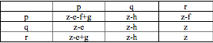
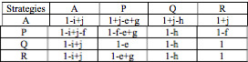

## An example of modellization of Interaction Between Tumour Cells {#fourcells}

<!-- This is very similar to the #hurlbut example. Would need to  -->
<!-- clarify how it differs and what it provides in addition to that example -->
<!-- For instance, some of the cell types are named identically, some -->
<!-- aren't.  -->

The following example is based on @krzeslak2014. The proposed model combines two different models; The first model assumes production of a substance to harm other cells by producing some cytotoxic substances as an evolutionary response to that feature some cells can acquire genetic resistance. Both, production of substances and resistance, are costly, but a phenotype that produces cytotoxins is able to gain some advantage in contact with non-resistant cells. The second one considers production of a growth factor which activates e.g. angiogenesis. 

They provide, the payoff matrix of first model reproduced in Figure
\@ref(fig:model1_table1): 


```{r model1_table1, eval=TRUE,echo=FALSE, fig.cap="Payoff matrix from Table 1 of Krzeslak et al., 2014, 'Four Phenotype Model of Interaction Between Tumour Cells', *Analysis of the extended model*, 3, 2; doi.org/10.3182/20140824-6-ZA-1003.02037"}

```

The phenotypes for the first model:
WT –  cell neither produces the cytotoxic substance nor is resistant (baseline)
P –  cell produces a cytotoxic substance against adjacent cells
Q –  cell is resistant to the cytotoxic substance

The parameters used to defined the measure of fitness of the first model:
z – baseline fitness
e – cost of producing cytotoxin
f – disadvantage of being affected by cytotoxin
g – benefit of harming other cells
h – cost of resistance to cytotoxin

The second model describes paracrine production of growth factor (GF):

And this is the Pay-off matrix corresponding to this model in Figure
\@ref(fig:model2_table2)

```{r model2_table2, eval=TRUE,echo=FALSE, fig.cap="Payoff matrix from Table 2 of Krzeslak et al., 2014, 'Four Phenotype Model of Interaction Between Tumour Cells', *Analysis of the extended model*, 3, 3; doi.org/10.3182/20140824-6-ZA-1003.02037"}
knitr::include_graphics("krzeslak2.png")
```

The phenotypes for the second model:
A+ - cell produces growth factors (paracrine fashion)
A- - cell does not produce growth factors (baseline)

The parameters used to defined the measure of fitness of the second model:
i – cost of proangiogenic factor production
j – benefit of receiving growth factor


Finally the authors combine the phenotypes of both models, obtaining then a model of four different phenotypes of cells:
WT: Strategy which shall be considered as a baseline (neither produces the cytotoxic substance, resistance to it, nor growth factor).
A: Cell produces the growth factor and the benefit impacts on all neighbors and cell itself;
P: Cell produces a cytotoxic substance against nearby cells;
Q: Cell is resistant to the cytotoxic substance;

They propose a pay-off matrix that combines both models, as we can see in Figure
\@ref(fig:model3_table3)

```{r model3_table3, eval=TRUE,echo=FALSE, fig.cap="Proposed pay-off matrix from Table 3 of Krzeslak et al., 2014, 'Four Phenotype Model of Interaction Between Tumour Cells', *Analysis of the extended model*, 3, 3; doi.org/10.3182/20140824-6-ZA-1003.02037"}

```

The expected pay-offs (the sum of the products of frequency and pay-off) are then:
WT = 1 + j * A - f * P
A = 1 - i + j - f * P
P = 1 - e + j * A-f*P+g*(A+P+WT)
Q = 1 - h + j * A

```{r fpm1, message=FALSE}
func_fitness <- function(i, j, f, g, e, h,
                         gt = c("WT", "A", "P", "Q")) {
  data.frame(Genotype = gt,
             Fitness = c(
               paste0("1 + ", j, " * f_1", " - ", f, " * f_2"), # Equation for WT
               paste0("1 - ", i, " + ", j, " - ", f, " * f_2"), # A population
               paste0("1 - ", e, " + ", j, " * f_1", " - ", f, " * f_2", " + ", g, " * (f_ + f_1 + f_2)"), # P population
               paste0("1 - ", h, " + ", j, " * f_1")), # Q population
             stringsAsFactors = FALSE)
}
```

```{r fpm2, message=FALSE}
func_fitness("i", "j", "f", "g", "e", "h")
```

```{r fpm3, message=FALSE}
# FIRST PART --> FAVOURING JUST ONE POPULATION
afe_fitness <- allFitnessEffects(
  genotFitness =
    func_fitness(0.3, 0.4, 0.4, 0.25, 0.7, 0.1), 
  # First simulation, affecting P population
  # With this parameters, we are directly affecting P population (bad fitness)
  frequencyDependentFitness = TRUE,
  frequencyType = "rel") # Relative values
```


```{r fpm4, message=FALSE}
# Other simulations affecting P:
# Second simulation: i = 0.3, j = 0.4, f = 0.4, g = 0.5, e = 0.5, h = 0.1
# With the second simulation, P fitness improves

# Third simulation: i = 0.3, j = 0.4, f = 0.4, g = 0.7, e = 0.25, h = 0.1
# This simulation benefit directly P population 

set.seed(2) # Establishment of seed
s_fitness <- oncoSimulIndiv(afe_fitness,
                            model = "McFL", # Model used to run the simulation
                            onlyCancer = FALSE,
                            finalTime = 500, # 500 time units as final time
                            mu = 1e-4,
                            initSize = 5000, # Size of the initial population
                            keepPhylog = TRUE,
                            seed = NULL, # seed null because it has been established before
                            errorHitMaxTries = FALSE,
                            errorHitWallTime = FALSE)
```

```{r fpmplot1, message=FALSE}
plot(s_fitness, show = "genotypes", type = "line",
     col = c("dodgerblue", "darkslateblue", "darkolivegreen4", "red")) # Colors in accordance with the ones used by the paper
```


For this example we set a high value for the e parameter (cost of producing cytotoxin) and a reduce value for g (benefit of harming other cells), directly damaging P, because both parameters affect only this population. As a consequence of that, P quickly disappeared with time and A and WT succeeded, as you can see in the plot above.

After this results, we removed the set.seed (to simulate the stochasticity of a biological situation) and repeated iteratively the simulation. We saw that the final population obtained remained the same in all iterations.

Afterwards, we equalized both parameters and observed something similar to the first graphic, with a just difference: as the P fitness was better, its number of cells at the end of the simulation was bigger (results not shown). We again perform iterations and the results remain the same.

Subsequently, we changed parameters in favour of P population (increasing g and decreasing e). As a result, P population grew in a short time period (results not shown). Again, the final population remained the same after some iterations. 

Finally, we looked for a parameter combination with which the frequency population were more dependent on fitness. The population distribution varies between iterations. We obtained it increasing j and f as these parameters made the fitness more dependent on frequency. In the plot below the result of one iteration is shown.

```{r fpm5, message=FALSE}
# SECOND PART
# After that, we looked for a parameter combination to make the fitness population
# more dependent on frequencies of other populations.

afe_fitness2 <- allFitnessEffects(
  genotFitness =
    func_fitness(0.3, 0.7, 0.7, 0.4, 0.3, 0.1), 
  # Increment on f and g parameters
  frequencyDependentFitness = TRUE,
  frequencyType = "rel")
```


```{r fpm6, message=FALSE}
s_fitness2 <- oncoSimulIndiv(afe_fitness2,
                            model = "McFL",
                            onlyCancer = FALSE,
                            finalTime = 500,
                            mu = 1e-4,
                            initSize = 5000,
                            keepPhylog = TRUE,
                            seed = NULL, # seed NULL because to run this simulation iteratively
                            errorHitMaxTries = FALSE,
                            errorHitWallTime = FALSE)
```


```{r fpmplot2, message=FALSE}
plot(s_fitness2, show = "genotypes", type = "line",
     col = c("dodgerblue", "darkslateblue", "darkolivegreen4", "red"))
```


We generate a plot to reflect this variation. For that purpose, we made 10 iterarions and we represented them in a boxplot. We can observe how the number of cells of all populations varied between iteration except WT. Due to that, we consider that OncoSimulR is particularly useful to simulate biological situations in which fitness of different populations are very similar and dependent on the frequency of the other populations. In that cases, performing a high number of simulations help predict the populations distribution at the end, very useful to suggest treatment for disease.

```{r boxplot, message=FALSE}

# Population distribution at the end of the simulation after runing it iteratively 10 times
#WT   0     0     0     0     0     0     459   0     0     0
#A    4605  2089  2196  1749  4694  2286  4191  2188  2218  4645
#P    1149  2779  2862  2771  1077  2893  1405  2933  2872  964
#Q    1978  0     0     0     2149  0     1619  0     0     2327

WT <- c(0,0,0,0,0,0,459,0,0,0)
A <- c(4605,2089,2196,1749,4694,2286,4191,2188,2218,4645)
P <- c(1149,2779,2862,2771,1077,2893,1405,2933,2872,964)
Q <- c(1978,0,0,0,2149,0,1619,0,0,2327)

matriz <- cbind(WT, A, P, Q)

boxplot(matriz, main = "Boxplot with the population composition after running N times")
```


